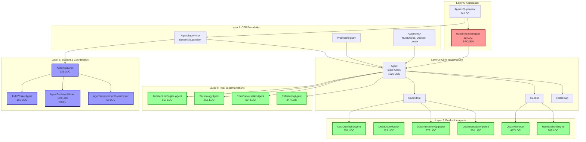
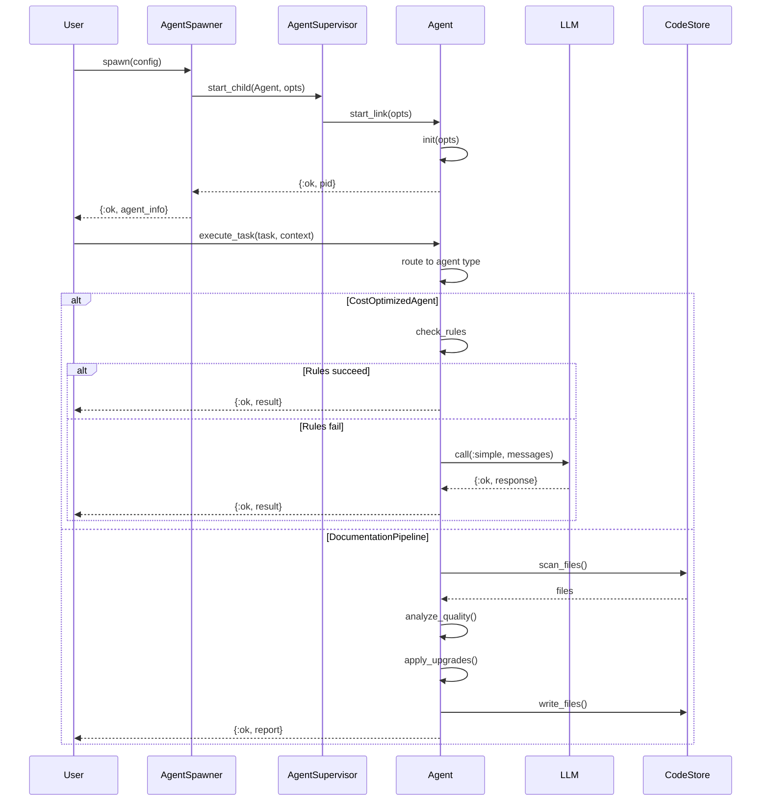
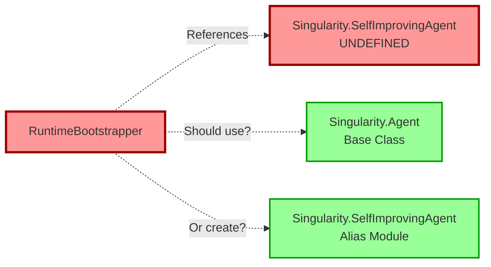
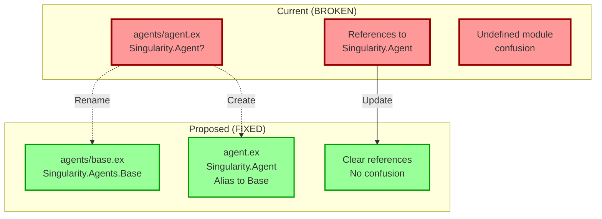
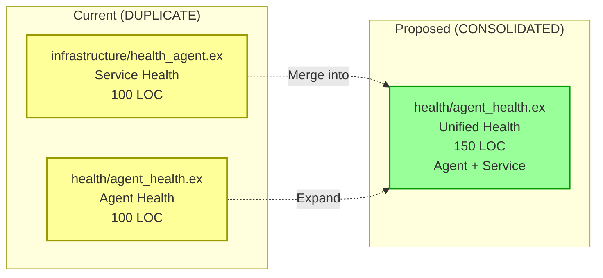
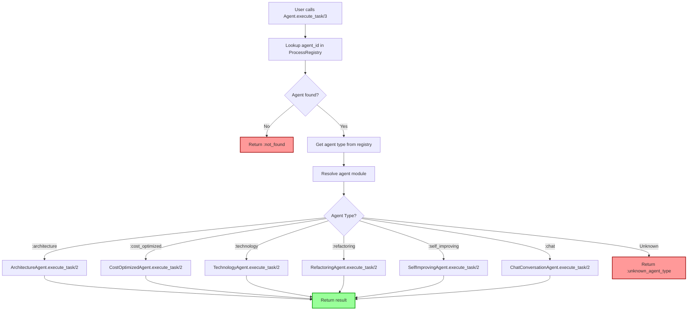
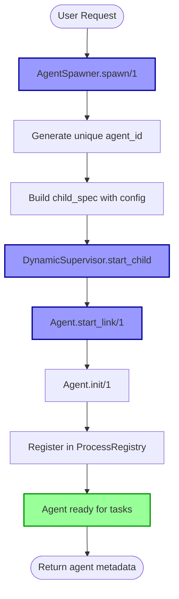
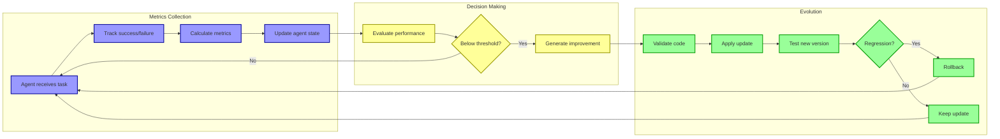
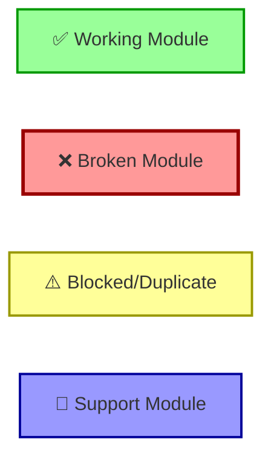

# Agent System Dependency Graph
**Generated:** 2025-01-24
**Purpose:** Visual reference for agent dependencies and relationships

---

## High-Level Architecture



---

## Agent Interaction Flow



---

## Critical Dependencies (Must Fix)

### 1. RuntimeBootstrapper → ??? (BROKEN)



**Fix Options:**
- Option A: `RTB` → `Singularity.Agent` (base class)
- Option B: Create alias `Singularity.SelfImprovingAgent` → `Singularity.Agent`

---

### 2. Agent Namespace Collision



---

### 3. Health Module Duplication



---

## Agent Type Resolution Flow



---

## Module Dependency Matrix

| Module | Depends On | Used By | Status |
|--------|-----------|---------|--------|
| **Agent (Base)** | CodeStore, Control, HotReload, Autonomy.* | All agents, AgentSpawner | ⚠️ Namespace collision |
| **AgentSupervisor** | - | Agents.Supervisor, AgentSpawner | ✅ Working |
| **ProcessRegistry** | - | Agent, AgentSpawner | ✅ Working |
| **AgentSpawner** | AgentSupervisor, Agent | TaskGraphExecutor, Lua | ✅ Working |
| **CostOptimizedAgent** | RuleEngine, Correlation, LLM.Service | Agent routing | ✅ Working |
| **DeadCodeMonitor** | Repo, DeadCodeHistory, Bash | Agent routing | ✅ Working |
| **DocumentationUpgrader** | All 6 agents, CodeStore, TemplateService | DocumentationPipeline | ✅ Working |
| **DocumentationPipeline** | DocumentationUpgrader, QualityEnforcer | Application | ✅ Working |
| **QualityEnforcer** | ArtifactStore, TechnologyAgent | DocumentationPipeline | ✅ Working |
| **RemediationEngine** | RAGCodeGenerator, Store | QualityEnforcer | ✅ Working |
| **RuntimeBootstrapper** | AgentSupervisor, SelfImprovingAgent | Agents.Supervisor | ❌ BROKEN |
| **Agents.Supervisor** | RuntimeBootstrapper, AgentSupervisor | Application | ⚠️ Blocked by RTB |
| **ArchitectureEngine.Agent** | ArchitectureEngine | Agent routing | ✅ Working |
| **TechnologyAgent** | TechnologyTemplateLoader, FrameworkDetector | Agent routing | ✅ Working |
| **ChatConversationAgent** | GoogleChat, Slack | Agent routing | ✅ Working |
| **RefactoringAgent** | Analysis, CodeStore, QualityEngine | Agent routing | ✅ Working |
| **TodoWorkerAgent** | TaskGraph, TodoStore | TodoSwarmCoordinator | ✅ Working |
| **AgentEvolutionWorker** | Evolution, Feedback.Analyzer | Oban.Cron | ⚠️ Blocked by Oban |
| **AgentImprovementBroadcaster** | Agent, :pg, :rpc | Control | ✅ Working |
| **Infrastructure.HealthAgent** | CodebaseStore | - | ⚠️ DUPLICATE |
| **Health.AgentHealth** | ProcessRegistry, :sys | - | ⚠️ DUPLICATE |
| **MetricsFeeder** | SelfImprovingAgent | - | ⚠️ Test only |
| **RealWorkloadFeeder** | SelfImprovingAgent, LLM.Service | - | ⚠️ Test only |

---

## Data Flow Diagrams

### Agent Spawning Flow



### Self-Improvement Cycle



---

## Critical Path Analysis

### Path 1: Basic Agent Spawning (Currently BROKEN)

```
Application
  → Agents.Supervisor
    → RuntimeBootstrapper ❌ BROKEN
      → Singularity.SelfImprovingAgent ❌ UNDEFINED

FIX: RuntimeBootstrapper → Singularity.Agent ✅
```

### Path 2: Task Execution (Should Work After Fix)

```
User
  → Agent.execute_task(agent_id, task, context)
    → ProcessRegistry lookup ✅
    → Get agent type ✅
    → Resolve agent module ✅
    → Agent.execute_task(task, context) ✅
      → CostOptimizedAgent logic ✅
      → TechnologyAgent logic ✅
      → etc.
```

### Path 3: Evolution Cycle (Blocked by Oban)

```
Oban.Cron (hourly)
  → AgentEvolutionWorker ⚠️ BLOCKED
    → Feedback.Analyzer.find_agents_needing_improvement
    → Evolution.evolve_agent
    → Metrics tracking

FIX: Make Oban optional OR run manually ✅
```

---

## Legend



---

**Next Steps:** Fix critical path (RuntimeBootstrapper + namespace collision) to unblock agent system
