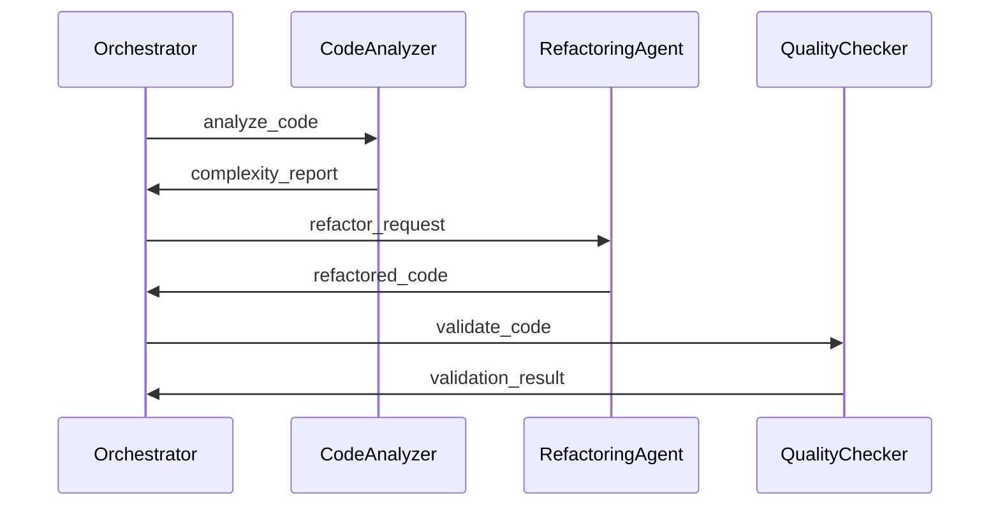

# Agent Flow Tracking & Execution Monitoring

## Problem: How do you know what your agents are ACTUALLY doing?

**Current State**: Agents execute autonomously, but you can't easily answer:
- ✅ What is the agent doing RIGHT NOW?
- ✅ What workflow/process is it following?
- ✅ Is the agent stuck in a loop?
- ✅ Did the agent complete all required steps?
- ✅ How do agents collaborate? (multi-agent flows)
- ✅ Where did the agent fail and why?
- ✅ Can I replay/debug an agent's execution?

## Solution: Agent Execution Flow Tracking

Track **runtime agent behavior** (not just static code flows):

1. **Agent state transitions** (idle → thinking → executing → done)
2. **Task execution flows** (HTDAG task decomposition)
3. **Agent collaboration** (agent A asks agent B for help)
4. **Tool/capability usage** (which tools did the agent use?)
5. **Decision points** (why did the agent choose option X?)
6. **Error recovery** (what failed, what did the agent try next?)

---

## Database Schema for Agent Flows

Following your naming conventions: `<What><How>`

### 1. Agent Execution Session Tracking

```sql
-- Main session: one agent executing one goal
CREATE TABLE agent_execution_sessions (
  id UUID PRIMARY KEY,

  -- Which agent?
  agent_id TEXT NOT NULL, -- "code-generator-agent-1", "quality-checker-agent-2"
  agent_type TEXT NOT NULL, -- "code_generator", "quality_checker", "orchestrator"

  -- What is the goal?
  goal_description TEXT NOT NULL,
  goal_type TEXT, -- "code_generation", "quality_check", "refactoring", "research"

  -- Parent/child sessions (for agent collaboration)
  parent_session_id UUID REFERENCES agent_execution_sessions(id),
  root_session_id UUID, -- Top-level session (for multi-agent workflows)

  -- HTDAG integration (if using task decomposition)
  htdag_id TEXT,
  htdag_root_task_id TEXT,

  -- Status
  status TEXT NOT NULL DEFAULT 'initializing',
    -- 'initializing', 'planning', 'executing', 'waiting', 'completed', 'failed', 'cancelled'

  -- Metadata
  codebase_name TEXT,
  triggered_by TEXT, -- "user", "scheduler", "another_agent", "webhook"
  trigger_metadata JSONB,

  -- Timing
  started_at TIMESTAMPTZ NOT NULL DEFAULT NOW(),
  completed_at TIMESTAMPTZ,
  duration_ms INTEGER,

  -- Results
  result JSONB, -- Final output
  error JSONB, -- If failed

  -- Observability
  trace_id TEXT, -- For distributed tracing
  span_id TEXT,

  created_at TIMESTAMPTZ DEFAULT NOW(),
  updated_at TIMESTAMPTZ DEFAULT NOW()
);

CREATE INDEX ON agent_execution_sessions (agent_id);
CREATE INDEX ON agent_execution_sessions (agent_type);
CREATE INDEX ON agent_execution_sessions (status);
CREATE INDEX ON agent_execution_sessions (parent_session_id);
CREATE INDEX ON agent_execution_sessions (started_at DESC);
CREATE INDEX ON agent_execution_sessions (trace_id);
```

### 2. Agent State Transitions (Workflow Steps)

```sql
-- Each state the agent goes through
CREATE TABLE agent_execution_state_transitions (
  id UUID PRIMARY KEY,
  session_id UUID REFERENCES agent_execution_sessions(id) ON DELETE CASCADE,

  -- State transition
  from_state TEXT, -- null for initial state
  to_state TEXT NOT NULL,
  state_sequence INTEGER NOT NULL, -- Order of states

  -- Why did it transition?
  transition_reason TEXT,
  transition_type TEXT, -- 'normal', 'error', 'retry', 'skip', 'jump'

  -- What triggered the transition?
  triggered_by_event TEXT, -- "task_completed", "error_occurred", "user_intervention"
  event_metadata JSONB,

  -- Timing
  entered_at TIMESTAMPTZ NOT NULL DEFAULT NOW(),
  exited_at TIMESTAMPTZ,
  duration_ms INTEGER,

  -- State data (snapshot of agent state)
  state_data JSONB,

  created_at TIMESTAMPTZ DEFAULT NOW()
);

CREATE INDEX ON agent_execution_state_transitions (session_id, state_sequence);
CREATE INDEX ON agent_execution_state_transitions (to_state);
CREATE INDEX ON agent_execution_state_transitions (entered_at DESC);
```

### 3. Agent Actions (What the agent DOES)

```sql
-- Every action an agent takes
CREATE TABLE agent_execution_actions (
  id UUID PRIMARY KEY,
  session_id UUID REFERENCES agent_execution_sessions(id) ON DELETE CASCADE,
  state_transition_id UUID REFERENCES agent_execution_state_transitions(id),

  -- Action details
  action_type TEXT NOT NULL,
    -- 'llm_call', 'tool_execution', 'code_generation', 'file_read', 'file_write',
    -- 'database_query', 'api_call', 'nats_publish', 'decision_point', 'wait'
  action_name TEXT NOT NULL, -- "call_claude", "run_rust_parser", "write_file"

  action_sequence INTEGER NOT NULL, -- Order within session

  -- Input/Output
  input_data JSONB,
  output_data JSONB,

  -- Tool/Capability usage
  tool_name TEXT, -- "claude_api", "rust_parser", "file_system"
  capability_id UUID, -- Reference to agent_capability_registry

  -- Status
  status TEXT NOT NULL DEFAULT 'pending',
    -- 'pending', 'running', 'completed', 'failed', 'skipped', 'retrying'

  -- Error handling
  error JSONB,
  retry_count INTEGER DEFAULT 0,
  max_retries INTEGER DEFAULT 3,

  -- Timing
  started_at TIMESTAMPTZ NOT NULL DEFAULT NOW(),
  completed_at TIMESTAMPTZ,
  duration_ms INTEGER,

  -- Cost tracking (for LLM calls)
  cost_usd DECIMAL(10, 6),
  tokens_used INTEGER,

  created_at TIMESTAMPTZ DEFAULT NOW()
);

CREATE INDEX ON agent_execution_actions (session_id, action_sequence);
CREATE INDEX ON agent_execution_actions (action_type);
CREATE INDEX ON agent_execution_actions (status);
CREATE INDEX ON agent_execution_actions (started_at DESC);
```

### 4. Agent Decision Points (Why did it choose X?)

```sql
-- Track agent decision-making
CREATE TABLE agent_execution_decision_points (
  id UUID PRIMARY KEY,
  session_id UUID REFERENCES agent_execution_sessions(id) ON DELETE CASCADE,
  action_id UUID REFERENCES agent_execution_actions(id),

  -- Decision context
  decision_type TEXT NOT NULL,
    -- 'tool_selection', 'task_prioritization', 'error_recovery_strategy',
    -- 'code_quality_acceptance', 'refactoring_approach', 'test_strategy'

  decision_question TEXT NOT NULL, -- "Which tool should I use?"
  available_options JSONB NOT NULL, -- List of options considered

  -- What was chosen?
  chosen_option JSONB NOT NULL,
  chosen_option_index INTEGER,

  -- Why?
  reasoning TEXT, -- Agent's explanation
  confidence_score FLOAT, -- 0.0 to 1.0

  -- How was decision made?
  decision_method TEXT,
    -- 'rule_based', 'llm_based', 'confidence_threshold', 'random', 'user_input'

  -- Rules used (if rule-based)
  rules_applied UUID[], -- References to agent_behavior_confidence_rules

  -- Alternative options (for analysis)
  rejected_options JSONB,
  rejection_reasons JSONB,

  decided_at TIMESTAMPTZ NOT NULL DEFAULT NOW()
);

CREATE INDEX ON agent_execution_decision_points (session_id);
CREATE INDEX ON agent_execution_decision_points (decision_type);
CREATE INDEX ON agent_execution_decision_points (confidence_score);
```

### 5. Agent Communication (Multi-Agent Flows)

```sql
-- Track agent-to-agent communication
CREATE TABLE agent_execution_communications (
  id UUID PRIMARY KEY,

  -- Who is communicating?
  from_session_id UUID REFERENCES agent_execution_sessions(id),
  to_session_id UUID REFERENCES agent_execution_sessions(id),

  from_agent_id TEXT NOT NULL,
  to_agent_id TEXT NOT NULL,

  -- What is being communicated?
  message_type TEXT NOT NULL,
    -- 'task_delegation', 'question', 'result', 'error_notification',
    -- 'collaboration_request', 'status_update', 'resource_request'

  message_content JSONB NOT NULL,

  -- Request/Response pattern
  is_request BOOLEAN DEFAULT true,
  request_id UUID, -- For linking request/response
  in_response_to UUID REFERENCES agent_execution_communications(id),

  -- Communication channel
  channel TEXT, -- 'nats', 'direct_call', 'shared_memory', 'database'
  nats_subject TEXT,

  -- Timing
  sent_at TIMESTAMPTZ NOT NULL DEFAULT NOW(),
  received_at TIMESTAMPTZ,
  responded_at TIMESTAMPTZ,

  created_at TIMESTAMPTZ DEFAULT NOW()
);

CREATE INDEX ON agent_execution_communications (from_session_id);
CREATE INDEX ON agent_execution_communications (to_session_id);
CREATE INDEX ON agent_execution_communications (message_type);
CREATE INDEX ON agent_execution_communications (request_id);
```

### 6. Agent Workflow Definitions (Expected Flows)

```sql
-- Define expected agent workflows (like process patterns for code)
CREATE TABLE agent_workflow_pattern_definitions (
  id UUID PRIMARY KEY,

  -- Workflow identity
  workflow_name TEXT NOT NULL UNIQUE,
  workflow_category TEXT NOT NULL,
    -- 'code_generation', 'quality_assurance', 'refactoring',
    -- 'research', 'deployment', 'multi_agent_collaboration'

  description TEXT NOT NULL,

  -- Which agents can execute this workflow?
  applicable_agent_types TEXT[],

  -- Expected states
  expected_states JSONB NOT NULL,
    -- [
    --   {state: "initializing", is_required: true, min_duration_ms: 100},
    --   {state: "planning", is_required: true, min_duration_ms: 1000},
    --   {state: "executing", is_required: true, min_duration_ms: 5000},
    --   {state: "validating", is_required: false},
    --   {state: "completed", is_required: true}
    -- ]

  -- Expected actions
  expected_actions JSONB NOT NULL,
    -- [
    --   {action_type: "llm_call", min_count: 1, max_count: 10},
    --   {action_type: "file_write", min_count: 1, max_count: 100},
    --   {action_type: "code_generation", min_count: 1, max_count: 1}
    -- ]

  -- Expected transitions
  expected_transitions JSONB NOT NULL,
    -- [
    --   {from: "planning", to: "executing", is_required: true},
    --   {from: "executing", to: "validating", is_required: false},
    --   {from: "validating", to: "completed", is_required: true}
    -- ]

  -- Quality expectations
  max_duration_ms INTEGER,
  max_cost_usd DECIMAL(10, 2),
  max_llm_calls INTEGER,

  -- Success criteria
  success_conditions JSONB,

  created_at TIMESTAMPTZ DEFAULT NOW(),
  updated_at TIMESTAMPTZ DEFAULT NOW()
);
```

### 7. Agent Workflow Completeness Analysis

```sql
-- Analyze if agent sessions followed expected workflows
CREATE TABLE agent_workflow_completeness_analysis (
  id UUID PRIMARY KEY,

  -- What are we analyzing?
  session_id UUID REFERENCES agent_execution_sessions(id) ON DELETE CASCADE,
  workflow_pattern_id UUID REFERENCES agent_workflow_pattern_definitions(id),

  -- Completeness
  completeness_score FLOAT NOT NULL, -- 0.0 to 1.0
  is_complete BOOLEAN DEFAULT false,

  -- State analysis
  expected_states_visited INTEGER NOT NULL,
  expected_states_total INTEGER NOT NULL,
  unexpected_states_visited TEXT[],

  -- Action analysis
  expected_actions_performed INTEGER NOT NULL,
  expected_actions_total INTEGER NOT NULL,
  unexpected_actions_performed TEXT[],

  -- Transition analysis
  expected_transitions_followed INTEGER NOT NULL,
  expected_transitions_total INTEGER NOT NULL,
  unexpected_transitions TEXT[],

  -- Quality metrics
  duration_within_bounds BOOLEAN,
  cost_within_bounds BOOLEAN,
  llm_calls_within_bounds BOOLEAN,

  -- Anomalies detected
  anomalies JSONB,
    -- [
    --   {type: "infinite_loop", description: "Agent repeated 'planning' state 10 times"},
    --   {type: "missing_action", description: "No validation performed"},
    --   {type: "timeout", description: "Session exceeded max duration"}
    -- ]

  -- Results
  analysis_result JSONB NOT NULL,

  analyzed_at TIMESTAMPTZ DEFAULT NOW()
);

CREATE INDEX ON agent_workflow_completeness_analysis (session_id);
CREATE INDEX ON agent_workflow_completeness_analysis (completeness_score);
CREATE INDEX ON agent_workflow_completeness_analysis (is_complete);
```

---

## Integration with Existing Systems

### Link to HTDAG (Task Decomposition)

```sql
-- Add to agent_execution_sessions
ALTER TABLE agent_execution_sessions
  ADD COLUMN htdag_id TEXT,
  ADD COLUMN htdag_current_task_id TEXT;

-- Track which HTDAG task each action is for
ALTER TABLE agent_execution_actions
  ADD COLUMN htdag_task_id TEXT,
  ADD COLUMN htdag_task_description TEXT;
```

### Link to SPARC Methodology

```sql
-- Add SPARC phase tracking
ALTER TABLE agent_execution_state_transitions
  ADD COLUMN sparc_phase TEXT,
    -- 'specification', 'pseudocode', 'architecture', 'refinement', 'completion'
  ADD COLUMN sparc_phase_sequence INTEGER;
```

### Link to Existing Agent Tables

```sql
-- Link to git_agent_sessions (existing table)
ALTER TABLE agent_execution_sessions
  ADD COLUMN git_session_id UUID REFERENCES git_agent_sessions(id);
```

---

## Agent Flow Examples

### Example 1: Code Generation Agent Flow

```
Session: code-gen-session-123
Agent: code-generator-agent-1
Goal: "Generate user authentication module"

States:
1. initializing (100ms)
2. planning (2s) - Broke down into HTDAG tasks
3. researching (5s) - Searched similar code
4. generating (30s) - Called Claude to generate code
5. validating (10s) - Ran quality checks
6. completed (0ms)

Actions:
1. llm_call: "Analyze user request" → HTDAG plan
2. database_query: "Search similar auth code" → 5 examples
3. llm_call: "Generate auth module with examples" → code.ex
4. file_write: "Save to lib/auth.ex" → success
5. tool_execution: "Run mix format" → formatted
6. tool_execution: "Run credo" → 2 warnings
7. decision_point: "Accept code with warnings?" → YES (confidence: 0.85)
8. file_write: "Save final code" → success

Decision Points:
- "Which LLM to use?" → Claude (rule: code_generation → claude)
- "Accept code with warnings?" → Yes (confidence: 0.85, reasoning: "Warnings are minor style issues")

Result: ✅ Code generated, 2 credo warnings (accepted)
```

### Example 2: Multi-Agent Collaboration Flow

```
Root Session: refactoring-session-456
Agent: orchestrator-agent-1
Goal: "Refactor user module"

Flow:
orchestrator-agent-1
  ├─ delegated → code-analyzer-agent-2
  │    └─ analyzed code complexity → returned metrics
  ├─ delegated → refactoring-agent-3
  │    └─ generated refactored code → returned code
  └─ delegated → quality-checker-agent-4
       └─ validated refactored code → approved

Communications:
1. orchestrator → code-analyzer: "Analyze user.ex"
2. code-analyzer → orchestrator: {complexity: 25, suggestions: [...]}
3. orchestrator → refactoring-agent: "Refactor using suggestions"
4. refactoring-agent → orchestrator: {code: "...", changes: [...]}
5. orchestrator → quality-checker: "Validate refactored code"
6. quality-checker → orchestrator: {approved: true, score: 0.95}

Result: ✅ Refactoring complete, quality score 0.95
```

---

## Queries for Agent Flow Analysis

### 1. Find agents currently stuck/running too long

```sql
SELECT
  s.id,
  s.agent_id,
  s.goal_description,
  s.status,
  st.to_state as current_state,
  NOW() - st.entered_at as time_in_state,
  st.state_data
FROM agent_execution_sessions s
JOIN LATERAL (
  SELECT * FROM agent_execution_state_transitions
  WHERE session_id = s.id
  ORDER BY state_sequence DESC
  LIMIT 1
) st ON true
WHERE s.status IN ('planning', 'executing', 'waiting')
  AND NOW() - st.entered_at > INTERVAL '5 minutes'
ORDER BY time_in_state DESC;
```

### 2. Find infinite loops (agent repeating same state)

```sql
WITH state_counts AS (
  SELECT
    session_id,
    to_state,
    COUNT(*) as visit_count,
    array_agg(id ORDER BY state_sequence) as transition_ids
  FROM agent_execution_state_transitions
  GROUP BY session_id, to_state
)
SELECT
  s.id,
  s.agent_id,
  s.goal_description,
  sc.to_state,
  sc.visit_count,
  'Possible infinite loop' as issue
FROM state_counts sc
JOIN agent_execution_sessions s ON s.id = sc.session_id
WHERE sc.visit_count > 5  -- Visited same state more than 5 times
  AND s.status NOT IN ('completed', 'failed')
ORDER BY sc.visit_count DESC;
```

### 3. Find complete agent workflow execution path

```sql
WITH RECURSIVE agent_flow AS (
  -- Start with session
  SELECT
    s.id as session_id,
    s.agent_id,
    s.goal_description,
    0 as depth,
    ARRAY[s.id::text] as path
  FROM agent_execution_sessions s
  WHERE s.id = 'target-session-uuid'

  UNION ALL

  -- Follow state transitions
  SELECT
    af.session_id,
    af.agent_id,
    af.goal_description,
    af.depth + 1,
    af.path || st.id::text
  FROM agent_flow af
  JOIN agent_execution_state_transitions st
    ON st.session_id = af.session_id
  WHERE af.depth < 100
)
SELECT
  af.agent_id,
  st.from_state,
  st.to_state,
  st.duration_ms,
  st.transition_reason,
  array_agg(a.action_type ORDER BY a.action_sequence) as actions_in_state
FROM agent_flow af
JOIN agent_execution_state_transitions st ON st.session_id = af.session_id
LEFT JOIN agent_execution_actions a
  ON a.state_transition_id = st.id
GROUP BY af.agent_id, st.from_state, st.to_state, st.duration_ms, st.transition_reason, st.state_sequence
ORDER BY st.state_sequence;
```

### 4. Multi-agent collaboration graph

```sql
-- Find all agents involved in a workflow
WITH RECURSIVE agent_graph AS (
  -- Root session
  SELECT
    id as session_id,
    agent_id,
    null::uuid as parent_session_id,
    0 as depth,
    ARRAY[id] as path
  FROM agent_execution_sessions
  WHERE root_session_id = 'target-root-uuid'
    AND parent_session_id IS NULL

  UNION ALL

  -- Child sessions
  SELECT
    child.id,
    child.agent_id,
    child.parent_session_id,
    ag.depth + 1,
    ag.path || child.id
  FROM agent_graph ag
  JOIN agent_execution_sessions child
    ON child.parent_session_id = ag.session_id
  WHERE ag.depth < 10
)
SELECT
  ag.agent_id,
  ag.depth,
  ag.path,
  array_agg(DISTINCT comm.message_type) as message_types
FROM agent_graph ag
LEFT JOIN agent_execution_communications comm
  ON comm.from_session_id = ag.session_id
     OR comm.to_session_id = ag.session_id
GROUP BY ag.agent_id, ag.depth, ag.path
ORDER BY ag.depth, ag.agent_id;
```

---

## Visualization Examples

### Mermaid Sequence Diagram (Multi-Agent Communication)

```elixir
defmodule Singularity.AgentFlowVisualizer do
  def generate_agent_sequence_diagram(root_session_id) do
    sessions = load_agent_sessions_tree(root_session_id)
    communications = load_communications(root_session_id)

    """
    sequenceDiagram
      participant Orchestrator
      participant CodeAnalyzer
      participant RefactoringAgent
      participant QualityChecker

      #{render_communications(communications)}
    """
  end

  defp render_communications(comms) do
    Enum.map_join(comms, "\n", fn comm ->
      from = agent_short_name(comm.from_agent_id)
      to = agent_short_name(comm.to_agent_id)
      msg = comm.message_type

      "  #{from}->>#{to}: #{msg}"
    end)
  end
end
```

**Result**:


### State Machine Diagram

```elixir
def generate_state_machine_diagram(session_id) do
  transitions = load_state_transitions(session_id)

  """
  stateDiagram-v2
    [*] --> initializing
    initializing --> planning
    planning --> researching
    researching --> generating
    generating --> validating
    validating --> completed: quality_passed
    validating --> generating: quality_failed (retry)
    completed --> [*]
  """
end
```

---

## Next Steps - Want Me To Build It?

I can create:

1. ✅ **7 new tables** (migrations) for agent flow tracking
2. ✅ **Elixir modules** to instrument your agents:
   ```elixir
   AgentFlowTracker.start_session(agent_id, goal)
   AgentFlowTracker.transition_state(session_id, "planning")
   AgentFlowTracker.record_action(session_id, "llm_call", input, output)
   AgentFlowTracker.record_decision(session_id, question, chosen, reasoning)
   AgentFlowTracker.complete_session(session_id, result)
   ```
3. ✅ **Seed workflows** (code_generation, quality_check, refactoring patterns)
4. ✅ **Completeness analyzer** (detect incomplete/stuck agents)
5. ✅ **Visualizations** (Mermaid diagrams, interactive graphs)
6. ✅ **Phoenix LiveView dashboard** to watch agents in real-time!

This would give you **full observability into agent execution** - see exactly what your agents are doing, where they get stuck, and if they're following expected patterns! 🎯

Ready to build it?
