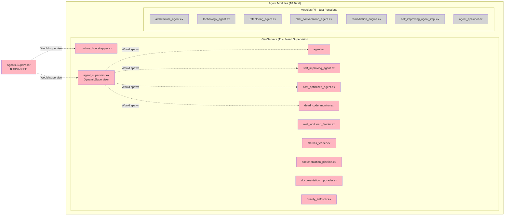
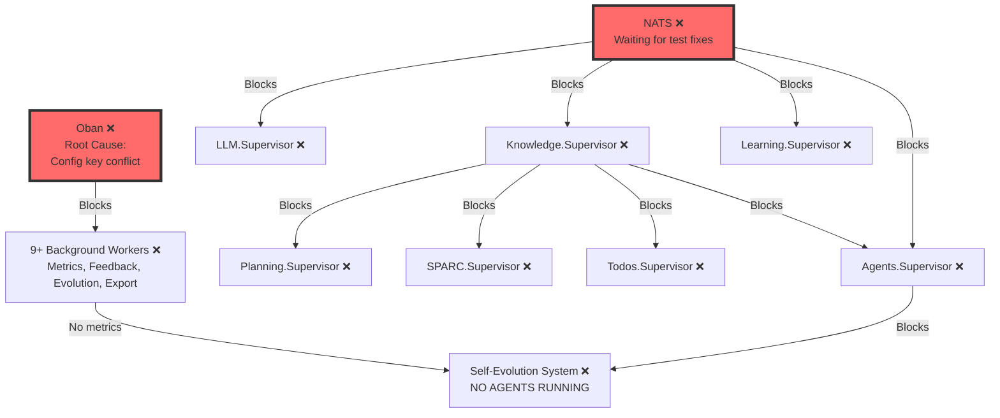

# Agent System - Current State Visualization

**Date**: 2025-10-24
**Status**: 🔴 Most Systems Disabled

---

## Current Supervision Tree (Reality)

```mermaid
graph TD
    App[Singularity.Application]

    %% Layer 1: Foundation (ACTIVE)
    Repo[Repo ✅]
    Telemetry[Telemetry ✅]
    Registry[ProcessRegistry ✅]

    %% Layer 2: HTTP (ACTIVE)
    Bandit[Bandit HTTP ✅<br/>Port 4000]

    %% Layer 3: Only Active Supervisor
    MetricsSup[Metrics.Supervisor ✅]

    %% EVERYTHING ELSE DISABLED
    Oban[Oban ❌<br/>Config issue]
    InfraSup[Infrastructure.Supervisor ❌]
    NatsSup[NATS.Supervisor ❌<br/>Test issues]
    LLMSup[LLM.Supervisor ❌<br/>Needs NATS]
    KnowledgeSup[Knowledge.Supervisor ❌<br/>Needs NATS]
    LearningSup[Learning.Supervisor ❌<br/>Needs NATS]
    PlanningSup[Planning.Supervisor ❌<br/>Needs Knowledge]
    SparcSup[SPARC.Supervisor ❌<br/>Needs deps]
    TodosSup[Todos.Supervisor ❌<br/>Needs deps]
    AgentsSup[Agents.Supervisor ❌<br/>Needs NATS+Knowledge]
    AppSup[ApplicationSupervisor ❌<br/>Needs deps]

    App --> Repo
    App --> Telemetry
    App --> Registry
    App --> Bandit
    App --> MetricsSup

    App -.->|Disabled| Oban
    App -.->|Disabled| InfraSup
    App -.->|Disabled| NatsSup
    App -.->|Disabled| LLMSup
    App -.->|Disabled| KnowledgeSup
    App -.->|Disabled| LearningSup
    App -.->|Disabled| PlanningSup
    App -.->|Disabled| SparcSup
    App -.->|Disabled| TodosSup
    App -.->|Disabled| AgentsSup
    App -.->|Disabled| AppSup

    style Repo fill:#90EE90
    style Telemetry fill:#90EE90
    style Registry fill:#90EE90
    style Bandit fill:#90EE90
    style MetricsSup fill:#90EE90

    style Oban fill:#FFB6C1
    style InfraSup fill:#FFB6C1
    style NatsSup fill:#FFB6C1
    style LLMSup fill:#FFB6C1
    style KnowledgeSup fill:#FFB6C1
    style LearningSup fill:#FFB6C1
    style PlanningSup fill:#FFB6C1
    style SparcSup fill:#FFB6C1
    style TodosSup fill:#FFB6C1
    style AgentsSup fill:#FFB6C1
    style AppSup fill:#FFB6C1
```



**Legend**:
- ✅ Green = Active and supervised
- ❌ Pink = Disabled (commented out in application.ex)
- Solid lines = Active supervision
- Dashed lines = Would supervise if enabled

---

## Agent Modules Inventory



**Status**:
- 🔴 **0 agents running** (Agents.Supervisor disabled)
- 11 GenServers ready to run (just need supervision)
- 7 utility modules available (no supervision needed)

---

## Dependency Cascade



**Fix Priority**:
1. 🔥 Fix Oban config → Unblocks workers
2. 🔥 Fix NATS tests → Unblocks services
3. 🔥 Re-enable Agents.Supervisor → Agents run
4. ✅ Self-evolution system operational

---

## What Works vs What Doesn't

| Component | Status | Details |
|-----------|--------|---------|
| **Database (PostgreSQL)** | ✅ Working | Repo supervised, migrations run |
| **Telemetry Collection** | ✅ Working | Events published, tracked |
| **HTTP Endpoint** | ✅ Working | Bandit on port 4000, dashboard accessible |
| **Metrics.Supervisor** | ✅ Working | Only domain supervisor running |
| **Process Registry** | ✅ Working | Agent lookup would work if agents existed |
| **Oban Job Queue** | ❌ Disabled | Config key conflict (`:singularity` vs `:oban`) |
| **NATS Messaging** | ❌ Disabled | Test dependency issues |
| **LLM Services** | ❌ Disabled | Waiting for NATS |
| **Knowledge Services** | ❌ Disabled | Waiting for NATS |
| **Learning System** | ❌ Disabled | Waiting for NATS |
| **Planning System** | ❌ Disabled | Waiting for Knowledge |
| **SPARC System** | ❌ Disabled | Waiting for dependencies |
| **Todos System** | ❌ Disabled | Waiting for dependencies |
| **Agents (All 6)** | ❌ Disabled | Agents.Supervisor commented out |
| **Background Workers** | ❌ Disabled | Oban disabled |
| **Self-Evolution** | ❌ Disabled | No agents + no Oban |

**Working**: 5/16 components (31%)
**Disabled**: 11/16 components (69%)

---

## Documentation Accuracy

| Document | Accuracy | Recommendation |
|----------|----------|----------------|
| `AGENTS.md` | 🔴 Inaccurate | Add "⚠️ CURRENTLY DISABLED" warning |
| `AGENT_EVOLUTION_STRATEGY.md` | 🟡 Design Only | Add "Future Vision" disclaimer |
| `AGENT_BRIEFING.md` | 🟢 Mostly Accurate | Update with supervision status |
| `AGENT_SELF_EVOLUTION_2.3.0.md` | 🔴 Aspirational | Rename to `*_DESIGN.md` |
| `AGENT_DOCUMENTATION_SYSTEM.md` | 🔴 Aspirational | Rename to `*_DESIGN.md` |
| `SELFEVOLVE.md` | 🟡 Infrastructure OK | Add Oban/NATS/supervision status |
| `AGENTS_VS_ENGINES_PATTERN.md` | 🟢 Accurate | Keep - architectural pattern is sound |

**Overall Documentation Accuracy**: ~30%

Most docs describe **future vision** as if it's **current reality**.

---

## Quick Status Check Commands

```bash
# Check what's actually supervised
iex> Supervisor.which_children(Singularity.Supervisor)
# Should show: Repo, Telemetry, ProcessRegistry, Bandit, Metrics.Supervisor
# Should NOT show: Agents.Supervisor (it's disabled)

# Try to find Agents.Supervisor
iex> Process.whereis(Singularity.Agents.Supervisor)
# Returns: nil (not running)

# Try to spawn an agent (will fail)
iex> Singularity.Agent.start_link(id: "test")
# Error: AgentSupervisor not running

# Check Oban status
iex> Oban.check_queue(:default)
# Error: nil.config/0 (Oban not started)

# Check NATS status
iex> Singularity.NATS.Client.health_check()
# Error: NATS.Client not supervised
```

---

## Path to Operational System

### Week 1: Fix Oban
```elixir
# 1. Check config/config.exs for duplicate Oban configs
# 2. Consolidate to single config key
# 3. Test Oban starts
# 4. Uncomment line 45 in application.ex
```

### Week 2: Fix NATS
```elixir
# 1. Add NATS availability check in tests
# 2. Mock NATS in tests or skip when unavailable
# 3. Ensure NATS starts in dev/prod
# 4. Uncomment line 53 in application.ex
```

### Week 3: Re-enable Services
```elixir
# Uncomment in application.ex:
# - Line 58: LLM.Supervisor
# - Line 61: Knowledge.Supervisor
# - Line 64: Learning.Supervisor
```

### Week 4: Re-enable Agents
```elixir
# Uncomment in application.ex:
# - Line 86: Agents.Supervisor
# - Line 89: ApplicationSupervisor
# Test agent spawning
```

### Week 5: Documentation
```markdown
# Update all docs to match reality
# Add status indicators (✅/❌/🟡)
# Rename aspirational docs to *_DESIGN.md
```

**Total Time**: ~4-5 weeks to fully operational system

---

## Summary

**Reality**: Singularity has excellent code and architecture, but **almost nothing is running** due to:
1. Oban config issue (root cause)
2. NATS test dependencies (blocks services)
3. Cascading supervisor disabling (everything commented out)

**Documentation**: Describes rich, active ecosystem that doesn't exist in runtime (yet).

**Fix**: 4-5 weeks following dependency-driven priority order.

**Quick Win**: Update docs to match reality (1 day) while fixing infrastructure.
