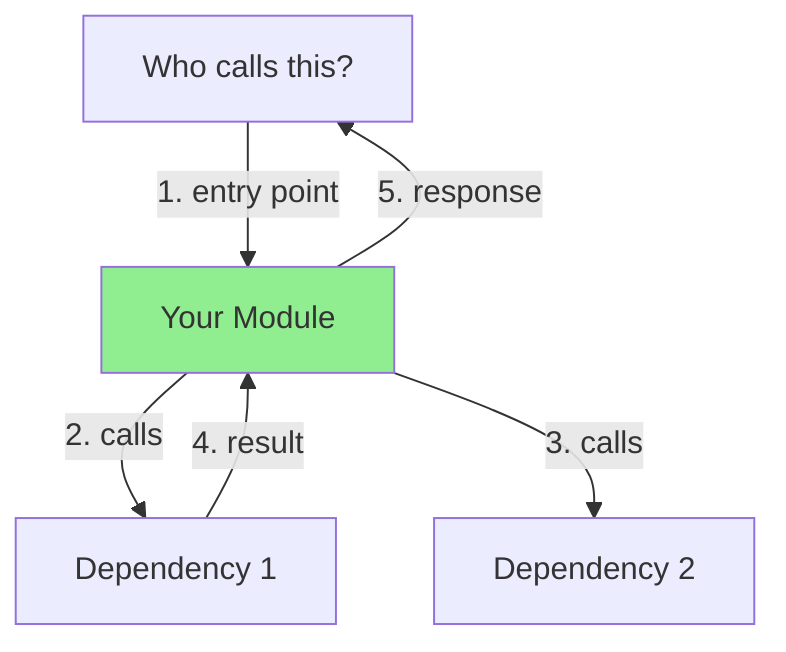

# AI Metadata Implementation Checklist

**Quick reference for adding AI-optimized metadata to production modules**

---

## Before You Start

- [ ] Read `/Users/mhugo/code/singularity-incubation/templates_data/code_generation/examples/AI_METADATA_QUICK_REFERENCE.md`
- [ ] Review example: `singularity/lib/singularity/llm/service.ex`
- [ ] Have template open: `templates_data/code_generation/quality/elixir_production.json` v2.4.0

---

## Per-Module Checklist (30 min)

### Step 1: Understand the Module (5 min)
- [ ] Read existing `@moduledoc`
- [ ] Identify purpose: What does this module do?
- [ ] Identify role: service, store, orchestrator, analyzer?
- [ ] Find callers: `rg "ModuleName\." lib/`
- [ ] Find callees: `rg "alias|Dependency\." module.ex`

### Step 2: Add Module Identity JSON (5 min)
```elixir
### Module Identity (JSON)

```json
{
  "module": "Singularity.YourModule",
  "purpose": "One-line clear purpose (what does this do?)",
  "role": "service|store|orchestrator|analyzer",
  "layer": "domain_services|infrastructure|application",
  "alternatives": {
    "SimilarModule1": "Why use this instead of SimilarModule1",
    "SimilarModule2": "Why use this instead of SimilarModule2"
  },
  "disambiguation": {
    "vs_similar1": "Key difference from SimilarModule1",
    "vs_similar2": "Key difference from SimilarModule2"
  }
}
```
```

**Checklist:**
- [ ] `module` - Full module name
- [ ] `purpose` - One clear sentence
- [ ] `role` - Correct type
- [ ] `layer` - Correct architecture layer
- [ ] `alternatives` - At least 1 similar module
- [ ] `disambiguation` - Clear differences

### Step 3: Add Architecture Diagram (10 min)
```elixir
### Architecture (Mermaid)


```

**Checklist:**
- [ ] Shows main caller(s)
- [ ] Shows this module (highlighted green)
- [ ] Shows dependencies
- [ ] Arrows numbered in sequence
- [ ] Labeled arrows (what happens)

### Step 4: Add Call Graph YAML (5 min)
```elixir
### Call Graph (YAML)

```yaml
calls_out:
  - module: Dependency1
    function: func/2
    purpose: Why calling it
    critical: true  # Would module break without this?

  - module: Dependency2
    function: func/1
    purpose: Why calling it
    critical: false

called_by:
  - module: Client1
    purpose: What Client1 uses this for
    frequency: high  # high/medium/low

depends_on:
  - Dependency1 (MUST exist before this module)
  - Dependency2 (optional)

supervision:
  supervised: true  # or false
  reason: "Why supervised (if GenServer) or why not (if plain module)"
```
```

**Checklist:**
- [ ] `calls_out` - List actual dependencies
- [ ] `called_by` - List actual callers
- [ ] `depends_on` - List critical dependencies
- [ ] `supervision` - Correct supervised status

### Step 5: Add Anti-Patterns (5 min)
```elixir
### Anti-Patterns

#### ❌ DO NOT create "YourModule.Wrapper" or "YourModule.Helper"
**Why:** This module already provides that functionality!
**Use instead:** Call this module directly.

#### ❌ DO NOT bypass validation
```elixir
# ❌ WRONG
YourModule.unsafe_call(data)

# ✅ CORRECT
YourModule.safe_call(data)
```

#### ❌ DO NOT call internal functions
```elixir
# ❌ WRONG - Calling private function
YourModule.Internal.private_func(data)

# ✅ CORRECT - Use public API
YourModule.public_func(data)
```
```

**Checklist:**
- [ ] At least 2 anti-patterns
- [ ] Specific module names (don't create X)
- [ ] Code examples showing wrong vs. right

### Step 6: Add Search Keywords (2 min)
```elixir
### Search Keywords

your module, main purpose, key feature 1, key feature 2,
technology used, pattern implemented, use case 1, use case 2,
related concept, common search term

(10-20 comma-separated keywords for vector search)
```

**Checklist:**
- [ ] 10+ keywords
- [ ] Include module name
- [ ] Include purpose
- [ ] Include use cases
- [ ] Include technologies

---

## Validation (3 min)

### Check JSON
```bash
# Extract Module Identity JSON
rg -A 10 'Module Identity' lib/singularity/your_module.ex | grep -A 10 '```json'

# Validate
python3 -m json.tool < identity.json
```

- [ ] JSON is valid

### Check YAML
```bash
# Extract Call Graph YAML
rg -A 20 'Call Graph' lib/singularity/your_module.ex | grep -A 20 '```yaml'

# Validate
yq < call_graph.yaml
```

- [ ] YAML is valid

### Check Mermaid
- [ ] Preview in GitHub (push to branch)
- [ ] Or render locally: `mmdc -i diagram.mmd -o diagram.png`

### Verify Completeness
- [ ] Module Identity has all 6 fields
- [ ] Architecture diagram shows main flow
- [ ] Call Graph lists actual callers/callees (verified with grep)
- [ ] Anti-patterns mention specific modules
- [ ] Keywords include 10+ terms

---

## Quick Commands

### Find Callers
```bash
rg "YourModule\." lib/ --type elixir
```

### Find Dependencies
```bash
rg "alias |defdelegate |import " lib/singularity/your_module.ex
```

### Extract Existing Docs
```bash
rg -A 50 '@moduledoc' lib/singularity/your_module.ex
```

### Count Modules with Metadata
```bash
# Count modules with Module Identity
rg -l 'Module Identity' lib/singularity/**/*.ex | wc -l

# Count modules with Architecture
rg -l 'Architecture.*Mermaid' lib/singularity/**/*.ex | wc -l

# Count modules with Call Graph
rg -l 'Call Graph.*YAML' lib/singularity/**/*.ex | wc -l
```

---

## Priority Modules (35 total)

### HIGH PRIORITY (10 modules - 3.5 hours)
- [ ] Execution.ExecutionOrchestrator (30 min) ⚠️ Partial
- [ ] CodeGeneration.GenerationOrchestrator (20 min) ⚠️ Partial
- [ ] Jobs.JobOrchestrator (30 min)
- [ ] NATS.NatsOrchestrator (30 min)
- [ ] Autonomy.RuleEngine (30 min)
- [ ] Planning.SafeWorkPlanner (30 min)
- [ ] SPARC.Orchestrator (30 min)

**Already Complete (use as reference):**
- ✅ Architecture.PatternDetector
- ✅ Architecture.AnalysisOrchestrator
- ✅ CodeAnalysis.ScanOrchestrator
- ✅ LLM.Service

### MEDIUM PRIORITY (15 modules - 6.5 hours)

**Storage & Knowledge (5 modules):**
- [ ] Storage.PostgresCache (30 min)
- [ ] CodeStore (30 min)
- [ ] Knowledge.ArtifactStore (30 min)
- [ ] Knowledge.TemplateService (30 min)
- [ ] Architecture.FrameworkPatternStore (30 min)

**Agent Control (3 modules):**
- [ ] Control (20 min) ⚠️ Partial
- [ ] Runner (30 min)
- [ ] Agents.Supervisor (30 min)

**LLM & NATS (4 modules):**
- [ ] LLM.RateLimiter (20 min)
- [ ] NatsClient (30 min)
- [ ] NATS.RegistryClient (30 min)
- ✅ LLM.Service (complete)

**Execution & Validation (3 modules):**
- [ ] Execution.ExecutionRunner (30 min)
- [ ] Execution.TaskDAG (30 min)
- [ ] Validation.ValidationOrchestrator (30 min)

### LOW PRIORITY (10 modules - 2.5 hours)
- [ ] LanguageDetection (15 min)
- [ ] Health (15 min)
- [ ] Metrics.Aggregator (15 min)
- [ ] CircuitBreaker (15 min)
- [ ] ErrorRateTracker (15 min)
- [ ] Tools.Catalog (15 min)
- [ ] Git.Supervisor (15 min)
- [ ] Infrastructure.Supervisor (15 min)
- [ ] Application (15 min)
- [ ] Repo (15 min)

---

## Tips for Speed

1. **Copy from examples:** Start with LLM.Service or PatternDetector
2. **Use template:** Keep AI_METADATA_QUICK_REFERENCE.md open
3. **Grep is your friend:** Find callers/callees quickly
4. **Keep it simple:** Start with 3-5 nodes in diagrams
5. **Batch similar modules:** Do all orchestrators together
6. **Validate as you go:** Check JSON/YAML immediately

---

## Common Mistakes

❌ **JSON syntax errors** - Missing commas, quotes
✅ **Validate with:** `python3 -m json.tool`

❌ **YAML indentation** - Spaces vs. tabs
✅ **Validate with:** `yq`

❌ **Mermaid syntax** - Wrong graph type
✅ **Test in:** GitHub preview

❌ **Vague anti-patterns** - "Don't create duplicates"
✅ **Be specific:** "Don't create LLM.Gateway - LLM.Service exists!"

❌ **Generic keywords** - "module, code, elixir"
✅ **Be specific:** "llm service, claude call, model selection, nats orchestration"

---

## Progress Tracking

**Started:** 2025-10-24
**Target Completion:** 3 weeks (15 hours)

**Current Progress:**
- ✅ Complete: 4/35 modules (11%)
- ⚠️ Partial: 3/35 modules (9%)
- ❌ Missing: 28/35 modules (80%)

**Phase 1 (Week 1):** High Priority Orchestrators
- Target: 7 modules in 3.5 hours
- Completion: ____%

**Phase 2 (Week 2):** Core Services
- Target: 14 modules in 6.5 hours
- Completion: ____%

**Phase 3 (Week 3):** Support Modules
- Target: 10 modules in 2.5 hours
- Completion: ____%

---

## Success Criteria

After completion, verify:

1. **AI Query Test:** Ask Claude Code "how do I call an LLM?" → Returns `LLM.Service` with >90% confidence
2. **Duplicate Prevention:** AI recognizes "LLM.Gateway already exists as LLM.Service"
3. **Graph Query:** Neo4j answers "what depends on NATS?" with complete call graph
4. **Vector Search:** Search "code analysis" ranks `ScanOrchestrator` highly
5. **Coverage:** 35/35 modules (100%) have complete metadata

---

**Last Updated:** 2025-10-24
**Next Review:** After Phase 1 completion
