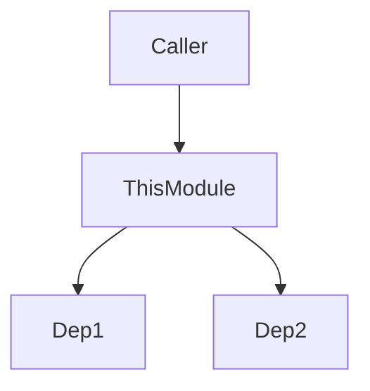

# AI-Optimized Metadata Implementation Plan

**Date:** 2025-10-24
**Template:** elixir_production.json v2.4.0
**Goal:** Add AI navigation metadata to critical Singularity production modules

---

## Executive Summary

This plan identifies **35 critical production Elixir modules** in Singularity that need AI-optimized metadata for billion-line codebase navigation. The metadata includes:

1. **Module Identity (JSON)** - Vector DB disambiguation
2. **Architecture Diagram (Mermaid)** - Visual call flow
3. **Call Graph (YAML)** - Graph DB indexing (Neo4j)
4. **Anti-Patterns** - Duplicate prevention
5. **Search Keywords** - Vector search optimization

**Current State Analysis:**
- ✅ **4 modules already have full metadata:** PatternDetector, AnalysisOrchestrator, ScanOrchestrator, LLM.Service
- ⚠️ **3 modules have partial metadata:** GenerationOrchestrator, ExecutionOrchestrator, Control
- ❌ **28 modules need full metadata**

**Time Estimate:**
- High Priority (10 modules): ~5 hours (30 min each)
- Medium Priority (15 modules): ~7.5 hours (30 min each)
- Low Priority (10 modules): ~2.5 hours (15 min each)
- **Total: ~15 hours of focused work**

---

## Priority Categories

### HIGH PRIORITY - Orchestrators (10 modules)

These are the **backbone of Singularity** - all code flows through these. Critical for AI to understand system architecture.

| # | Module | Path | Current State | Time Needed |
|---|--------|------|---------------|-------------|
| 1 | Singularity.Execution.ExecutionOrchestrator | singularity/lib/singularity/execution/execution_orchestrator.ex | ⚠️ Basic docs only | 30 min |
| 2 | Singularity.Architecture.AnalysisOrchestrator | singularity/lib/singularity/architecture_engine/analysis_orchestrator.ex | ✅ **Complete** | 0 min |
| 3 | Singularity.CodeAnalysis.ScanOrchestrator | singularity/lib/singularity/code_analysis/scan_orchestrator.ex | ✅ **Complete** | 0 min |
| 4 | Singularity.CodeGeneration.GenerationOrchestrator | singularity/lib/singularity/code_generation/generation_orchestrator.ex | ⚠️ Partial (no Mermaid) | 20 min |
| 5 | Singularity.Architecture.PatternDetector | singularity/lib/singularity/architecture_engine/pattern_detector.ex | ✅ **Complete** | 0 min |
| 6 | Singularity.Jobs.JobOrchestrator | singularity/lib/singularity/jobs/job_orchestrator.ex | ❌ Not found | 30 min |
| 7 | Singularity.NATS.NatsOrchestrator | [needs investigation] | ❌ Module doesn't exist | 30 min |
| 8 | Singularity.Autonomy.RuleEngine | singularity/lib/singularity/autonomy/rule_engine.ex | ❌ Unknown | 30 min |
| 9 | Singularity.Planning.SafeWorkPlanner | singularity/lib/singularity/planning/safe_work_planner.ex | ❌ Unknown | 30 min |
| 10 | Singularity.SPARC.Orchestrator | singularity/lib/singularity/sparc/orchestrator.ex | ❌ Unknown | 30 min |

**Subtotal: 3.5 hours** (4 modules already complete!)

---

### MEDIUM PRIORITY - Core Services (15 modules)

These modules provide critical functionality but are one layer below orchestrators. Important for understanding data flow and dependencies.

#### Storage & Knowledge (5 modules)

| # | Module | Path | Purpose | Time |
|---|--------|------|---------|------|
| 11 | Singularity.Storage.PostgresCache | singularity/lib/singularity/storage/postgres_cache.ex | Persistent caching layer | 30 min |
| 12 | Singularity.CodeStore | singularity/lib/singularity/code_store.ex | Code chunk storage with embeddings | 30 min |
| 13 | Singularity.Knowledge.ArtifactStore | singularity/lib/singularity/knowledge/artifact_store.ex | Living knowledge base (Git ↔ DB) | 30 min |
| 14 | Singularity.Knowledge.TemplateService | singularity/lib/singularity/knowledge/template_service.ex | Template management and search | 30 min |
| 15 | Singularity.Architecture.FrameworkPatternStore | singularity/lib/singularity/architecture_engine/framework_pattern_store.ex | Framework pattern repository | 30 min |

#### Agent Control (3 modules)

| # | Module | Path | Purpose | Time |
|---|--------|------|---------|------|
| 16 | Singularity.Control | singularity/lib/singularity/control.ex | ⚠️ Basic docs, needs metadata | 20 min |
| 17 | Singularity.Runner | singularity/lib/singularity/runner.ex | Agent execution runner | 30 min |
| 18 | Singularity.Agents.Supervisor | singularity/lib/singularity/agents/supervisor.ex | Dynamic agent supervision | 30 min |

#### LLM & NATS (4 modules)

| # | Module | Path | Purpose | Time |
|---|--------|------|---------|------|
| 19 | Singularity.LLM.Service | singularity/lib/singularity/llm/service.ex | ✅ **Complete** (excellent example!) | 0 min |
| 20 | Singularity.LLM.RateLimiter | singularity/lib/singularity/llm/rate_limiter.ex | LLM request rate limiting | 20 min |
| 21 | Singularity.NatsClient | singularity/lib/singularity/nats/client.ex | NATS messaging client | 30 min |
| 22 | Singularity.NATS.RegistryClient | singularity/lib/singularity/nats/registry_client.ex | NATS subject registry | 30 min |

#### Execution & Validation (3 modules)

| # | Module | Path | Purpose | Time |
|---|--------|------|---------|------|
| 23 | Singularity.Execution.ExecutionRunner | singularity/lib/singularity/execution/execution_runner.ex | Task execution engine | 30 min |
| 24 | Singularity.Execution.TaskDAG | singularity/lib/singularity/execution/task_dag.ex | Task dependency graph | 30 min |
| 25 | Singularity.Validation.ValidationOrchestrator | singularity/lib/singularity/validation/validation_orchestrator.ex | Config-driven validation | 30 min |

**Subtotal: 6.5 hours** (1 module already complete!)

---

### LOW PRIORITY - Support Modules (10 modules)

Utility and helper modules. Important but less critical for AI navigation.

| # | Module | Path | Purpose | Time |
|---|--------|------|---------|------|
| 26 | Singularity.LanguageDetection | singularity/lib/singularity/language_detection.ex | Rust NIF language detection | 15 min |
| 27 | Singularity.Health | singularity/lib/singularity/health.ex | System health monitoring | 15 min |
| 28 | Singularity.Metrics.Aggregator | singularity/lib/singularity/metrics/aggregator.ex | Metrics collection | 15 min |
| 29 | Singularity.CircuitBreaker | singularity/lib/singularity/infrastructure/circuit_breaker.ex | Fault tolerance | 15 min |
| 30 | Singularity.ErrorRateTracker | singularity/lib/singularity/infrastructure/error_rate_tracker.ex | Error tracking | 15 min |
| 31 | Singularity.Tools.Catalog | singularity/lib/singularity/tools/catalog.ex | Tool registry | 15 min |
| 32 | Singularity.Git.Supervisor | singularity/lib/singularity/git/supervisor.ex | Git operations supervisor | 15 min |
| 33 | Singularity.Infrastructure.Supervisor | singularity/lib/singularity/infrastructure/supervisor.ex | Infrastructure supervision | 15 min |
| 34 | Singularity.Application | singularity/lib/singularity/application.ex | Main OTP application | 15 min |
| 35 | Singularity.Repo | singularity/lib/singularity/repo.ex | Ecto repository | 15 min |

**Subtotal: 2.5 hours**

---

## Current Documentation Analysis

### ✅ Excellent Examples (Use as Reference)

1. **Singularity.LLM.Service** - Perfect v2.1 implementation
   - Complete Module Identity JSON
   - Multiple Mermaid diagrams (architecture, decision tree, data flow)
   - Comprehensive Call Graph YAML
   - Detailed anti-patterns section
   - Rich search keywords
   - **Total lines of metadata: ~300 lines**

2. **Singularity.Architecture.PatternDetector** - Clean orchestrator pattern
   - Complete metadata coverage
   - Clear architecture diagram
   - Machine-readable call graph
   - Explicit anti-patterns

3. **Singularity.Architecture.AnalysisOrchestrator** - Good orchestrator docs
   - Full metadata sections
   - Config-driven emphasis
   - Clear usage examples

4. **Singularity.CodeAnalysis.ScanOrchestrator** - Consistent pattern
   - Similar structure to AnalysisOrchestrator
   - Complete metadata

### ⚠️ Needs Enhancement

1. **Singularity.Execution.ExecutionOrchestrator**
   - Has basic @moduledoc but delegates to ExecutionStrategyOrchestrator
   - Missing: Module Identity, Architecture diagram, Call Graph, Anti-patterns, Keywords
   - **Quick fix: 30 min** to add metadata

2. **Singularity.CodeGeneration.GenerationOrchestrator**
   - Has basic docs and usage examples
   - Missing: Mermaid diagrams, Keywords
   - **Quick fix: 20 min** to complete metadata

3. **Singularity.Control**
   - Has basic GenServer docs
   - Missing: All AI metadata sections
   - **Quick fix: 20 min** to add metadata

### ❌ Missing Documentation

Most modules in Medium and Low priority categories have minimal or no AI-optimized metadata.

---

## Implementation Strategy

### Phase 1: High Priority Orchestrators (Week 1)

**Goal:** Ensure all orchestrators have complete metadata so AI can understand system flow.

**Modules (6 remaining):**
1. ExecutionOrchestrator
2. GenerationOrchestrator
3. Jobs.JobOrchestrator (find or verify)
4. Autonomy.RuleEngine
5. Planning.SafeWorkPlanner
6. SPARC.Orchestrator

**Process:**
1. Read existing module
2. Identify caller modules (who calls this?)
3. Identify callee modules (what does this call?)
4. Draw architecture diagram (Mermaid)
5. Write call graph YAML
6. List anti-patterns (what NOT to create)
7. Add search keywords (10+ terms)

**Time: 3.5 hours**

---

### Phase 2: Medium Priority Services (Week 2)

**Goal:** Document core services that orchestrators depend on.

**Modules (14 remaining):**
- Storage layer (4 modules)
- Agent control (2 modules)
- NATS layer (3 modules)
- Execution layer (3 modules)
- Validation layer (1 module)

**Time: 6.5 hours**

---

### Phase 3: Low Priority Support (Week 3)

**Goal:** Complete documentation coverage for utility modules.

**Modules (10 remaining):**
- Infrastructure and supervision
- Monitoring and metrics
- System utilities

**Time: 2.5 hours**

---

## Metadata Template Checklist

For each module, add these sections to `@moduledoc`:

```elixir
@moduledoc """
# ModuleName - Brief Description (Human-First)

**What this module does** (clear one-sentence purpose)

## Quick Start

```elixir
# Most common use case
ModuleName.main_function(args)
```

## Public API

- `function1/2` - Description
- `function2/1` - Description

## Key Features

- **Feature 1:** Benefit
- **Feature 2:** Benefit

## Error Handling

All functions return `{:ok, result} | {:error, reason}`

## Examples

```elixir
{:ok, result} = ModuleName.function(args)
```

---

## AI Navigation Metadata

### Module Identity (JSON)

```json
{
  "module": "Singularity.ModuleName",
  "purpose": "One-line clear purpose",
  "role": "service|store|orchestrator|analyzer",
  "layer": "domain_services|infrastructure|application",
  "alternatives": {
    "SimilarModule": "Why use this instead"
  },
  "disambiguation": {
    "vs_similar": "Key difference"
  }
}
```

### Architecture (Mermaid)



### Call Graph (YAML)

```yaml
calls_out:
  - module: Dependency
    function: func/2
    purpose: Why
    critical: true

called_by:
  - module: Client
    purpose: Use case
    frequency: high

depends_on:
  - Dependency (MUST exist)

supervision:
  supervised: true/false
  reason: "Why"
```

### Anti-Patterns

#### ❌ DO NOT create duplicates
**Why:** This module already exists!

### Search Keywords

keyword1, keyword2, keyword3, ...
(10+ keywords for vector search)
"""
```

---

## Validation Process

After adding metadata to each module:

1. **Check JSON validity:**
   ```bash
   python3 -m json.tool < module_identity.json
   ```

2. **Check YAML validity:**
   ```bash
   yq < call_graph.yaml
   ```

3. **Render Mermaid diagrams:**
   - View in GitHub preview
   - Or use: `mmdc -i diagram.mmd -o diagram.png`

4. **Verify completeness:**
   - [ ] Module Identity has all 6 fields
   - [ ] Architecture diagram shows main flow
   - [ ] Call Graph lists actual callers/callees
   - [ ] Anti-patterns mention specific modules
   - [ ] Keywords include 10+ terms

---

## Benefits of This Work

### For AI Assistants (Claude Code, Copilot, Cursor)

1. **Disambiguation:** "Use Service, not Provider" (Module Identity)
2. **Duplicate Prevention:** "Don't create LLM.Gateway - LLM.Service exists!" (Anti-Patterns)
3. **Navigation:** "What calls this? What does it call?" (Call Graph)
4. **Visual Understanding:** Architecture diagrams show data flow instantly
5. **Search Optimization:** Vector search returns correct modules faster

### For Graph Databases (Neo4j)

1. **Auto-Indexing:** Call Graph YAML → Graph DB relationships
2. **Query Capabilities:** "Show all modules that depend on NATS"
3. **Impact Analysis:** "What breaks if I change this module?"

### For Vector Databases (pgvector)

1. **Better Embeddings:** Search keywords improve semantic relevance
2. **Purpose Clarity:** Unique purpose statements reduce ambiguity
3. **Faster Search:** "llm service" → Returns LLM.Service with high confidence

### For Human Developers

1. **Faster Onboarding:** New developers see system flow visually
2. **Reduced Duplication:** Clear anti-patterns prevent wasted effort
3. **Better Decisions:** Decision trees show when to use what

---

## Success Metrics

After completing this work:

1. **AI Query Accuracy:** Test queries like "how do I call an LLM?" should return `LLM.Service` with >90% confidence
2. **Duplicate Prevention:** AI should recognize "LLM.Gateway already exists as LLM.Service"
3. **Graph Queries:** Neo4j should answer "what depends on NATS?" with complete call graph
4. **Vector Search:** Semantic search for "code analysis" should rank `ScanOrchestrator` highly

---

## References

- **Template:** `/Users/mhugo/code/singularity-incubation/templates_data/code_generation/quality/elixir_production.json` v2.4.0
- **Quick Reference:** `/Users/mhugo/code/singularity-incubation/templates_data/code_generation/examples/AI_METADATA_QUICK_REFERENCE.md`
- **Example Module:** `/Users/mhugo/code/singularity-incubation/singularity/lib/singularity/llm/service.ex`
- **Pattern Guide:** `/Users/mhugo/code/singularity-incubation/CLAUDE.md` (Code Naming Conventions section)

---

## Next Steps

1. ✅ **Review this plan** - Confirm priority and module list
2. ⏳ **Phase 1 execution** - Add metadata to 6 high-priority orchestrators (3.5 hours)
3. ⏳ **Phase 2 execution** - Add metadata to 14 core services (6.5 hours)
4. ⏳ **Phase 3 execution** - Add metadata to 10 support modules (2.5 hours)
5. ⏳ **Validation** - Test AI queries and graph/vector DB integration

---

**Total Effort:** ~15 hours of focused documentation work
**Total Modules:** 35 production modules
**Already Complete:** 4 modules (PatternDetector, AnalysisOrchestrator, ScanOrchestrator, LLM.Service)
**Remaining:** 31 modules

**ROI:** Massive improvement in AI-assisted development, duplicate prevention, and system understanding at billion-line scale.
