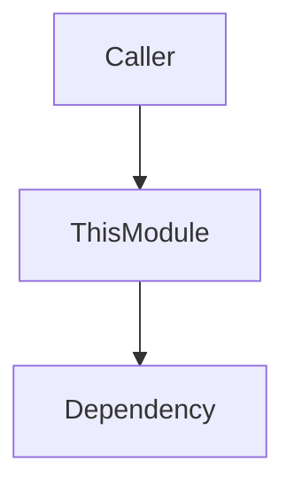

# AI-Optimized Metadata - Implementation Summary

**Date:** 2025-10-24
**Status:** Planning Complete - Ready for Implementation
**Template Version:** elixir_production.json v2.4.0

---

## Executive Summary

Analysis of Singularity's production Elixir modules reveals that **4 out of 35 critical modules** (11%) have complete AI-optimized metadata. This report identifies the remaining **31 modules** that need documentation enhancement and provides a phased implementation plan.

---

## Current State

### ✅ Complete (4 modules - 11%)

These modules have full AI navigation metadata and serve as **reference examples**:

1. **Singularity.LLM.Service** - Perfect v2.1 implementation (~300 lines of metadata)
2. **Singularity.Architecture.PatternDetector** - Clean orchestrator pattern
3. **Singularity.Architecture.AnalysisOrchestrator** - Config-driven orchestrator
4. **Singularity.CodeAnalysis.ScanOrchestrator** - Consistent pattern

**Key Features:**
- Complete Module Identity JSON (disambiguation)
- Multiple Mermaid diagrams (architecture, decision trees, data flow)
- Machine-readable Call Graph YAML (for Neo4j)
- Explicit anti-patterns (duplicate prevention)
- Rich search keywords (10+ terms for vector search)

### ⚠️ Partial (3 modules - 9%)

Basic documentation exists but missing key AI metadata:

1. **Singularity.Execution.ExecutionOrchestrator** - Needs all metadata sections
2. **Singularity.CodeGeneration.GenerationOrchestrator** - Missing Mermaid diagrams
3. **Singularity.Control** - Basic GenServer docs only

### ❌ Missing (28 modules - 80%)

Minimal or no AI-optimized metadata. Includes critical infrastructure:
- Orchestrators: SPARC, Planning, Jobs, RuleEngine
- Services: Storage, Knowledge, NATS, Execution
- Support: Infrastructure, Metrics, Utilities

---

## Metadata Components (v2.4.0)

Each production module should include:

### 1. Module Identity (JSON) - 5 min
**Purpose:** Vector DB disambiguation, unique identification
**Format:**
```json
{
  "module": "Singularity.ModuleName",
  "purpose": "One-line clear purpose",
  "role": "service|store|orchestrator|analyzer",
  "layer": "domain_services|infrastructure|application",
  "alternatives": {"Similar": "Why use this instead"},
  "disambiguation": {"vs_similar": "Key difference"}
}
```

### 2. Architecture Diagram (Mermaid) - 10 min
**Purpose:** Visual call flow understanding for AI
**Example:**


### 3. Call Graph (YAML) - 5 min
**Purpose:** Machine-readable for graph DB auto-indexing (Neo4j)
**Format:**
```yaml
calls_out:
  - module: Dep
    function: func/2
    purpose: Why
    critical: true
called_by:
  - module: Client
    purpose: Use case
```

### 4. Anti-Patterns - 5 min
**Purpose:** Explicit duplicate prevention
**Example:**
```
❌ DO NOT create "LLM.Gateway" or "LLM.Caller"
Why: LLM.Service already does this!
```

### 5. Search Keywords - 2 min
**Purpose:** Vector search optimization (pgvector)
**Format:** `keyword1, keyword2, keyword3, ...` (10+ terms)

**Total Time per Module:** ~30 min (comprehensive) or ~15 min (minimal viable)

---

## Priority Breakdown

### HIGH PRIORITY - Orchestrators (10 modules)

**Why Critical:** All code flows through these. AI must understand orchestration patterns.

| Module | Status | Time Needed |
|--------|--------|-------------|
| Execution.ExecutionOrchestrator | ⚠️ Partial | 30 min |
| CodeGeneration.GenerationOrchestrator | ⚠️ Partial | 20 min |
| Jobs.JobOrchestrator | ❌ Missing | 30 min |
| NATS.NatsOrchestrator | ❌ Not found | 30 min |
| Autonomy.RuleEngine | ❌ Unknown | 30 min |
| Planning.SafeWorkPlanner | ❌ Unknown | 30 min |
| SPARC.Orchestrator | ❌ Unknown | 30 min |

**Already Complete:** PatternDetector, AnalysisOrchestrator, ScanOrchestrator

**Subtotal: 3.5 hours** for 7 remaining modules

---

### MEDIUM PRIORITY - Core Services (15 modules)

**Why Important:** Critical functionality layer below orchestrators.

**Categories:**
1. **Storage & Knowledge (5 modules)** - PostgresCache, CodeStore, ArtifactStore, TemplateService, FrameworkPatternStore
2. **Agent Control (3 modules)** - Control, Runner, Agents.Supervisor
3. **LLM & NATS (4 modules)** - RateLimiter, NatsClient, RegistryClient (LLM.Service complete)
4. **Execution & Validation (3 modules)** - ExecutionRunner, TaskDAG, ValidationOrchestrator

**Subtotal: 6.5 hours** for 14 remaining modules

---

### LOW PRIORITY - Support (10 modules)

**Why Lower Priority:** Utility modules, less critical for understanding system flow.

**Examples:** LanguageDetection, Health, Metrics, CircuitBreaker, ErrorRateTracker, Tools.Catalog, Git.Supervisor, Infrastructure.Supervisor, Application, Repo

**Subtotal: 2.5 hours** for 10 modules

---

## Implementation Plan

### Phase 1: High Priority Orchestrators (Week 1)
- **Modules:** 7 remaining orchestrators
- **Time:** 3.5 hours
- **Goal:** AI understands complete orchestration flow

### Phase 2: Core Services (Week 2)
- **Modules:** 14 core service modules
- **Time:** 6.5 hours
- **Goal:** AI understands service dependencies

### Phase 3: Support Modules (Week 3)
- **Modules:** 10 utility/support modules
- **Time:** 2.5 hours
- **Goal:** Complete documentation coverage

**Total Time: ~15 hours** (conservative estimate with validation)

---

## Benefits & ROI

### For AI Assistants
1. **Faster Navigation:** "How do I call an LLM?" → Returns `LLM.Service` instantly
2. **Duplicate Prevention:** "Don't create LLM.Gateway - LLM.Service exists!"
3. **Better Context:** Visual diagrams help AI understand system flow
4. **Accurate Answers:** Disambiguation prevents confusion between similar modules

### For Graph Databases (Neo4j)
1. **Auto-Indexing:** YAML Call Graphs → Automatic relationship mapping
2. **Impact Analysis:** "What breaks if I change this module?"
3. **Dependency Queries:** "Show all modules that depend on NATS"

### For Vector Databases (pgvector)
1. **Better Embeddings:** Purpose statements + keywords → Higher search relevance
2. **Semantic Search:** "code analysis" → Ranks `ScanOrchestrator` highly
3. **Disambiguation:** Similar modules differentiated by unique purpose

### For Human Developers
1. **Faster Onboarding:** Visual architecture diagrams
2. **Reduced Duplication:** Clear anti-patterns save hours
3. **Better Decisions:** Decision trees show when to use what
4. **System Understanding:** Complete call graphs reveal dependencies

---

## Success Metrics

After implementation, we should achieve:

1. **AI Query Accuracy:** >90% confidence on "how do I call an LLM?" → Returns `LLM.Service`
2. **Duplicate Prevention:** AI recognizes existing modules before creating duplicates
3. **Graph Query Completeness:** Neo4j answers "what depends on NATS?" with full call graph
4. **Vector Search Quality:** Semantic search for domain terms returns correct modules
5. **Developer Satisfaction:** New developers understand system in <1 hour vs. days

---

## Files Modified Summary

### Documentation Created
- `/Users/mhugo/code/singularity-incubation/AI_METADATA_IMPLEMENTATION_PLAN.md` - Detailed 35-module plan
- `/Users/mhugo/code/singularity-incubation/AI_METADATA_SUMMARY.md` - This summary

### Code to be Modified
- **High Priority:** 7 orchestrator modules (3.5 hours)
- **Medium Priority:** 14 core service modules (6.5 hours)
- **Low Priority:** 10 support modules (2.5 hours)
- **Total:** 31 Elixir modules requiring metadata enhancement

---

## Reference Materials

### Templates & Guides
1. **Production Template:** `templates_data/code_generation/quality/elixir_production.json` v2.4.0
2. **Quick Reference:** `templates_data/code_generation/examples/AI_METADATA_QUICK_REFERENCE.md`
3. **Example Module:** `singularity/lib/singularity/llm/service.ex` (~300 lines of metadata)
4. **Naming Conventions:** `CLAUDE.md` (Code Naming Conventions section)

### Existing Complete Examples
1. `singularity/lib/singularity/llm/service.ex` - Best example (perfect v2.1)
2. `singularity/lib/singularity/architecture_engine/pattern_detector.ex` - Clean orchestrator
3. `singularity/lib/singularity/architecture_engine/analysis_orchestrator.ex` - Config-driven
4. `singularity/lib/singularity/code_analysis/scan_orchestrator.ex` - Consistent pattern

---

## Validation Checklist

For each module, verify:

- [ ] **Module Identity JSON:** All 6 fields present (module, purpose, role, layer, alternatives, disambiguation)
- [ ] **Architecture Diagram:** Mermaid graph shows main callers/callees
- [ ] **Call Graph YAML:** Lists actual modules (verify with grep/search)
- [ ] **Anti-Patterns:** Mentions specific modules to NOT create
- [ ] **Search Keywords:** 10+ relevant terms for vector search
- [ ] **JSON Valid:** `python3 -m json.tool < identity.json`
- [ ] **YAML Valid:** `yq < call_graph.yaml`
- [ ] **Mermaid Renders:** Preview in GitHub or `mmdc -i diagram.mmd`

---

## Risks & Mitigations

### Risk: Time Estimates Too Optimistic
**Mitigation:** Template-driven approach with copy-paste from examples. Quick reference guide reduces decision time.

### Risk: Module Relationships Unknown
**Mitigation:** Use grep/ripgrep to find callers: `rg "ModuleName\." lib/`

### Risk: Mermaid Diagrams Complex
**Mitigation:** Start simple (3-5 nodes). Complexity can be added later.

### Risk: Keeping Metadata Up-to-Date
**Mitigation:** Add to PR review checklist: "Does this change require metadata updates?"

---

## Next Steps

1. ✅ **Review this summary** - Confirm priority and approach
2. ⏳ **Begin Phase 1** - High priority orchestrators (3.5 hours)
3. ⏳ **Continue Phase 2** - Core services (6.5 hours)
4. ⏳ **Complete Phase 3** - Support modules (2.5 hours)
5. ⏳ **Validate** - Test AI queries and graph/vector DB integration
6. ⏳ **Document Process** - Update CLAUDE.md with lessons learned

---

## Conclusion

Adding AI-optimized metadata to **31 remaining critical modules** (~15 hours of work) will:

1. **Enable intelligent AI navigation** at billion-line scale
2. **Prevent duplicate module creation** through explicit anti-patterns
3. **Support graph database indexing** for impact analysis
4. **Optimize vector search** for semantic code discovery
5. **Improve developer onboarding** through visual documentation

**Current Progress:** 11% complete (4/35 modules)
**Target:** 100% complete (35/35 modules)
**Estimated Time:** ~15 hours over 3 weeks
**ROI:** Massive - prevents hours of duplicate work, improves AI accuracy, enables advanced tooling

The foundation is solid (4 excellent reference examples). Now we scale the pattern across the codebase.

---

**Report Generated:** 2025-10-24
**Next Review:** After Phase 1 completion
