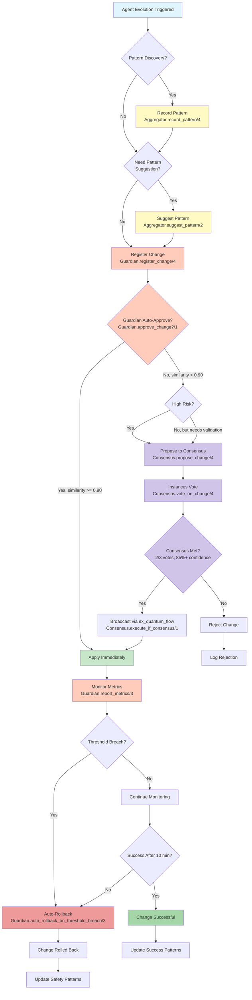
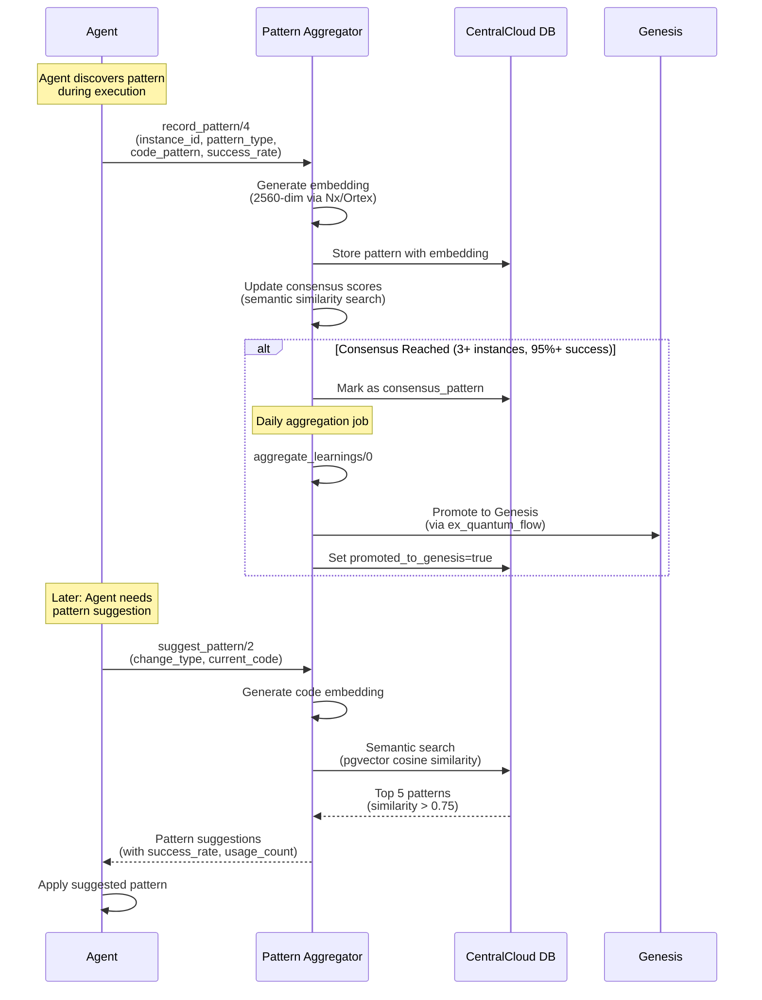
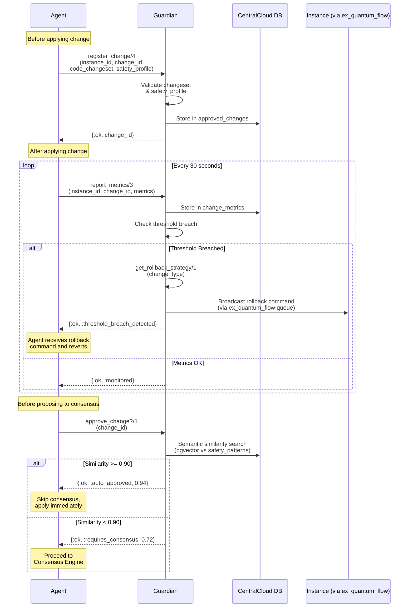
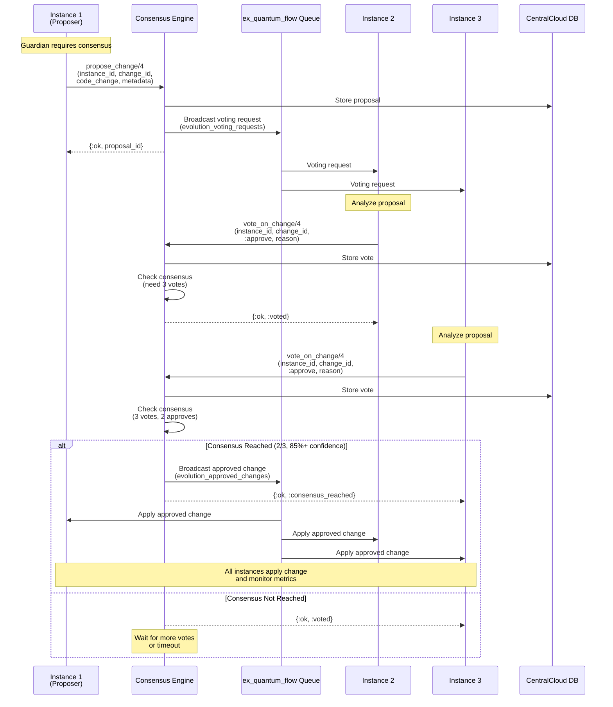
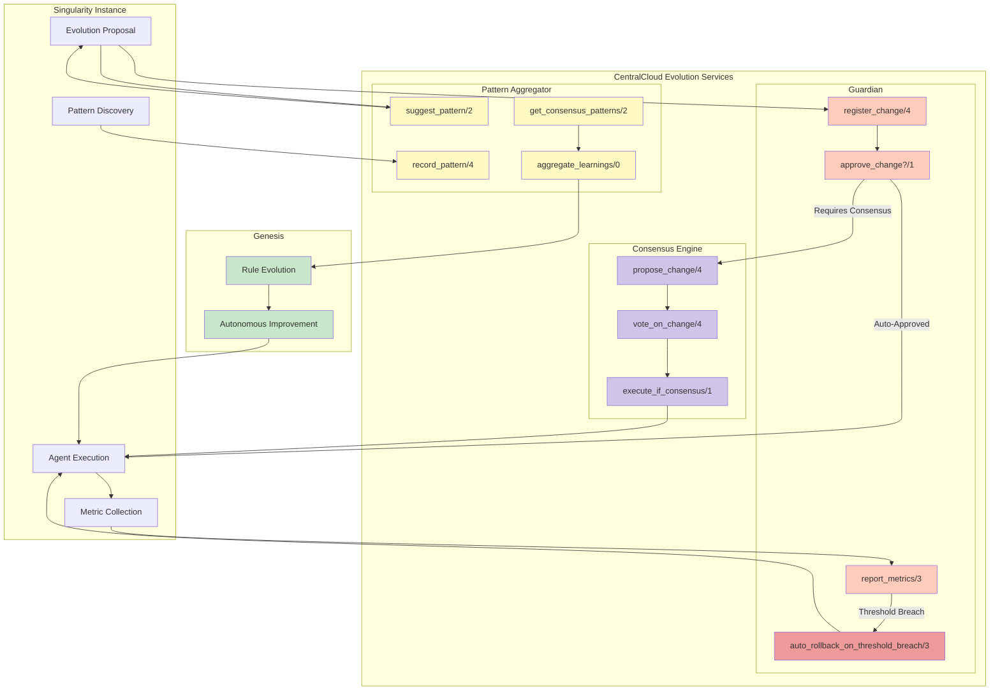
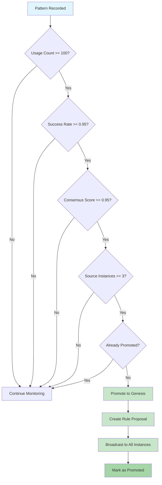

# CentralCloud Evolution - Decision Tree & Flow Diagrams

**Version**: 1.0
**Date**: 2025-10-30

## Decision Tree: When to Consult Guardian vs Patterns vs Consensus



## Detailed Flow: Pattern Discovery & Suggestion



## Detailed Flow: Guardian Safety Coordination



## Detailed Flow: Consensus Voting & Execution



## Complete System Flow (All 3 Services)



## Threshold Decision Matrix

| Metric | Threshold | Severity | Action |
|--------|-----------|----------|--------|
| `success_rate < 0.90` | 90% | Critical | Auto-rollback immediately |
| `error_rate > 0.10` | 10% | Critical | Auto-rollback immediately |
| `latency_p95_ms > 3000` | 3000ms | High | Auto-rollback after 2 breaches |
| `cost_cents > 10.0` | $0.10 | Medium | Alert, rollback after 5 breaches |

## Consensus Scoring Matrix

| Criteria | Requirement | Weight |
|----------|-------------|--------|
| **Minimum Votes** | >= 3 instances | Required |
| **Approval Rate** | >= 67% (2/3) | Required |
| **Average Confidence** | >= 0.85 | Required |
| **No Strong Rejections** | No vote with confidence > 0.90 and vote = reject | Required |

### Consensus Examples

#### Scenario 1: Consensus Reached
```
Votes: 4 total
- Instance 1: approve, confidence 0.92
- Instance 2: approve, confidence 0.88
- Instance 3: approve, confidence 0.90
- Instance 4: reject, confidence 0.60

Approval Rate: 3/4 = 75% ✅ (>= 67%)
Avg Confidence: (0.92 + 0.88 + 0.90 + 0.60) / 4 = 0.825 ❌ (< 0.85)

Result: Consensus NOT reached (avg confidence too low)
```

#### Scenario 2: Consensus Reached
```
Votes: 3 total
- Instance 1: approve, confidence 0.95
- Instance 2: approve, confidence 0.90
- Instance 3: approve, confidence 0.85

Approval Rate: 3/3 = 100% ✅ (>= 67%)
Avg Confidence: (0.95 + 0.90 + 0.85) / 3 = 0.90 ✅ (>= 0.85)
Strong Rejections: None ✅

Result: Consensus REACHED ✅ → Execute change
```

#### Scenario 3: Strong Rejection
```
Votes: 3 total
- Instance 1: approve, confidence 0.95
- Instance 2: approve, confidence 0.90
- Instance 3: reject, confidence 0.92

Approval Rate: 2/3 = 67% ✅ (>= 67%)
Avg Confidence: (0.95 + 0.90 + 0.92) / 3 = 0.92 ✅ (>= 0.85)
Strong Rejections: Instance 3 (reject with 0.92 confidence) ❌

Result: Consensus REJECTED ❌ (strong rejection override)
```

## Pattern Promotion Decision Tree



## Service Selection Quick Reference

| Scenario | Service to Use | Function |
|----------|---------------|----------|
| **Pattern discovered** | Pattern Aggregator | `record_pattern/4` |
| **Need pattern for evolution** | Pattern Aggregator | `suggest_pattern/2` |
| **Before applying any change** | Guardian | `register_change/4` |
| **After applying change** | Guardian | `report_metrics/3` (loop) |
| **Check if safe to apply** | Guardian | `approve_change?/1` |
| **High-risk change** | Consensus Engine | `propose_change/4` |
| **Vote on proposal** | Consensus Engine | `vote_on_change/4` |
| **Metrics breach threshold** | Guardian | `auto_rollback_on_threshold_breach/3` (automatic) |
| **Get consensus patterns** | Pattern Aggregator | `get_consensus_patterns/2` |
| **Promote to Genesis** | Pattern Aggregator | `aggregate_learnings/0` (daily) |

## Summary

**Decision Logic:**
1. **Always** register changes with Guardian before applying
2. **If pattern discovered** → Record with Pattern Aggregator
3. **If need suggestion** → Ask Pattern Aggregator for similar patterns
4. **If Guardian auto-approves** → Apply immediately
5. **If Guardian requires consensus** → Propose to Consensus Engine
6. **If consensus reached** → Broadcast to all instances
7. **Always** monitor metrics and report to Guardian
8. **If threshold breached** → Guardian auto-rolls back
9. **Daily** → Pattern Aggregator promotes to Genesis
