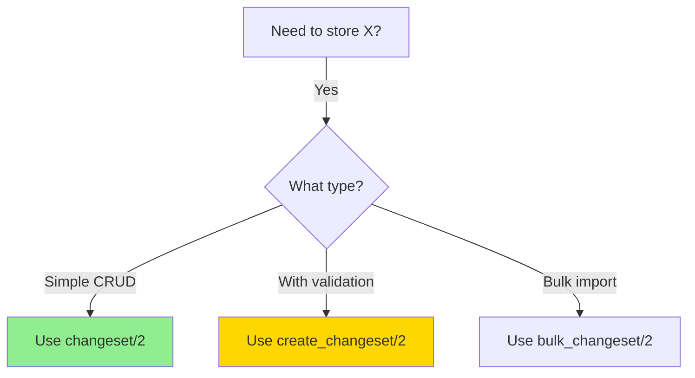
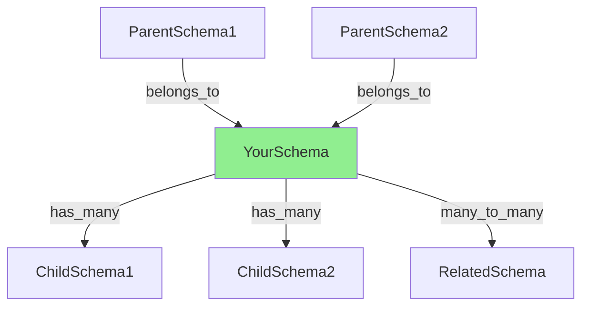
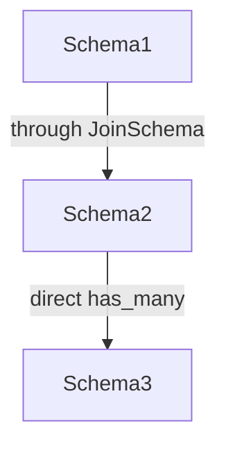

# Ecto Schema AI Documentation Guide

**Complete template and examples for adding AI navigation metadata to 67 Ecto schemas in Singularity codebase.**

Version: 1.0
Date: 2025-01-25
Author: Claude Code
Purpose: Systematically document all Ecto schemas with AI-optimized metadata

---

## Table of Contents

1. [Overview](#overview)
2. [Why AI Metadata for Schemas?](#why-ai-metadata-for-schemas)
3. [Schema-Specific Template](#schema-specific-template)
4. [Real Examples](#real-examples)
5. [Quick Start Workflow](#quick-start-workflow)
6. [Schema Type Categories](#schema-type-categories)
7. [Content Generation Tips](#content-generation-tips)
8. [Validation Checklist](#validation-checklist)

---

## Overview

Ecto schemas are **data definitions**, not service modules. They require specialized AI metadata focusing on:

- **Data structure** (fields, types, relationships)
- **Database operations** (queries, changesets)
- **Schema relationships** (belongs_to, has_many)
- **Data integrity** (validations, constraints)
- **Storage patterns** (JSONB, vectors, embeddings)

---

## Why AI Metadata for Schemas?

At billion-line scale, AI assistants need to:

1. **Find the right schema** - "Which schema stores rules?"
2. **Understand relationships** - "What schemas reference this?"
3. **Prevent duplicates** - "Don't create another UserSchema - User exists!"
4. **Know storage details** - "Does this use pgvector? JSONB? TimescaleDB?"
5. **Understand data flow** - "How does data get into this table?"

**Key differences from service modules:**

| Service Module | Ecto Schema |
|----------------|-------------|
| Focus on behavior | Focus on data structure |
| `calls_out` to dependencies | `has_many`, `belongs_to` relationships |
| Function execution flow | Data validation & persistence |
| GenServer/Supervisor | Never supervised (pure data) |

---

## Schema-Specific Template

### Minimum Viable (15 minutes)

```elixir
defmodule Singularity.Schemas.YourSchema do
  @moduledoc """
  Brief description of what data this schema stores.

  Key features:
  - Main purpose bullet points
  - Special fields (JSONB, vectors, etc.)
  - Relationships to other schemas

  ## AI Navigation Metadata

  ### Module Identity (JSON)

  ```json
  {
    "module": "Singularity.Schemas.YourSchema",
    "purpose": "Clear one-line purpose: stores X with Y features",
    "role": "schema",
    "layer": "domain_services|infrastructure|tools|monitoring",
    "table": "database_table_name",
    "relationships": {
      "ParentSchema": "belongs_to relationship",
      "ChildSchema": "has_many relationship"
    },
    "alternatives": {
      "SimilarSchema": "Why use this instead of SimilarSchema"
    },
    "disambiguation": {
      "vs_similar": "Key difference from SimilarSchema"
    }
  }
  ```

  ### Schema Structure (YAML)

  ```yaml
  table: database_table_name
  primary_key: :id (binary_id)

  fields:
    # Core fields
    - name: field_name
      type: :string | :integer | :boolean | :map | etc.
      required: true|false
      purpose: What this field stores

    # Special fields
    - name: embedding
      type: Pgvector.Ecto.Vector
      purpose: Semantic search via pgvector

    - name: metadata
      type: :map (JSONB)
      purpose: Flexible JSON data

  relationships:
    belongs_to:
      - schema: ParentSchema
        field: parent_id
        required: true|false

    has_many:
      - schema: ChildSchema
        foreign_key: parent_id
        purpose: Why this relationship exists

  indexes:
    - type: btree|gin|hnsw
      fields: [field1, field2]
      purpose: Query optimization

  constraints:
    - type: unique_constraint
      fields: [field1, field2]
      name: constraint_name
  ```

  ### Data Flow (Mermaid)

  ```mermaid
  graph TB
      Source[Data Source] -->|1. create/update| Schema[YourSchema]
      Schema -->|2. changeset| Validation[Validations]
      Validation -->|3. valid| DB[PostgreSQL Table]

      Query[Queries] -->|4. read| DB
      DB -->|5. results| Schema

      style Schema fill:#90EE90
      style DB fill:#FFD700
  ```

  ### Call Graph (YAML)

  ```yaml
  calls_out:
    - module: Ecto.Schema
      function: schema/2
      purpose: Define table structure
      critical: true

    - module: Ecto.Changeset
      function: cast/3, validate_*/2
      purpose: Data validation
      critical: true

  called_by:
    - module: ServiceThatUsesThis
      purpose: CRUD operations
      frequency: high

    - module: AnotherService
      purpose: Queries
      frequency: medium

  depends_on:
    - PostgreSQL table (MUST exist via migration)
    - Ecto.Repo (for all operations)
    - Special extensions (pgvector, timescaledb, etc.)

  supervision:
    supervised: false
    reason: "Pure Ecto schema - not a process, no supervision needed"
  ```

  ### Anti-Patterns

  #### ❌ DO NOT create duplicate schemas for same table
  **Why:** One schema per table. Multiple schemas = confusion.
  ```elixir
  # ❌ WRONG - Duplicate schema
  defmodule YourSchemaV2 do
    schema "same_table" do ...

  # ✅ CORRECT - Evolve existing schema
  # Add new fields/relationships to YourSchema
  ```

  #### ❌ DO NOT bypass changesets for validation
  ```elixir
  # ❌ WRONG - Direct struct insertion
  %YourSchema{field: value} |> Repo.insert!()

  # ✅ CORRECT - Use changeset
  %YourSchema{}
  |> YourSchema.changeset(%{field: value})
  |> Repo.insert()
  ```

  #### ❌ DO NOT use raw SQL instead of Ecto queries
  ```elixir
  # ❌ WRONG - Raw SQL bypasses schema
  Repo.query!("SELECT * FROM table WHERE id = $1", [id])

  # ✅ CORRECT - Use Ecto query
  from(s in YourSchema, where: s.id == ^id) |> Repo.one()
  ```

  ### Search Keywords

  schema name, table name, main purpose, data type, key features,
  relationships, validation, storage patterns, use cases, domain area
  (10-15 comma-separated keywords)
  """

  use Ecto.Schema
  import Ecto.Changeset

  # Schema definition...
end
```

### Full Optimization (30 minutes)

Add these optional sections for complex schemas:

#### Decision Tree (for schemas with multiple usage patterns)

```elixir
## Decision Tree


```

#### Complex Relationships Diagram

```elixir
## Relationships


```

---

## Real Examples

### Example 1: Simple Schema with pgvector (CodeChunk)

```elixir
defmodule Singularity.Schemas.CodeChunk do
  @moduledoc """
  Code Chunk schema - Individual code chunks with semantic embeddings

  Stores parsed code snippets with their vector embeddings for semantic search.
  Uses pgvector for similarity queries across the codebase.

  ## AI Navigation Metadata

  ### Module Identity (JSON)

  ```json
  {
    "module": "Singularity.Schemas.CodeChunk",
    "purpose": "Store code chunks with pgvector embeddings for semantic search",
    "role": "schema",
    "layer": "domain_services",
    "table": "code_chunks",
    "relationships": {
      "CodebaseMetadata": "belongs_to relationship for codebase tracking"
    },
    "alternatives": {
      "KnowledgeArtifact": "Use CodeChunk for actual code; KnowledgeArtifact for templates"
    },
    "disambiguation": {
      "vs_knowledge_artifact": "CodeChunk = your codebase. KnowledgeArtifact = curated templates"
    }
  }
  ```

  ### Schema Structure (YAML)

  ```yaml
  table: code_chunks
  primary_key: :id (binary_id)

  fields:
    - name: codebase_id
      type: :string
      required: true
      purpose: Links chunk to specific codebase

    - name: file_path
      type: :string
      required: true
      purpose: Source file path

    - name: language
      type: :string
      required: true
      purpose: Programming language (elixir, rust, etc.)

    - name: content
      type: :string (text)
      required: true
      purpose: Actual code content

    - name: embedding
      type: Pgvector.Ecto.Vector (halfvec 2560)
      required: true
      purpose: Semantic search vector (Qodo 1536 + Jina 1024)

    - name: metadata
      type: :map (JSONB)
      required: false
      purpose: Line count, function count, complexity

    - name: content_hash
      type: :string
      required: true
      purpose: Deduplication via hash

  relationships:
    belongs_to:
      - schema: CodebaseMetadata
        field: codebase_id
        required: false

    has_many: []

  indexes:
    - type: hnsw
      fields: [embedding]
      purpose: Fast vector similarity search with halfvec_cosine_ops (up to 4000 dims)

    - type: btree
      fields: [codebase_id, file_path]
      purpose: Lookup by codebase and file

    - type: unique btree
      fields: [codebase_id, content_hash]
      purpose: Prevent duplicate chunks
  ```

  ### Data Flow (Mermaid)

  ```mermaid
  graph TB
      Parser[Code Parser] -->|1. parse file| CodeChunk[CodeChunk]
      CodeChunk -->|2. generate hash| Hash[content_hash]
      CodeChunk -->|3. generate embedding| Embedding[EmbeddingGenerator]
      Embedding -->|4. 2560-dim vector| CodeChunk
      CodeChunk -->|5. changeset| Validation[Validations]
      Validation -->|6. insert/update| DB[(PostgreSQL + pgvector)]

      Search[Semantic Search] -->|7. similarity query| DB
      DB -->|8. results| CodeChunk

      style CodeChunk fill:#90EE90
      style DB fill:#FFD700
      style Embedding fill:#87CEEB
  ```

  ### Call Graph (YAML)

  ```yaml
  calls_out:
    - module: Ecto.Schema
      function: schema/2
      purpose: Define code_chunks table structure
      critical: true

    - module: Ecto.Changeset
      function: cast/3, validate_*/2
      purpose: Validate chunk data before persistence
      critical: true

    - module: Pgvector.Ecto.Vector
      function: type definition
      purpose: Store 2560-dim vectors in halfvec format
      critical: true

  called_by:
    - module: Singularity.CodeStore
      purpose: Insert/update code chunks during indexing
      frequency: high

    - module: Singularity.SemanticCodeSearch
      purpose: Query similar code via embedding
      frequency: high

    - module: Singularity.HybridCodeSearch
      purpose: Combined semantic + keyword search
      frequency: medium

  depends_on:
    - PostgreSQL code_chunks table (MUST exist via migration)
    - Pgvector extension (for embedding field)
    - Ecto.Repo (for all database operations)

  supervision:
    supervised: false
    reason: "Pure Ecto schema - not a process, no supervision needed"
  ```

  ### Anti-Patterns

  #### ❌ DO NOT use non-2560-dim embeddings
  **Why:** Index is optimized for 2560 dimensions (Qodo 1536 + Jina 1024).
  ```elixir
  # ❌ WRONG - Wrong dimension
  %CodeChunk{embedding: Pgvector.new(List.duplicate(0.0, 1024))}

  # ✅ CORRECT - 2560 dimensions
  %CodeChunk{embedding: Pgvector.new(List.duplicate(0.0, 2560))}
  ```

  #### ❌ DO NOT skip content_hash for deduplication
  ```elixir
  # ❌ WRONG - No hash, duplicates possible
  %CodeChunk{content: code} |> Repo.insert()

  # ✅ CORRECT - Hash for uniqueness
  hash = :crypto.hash(:sha256, code) |> Base.encode16()
  %CodeChunk{content: code, content_hash: hash} |> Repo.insert()
  ```

  #### ❌ DO NOT query without codebase_id filter
  **Why:** Millions of chunks across codebases - always filter!
  ```elixir
  # ❌ WRONG - Scans all codebases
  from(c in CodeChunk, where: c.language == "elixir")

  # ✅ CORRECT - Filter by codebase first
  from(c in CodeChunk,
    where: c.codebase_id == ^codebase_id and c.language == "elixir")
  ```

  ### Search Keywords

  code chunks, embeddings, pgvector, semantic search, code storage,
  vector similarity, halfvec, ecto schema, code indexing, similarity query,
  elixir rust typescript, codebase search, RAG
  """

  use Ecto.Schema
  import Ecto.Changeset

  @primary_key {:id, :binary_id, autogenerate: true}
  @foreign_key_type :binary_id

  schema "code_chunks" do
    field :codebase_id, :string
    field :file_path, :string
    field :language, :string
    field :content, :string
    field :embedding, Pgvector.Ecto.Vector
    field :metadata, :map, default: %{}
    field :content_hash, :string

    timestamps()
  end

  @doc false
  def changeset(chunk, attrs) do
    chunk
    |> cast(attrs, [:codebase_id, :file_path, :language, :content,
                    :embedding, :metadata, :content_hash])
    |> validate_required([:codebase_id, :file_path, :language,
                         :content, :embedding, :content_hash])
    |> validate_embedding_dimension()
    |> unique_constraint([:codebase_id, :content_hash])
  end

  defp validate_embedding_dimension(changeset) do
    # Implementation...
  end
end
```

---

### Example 2: Complex Schema with Relationships (Rule)

```elixir
defmodule Singularity.Execution.Autonomy.Rule do
  @moduledoc """
  Rule schema - Evolvable agent behavior rules with consensus governance

  Rules are data, not code. Agents can propose rule evolutions through
  consensus voting. Supports both Elixir pattern matching and Lua scripts
  for hot-reloadable business logic.

  ## AI Navigation Metadata

  ### Module Identity (JSON)

  ```json
  {
    "module": "Singularity.Execution.Autonomy.Rule",
    "purpose": "Evolvable agent behavior rules with pgvector embeddings and Lua support",
    "role": "schema",
    "layer": "domain_services",
    "table": "agent_behavior_confidence_rules",
    "relationships": {
      "RuleExecution": "has_many - tracks rule execution history",
      "RuleEvolutionProposal": "has_many - tracks evolution proposals",
      "ParentRule": "belongs_to self - versioning lineage"
    },
    "alternatives": {
      "RuleLoader": "Use Rule for schema; RuleLoader for caching",
      "RuleEngine": "Rule = data definition; RuleEngine = execution",
      "Hardcoded Rules": "Rules-as-data enables hot-reload & evolution"
    },
    "disambiguation": {
      "vs_rule_loader": "Rule is schema; RuleLoader is cache service",
      "vs_rule_engine": "Rule defines structure; RuleEngine evaluates",
      "vs_hardcoded": "DB rules evolve via consensus without recompiling"
    }
  }
  ```

  ### Schema Structure (YAML)

  ```yaml
  table: agent_behavior_confidence_rules
  primary_key: :id (binary_id)

  fields:
    # Identity
    - name: name
      type: :string
      required: true
      purpose: Unique rule identifier

    - name: description
      type: :string
      required: false
      purpose: Human-readable explanation

    - name: category
      type: :string
      required: true
      purpose: Rule category (quality, security, performance)

    # Rule definition (JSONB)
    - name: condition
      type: :map (JSONB)
      required: true
      purpose: Rule condition pattern matching

    - name: action
      type: :map (JSONB)
      required: false
      purpose: Action to take when condition matches

    - name: metadata
      type: :map (JSONB)
      required: false
      purpose: Additional rule metadata

    # Configuration
    - name: confidence_threshold
      type: :float
      required: false
      purpose: Minimum confidence (0.0-1.0) to execute rule

    - name: priority
      type: :integer
      required: false
      purpose: Rule priority for conflict resolution

    # Semantic search
    - name: embedding
      type: Pgvector.Ecto.Vector
      required: false
      purpose: Semantic search for similar rules

    # Execution type
    - name: execution_type
      type: Ecto.Enum [:elixir_patterns, :lua_script]
      required: true
      default: :elixir_patterns
      purpose: How to execute rule (Elixir or Lua)

    - name: lua_script
      type: :string (text)
      required: false
      purpose: Lua script for hot-reload logic

    # Governance
    - name: version
      type: :integer
      required: false
      purpose: Rule version number

    - name: active
      type: :boolean
      required: true
      default: true
      purpose: Whether rule is active

  relationships:
    belongs_to:
      - schema: Rule (self-reference)
        field: parent_id
        required: false
        purpose: Versioning lineage (evolved from parent)

    has_many:
      - schema: RuleExecution
        foreign_key: rule_id
        purpose: Track execution history

      - schema: RuleEvolutionProposal
        foreign_key: rule_id
        purpose: Track evolution proposals and voting

  indexes:
    - type: hnsw
      fields: [embedding]
      purpose: Semantic similarity search for rules

    - type: unique btree
      fields: [name]
      purpose: Unique rule names

    - type: btree
      fields: [category, active]
      purpose: Query active rules by category

  constraints:
    - type: unique_constraint
      fields: [name]
      name: agent_behavior_confidence_rules_name_index

    - type: check_constraint
      condition: confidence_threshold >= 0.0 AND confidence_threshold <= 1.0
      name: valid_confidence_threshold
  ```

  ### Data Flow (Mermaid)

  ```mermaid
  graph TB
      Agent[Agent] -->|1. propose| Evolution[RuleEvolutionProposal]
      Evolution -->|2. consensus vote| Approved{Approved?}

      Approved -->|Yes| NewRule[New Rule Version]
      NewRule -->|3. parent_id link| OldRule[Old Rule]

      NewRule -->|4. insert| DB[(PostgreSQL)]
      DB -->|5. with embedding| Vector[pgvector]

      RuleLoader[RuleLoader] -->|6. load active| DB
      RuleEngine[RuleEngine] -->|7. execute| NewRule
      NewRule -->|8. create| RuleExecution[RuleExecution Record]

      NewRule -.->|Lua script| LuaVM[Lua VM]
      NewRule -.->|Elixir patterns| Patterns[Pattern Matching]

      style NewRule fill:#90EE90
      style DB fill:#FFD700
      style Evolution fill:#87CEEB
  ```

  ### Relationships Diagram

  ```mermaid
  graph TB
      Rule[Rule Schema]

      Rule -->|parent_id| Rule
      Rule -->|has_many| Execution[RuleExecution]
      Rule -->|has_many| Proposal[RuleEvolutionProposal]

      Execution -->|belongs_to| Rule
      Proposal -->|belongs_to| Rule

      style Rule fill:#90EE90
  ```

  ### Call Graph (YAML)

  ```yaml
  calls_out:
    - module: Ecto.Schema
      function: schema/2
      purpose: Define table structure
      critical: true

    - module: Ecto.Changeset
      function: cast/3, validate_*/2
      purpose: Validate rule data
      critical: true

    - module: Pgvector.Ecto.Vector
      function: type definition
      purpose: Semantic search embeddings
      critical: true

    - module: Ecto.Enum
      function: type definition
      purpose: execution_type enum
      critical: true

  called_by:
    - module: Singularity.Execution.Autonomy.RuleLoader
      purpose: Load and cache active rules
      frequency: high

    - module: Singularity.Execution.Autonomy.RuleEngine
      purpose: Read rule definitions for execution
      frequency: high

    - module: Agent Consensus System
      purpose: Create/evolve rules via proposals
      frequency: low

    - module: RuleEvolutionProposal
      purpose: Link proposals to rules
      frequency: medium

  depends_on:
    - PostgreSQL agent_behavior_confidence_rules table
    - Pgvector extension (for embedding field)
    - Ecto.Repo (for all operations)
    - RuleExecution schema (for has_many relationship)
    - RuleEvolutionProposal schema (for has_many relationship)

  supervision:
    supervised: false
    reason: "Pure Ecto schema - not a process, no supervision needed"
  ```

  ### Anti-Patterns

  #### ❌ DO NOT hardcode rule logic in Elixir modules
  **Why:** Rules-as-data enables hot-reload, evolution, and A/B testing.
  ```elixir
  # ❌ WRONG - Hardcoded rule
  defmodule MyRule do
    def evaluate(code), do: code.complexity > 10
  end

  # ✅ CORRECT - Data-driven rule
  %Rule{
    name: "complexity-check",
    condition: %{type: "metric", metric: "complexity", threshold: 10},
    execution_type: :elixir_patterns
  }
  ```

  #### ❌ DO NOT bypass changesets
  ```elixir
  # ❌ WRONG - Direct struct insertion
  %Rule{name: "test", category: "quality"} |> Repo.insert!()

  # ✅ CORRECT - Use changeset
  %Rule{}
  |> Rule.changeset(%{name: "test", category: "quality"})
  |> Repo.insert()
  ```

  #### ❌ DO NOT modify rules without evolution tracking
  **Why:** Evolution proposals track consensus voting and history.
  ```elixir
  # ❌ WRONG - Direct update
  rule
  |> Ecto.Changeset.change(%{confidence_threshold: 0.9})
  |> Repo.update!()

  # ✅ CORRECT - Use evolution_changeset
  rule
  |> Rule.evolution_changeset(%{confidence_threshold: 0.9})
  |> Repo.update()
  # (Creates RuleEvolutionProposal automatically)
  ```

  #### ❌ DO NOT use :lua_script without providing script
  ```elixir
  # ❌ WRONG - Lua type without script
  %Rule{execution_type: :lua_script, lua_script: nil}

  # ✅ CORRECT - Provide Lua script
  %Rule{
    execution_type: :lua_script,
    lua_script: "return code.complexity > 10"
  }
  ```

  ### Search Keywords

  rule schema, evolvable rules, agent behavior, confidence rules,
  consensus governance, lua scripts, hot reload, pgvector embeddings,
  rule evolution, rule versioning, autonomous agents, data not code,
  semantic rule search, agent autonomy, rule proposals
  """

  use Ecto.Schema
  import Ecto.Changeset

  @primary_key {:id, :binary_id, autogenerate: true}
  @foreign_key_type :binary_id

  schema "agent_behavior_confidence_rules" do
    # Fields...
    belongs_to :parent_rule, __MODULE__, foreign_key: :parent_id
    has_many :executions, Singularity.Execution.Autonomy.RuleExecution
    has_many :evolution_proposals, Singularity.Execution.Autonomy.RuleEvolutionProposal

    timestamps(type: :utc_datetime_usec)
  end

  def changeset(rule, attrs) do
    # Implementation...
  end

  def evolution_changeset(rule, attrs) do
    # Implementation...
  end
end
```

---

### Example 3: Simple Monitoring Schema (Event)

```elixir
defmodule Singularity.Metrics.Event do
  @moduledoc """
  Metrics Event schema - Raw measurement events from all sources

  Stores individual metric measurements (latency, cost, success rate)
  from Telemetry, RateLimiter, ErrorRateTracker, and other sources.
  TimescaleDB hypertable for efficient time-series queries.

  ## AI Navigation Metadata

  ### Module Identity (JSON)

  ```json
  {
    "module": "Singularity.Metrics.Event",
    "purpose": "Raw metrics event storage for unified monitoring system",
    "role": "schema",
    "layer": "monitoring",
    "table": "metrics_events",
    "storage": "TimescaleDB hypertable",
    "relationships": {},
    "alternatives": {
      "AggregatedData": "Use Event for raw data; AggregatedData for rollups"
    },
    "disambiguation": {
      "vs_aggregated": "Event = raw measurements. AggregatedData = hourly/daily rollups"
    }
  }
  ```

  ### Schema Structure (YAML)

  ```yaml
  table: metrics_events
  storage: TimescaleDB hypertable (time-series optimized)
  primary_key: :id (binary_id)
  partition_by: recorded_at (time-series partitioning)

  fields:
    - name: event_name
      type: :string
      required: true
      purpose: Event identifier (agent.success, llm.cost, etc.)

    - name: measurement
      type: :float
      required: true
      purpose: Numeric value (latency_ms, cost_usd, count)
      validation: Not NaN, not Infinity

    - name: unit
      type: :string
      required: true
      purpose: Unit of measurement (ms, usd, count, %)

    - name: tags
      type: :map (JSONB)
      required: false
      default: {}
      purpose: Contextual data (agent_id, model, operation)

    - name: recorded_at
      type: :utc_datetime_usec
      required: true
      purpose: When event occurred (time-series key)

  relationships:
    belongs_to: []
    has_many: []

  indexes:
    - type: btree
      fields: [recorded_at DESC]
      purpose: Time-series queries (TimescaleDB optimized)

    - type: btree
      fields: [event_name, recorded_at]
      purpose: Filter by event type within time range

    - type: gin
      fields: [tags]
      purpose: JSONB queries on tags

  constraints:
    - type: check_constraint
      condition: measurement IS NOT NULL AND NOT isnan(measurement)
      name: valid_measurement
  ```

  ### Data Flow (Mermaid)

  ```mermaid
  graph TB
      Telemetry[Telemetry Events] -->|1. emit| Event[Metrics Event]
      RateLimiter[RateLimiter] -->|1. emit| Event
      ErrorTracker[ErrorRateTracker] -->|1. emit| Event

      Event -->|2. changeset| Validation[Validations]
      Validation -->|3. valid| DB[(TimescaleDB)]

      Query[Queries] -->|4. time range| DB
      DB -->|5. fast retrieval| Results[Raw Events]

      Aggregator[Aggregator Job] -->|6. rollup| AggregatedData[AggregatedData Schema]

      style Event fill:#90EE90
      style DB fill:#FFD700
  ```

  ### Call Graph (YAML)

  ```yaml
  calls_out:
    - module: Ecto.Schema
      function: schema/2
      purpose: Define metrics_events table structure
      critical: true

    - module: Ecto.Changeset
      function: cast/3, validate_*/2
      purpose: Validate event data
      critical: true

  called_by:
    - module: Singularity.Telemetry
      purpose: Store telemetry events
      frequency: very_high

    - module: Singularity.LLM.RateLimiter
      purpose: Store rate limit events
      frequency: high

    - module: Singularity.ErrorRateTracker
      purpose: Store error events
      frequency: medium

    - module: Aggregation Jobs (Oban)
      purpose: Read raw events for rollups
      frequency: hourly

  depends_on:
    - PostgreSQL metrics_events table
    - TimescaleDB extension (for hypertable)
    - Ecto.Repo

  supervision:
    supervised: false
    reason: "Pure Ecto schema - not a process"
  ```

  ### Anti-Patterns

  #### ❌ DO NOT store aggregated data in Event
  **Why:** Event is for raw measurements. Use AggregatedData for rollups.
  ```elixir
  # ❌ WRONG - Pre-aggregated data
  %Event{
    event_name: "daily.average.latency",
    measurement: 245.5,  # Already averaged!
    tags: %{date: "2025-01-25"}
  }

  # ✅ CORRECT - Raw measurement
  %Event{
    event_name: "search.latency",
    measurement: 245,  # Single measurement
    recorded_at: ~U[2025-01-25 10:30:00Z]
  }
  ```

  #### ❌ DO NOT use nil or NaN measurements
  ```elixir
  # ❌ WRONG - Invalid measurement
  %Event{measurement: :nan}  # Will fail validation

  # ✅ CORRECT - Valid number
  %Event{measurement: 0.0}  # Use 0.0 for zero
  ```

  #### ❌ DO NOT query without time range
  **Why:** TimescaleDB is optimized for time-series. Always filter by time!
  ```elixir
  # ❌ WRONG - No time filter (slow!)
  from(e in Event, where: e.event_name == "llm.cost")

  # ✅ CORRECT - Time range filter
  from(e in Event,
    where: e.event_name == "llm.cost" and
           e.recorded_at >= ^start_time and
           e.recorded_at < ^end_time)
  ```

  ### Search Keywords

  metrics event, timescaledb, time series, raw measurements,
  telemetry, monitoring, event storage, hypertable, latency,
  cost tracking, success rate, ecto schema, jsonb tags
  """

  use Ecto.Schema
  import Ecto.Changeset

  @primary_key {:id, :binary_id, autogenerate: true}
  schema "metrics_events" do
    field :event_name, :string
    field :measurement, :float
    field :unit, :string
    field :tags, :map, default: %{}
    field :recorded_at, :utc_datetime_usec

    timestamps(type: :utc_datetime_usec)
  end

  def changeset(event, attrs) do
    event
    |> cast(attrs, [:event_name, :measurement, :unit, :tags, :recorded_at])
    |> validate_required([:event_name, :measurement, :unit, :recorded_at])
    |> validate_measurement_valid(:measurement)
  end

  defp validate_measurement_valid(changeset, field) do
    # Validation implementation...
  end
end
```

---

## Quick Start Workflow

Follow this systematic process for each schema:

### Step 1: Identify Schema Type (5 min)

Determine which category your schema fits:

1. **Core Domain** - Business logic data (Rule, Task, Agent)
2. **Storage** - Code/knowledge storage (CodeChunk, KnowledgeArtifact)
3. **Monitoring** - Metrics/events (Event, AggregatedData)
4. **Infrastructure** - System data (GitStateStore, CodebaseMetadata)
5. **Tools** - Tool definitions (Tool, ToolParam, ToolResult)

### Step 2: Fill Module Identity (10 min)

Answer these questions:

- **Purpose**: What data does this store? (one sentence)
- **Table**: Database table name?
- **Layer**: domain_services | infrastructure | tools | monitoring?
- **Relationships**: What schemas does it reference?
- **Alternatives**: Similar schemas that might be confused with this?
- **Disambiguation**: How is this different from alternatives?

### Step 3: Document Schema Structure (15 min)

List in YAML:

- All fields with types and purposes
- Relationships (belongs_to, has_many)
- Indexes (especially HNSW for vectors, GIN for JSONB)
- Constraints (unique, check)
- Special storage (TimescaleDB, pgvector)

### Step 4: Draw Data Flow (10 min)

Mermaid diagram showing:

1. Where data comes from
2. How it gets validated
3. Where it's stored
4. Who queries it
5. What happens to it (aggregation, export, etc.)

### Step 5: Document Call Graph (10 min)

YAML showing:

- **calls_out**: Always includes Ecto.Schema, Ecto.Changeset
- **called_by**: Services that use this schema (for CRUD)
- **depends_on**: Database table, extensions, other schemas
- **supervision**: Always `false` for schemas

### Step 6: Add Anti-Patterns (10 min)

Include 3-5 anti-patterns:

1. **Don't create duplicate schemas** for same table
2. **Don't bypass changesets** for validation
3. **Don't use raw SQL** instead of Ecto
4. **Schema-specific anti-patterns** (e.g., wrong dimensions, missing filters)

### Step 7: Add Search Keywords (5 min)

10-15 comma-separated keywords:

- Schema name
- Table name
- Main purpose
- Key features (pgvector, JSONB, TimescaleDB)
- Related concepts
- Use cases

### Total Time: ~65 minutes per schema
- **Minimum viable**: Steps 1-5 = ~40 minutes
- **Full optimization**: All steps = ~65 minutes

---

## Schema Type Categories

### 1. Core Domain Schemas

**Examples**: Rule, Task, Todo, ExecutionRecord

**Focus on**:
- Business logic and workflow
- State transitions
- Validation rules
- Governance patterns

**Special considerations**:
- Often have complex relationships
- May have versioning (parent_id self-reference)
- Usually have workflow state (status enum)

### 2. Storage Schemas

**Examples**: CodeChunk, KnowledgeArtifact, Template

**Focus on**:
- Data indexing strategies
- Search optimization (pgvector, full-text)
- Dual storage (raw + parsed)
- Deduplication (content_hash)

**Special considerations**:
- pgvector fields require dimension validation
- JSONB fields need GIN indexes
- Often have `metadata` fields

### 3. Monitoring Schemas

**Examples**: Event, AggregatedData, SearchMetric

**Focus on**:
- Time-series optimization
- Measurement validation (no NaN/Infinity)
- Aggregation patterns
- Retention policies

**Special considerations**:
- TimescaleDB hypertables
- Always query with time range
- Partition by time
- Tag-based filtering (JSONB)

### 4. Infrastructure Schemas

**Examples**: GitStateStore, CodebaseMetadata, UserPreferences

**Focus on**:
- System configuration
- State persistence
- Access control
- Caching strategies

**Special considerations**:
- Often singleton per user/codebase
- May have TTL/expiry
- Audit trail fields

### 5. Tool Schemas

**Examples**: Tool, ToolParam, ToolCall, ToolResult

**Focus on**:
- Tool definitions
- Parameter schemas
- Execution tracking
- Result storage

**Special considerations**:
- Often embedded schemas (no table)
- Virtual fields for runtime data
- Function references (virtual)

---

## Content Generation Tips

### For Module Identity JSON

**Quick template**:

```json
{
  "module": "Singularity.Schemas.YourSchema",
  "purpose": "[What data] with [key feature]",
  "role": "schema",
  "layer": "[domain_services|infrastructure|tools|monitoring]",
  "table": "[database_table_name]",
  "relationships": {
    "[ParentSchema]": "[relationship type and purpose]"
  },
  "alternatives": {
    "[SimilarSchema]": "Use [YourSchema] for X; [SimilarSchema] for Y"
  },
  "disambiguation": {
    "vs_[similar]": "[YourSchema] = X. [SimilarSchema] = Y."
  }
}
```

**Examples**:

- Purpose: "Stores code chunks with pgvector embeddings for semantic search"
- Purpose: "Evolvable agent rules with Lua hot-reload and consensus governance"
- Purpose: "Raw metrics events in TimescaleDB for time-series analysis"

### For Schema Structure YAML

**Quick checklist**:

- [ ] Table name
- [ ] Primary key type (usually `:id (binary_id)`)
- [ ] List all fields with types
- [ ] Mark required fields
- [ ] Explain purpose of each field
- [ ] Note special types (Pgvector.Ecto.Vector, :map for JSONB)
- [ ] List belongs_to relationships
- [ ] List has_many relationships
- [ ] Document indexes (especially HNSW for vectors, GIN for JSONB)
- [ ] Document constraints (unique, check)

### For Data Flow Mermaid

**Common patterns**:

**CRUD Pattern**:
```
Source → Schema → Validation → DB
Query → DB → Schema → Results
```

**Search Pattern**:
```
Query → DB → Similarity Search → Ranked Results
```

**Event Pattern**:
```
Emitter → Event → Validation → TimescaleDB
Aggregator → TimescaleDB → Rollup → AggregatedData
```

**Learning Pattern**:
```
Usage → Schema → Track Success → Export to Git
Git → Import → Schema → Database
```

### For Call Graph YAML

**Schemas always call**:
- `Ecto.Schema` (schema definition)
- `Ecto.Changeset` (validation)
- Special types: `Pgvector.Ecto.Vector`, `Ecto.Enum`, etc.

**Schemas are called by**:
- Services that perform CRUD operations
- Query modules
- Background jobs (Oban)
- Other schemas (for relationships)

**Schemas depend on**:
- PostgreSQL table (migration)
- Extensions (pgvector, timescaledb, postgis)
- Ecto.Repo
- Related schemas (for relationships)

### For Anti-Patterns

**Common schema anti-patterns**:

1. **Duplicate schemas**
   - Don't create multiple schemas for same table
   - Evolve existing schema instead

2. **Bypassing changesets**
   - Don't use direct struct insertion
   - Always validate via changeset

3. **Raw SQL instead of Ecto**
   - Don't bypass schema with raw SQL
   - Use Ecto queries for type safety

4. **Schema-specific**:
   - pgvector: Wrong dimensions
   - TimescaleDB: No time filter
   - JSONB: No GIN index
   - Embeddings: Null values
   - Hashes: Missing deduplication

### For Search Keywords

**Formula**: Schema name + Table + Purpose + Tech + Use cases

**Examples**:

- CodeChunk: "code chunks, embeddings, pgvector, semantic search, code storage"
- Rule: "rule schema, evolvable rules, consensus, lua scripts, agent behavior"
- Event: "metrics event, timescaledb, time series, monitoring, telemetry"

**Include**:
- Schema name (lowercase with spaces)
- Table name
- 2-3 purpose keywords
- Special technologies (pgvector, timescaledb, lua)
- 2-3 use case keywords
- Related domain terms

---

## Validation Checklist

Before committing, verify:

### Module Identity
- [ ] `module` field matches actual module name
- [ ] `purpose` is one clear sentence
- [ ] `role` is "schema"
- [ ] `layer` is appropriate (domain_services, infrastructure, tools, monitoring)
- [ ] `table` matches database table name
- [ ] `relationships` lists parent/child schemas
- [ ] `alternatives` explains similar schemas
- [ ] `disambiguation` clarifies differences

### Schema Structure
- [ ] All fields documented with types
- [ ] Required fields marked
- [ ] Relationships complete (belongs_to, has_many)
- [ ] Indexes documented (especially HNSW, GIN)
- [ ] Constraints listed
- [ ] Special storage noted (TimescaleDB, pgvector)

### Data Flow Diagram
- [ ] Shows data input sources
- [ ] Shows validation step
- [ ] Shows database storage
- [ ] Shows query patterns
- [ ] Renders correctly (test in GitHub)

### Call Graph
- [ ] `calls_out` includes Ecto.Schema, Ecto.Changeset
- [ ] `called_by` lists actual services
- [ ] `depends_on` lists table, extensions, schemas
- [ ] `supervision` is `false` with reason

### Anti-Patterns
- [ ] At least 3 anti-patterns
- [ ] Includes "don't create duplicate"
- [ ] Includes "don't bypass changeset"
- [ ] Includes schema-specific patterns
- [ ] Each has code example

### Search Keywords
- [ ] 10-15 keywords
- [ ] Includes schema name
- [ ] Includes table name
- [ ] Includes key technologies
- [ ] Includes use cases

### Code Formatting
- [ ] All JSON blocks properly closed
- [ ] All YAML blocks properly closed
- [ ] All Mermaid blocks properly closed
- [ ] All Elixir code blocks properly closed
- [ ] Indentation consistent

---

## Batch Processing Strategy

For 67 schemas, use this approach:

### Phase 1: Core Domain (10 schemas, ~7 hours)

Priority schemas that other code references:

1. Rule
2. Task
3. Todo
4. ExecutionRecord
5. Tool
6. ToolParam
7. ToolCall
8. ToolResult
9. Event
10. KnowledgeArtifact

### Phase 2: Storage & Search (15 schemas, ~10 hours)

11-25. CodeChunk, Template, TechnologyPattern, etc.

### Phase 3: Monitoring & Infrastructure (15 schemas, ~10 hours)

26-40. AggregatedData, SearchMetric, GitStateStore, etc.

### Phase 4: Remaining Schemas (27 schemas, ~18 hours)

41-67. All remaining schemas

**Total estimated time**: 45 hours (1.5 weeks at 6 hours/day)

### Optimization Tips

1. **Batch similar schemas** - Do all monitoring schemas together
2. **Reuse patterns** - Copy structure YAML from similar schemas
3. **Template anti-patterns** - Most are similar across schemas
4. **Group keywords** - Schemas in same domain have similar keywords
5. **Validate in batches** - Check 5-10 schemas at once for consistency

---

## Example Commit Strategy

### Commit 1: Core Domain Schemas (10 schemas)

```bash
git add lib/singularity/schemas/execution/rule.ex
git add lib/singularity/schemas/execution/task.ex
# ... (8 more)
git commit -m "docs: Add AI metadata to 10 core domain schemas

- Rule, Task, Todo, ExecutionRecord (execution domain)
- Tool, ToolParam, ToolCall, ToolResult (tools domain)
- Event, KnowledgeArtifact (monitoring/knowledge)

Complete Module Identity, Schema Structure, Data Flow,
Call Graph, Anti-Patterns, and Search Keywords for each.

Enables AI assistants and graph/vector DBs to navigate
schemas and prevent duplicates at billion-line scale."
```

### Commit 2-4: Continue with batches

---

## Tools & Validation

### Validate JSON

```bash
# Extract and validate all Module Identity JSON blocks
rg -U '@moduledoc.*```json.*?```' --multiline lib/singularity/schemas/ | \
  sed -n '/```json/,/```/p' | \
  python3 -m json.tool
```

### Validate YAML

```bash
# Extract and validate all Schema Structure YAML blocks
rg -U '### Schema Structure.*?```yaml.*?```' --multiline lib/singularity/schemas/ | \
  sed -n '/```yaml/,/```/p' | \
  yq
```

### Render Mermaid

```bash
# Install mermaid-cli
npm install -g @mermaid-js/mermaid-cli

# Extract mermaid diagrams to files
# Then render
mmdc -i schema_diagram.mmd -o schema_diagram.png
```

### Check Coverage

```bash
# Count schemas with AI metadata
rg -c "## AI Navigation Metadata" lib/singularity/schemas/

# List schemas WITHOUT metadata
fd -e ex . lib/singularity/schemas/ -x sh -c 'if ! grep -q "AI Navigation Metadata" {}; then echo {}; fi'
```

---

## FAQ

### Q: Do embedded schemas need AI metadata?

**A**: Yes, if they're used across multiple modules. Embedded schemas like `Tool` are heavily referenced, so they need full documentation.

### Q: What if a schema is very simple (3 fields)?

**A**: Use minimum viable template (15 min). Even simple schemas need Module Identity + Anti-Patterns to prevent duplicates.

### Q: Should I document deprecated schemas?

**A**: Yes, but add to Module Identity:

```json
{
  "status": "deprecated",
  "deprecated_reason": "Replaced by NewSchema",
  "migration_path": "Use NewSchema.migrate_from_old/1"
}
```

### Q: What about schemas in subdirectories?

**A**: Same template. Update `layer` and `module` path to match location.

### Q: How to handle schemas with 20+ fields?

**A**: Group fields in YAML by purpose:

```yaml
fields:
  # Identity fields
  - name: id
    ...
  - name: name
    ...

  # Configuration fields
  - name: config
    ...

  # Metadata fields
  - name: metadata
    ...
```

### Q: What if relationships are complex (many-to-many)?

**A**: Add dedicated Relationships Diagram:



---

## Next Steps

1. **Start with Example 1** - CodeChunk (simple, well-documented)
2. **Do 3 practice schemas** - Get comfortable with template
3. **Batch by domain** - Do all execution schemas together
4. **Validate as you go** - Check JSON/YAML/Mermaid syntax
5. **Commit in batches** - 5-10 schemas per commit

**Estimated completion**: 45 hours total (1.5 weeks at 6 hours/day)

---

## Resources

- Quick Reference: `templates_data/code_generation/examples/AI_METADATA_QUICK_REFERENCE.md`
- Example Module: `templates_data/code_generation/examples/elixir_ai_optimized_example.ex`
- Real Examples: `lib/singularity/schemas/execution/rule.ex`, `lib/singularity/schemas/code_chunk.ex`
- Mermaid Docs: https://mermaid.js.org/
- YAML Validator: https://www.yamllint.com/

---

**Good luck! Systematically documenting 67 schemas will dramatically improve AI navigation across your billion-line codebase.**
