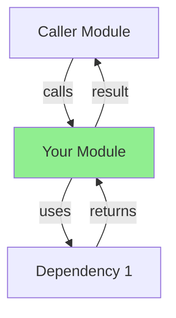
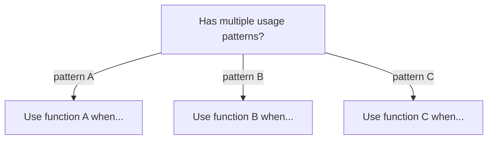
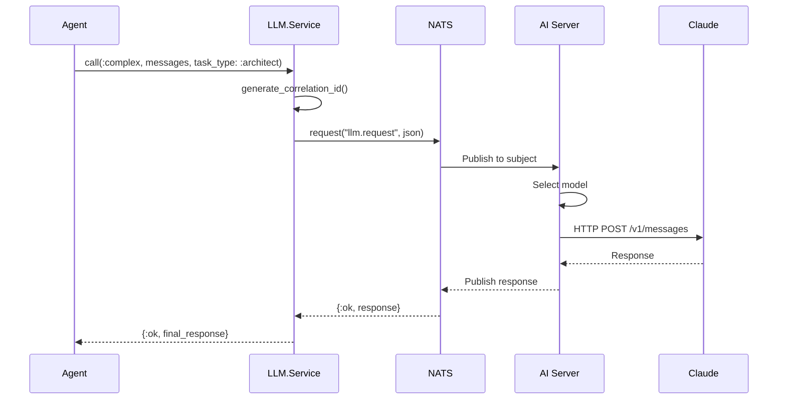

# 📊 Complete AI Metadata v2.3.0+ & Rust Parser Extraction Roadmap

## Overview

Your Singularity codebase contains **7-layer AI navigation metadata** (v2.3.0 - v2.4.0) across **62 production modules**. The tree-sitter Rust parser can extract code structure (AST), and tree-sitter-mermaid can parse Mermaid diagrams. However, **docstring metadata extraction** remains to be implemented.

This document outlines what metadata exists, what can be parsed, and how to bridge the gap.

---

## AI Metadata Structure (v2.3.0 - v2.4.0)

Your modules embed **7 distinct layers** of AI navigation metadata inside `@moduledoc`:

### Layer 1: Module Identity (JSON)
```json
{
  "module": "Singularity.LanguageDetection",
  "purpose": "Unified language detection for files and projects",
  "role": "service",
  "layer": "domain_services",
  "alternatives": {
    "ParserEngine": "Use this module instead for file-level detection"
  },
  "disambiguation": {
    "vs_ParserEngine": "Module-level vs file-level"
  }
}
```
**Purpose:** Vector DB disambiguation, graph DB indexing
**Current Status:** 62 modules documented
**Format:** JSON block inside `@moduledoc`
**Parsing Ready:** ✅ Yes - `serde_json`

---

### Layer 2: Architecture Diagram (Mermaid)

**Purpose:** Visual call flow understanding
**Current Status:** 67 architecture diagrams (47 TD + 20 TB)
**Format:** Mermaid flowchart
**Parsing Ready:** ✅ Yes - `tree-sitter-mermaid` (just integrated!)

---

### Layer 3: Decision Tree (Mermaid - Optional)

**Purpose:** Conditional usage guidance
**Current Status:** ~40 decision trees in multi-pattern modules
**Format:** Mermaid flowchart
**Parsing Ready:** ✅ Yes - `tree-sitter-mermaid`

---

### Layer 4: Call Graph (YAML)
```yaml
calls_out:
  - module: Dependency1
    function: func/2
    purpose: "Validates input data"
    critical: true

  - module: Dependency2
    function: helper/1
    purpose: "Helper function"
    critical: false

called_by:
  - module: ClientModule
    purpose: "Uses for language detection"
    frequency: high

depends_on:
  - Dependency1 (MUST exist)
  - FileSystem (optional)

supervision:
  supervised: false
  reason: "Pure functions, no state"
```
**Purpose:** Graph DB indexing (Neo4j), machine-readable relationships
**Current Status:** 62 modules documented
**Format:** YAML block inside `@moduledoc`
**Parsing Ready:** ✅ Yes - `serde_yaml`

---

### Layer 5: Data Flow Diagram (Mermaid - Sequence)

**Purpose:** Complex orchestration flows, async messaging
**Current Status:** 7 sequence diagrams (LLM.Service, Embedding.Service, etc.)
**Format:** Mermaid sequence diagram
**Parsing Ready:** ✅ Yes - `tree-sitter-mermaid`

---

### Layer 6: Anti-Patterns (Markdown)
```markdown
### Anti-Patterns

#### ❌ DO NOT create "LanguageDetection.Cache"
**Why:** This module already provides caching for detection results!

#### ❌ DO NOT hardcode language matching in Elixir
**Instead:** Call LanguageDetection.detect() which delegates to Rust

#### ❌ DO NOT call internal RCA functions directly
**Why:** Internal Rust analysis changes frequently
**Use:** Public LanguageDetection API only
```
**Purpose:** Prevent AI/developers from creating duplicates
**Current Status:** 62 modules with anti-patterns
**Format:** Markdown sections
**Parsing Ready:** ✅ Yes - regex + markdown parsing

---

### Layer 7: Search Keywords (Text)
```
language-detection, language-registry, file-extension, manifest-detection,
rust-nif, programming-language, tech-stack-detection, project-language,
language-identification, polyglot, multi-language, detection-confidence
```
**Purpose:** Vector DB semantic search optimization
**Current Status:** 10-15 keywords per module (62 modules)
**Format:** Comma-separated text
**Parsing Ready:** ✅ Yes - simple text parsing

---

## What the Rust Parser Can Extract (Currently)

The tree-sitter-based `ElixirParser` can extract:

### ✅ Code Structure (AST Level)

**Functions**
- Function name, arity, line numbers
- Public vs private (`def` vs `defp`)
- Parameters and return types
- Guard clauses

**Imports & Aliases**
```elixir
alias Singularity.LanguageDetection
import Singularity.Helper
require Logger
```
- Import source module
- Alias target
- Import type (alias/import/require)

**Comments**
- Comment text
- Associated line numbers
- Block vs inline

**Complexity Metrics** (RCA - Rust Code Analysis)
- Cyclomatic complexity score
- Lines of actual code (non-blank, non-comment)
- Physical lines (with blanks)
- Logical lines
- Comment coverage

**BEAM-Specific Patterns**
- `GenServer` module patterns
- `Supervisor` configuration (`one_for_one`, `rest_for_one`)
- `@behaviour` declarations (protocol implementations)
- Process spawning (`spawn`, `spawn_link`, `spawn_monitor`)
- Message passing patterns
- Actor patterns
- OTP patterns

**Framework Integration**
- Phoenix patterns (Controllers, Views, LiveView, Plugs)
- Ecto patterns (Schemas, Changesets, Queries)
- Telemetry event declarations (`@telemetry`)

**Modules & Namespaces**
- Module hierarchy (nested modules)
- Module attributes (`@module_attribute`)
- Guard function definitions

**Type Specs** (if parsed separately)
- Function signatures
- Type definitions
- Callback definitions

---

## What the Parser CANNOT Extract (Currently)

### ❌ Module Documentation

The parser sees docstrings as **text blobs**, not structured data:

```rust
// Tree-sitter output:
@moduledoc = """
<LARGE TEXT STRING - NOT PARSED>
"""
```

**Why?** Docstrings are string literals in the source. To extract structure, you need:
1. Extract the string content
2. Regex/parse the content
3. Parse each format (JSON, Mermaid, YAML)

---

## The Gap: Metadata Extraction Pipeline

### Current Situation

**In Source Code (62 modules):**
- 62 Module Identity JSON blocks
- ~100 Architecture Mermaid diagrams (graph TD/TB)
- ~40 Decision Tree Mermaid diagrams
- 7 Data Flow Sequence diagrams
- 62 YAML Call Graphs
- 62 Markdown Anti-Pattern sections
- 62 Search Keyword lists

**Total Metadata Blocks:** 62 × 7 = **434 structured blocks**

**Current Extraction:**
- Tree-sitter extracts AST ✅
- Mermaid parser available ✅
- JSON/YAML parsing libraries available ✅
- **Docstring extraction:** ❌ Not implemented

---

## Solution: Metadata Extraction Pipeline

### Phase 1: Extract Docstring Content (Immediate)

**Step 1:** Use tree-sitter to find `@moduledoc` nodes
```rust
// Tree-sitter query to find module documentation
let query = Query::new(
    &tree_sitter_elixir::LANGUAGE,
    r#"
    (attribute
      name: (identifier) @attr_name (#eq? @attr_name "moduledoc")
      value: (string) @doc_content
    ) @attribute
    "#,
)?;
```

**Step 2:** Extract string literal content
```rust
let doc_content = capture.node.utf8_text(source_bytes);
// Strip opening/closing """
let content = doc_content.trim_start_matches('"').trim_end_matches('"');
```

**Step 3:** Find structured blocks with regex
```rust
// JSON blocks
let json_regex = Regex::new(r"```json\s*(.*?)\s*```")?;
let jsons: Vec<&str> = json_regex.captures_iter(&content)
    .map(|c| c.get(1).unwrap().as_str())
    .collect();

// Mermaid blocks
let mermaid_regex = Regex::new(r"```mermaid\s*(.*?)\s*```")?;
let mermaids: Vec<&str> = mermaid_regex.captures_iter(&content)
    .map(|c| c.get(1).unwrap().as_str())
    .collect();

// YAML blocks
let yaml_regex = Regex::new(r"```yaml\s*(.*?)\s*```")?;
let yamls: Vec<&str> = yaml_regex.captures_iter(&content)
    .map(|c| c.get(1).unwrap().as_str())
    .collect();

// Markdown anti-patterns
let markdown_regex = Regex::new(r"### Anti-Patterns(.*?)(?=###|\Z)")?;
let markdown: Option<&str> = markdown_regex.captures(&content)
    .map(|c| c.get(1).unwrap().as_str());

// Keywords (last line or specific section)
let keywords: Vec<String> = content
    .lines()
    .last()
    .unwrap_or("")
    .split(',')
    .map(|k| k.trim().to_string())
    .collect();
```

---

### Phase 2: Parse Each Format

**JSON Module Identity:**
```rust
#[derive(Deserialize)]
struct ModuleIdentity {
    module: String,
    purpose: String,
    role: String,
    layer: String,
    alternatives: Map<String, String>,
    disambiguation: Map<String, String>,
}

for json_str in jsons {
    let identity: ModuleIdentity = serde_json::from_str(json_str)?;
    // Use for: Vector DB, Neo4j nodes
}
```

**Mermaid Diagrams:**
```rust
use tree_sitter_little_mermaid::language;

for mermaid_str in mermaids {
    let tree = parser.parse(mermaid_str)?;
    let nodes = extract_mermaid_nodes(&tree);
    let edges = extract_mermaid_edges(&tree);
    // Use for: Architecture understanding, relationship extraction
}
```

**YAML Call Graph:**
```rust
#[derive(Deserialize)]
struct CallGraph {
    calls_out: Vec<Call>,
    called_by: Vec<Caller>,
    depends_on: Vec<String>,
    supervision: Supervision,
}

for yaml_str in yamls {
    let graph: CallGraph = serde_yaml::from_str(yaml_str)?;
    // Use for: Neo4j relationship indexing
}
```

**Markdown Anti-Patterns:**
```rust
let patterns: Vec<AntiPattern> = parse_anti_patterns(markdown)?;
// Use for: AI duplicate prevention
```

---

### Phase 3: Aggregate Per Module

```rust
struct ModuleMetadata {
    // Identifiers
    file_path: String,
    module_name: String,

    // From AST
    functions: Vec<FunctionInfo>,
    imports: Vec<Import>,
    complexity: f64,
    beam_patterns: Vec<String>,

    // From Docstring Metadata
    identity: Option<ModuleIdentity>,
    architecture_diagrams: Vec<MermaidAST>,
    decision_trees: Vec<MermaidAST>,
    data_flows: Vec<MermaidAST>,
    call_graph: Option<CallGraph>,
    anti_patterns: Vec<AntiPattern>,
    search_keywords: Vec<String>,
}

fn extract_module_metadata(file_path: &Path) -> Result<ModuleMetadata> {
    let content = std::fs::read_to_string(file_path)?;
    let tree = parser.parse(&content)?;

    // Get AST info
    let functions = extract_functions(&tree)?;
    let imports = extract_imports(&tree)?;
    let complexity = calculate_complexity(&content)?;

    // Get docstring metadata
    let (moduledoc, _) = extract_module_doc(&tree, &content)?;
    let identity = extract_json_block(&moduledoc)?;
    let diagrams = extract_mermaid_blocks(&moduledoc)?;
    let call_graph = extract_yaml_block(&moduledoc)?;
    let anti_patterns = extract_anti_patterns(&moduledoc)?;
    let keywords = extract_keywords(&moduledoc)?;

    Ok(ModuleMetadata {
        file_path: file_path.to_string_lossy().to_string(),
        module_name: extract_module_name(&tree)?,
        functions,
        imports,
        complexity,
        beam_patterns: extract_beam_patterns(&tree)?,
        identity,
        architecture_diagrams: diagrams.architecture,
        decision_trees: diagrams.decision_tree,
        data_flows: diagrams.data_flow,
        call_graph,
        anti_patterns,
        search_keywords: keywords,
    })
}
```

---

### Phase 4: Database Integration

**PostgreSQL (pgvector) - Semantic Search:**
```rust
async fn index_to_vector_db(metadata: &ModuleMetadata, client: &sqlx::PgPool) {
    // Generate embedding for semantic search
    let search_text = format!(
        "{} {} {}",
        metadata.module_name,
        metadata.identity.purpose,
        metadata.search_keywords.join(" ")
    );
    let embedding = generate_embedding(&search_text).await?;

    // Insert to pgvector
    sqlx::query!(
        "INSERT INTO module_embeddings (module_name, purpose, embedding)
         VALUES ($1, $2, $3)",
        metadata.module_name,
        metadata.identity.as_ref().map(|i| i.purpose.clone()),
        embedding
    )
    .execute(client)
    .await?;
}
```

**Neo4j - Relationship Indexing:**
```rust
async fn index_to_neo4j(metadata: &ModuleMetadata, neo4j: &Neo4jClient) {
    // Create module node
    neo4j.run(
        cypher!(
            "CREATE (m:Module { name: $name, role: $role, layer: $layer })",
            name: &metadata.module_name,
            role: metadata.identity.role.clone(),
            layer: metadata.identity.layer.clone(),
        )
    ).await?;

    // Create function nodes
    for func in &metadata.functions {
        neo4j.run(
            cypher!(
                "MATCH (m:Module { name: $module })
                 CREATE (f:Function { name: $func, arity: $arity })-[:IN_MODULE]->(m)",
                module: &metadata.module_name,
                func: &func.name,
                arity: func.arity,
            )
        ).await?;
    }

    // Create call relationships from YAML
    if let Some(graph) = &metadata.call_graph {
        for call in &graph.calls_out {
            neo4j.run(
                cypher!(
                    "MATCH (m1:Module { name: $from })
                     MATCH (m2:Module { name: $to })
                     CREATE (m1)-[r:CALLS { function: $func, critical: $critical }]->(m2)",
                    from: &metadata.module_name,
                    to: &call.module,
                    func: &call.function,
                    critical: call.critical,
                )
            ).await?;
        }
    }
}
```

---

## Implementation Roadmap

### Phase 1: Docstring Extraction (1-2 days)
- [ ] Query tree-sitter for `@moduledoc` nodes
- [ ] Extract string content
- [ ] Regex-match JSON, Mermaid, YAML blocks
- [ ] Return raw blocks

**Deliverable:** Rust module that extracts metadata from Elixir files

```rust
pub struct MetadataExtractor {
    parser: Parser,
}

pub struct ExtractedMetadata {
    json_blocks: Vec<String>,
    mermaid_blocks: Vec<String>,
    yaml_blocks: Vec<String>,
    markdown_blocks: Vec<String>,
    keywords: Vec<String>,
}

impl MetadataExtractor {
    pub fn extract(&self, file_path: &Path) -> Result<ExtractedMetadata> {
        // Implementation
    }
}
```

---

### Phase 2: Format-Specific Parsing (2-3 days)
- [ ] Parse JSON → `ModuleIdentity` struct
- [ ] Parse Mermaid → AST (using tree-sitter-mermaid)
- [ ] Parse YAML → `CallGraph` struct
- [ ] Parse Markdown → `AntiPattern` struct

**Deliverable:** Complete `ModuleMetadata` struct per module

---

### Phase 3: Aggregation (1 day)
- [ ] Combine AST + extracted metadata
- [ ] Build 62 complete module profiles
- [ ] Validate completeness

**Deliverable:** 62 modules with unified metadata

---

### Phase 4: Database Integration (3-5 days)
- [ ] Vector DB insertion (pgvector)
- [ ] Graph DB indexing (Neo4j)
- [ ] Search interface

**Deliverable:** Queryable architecture knowledge base

---

### Phase 5: AI Navigation (Ongoing)
- [ ] Use for module disambiguation
- [ ] Train AI on patterns
- [ ] Auto-generate metadata for new modules

---

## Data Structures

```rust
// Module Identity (from JSON)
#[derive(Deserialize)]
struct ModuleIdentity {
    module: String,
    purpose: String,
    role: String,
    layer: String,
    alternatives: HashMap<String, String>,
    disambiguation: HashMap<String, String>,
}

// Call Graph (from YAML)
#[derive(Deserialize)]
struct CallGraph {
    calls_out: Vec<Call>,
    called_by: Vec<Caller>,
    depends_on: Vec<String>,
    supervision: Supervision,
}

#[derive(Deserialize)]
struct Call {
    module: String,
    function: String,
    purpose: String,
    critical: bool,
}

#[derive(Deserialize)]
struct Supervision {
    supervised: bool,
    reason: String,
}

// Anti-Pattern
struct AntiPattern {
    pattern: String,
    why: String,
    use_instead: String,
    examples: Vec<(String, String)>, // (wrong, right)
}

// Complete Module Metadata
struct ModuleMetadata {
    // Identifiers
    file_path: String,
    module_name: String,

    // From AST
    functions: Vec<FunctionInfo>,
    imports: Vec<Import>,
    complexity: f64,

    // From Metadata
    identity: Option<ModuleIdentity>,
    architecture_diagrams: Vec<MermaidAST>,
    decision_trees: Vec<MermaidAST>,
    data_flows: Vec<MermaidAST>,
    call_graph: Option<CallGraph>,
    anti_patterns: Vec<AntiPattern>,
    search_keywords: Vec<String>,
}
```

---

## Expected Outcome

### Before
- 62 modules with metadata embedded in docstrings
- Metadata not accessible to code analysis
- No automated dependency graph

### After
- 62 modules fully indexed
- Metadata in pgvector (semantic search)
- Relationships in Neo4j (graph queries)
- Complete architecture knowledge base
- AI can understand module relationships
- Automated documentation validation

---

## Dependencies Needed

```toml
[dependencies]
serde_json = "1.0"      # JSON parsing
serde_yaml = "0.9"      # YAML parsing
regex = "1.10"          # Block extraction
tree-sitter = "0.25"    # Already have
tree-sitter-elixir = "0.25" # Already have
tree-sitter-little-mermaid = "0.9" # Just added!
sqlx = { version = "0.7", features = ["postgres"] } # Vector DB
neo4rs = "0.6"          # Neo4j client
tokio = "1.0"           # Async runtime
```

---

## Summary

| Component | Status | What | Count |
|---|---|---|---|
| **Docstring Content** | 🔄 Ready | Extract from AST | 62 |
| **JSON Module Identity** | ✅ Ready | Parse with serde_json | 62 |
| **Mermaid Diagrams** | ✅ Ready | Parse with tree-sitter-mermaid | ~150 |
| **YAML Call Graphs** | ✅ Ready | Parse with serde_yaml | 62 |
| **Markdown Anti-Patterns** | ✅ Ready | Regex + markdown parsing | 62 |
| **Keywords** | ✅ Ready | Simple text parsing | 62 |
| **AST Extraction** | ✅ Done | Tree-sitter | 62 |
| **Aggregation** | 🔄 Ready | Combine all sources | 62 |
| **Vector DB Index** | 🔄 Ready | pgvector insertion | 62 |
| **Graph DB Index** | 🔄 Ready | Neo4j relationships | ~500+ |

**All pieces exist. Implementation is straightforward.**
