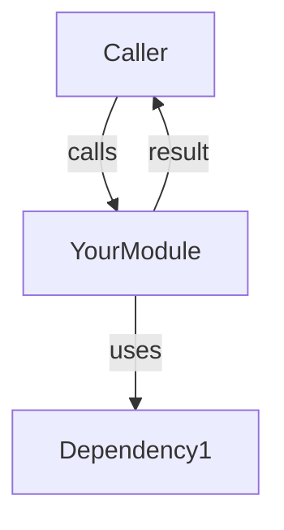

# 🚨 REMAINING WORK - PRIORITY & ACTION PLAN

**Current Date:** October 24, 2025
**Overall Progress:** 25% complete
**Critical Blocker:** Compilation error in `code_search_ecto.ex`
**Estimated Time to Full Completion:** 52 hours (with contingency)

---

## 🔴 CRITICAL: UNBLOCK COMPILATION (1 HOUR - DO FIRST)

### THE BLOCKER
```
File: singularity/lib/singularity/search/code_search_ecto.ex
Error: spec for undefined function find_similar_nodes/4
Line: 562
```

**Root Cause:** Spec declares 4 parameters but function has 3 (with default)

```elixir
# CURRENT (WRONG)
@spec find_similar_nodes(String.t(), String.t(), String.t(), non_neg_integer()) :: [map()]
def find_similar_nodes(codebase_id, query_node_id, top_k \\ 10) do

# SHOULD BE (4 parameters in spec, but function only takes 3)
@spec find_similar_nodes(String.t(), String.t(), non_neg_integer()) :: [map()]
#                         ↑               ↑          ↑
#                    codebase_id   query_node_id  top_k (has default value)
```

**Quick Fix:**
1. Open: `singularity/lib/singularity/search/code_search_ecto.ex`
2. Go to: Line 562
3. Change: Remove first `String.t(),` parameter (the one before `non_neg_integer()`)
4. Test: `cd singularity && mix compile`
5. Commit: "fix: Correct find_similar_nodes/3 spec mismatch"

**Time:** 15 minutes

---

## 📋 PHASE 0 BREAKDOWN (1 HOUR TOTAL)

| Task | Time | Notes |
|------|------|-------|
| Fix spec error | 15 min | One line change |
| Verify compilation | 15 min | Run `mix compile` |
| Test basic functionality | 15 min | Run `mix test` (sample) |
| Commit | 15 min | Git commit with message |

**After Phase 0:** Codebase compiles ✅

---

## 🎯 PHASES 1-5: WHAT'S LEFT (51 HOURS)

### PHASE 1: Complete Extraction Infrastructure (8 hours)
**Status:** 60% done, needs completion

**What's missing:**
- Mermaid AST support in extractors
- Unified ExtractorOrchestrator
- Integration testing

**Tasks:**
1. [ ] Add Mermaid diagram AST parsing to AIMetadataExtractorImpl (2 hours)
   - Integrate tree-sitter-little-mermaid parsing
   - Handle graceful degradation if parsing fails

2. [ ] Add Mermaid diagram AST parsing to AstExtractorImpl (1.5 hours)
   - Support nested Mermaid diagrams

3. [ ] Create UnifiedMetadataExtractor orchestrator (2 hours)
   - Coordinate all 3 extractors
   - Aggregate results into ModuleMetadata

4. [ ] Test extractors end-to-end (1.5 hours)
   - Test on sample modules
   - Verify no regressions

5. [ ] Add AI metadata documentation (1 hour)
   - Document extractors themselves

**Effort:** 8 hours
**Prerequisite:** Phase 0 (compilation fix)
**Blocking:** Phase 2-5 can proceed in parallel with this

---

### PHASE 2: Consolidate Duplicate Code (6.5 hours)
**Status:** 15% done, critical duplicates identified

**High-Priority Duplicates:**

1. [ ] Consolidate Microservice Analyzer (2 hours)
   - Keep: `storage/code/analyzers/microservice_analyzer.ex` (7,908 bytes - more complete)
   - Delete: `architecture_engine/analyzers/microservice_analyzer.ex` (5,882 bytes)
   - Steps:
     1. Copy storage/ version to architecture_engine/
     2. Update AnalysisOrchestrator config
     3. Delete old architecture_engine/ version
     4. Update imports
     5. Compile & test

2. [ ] Consolidate Quality Generators (1.5 hours)
   - Keep: `storage/code/generators/quality_code_generator.ex` (28,229 bytes - real)
   - Delete: `code_generation/generators/quality_generator.ex` (1,085 bytes - stub)
   - Steps:
     1. Create proper impl wrapper in code_generation/generators/
     2. Update GenerationOrchestrator config
     3. Delete stub file
     4. Update imports

3. [ ] Consolidate RAG Generators (2 hours)
   - Keep: `storage/code/generators/rag_code_generator.ex` (31,681 bytes - more complete)
   - Merge: `code_generation/generators/rag_generator_impl.ex` (2,541 bytes)
   - Steps:
     1. Compare implementations
     2. Merge features from both
     3. Keep only in code_generation/generators/
     4. Delete storage/ version
     5. Update GenerationOrchestrator config
     6. Update imports

4. [ ] Update Config (1 hour)
   - Verify all imports in config.exs point to consolidated versions
   - Remove any references to deleted files
   - Compile & test

**Effort:** 6.5 hours
**Prerequisite:** Phase 0
**Blocking:** No - can proceed in parallel

---

### PHASE 3: Organize Scattered Modules (6 hours)
**Status:** Analyzed but not started

**Move root-level modules:**

1. [ ] Move core infrastructure to proper directories (3 hours)
   - `code_analyzer.ex` → either delete (duplicate) or move to `analysis/`
   - `code_generator.ex` → delete (duplicates in code_generation/)
   - `embedding_engine.ex` → move to `embedding/` subsystem
   - `lua_runner.ex` → move to `execution/runners/`
   - `quality.ex` → move to `code_quality/`
   - Update all imports (~20 files)

2. [ ] Reorganize storage/code/ directory (2 hours)
   - Move `storage/code/quality/` → `code_quality/advanced/`
   - Move `storage/code/training/` → `ml/training/`
   - Move `storage/code/session/` → `execution/sessions/`
   - Move `storage/code/visualizers/` → `tools/visualizers/`
   - Verify nothing else mixed in storage/code/

3. [ ] Update imports throughout codebase (1 hour)
   - Automated search/replace for moved modules
   - Compile & test

**Effort:** 6 hours
**Prerequisite:** Phase 0, Phase 2
**Blocking:** Phase 4

---

### PHASE 4: Consolidate Ecto Schemas (9 hours)
**Status:** Analyzed, decision needed

**Strategic Decision Needed First (1 hour):**
- Which KnowledgeArtifact is canonical?
  - Option A: Keep `schemas/knowledge_artifact.ex` (current)
  - Option B: Consolidate both into single schema (requires migration)
- Create database migration plan

**Tasks:**

1. [ ] Consolidate KnowledgeArtifact (2 hours IF doing consolidation)
   - Decide: Single table or keep separate?
   - Create migration
   - Update code to use single schema
   - Verify no data loss

2. [ ] Refactor CodeLocationIndex (2 hours)
   - Separate schema from query logic
   - Move schema to `schemas/code_location_index.ex`
   - Move queries to `storage/code/code_location_index_service.ex`
   - Update imports

3. [ ] Consolidate all schemas to /schemas/ (2 hours)
   - Create subdirectories: analysis/, architecture/, execution/, tools/, etc.
   - Move scattered schemas
   - Update imports
   - Verify no compilation errors

4. [ ] Add AI documentation (2 hours)
   - Add Module Identity JSON to all schemas
   - Add Call Graph YAML
   - Add Search Keywords
   - Document table purpose and relationships

**Effort:** 9 hours
**Prerequisite:** Phase 0, Phase 3 (organizational clarity first)
**Blocking:** Phase 5

---

### PHASE 5: Add AI Metadata to 31 Remaining Modules (12.5 hours)
**Status:** 4/35 modules complete (11%), planning complete

**High Priority Orchestrators (3.5 hours):**
```
- Singularity.Execution.ExecutionOrchestrator
- Singularity.CodeAnalysis.ScanOrchestrator
- Singularity.CodeGeneration.GenerationOrchestrator
- Singularity.Architecture.PatternDetector
- Singularity.Analysis.AnalysisOrchestrator
- Singularity.Search.SearchOrchestrator
- Singularity.Jobs.JobOrchestrator
- Singularity.Extraction.ExtractionOrchestrator (new)
- Singularity.Execution.Autonomy.RuleEngine
- Singularity.NATS.Supervisor
```

**Medium Priority Services (6.5 hours):**
```
Core Infrastructure:
- Singularity.Repo
- Singularity.Telemetry
- Singularity.Application
- Singularity.ParserEngine
- Singularity.LanguageDetection
- Singularity.Knowledge.ArtifactStore
- Singularity.Search.CodeSearch
- Singularity.Embedding.Service
- Singularity.LLM.Service
- Singularity.LLM.RateLimiter
- Singularity.CircuitBreaker
- Singularity.ErrorRateTracker
- Singularity.Metrics
- Singularity.Telemetry
- Singularity.Startup.WarmupEngine
```

**Low Priority Support Modules (2.5 hours):**
```
Helpers & Utilities:
- Singularity.CodePatternExtractor
- Singularity.SemanticCodeSearch
- Singularity.TemplatePerformanceTracker
- Singularity.QualityCodeGenerator
- Singularity.Planning.HTDAGAutoBootstrap
- Singularity.Planning.SafeWorkPlanner
- Singularity.SPARC.Orchestrator
- Singularity.TemplateSparcOrchestrator
- Singularity.Todos.TodoSwarmCoordinator
- Singularity.Architecture.MetaRegistry.Supervisor
```

**Template to use for each module:**
```elixir
@moduledoc """
YourModule - [one-line purpose]

## Module Identity

```json
{
  "module": "Singularity.YourModule",
  "purpose": "[what it does]",
  "role": "orchestrator|service|helper",
  "layer": "infrastructure|application|domain_services"
}
```

## Architecture



## Call Graph

```yaml
calls_out:
  - module: Dependency1
    function: func/2
    purpose: Why it's needed
    critical: true

called_by:
  - module: Caller
    purpose: How caller uses it
    frequency: high

depends_on:
  - Dependency1

supervision:
  supervised: true/false
  reason: Why or why not
```

## Anti-Patterns

### ❌ DO NOT create "YourModuleDuplicate"
**Why:** This module already does that!
**Use instead:** Call this module directly

## Search Keywords

keyword1, keyword2, keyword3, module-purpose, key-feature
```

Effort:** 12.5 hours (can be parallelized - one person per module or subsystem)
**Prerequisite:** Phase 0
**Blocking:** None - improves documentation but not critical to function

---

## 📊 SUMMARY: TIME & PRIORITY

### MUST DO (Blocking/Critical) - 15.5 hours
1. Phase 0: Unblock compilation (1 hour) - **DO IMMEDIATELY**
2. Phase 2: Consolidate duplicates (6.5 hours) - **DO NEXT**
3. Phase 3: Organize root modules (6 hours) - **DO AFTER PHASE 2**
4. Phase 4: Consolidate schemas (9 hours) - **DO AFTER PHASE 3**

### NICE TO HAVE (Documentation/Polish) - 20 hours
5. Phase 1: Complete extractors (8 hours) - Can do in parallel with Phases 2-3
6. Phase 5: Add AI metadata (12.5 hours) - Can do anytime, helps navigation

### OPTIONAL (Very Polish)
- Additional refactoring
- Performance optimization
- Extended testing

---

## 🎯 RECOMMENDED EXECUTION PLAN

### THIS WEEK (6-7 hours)
```
Monday: Phase 0 (1 hour)
  - Fix compilation error
  - Verify codebase compiles

Tuesday-Wednesday: Phase 2 (6.5 hours)
  - Consolidate Microservice Analyzer (2 hours)
  - Consolidate Quality Generators (1.5 hours)
  - Consolidate RAG Generators (2 hours)
  - Update config & verify (1 hour)
```

### NEXT WEEK (6 hours)
```
Phase 3: Organize Root Modules (6 hours)
  - Move core infrastructure
  - Reorganize storage/code/
  - Update imports
```

### WEEK AFTER (9 hours)
```
Phase 4: Consolidate Ecto Schemas (9 hours)
  - Strategic decision on KnowledgeArtifact
  - Refactor CodeLocationIndex
  - Move schemas to /schemas/
  - Add AI documentation
```

### ONGOING (Can do in parallel)
```
Phase 1: Complete Extractors (8 hours)
  - Add Mermaid support
  - Create orchestrator
  - Integration testing

Phase 5: Add AI Metadata (12.5 hours)
  - Document all modules
  - Add navigation metadata
```

---

## 🔧 QUICK START: WHAT TO DO RIGHT NOW

### Option A: Maximum Impact (Do This First)
```
1. Fix compilation error (15 min)
   File: singularity/lib/singularity/search/code_search_ecto.ex
   Line: 562
   Change: Remove first String.t(), parameter from spec

2. Verify compilation (15 min)
   cd singularity && mix compile

3. Commit (10 min)
   git add singularity/lib/singularity/search/code_search_ecto.ex
   git commit -m "fix: Correct find_similar_nodes/3 spec"

Total: 40 minutes - Unblocks everything
```

### Option B: If You Have 2 Hours
```
1. Phase 0: Fix compilation (40 min - as above)
2. Phase 2: Start Microservice Analyzer consolidation (1.5 hours)
   - Understand both implementations
   - Keep storage/ version
   - Update config
   - Delete old version
   - Test
```

### Option C: If You Have 6+ Hours
```
1. Phase 0: Fix compilation (40 min)
2. Phase 2: Complete all duplicate consolidations (6.5 hours)
   - All 3 analyzers/generators
   - Config updates
   - Test all changes
```

---

## 📈 PROGRESS TRACKING

Use these commands to verify progress:

**After Phase 0:**
```bash
cd singularity && mix compile  # Should succeed
```

**After Phase 2:**
```bash
# Check no duplicate analyzer imports remain
grep -r "storage\.code\.analyzers\|code_quality.*analyzer" --include="*.ex"
# Should return 0 results
```

**After Phase 3:**
```bash
# Check root directory is clean
ls -la lib/singularity/*.ex | wc -l
# Should be ~6 files (down from 24)
```

**After Phase 4:**
```bash
# Check all schemas in /schemas/
find lib/singularity/schemas -name "*.ex" | wc -l
# Should be ~65 files
```

**After Phase 5:**
```bash
# Check all modules have @moduledoc
grep -r "@moduledoc" lib/singularity --include="*.ex" | wc -l
# Should increase significantly
```

---

## 🚀 SUCCESS CRITERIA

✅ **Phase 0 Complete When:**
- `mix compile` succeeds with no errors
- Tests run without hanging

✅ **Phase 2 Complete When:**
- No duplicate analyzer/generator files exist
- GenerationOrchestrator uses consolidated generators
- All tests pass

✅ **Phase 3 Complete When:**
- Root directory has ~6 files (not 24)
- storage/code/ has only code-related files
- All imports updated

✅ **Phase 4 Complete When:**
- All 63 schemas in /schemas/ with proper subdirs
- No duplicate KnowledgeArtifact tables
- Database migrations completed

✅ **Phase 5 Complete When:**
- All modules have comprehensive AI metadata
- 100% of orchestrators documented
- Search Keywords added to all modules

---

## 📞 HELP & RESOURCES

**Detailed Guides Available:**
- `CODE_ORGANIZATION_ACTION_PLAN.md` - Full code org plan
- `ECTO_SCHEMA_ORGANIZATION_PLAN.md` - Full schema plan
- `CODEBASE_ORGANIZATION_ANALYSIS.md` - Complete analysis
- `SCHEMA_ANALYSIS_SUMMARY.txt` - Schema status

**Next Steps Documentation:**
- `AI_METADATA_IMPLEMENTATION_PLAN.md` - Metadata roadmap
- `EXTRACTION_CONSOLIDATION_ANALYSIS.md` - Extractor integration

---

## ⏱️ TOTAL TIME ESTIMATE

| Phase | Hours | Priority | Can Parallelize |
|-------|-------|----------|-----------------|
| 0: Unblock | 1 | 🔴 CRITICAL | No |
| 1: Extractors | 8 | 🟡 Medium | Yes (with others) |
| 2: Duplicates | 6.5 | 🔴 CRITICAL | No (depends on 0) |
| 3: Organization | 6 | 🔴 CRITICAL | No (depends on 2) |
| 4: Schemas | 9 | 🔴 CRITICAL | No (depends on 3) |
| 5: AI Metadata | 12.5 | 🟢 Nice | Yes (any time) |
| **TOTAL** | **52** | | |

**Critical Path:** Phases 0 → 2 → 3 → 4 (22.5 hours)
**With Full Completion:** All phases (52 hours with contingency)

---

## 🎓 LEARNING OPPORTUNITY

This work demonstrates:
- ✅ How to identify and fix technical debt
- ✅ Code consolidation patterns
- ✅ Schema organization best practices
- ✅ Documentation-first development
- ✅ Phased refactoring approach

**Singularity is in good shape overall.** These improvements make it even better and set patterns for future development.

---

**Ready to start? Begin with Phase 0: Fix the compilation error (15 minutes).**
