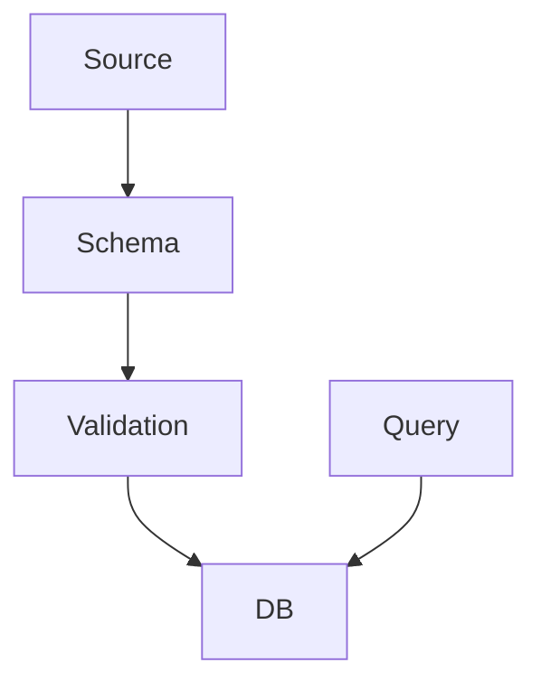

# Schema AI Metadata Checklist

**Quick reference for adding AI metadata to Ecto schemas - Print this and check boxes as you go!**

---

## Per-Schema Checklist (15-65 min)

### ☐ Step 1: Identify Schema Type (5 min)

- [ ] Core Domain (Rule, Task, Todo)
- [ ] Storage (CodeChunk, KnowledgeArtifact)
- [ ] Monitoring (Event, AggregatedData)
- [ ] Infrastructure (GitStateStore, Metadata)
- [ ] Tools (Tool, ToolParam, ToolCall)

### ☐ Step 2: Module Identity JSON (10 min)

```json
{
  "module": "Singularity.Schemas.___________",
  "purpose": "_________________________",
  "role": "schema",
  "layer": "___________",
  "table": "___________",
  "relationships": {},
  "alternatives": {},
  "disambiguation": {}
}
```

- [ ] `module` - Full module path
- [ ] `purpose` - One clear sentence
- [ ] `role` - Always "schema"
- [ ] `layer` - domain_services/infrastructure/tools/monitoring
- [ ] `table` - Database table name
- [ ] `relationships` - Parent/child schemas
- [ ] `alternatives` - Similar schemas
- [ ] `disambiguation` - How this differs

### ☐ Step 3: Schema Structure YAML (15 min)

```yaml
table: ___________
primary_key: :id (binary_id)

fields:
  - name: ___________
    type: ___________
    required: true/false
    purpose: ___________

relationships:
  belongs_to:
    - schema: ___________
  has_many:
    - schema: ___________

indexes:
  - type: btree/hnsw/gin
    fields: [___________]

constraints:
  - type: unique_constraint
    fields: [___________]
```

- [ ] All fields listed with types
- [ ] Required fields marked
- [ ] Field purposes documented
- [ ] Special types noted (Pgvector, JSONB, Enum)
- [ ] belongs_to relationships
- [ ] has_many relationships
- [ ] Indexes documented
- [ ] Constraints documented

### ☐ Step 4: Data Flow Mermaid (10 min)



- [ ] Shows data input
- [ ] Shows validation
- [ ] Shows storage
- [ ] Shows queries
- [ ] Highlights this schema (fill:#90EE90)

### ☐ Step 5: Call Graph YAML (10 min)

```yaml
calls_out:
  - module: Ecto.Schema
  - module: Ecto.Changeset

called_by:
  - module: ServiceName

depends_on:
  - PostgreSQL table
  - Ecto.Repo

supervision:
  supervised: false
  reason: "Pure Ecto schema"
```

- [ ] Includes Ecto.Schema, Ecto.Changeset
- [ ] Lists services that use schema
- [ ] Lists table/extensions
- [ ] Supervision = false with reason

### ☐ Step 6: Anti-Patterns (10 min)

- [ ] ❌ Don't create duplicate schemas
- [ ] ❌ Don't bypass changesets
- [ ] ❌ Don't use raw SQL
- [ ] ❌ Schema-specific (2+ patterns)
- [ ] All have code examples

### ☐ Step 7: Search Keywords (5 min)

```
schema name, table name, purpose, technology, use case,
domain, feature, pattern, concept, search term
```

- [ ] 10-15 keywords
- [ ] Schema name (lowercase)
- [ ] Table name
- [ ] Key technologies
- [ ] Use cases
- [ ] Domain terms

---

## Validation Before Commit

### JSON Validation
- [ ] All JSON blocks properly closed (```)
- [ ] Valid JSON syntax
- [ ] All required fields present

```bash
# Test: Extract and validate JSON
rg -U '@moduledoc.*```json.*?```' --multiline YOUR_FILE.ex | python3 -m json.tool
```

### YAML Validation
- [ ] All YAML blocks properly closed (```)
- [ ] Valid YAML syntax
- [ ] Proper indentation

```bash
# Test: Extract and validate YAML
rg -U '```yaml.*?```' --multiline YOUR_FILE.ex | yq
```

### Mermaid Validation
- [ ] All Mermaid blocks properly closed (```)
- [ ] Valid Mermaid syntax
- [ ] Renders in GitHub preview

```bash
# Test: View in GitHub markdown preview or:
mmdc -i diagram.mmd -o diagram.png
```

### Content Validation
- [ ] Module name matches file
- [ ] Table name matches schema
- [ ] All relationships exist
- [ ] No dead links to modules
- [ ] Anti-patterns are accurate

---

## Batch Progress Tracker

### Phase 1: Core Domain (10 schemas)

- [ ] 1. Rule
- [ ] 2. RuleExecution
- [ ] 3. RuleEvolutionProposal
- [ ] 4. Task
- [ ] 5. TaskExecutionStrategy
- [ ] 6. Todo
- [ ] 7. ExecutionRecord
- [ ] 8. Tool
- [ ] 9. ToolParam
- [ ] 10. ToolCall

**Estimated**: 7 hours

### Phase 2: Storage (15 schemas)

- [ ] 11. ToolResult
- [ ] 12. KnowledgeArtifact
- [ ] 13. CodeChunk
- [ ] 14. Template
- [ ] 15. TemplateCache
- [ ] 16. TechnologyTemplate
- [ ] 17. TechnologyPattern
- [ ] 18. TechnologyDetection
- [ ] 19. PackageCodeExample
- [ ] 20. PackageUsagePattern
- [ ] 21. PackageDependency
- [ ] 22. DependencyCatalog
- [ ] 23. CodeFile
- [ ] 24. CodeLocationIndex
- [ ] 25. CodeEmbeddingCache

**Estimated**: 10 hours

### Phase 3: Monitoring & Analysis (15 schemas)

- [ ] 26. Event
- [ ] 27. AggregatedData
- [ ] 28. SearchMetric
- [ ] 29. UsageEvent
- [ ] 30. AgentMetric
- [ ] 31. CodebaseSnapshot
- [ ] 32. Finding
- [ ] 33. Run
- [ ] 34. CodeAnalysisResult
- [ ] 35. FileArchitecturePattern
- [ ] 36. FileNamingViolation
- [ ] 37. DeadCodeHistory
- [ ] 38. ExperimentResult
- [ ] 39. T5EvaluationResult
- [ ] 40. T5TrainingSession

**Estimated**: 10 hours

### Phase 4: Infrastructure & Misc (27 schemas)

- [ ] 41. T5TrainingExample
- [ ] 42. T5ModelVersion
- [ ] 43. GitStateStore
- [ ] 44. CodebaseMetadata
- [ ] 45. CodebaseRegistry
- [ ] 46. UserPreferences
- [ ] 47. UserCodebasePermission
- [ ] 48. ApprovalQueue
- [ ] 49. VectorSimilarityCache
- [ ] 50. VectorSearch
- [ ] 51. TemplateGeneration
- [ ] 52. LLMCall
- [ ] 53. LocalLearning
- [ ] 54. GraphNode
- [ ] 55. GraphEdge
- [ ] 56. GraphType
- [ ] 57. PackagePromptUsage
- [ ] 58. InstructorSchemas
- [ ] 59. StrategicTheme
- [ ] 60. Epic
- [ ] 61. Feature
- [ ] 62. Capability
- [ ] 63. CapabilityDependency
- [ ] 64-67. (Any remaining schemas)

**Estimated**: 18 hours

---

## Time Tracking

| Date | Schemas Completed | Hours | Notes |
|------|-------------------|-------|-------|
|      |                   |       |       |
|      |                   |       |       |
|      |                   |       |       |

**Target**: 67 schemas in ~45 hours

---

## Common Issues & Solutions

### Issue: JSON syntax error
**Solution**: Test with `python3 -m json.tool`
- Missing comma
- Trailing comma
- Unescaped quotes

### Issue: YAML indentation error
**Solution**: Test with `yq`
- Use 2 spaces (not tabs)
- Align list items
- Proper nesting

### Issue: Mermaid doesn't render
**Solution**: Check syntax
- `graph TB` (top-bottom) or `graph LR` (left-right)
- Valid node names (no special chars)
- Proper arrow syntax (`-->` or `-.->`)

### Issue: Can't find similar schemas
**Solution**: Search codebase
```bash
# Find schemas with similar purpose
rg "purpose.*search" lib/singularity/schemas/

# Find schemas with similar fields
rg "field :embedding" lib/singularity/schemas/
```

### Issue: Unknown relationships
**Solution**: Check schema file
```bash
# Find belongs_to
rg "belongs_to" lib/singularity/schemas/your_schema.ex

# Find has_many
rg "has_many" lib/singularity/schemas/your_schema.ex
```

### Issue: Not sure about table name
**Solution**: Check schema definition or migration
```bash
# In schema file
rg 'schema "' lib/singularity/schemas/your_schema.ex

# In migrations
fd create_your_table priv/repo/migrations/
```

---

## Quick Reference: Schema-Specific Anti-Patterns

### Schemas with pgvector
- [ ] ❌ Wrong embedding dimensions
- [ ] ❌ Null embeddings
- [ ] ❌ Missing HNSW index

### Schemas with JSONB
- [ ] ❌ Missing GIN index
- [ ] ❌ No validation
- [ ] ❌ Storing arrays instead of JSONB

### Schemas with TimescaleDB
- [ ] ❌ Querying without time filter
- [ ] ❌ Missing hypertable setup
- [ ] ❌ Not using time partitioning

### Schemas with enums
- [ ] ❌ Using strings instead of Ecto.Enum
- [ ] ❌ Not validating enum values
- [ ] ❌ Changing enum order (breaks DB)

### Schemas with relationships
- [ ] ❌ Missing foreign key
- [ ] ❌ No preload in queries
- [ ] ❌ Circular dependencies

---

## Commit Template

```bash
git add lib/singularity/schemas/[domain]/*.ex
git commit -m "docs: Add AI metadata to [N] [domain] schemas

Schemas documented:
- SchemaName1 - Brief description
- SchemaName2 - Brief description
- ...

Added for each schema:
✅ Module Identity (JSON) - Purpose, role, relationships
✅ Schema Structure (YAML) - Fields, indexes, constraints
✅ Data Flow (Mermaid) - Visual data flow
✅ Call Graph (YAML) - Dependencies and usage
✅ Anti-Patterns - Duplicate prevention
✅ Search Keywords - Vector DB optimization

Enables AI assistants and graph/vector DBs to navigate
schemas and prevent duplicates at billion-line scale.

Ref: ECTO_SCHEMA_AI_DOCUMENTATION_GUIDE.md"
```

---

## Daily Goals

**Day 1** (6 hours): Phase 1 schemas 1-8
**Day 2** (6 hours): Phase 1 schemas 9-10 + Phase 2 schemas 11-16
**Day 3** (6 hours): Phase 2 schemas 17-25
**Day 4** (6 hours): Phase 3 schemas 26-33
**Day 5** (6 hours): Phase 3 schemas 34-40
**Day 6** (6 hours): Phase 4 schemas 41-50
**Day 7** (6 hours): Phase 4 schemas 51-60
**Day 8** (3 hours): Phase 4 schemas 61-67 + final validation

---

## Celebration Milestones

- [ ] ✨ First 10 schemas complete (Phase 1)
- [ ] ✨ 25 schemas complete (Phases 1-2)
- [ ] ✨ 40 schemas complete (Phases 1-3)
- [ ] ✨ ALL 67 SCHEMAS COMPLETE! 🎉

---

**Print this checklist and track your progress!**

For detailed examples and templates, see: `ECTO_SCHEMA_AI_DOCUMENTATION_GUIDE.md`
