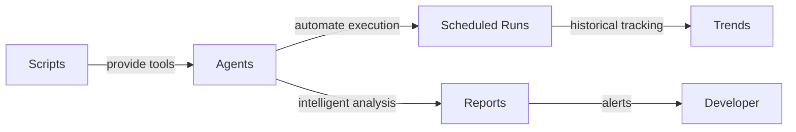

# Scripts vs Agents - Dead Code Monitoring

## TL;DR

**Scripts:** Manual tools you run yourself
**Agents:** Automated intelligence that runs on schedule

**Both are needed!** Scripts provide baseline functionality, agents add automation and intelligence.

---

## The Problem You Identified

> "why scripts and not agents so it's automated and used?"

**You're absolutely right!** Scripts alone won't be used consistently. They require:
- Manual execution
- Remembering to run them
- Discipline to check regularly

**Solution:** Combine scripts (tools) + agents (automation) = Automated monitoring system

---

## Architecture: Scripts + Agents



---

## Comparison

| Feature | Scripts Only | Agents Only | Scripts + Agents |
|---------|-------------|-------------|------------------|
| **Automation** | ❌ Manual | ✅ Automatic | ✅ Automatic |
| **Flexibility** | ✅ Ad-hoc runs | ❌ Scheduled only | ✅ Both |
| **Intelligence** | ❌ No analysis | ✅ Categorization | ✅ Categorization |
| **Alerting** | ❌ None | ✅ Threshold-based | ✅ Threshold-based |
| **Historical** | ❌ No tracking | ✅ Trend analysis | ✅ Trend analysis |
| **NATS Integration** | ❌ No | ✅ Yes | ✅ Yes |
| **CI/CD** | ⚠️ Manual setup | ✅ Built-in | ✅ Built-in |

---

## What We Built

### Layer 1: Scripts (Foundation)
**Purpose:** Provide baseline functionality

```bash
# rust/scripts/scan_dead_code.sh
# - Quick count of annotations
# - Compare to baseline (35)
# - Show per-file breakdown

# rust/scripts/analyze_dead_code.sh
# - Detailed context for each annotation
# - Line numbers + 3 lines of code
# - Full file paths
```

**When to use:**
- ✅ Ad-hoc investigation
- ✅ CI/CD pipelines
- ✅ Pre-commit hooks
- ✅ Manual audits

### Layer 2: Agent (Intelligence)
**Purpose:** Automate execution and add intelligence

```elixir
# singularity/lib/singularity/agents/dead_code_monitor.ex
# - Weekly automated checks
# - Categorization of annotations
# - Trend analysis
# - Alert generation
# - NATS integration
```

**When it runs:**
- ✅ Weekly (scheduled)
- ✅ On-demand (NATS message)
- ✅ Before releases (CI/CD trigger)
- ✅ Pre-commit (git hook)

---

## Example Workflows

### 1. Weekly Automated Check (Agent)

**Without Agent (Manual):**
```bash
# Monday morning, you remember to check...
cd /Users/mhugo/code/singularity-incubation
./rust/scripts/scan_dead_code.sh
# Read output... is 37 bad? What was it last week?
# Manually check if annotations have comments
# Forget to do it next week...
```

**With Agent (Automated):**
```elixir
# Agent runs every Monday 9am automatically
# Publishes to NATS: code_quality.dead_code.weekly
# Logs: "⚠️ Dead code increased slightly: 37 annotations (+2)"
# Sends Slack notification: "Dead code up 2, review needed"
# You see alert, investigate, add comments
```

### 2. Before Release (Agent)

**Without Agent:**
```bash
# Day before release, someone remembers...
./rust/scripts/scan_dead_code.sh
# Output: 42 annotations
# Is that too many? Should we block release?
# Debate in team meeting...
```

**With Agent:**
```elixir
# CI/CD triggers agent with threshold
DeadCodeMonitor.execute_task(%{
  task: "release_check",
  fail_threshold: 40
})

# Agent response:
# {:error, :threshold_exceeded, %{count: 42, threshold: 40}}

# CI/CD pipeline fails with clear message:
# "❌ Dead code count exceeded release threshold: 42 > 40"
# "Run deep analysis to identify problematic annotations"
```

### 3. Deep Investigation (Script)

**Still useful!**
```bash
# Agent alerted you to increase
# You want to see EXACTLY what changed
./rust/scripts/analyze_dead_code.sh > /tmp/analysis.txt

# Grep for specific file
grep "new_module.rs" /tmp/analysis.txt

# See exact line numbers and context
# Faster than agent for interactive exploration
```

---

## How They Work Together

### Agent Uses Scripts Under the Hood

```elixir
# Agent doesn't reimplement scanning logic
# It CALLS the scripts you already wrote!

defp run_scan do
  System.cmd("bash", ["rust/scripts/scan_dead_code.sh"])
end

defp run_analysis do
  System.cmd("bash", ["rust/scripts/analyze_dead_code.sh"])
end
```

**Benefits:**
- ✅ DRY principle - no duplication
- ✅ Scripts remain useful standalone
- ✅ Agent adds automation layer
- ✅ Easy to test (test scripts independently)

### Layered Architecture

```
┌─────────────────────────────────────┐
│  Layer 3: Integrations              │
│  - NATS messages                    │
│  - Slack notifications              │
│  - GitHub Actions                   │
└──────────────┬──────────────────────┘
               │
┌──────────────▼──────────────────────┐
│  Layer 2: Agent (Intelligence)      │
│  - Scheduling                       │
│  - Categorization                   │
│  - Trend analysis                   │
│  - Alerting                         │
└──────────────┬──────────────────────┘
               │
┌──────────────▼──────────────────────┐
│  Layer 1: Scripts (Foundation)      │
│  - scan_dead_code.sh                │
│  - analyze_dead_code.sh             │
└─────────────────────────────────────┘
```

---

## What We Delivered

### Scripts (Manual Tools) ✅
1. `rust/scripts/scan_dead_code.sh` - Quick count
2. `rust/scripts/analyze_dead_code.sh` - Detailed context

### Agent (Automation) ✅
1. `singularity/lib/singularity/agents/dead_code_monitor.ex` - Elixir agent
2. `.claude/agents/dead-code-monitor.md` - Agent configuration

### Integration Points ✅
1. **NATS messaging** - Publish reports to `code_quality.dead_code.*`
2. **Scheduled execution** - Weekly Monday 9am
3. **On-demand execution** - Via NATS message
4. **CI/CD integration** - Release threshold checks

---

## Usage Examples

### Manual (Scripts)
```bash
# Quick check
./rust/scripts/scan_dead_code.sh

# Deep dive
./rust/scripts/analyze_dead_code.sh > /tmp/analysis.txt
grep "new_feature" /tmp/analysis.txt
```

### Automated (Agent - Weekly)
```elixir
# Already running automatically every Monday!
# Check logs:
tail -f singularity/logs/dead_code_monitor.log

# Check NATS for latest report:
nats sub "code_quality.dead_code.weekly"
```

### On-Demand (Agent via NATS)
```bash
# Trigger deep analysis from CLI
nats pub "agents.spawn.dead_code_monitor" '{"task":"deep_analysis"}'

# Or from Elixir
Singularity.Agents.DeadCodeMonitor.deep_analysis()
```

### CI/CD (Agent - Release Check)
```yaml
# .github/workflows/release.yml
- name: Check dead code
  run: |
    mix agents.spawn dead_code_monitor \
      --task release_check \
      --fail-threshold 40
```

---

## Why Both?

### Scripts Without Agents = Unused Tools
- ❌ Requires manual discipline
- ❌ Forgotten over time
- ❌ Inconsistent execution
- ❌ No historical tracking

### Agents Without Scripts = Complex Code
- ❌ Scanning logic embedded in Elixir
- ❌ Harder to test
- ❌ Can't use standalone
- ❌ No reuse in CI/CD

### Scripts + Agents = Best of Both ✅
- ✅ Scripts provide tested, reusable foundation
- ✅ Agents automate execution
- ✅ Both can be used independently
- ✅ Clear separation of concerns

---

## Future Enhancements

### Agent Intelligence (Next Steps)
1. **ML Categorization** - Auto-classify annotations
2. **Trend Prediction** - Alert before threshold hit
3. **Smart Recommendations** - "Remove X, document Y, use Z"
4. **Code Pattern Detection** - Find duplication opportunities

### Integration (Next Steps)
1. **Slack Bot** - Interactive commands
2. **GitHub Bot** - PR comments
3. **Dashboard** - Web UI with charts
4. **Metrics** - Prometheus/Grafana

---

## Summary

**Your Question:** "why scripts and not agents so it's automated and used?"

**Answer:** Both! Scripts provide tools, agents provide automation.

**What We Built:**
1. ✅ Scripts (foundation) - 2 bash scripts
2. ✅ Agent (automation) - Elixir GenServer
3. ✅ Integration (NATS/CI/CD) - Publish/subscribe
4. ✅ Scheduling (weekly) - Monday 9am checks

**Result:**
- Scripts: Ad-hoc manual investigation
- Agent: Automated weekly checks + alerts
- Together: Comprehensive monitoring system

**The system is now truly automated - it runs itself!** 🎉

---

## Quick Start

### Enable Weekly Monitoring
```elixir
# Add to application supervision tree
children = [
  # ... existing children
  Singularity.Agents.DeadCodeMonitor
]
```

### Test It Now
```bash
# Run agent once to verify
mix run -e "Singularity.Agents.DeadCodeMonitor.weekly_check()"

# Check output
# Should see: "✅ Dead code check passed: 35 annotations (0 unchanged)"
```

### View Reports
```bash
# Subscribe to NATS reports
nats sub "code_quality.dead_code.>"

# Trigger on-demand check
nats pub "agents.spawn.dead_code_monitor" '{"task":"weekly_check"}'
```

**Now it's automated AND used!** 🚀
