# System Flows Documentation

This document provides comprehensive flow diagrams for all major system components using Mermaid diagrams.

## Table of Contents

1. [Overall System Architecture](#overall-system-architecture)
2. [AI Request Flow (HTTP → NATS → AI Provider)](#ai-request-flow)
3. [Error Handling Flow](#error-handling-flow)
4. [Monitoring & Metrics Flow](#monitoring--metrics-flow)
5. [NATS Message Flow with Backpressure](#nats-message-flow-with-backpressure)
6. [Tool Execution Flow](#tool-execution-flow)
7. [Health Check Flow](#health-check-flow)
8. [Startup Sequence](#startup-sequence)
9. [Database Architecture & Flows](#database-architecture--flows)
10. [Knowledge Base Storage Flow](#knowledge-base-storage-flow)
11. [Cache System Flow](#cache-system-flow)
12. [Vector Search Flow (pgvector)](#vector-search-flow-pgvector)
13. [Agent Flows](#agent-flows) **NEW**
14. [Self-Improving Agent Lifecycle](#self-improving-agent-lifecycle) **NEW**
15. [Cost-Optimized Agent Flow](#cost-optimized-agent-flow) **NEW**
16. [Agent Supervision Tree](#agent-supervision-tree) **NEW**

---

## Overall System Architecture

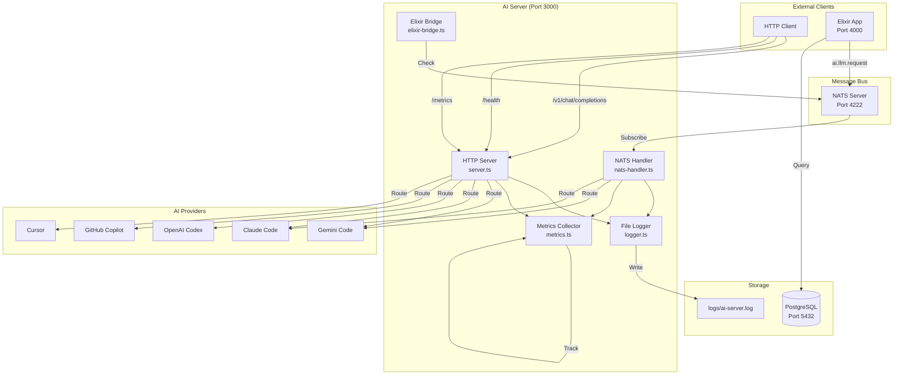
```mermaid
graph TB
    subgraph "External Clients"
        HTTP[HTTP Client]
        Elixir[Elixir App<br/>Port 4000]
    end
    
    subgraph "AI Server (Port 3000)"
        Server[HTTP Server<br/>server.ts]
        Logger[File Logger<br/>logger.ts]
        Metrics[Metrics Collector<br/>metrics.ts]
        NATSHandler[NATS Handler<br/>nats-handler.ts]
        Bridge[Elixir Bridge<br/>elixir-bridge.ts]
    end
    
    subgraph "Message Bus"
        NATS[NATS Server<br/>Port 4222]
    end
    
    subgraph "AI Providers"
        Gemini[Gemini Code]
        Claude[Claude Code]
        Codex[OpenAI Codex]
        Copilot[GitHub Copilot]
        Cursor[Cursor]
    end
    
    subgraph "Storage"
        Logs[logs/ai-server.log]
        DB[(PostgreSQL<br/>Port 5432)]
    end
    
    HTTP -->|/v1/chat/completions| Server
    HTTP -->|/health| Server
    HTTP -->|/metrics| Server
    Elixir -->|ai.llm.request| NATS
    NATS -->|Subscribe| NATSHandler
    Server --> Logger
    Server --> Metrics
    NATSHandler --> Logger
    NATSHandler --> Metrics
    Logger -->|Write| Logs
    Metrics -->|Track| Metrics
    Server -->|Route| Gemini
    Server -->|Route| Claude
    Server -->|Route| Codex
    Server -->|Route| Copilot
    Server -->|Route| Cursor
    NATSHandler -->|Route| Gemini
    NATSHandler -->|Route| Claude
    Bridge -->|Check| NATS
    Elixir -->|Query| DB
```

---

## AI Request Flow

### HTTP Chat Completions Flow

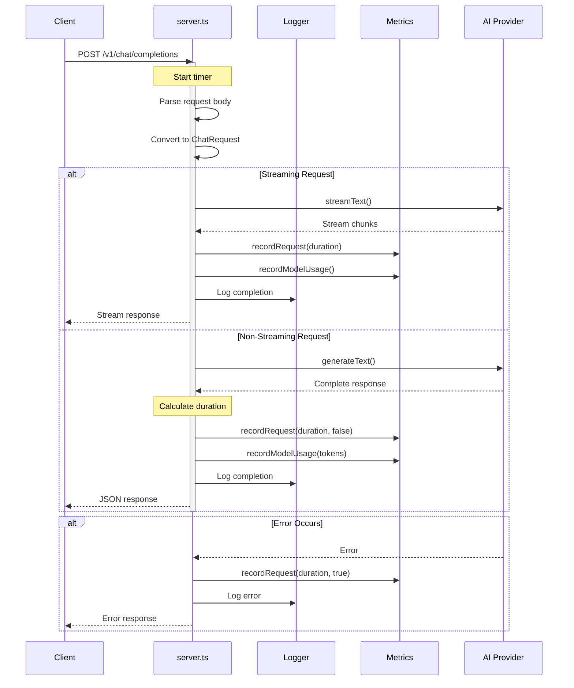
```mermaid
sequenceDiagram
    participant Client
    participant Server as server.ts
    participant Logger
    participant Metrics
    participant Provider as AI Provider
    
    Client->>Server: POST /v1/chat/completions
    activate Server
    Note over Server: Start timer
    Server->>Server: Parse request body
    Server->>Server: Convert to ChatRequest
    
    alt Streaming Request
        Server->>Provider: streamText()
        Provider-->>Server: Stream chunks
        Server->>Metrics: recordRequest(duration)
        Server->>Metrics: recordModelUsage()
        Server->>Logger: Log completion
        Server-->>Client: Stream response
    else Non-Streaming Request
        Server->>Provider: generateText()
        Provider-->>Server: Complete response
        Note over Server: Calculate duration
        Server->>Metrics: recordRequest(duration, false)
        Server->>Metrics: recordModelUsage(tokens)
        Server->>Logger: Log completion
        Server-->>Client: JSON response
    end
    deactivate Server
    
    alt Error Occurs
        Provider-->>Server: Error
        Server->>Metrics: recordRequest(duration, true)
        Server->>Logger: Log error
        Server-->>Client: Error response
    end
```

### NATS LLM Request Flow

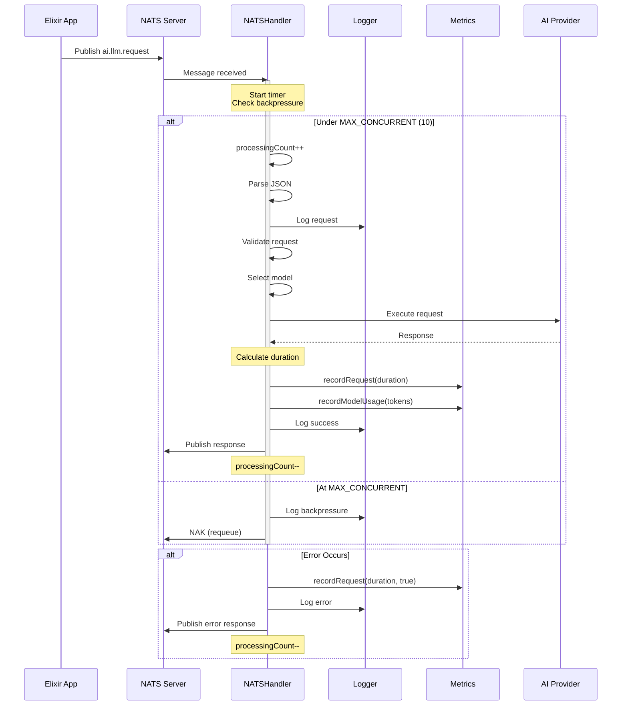
```mermaid
sequenceDiagram
    participant Elixir as Elixir App
    participant NATS as NATS Server
    participant Handler as NATSHandler
    participant Logger
    participant Metrics
    participant Provider as AI Provider
    
    Elixir->>NATS: Publish ai.llm.request
    NATS->>Handler: Message received
    activate Handler
    Note over Handler: Start timer<br/>Check backpressure
    
    alt Under MAX_CONCURRENT (10)
        Handler->>Handler: processingCount++
        Handler->>Handler: Parse JSON
        Handler->>Logger: Log request
        Handler->>Handler: Validate request
        Handler->>Handler: Select model
        Handler->>Provider: Execute request
        Provider-->>Handler: Response
        Note over Handler: Calculate duration
        Handler->>Metrics: recordRequest(duration)
        Handler->>Metrics: recordModelUsage(tokens)
        Handler->>Logger: Log success
        Handler->>NATS: Publish response
        Note over Handler: processingCount--
    else At MAX_CONCURRENT
        Handler->>Logger: Log backpressure
        Handler->>NATS: NAK (requeue)
    end
    deactivate Handler
    
    alt Error Occurs
        Handler->>Metrics: recordRequest(duration, true)
        Handler->>Logger: Log error
        Handler->>NATS: Publish error response
        Note over Handler: processingCount--
    end
```

---

## Error Handling Flow

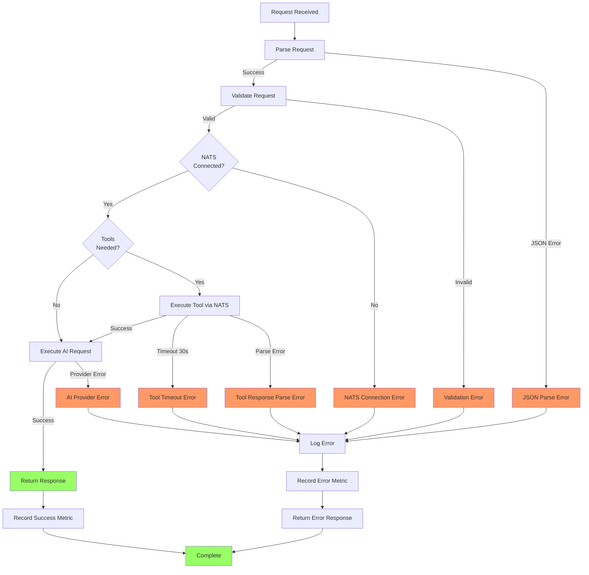
```mermaid
flowchart TD
    Start[Request Received] --> Parse[Parse Request]
    
    Parse -->|Success| Validate[Validate Request]
    Parse -->|JSON Error| JSONError[JSON Parse Error]
    
    Validate -->|Valid| CheckNATS{NATS<br/>Connected?}
    Validate -->|Invalid| ValError[Validation Error]
    
    CheckNATS -->|Yes| CheckTools{Tools<br/>Needed?}
    CheckNATS -->|No| NATSError[NATS Connection Error]
    
    CheckTools -->|No| Execute[Execute AI Request]
    CheckTools -->|Yes| ExecTool[Execute Tool via NATS]
    
    ExecTool -->|Success| Execute
    ExecTool -->|Timeout 30s| TimeoutError[Tool Timeout Error]
    ExecTool -->|Parse Error| ToolParseError[Tool Response Parse Error]
    
    Execute -->|Success| Response[Return Response]
    Execute -->|Provider Error| ProviderError[AI Provider Error]
    
    JSONError --> LogError[Log Error]
    ValError --> LogError
    NATSError --> LogError
    TimeoutError --> LogError
    ToolParseError --> LogError
    ProviderError --> LogError
    
    LogError --> RecordMetric[Record Error Metric]
    RecordMetric --> ErrorResponse[Return Error Response]
    
    Response --> RecordSuccess[Record Success Metric]
    RecordSuccess --> End[Complete]
    ErrorResponse --> End
    
    style JSONError fill:#f96
    style ValError fill:#f96
    style NATSError fill:#f96
    style TimeoutError fill:#f96
    style ToolParseError fill:#f96
    style ProviderError fill:#f96
    style Response fill:#9f6
    style End fill:#9f6
```

---

## Monitoring & Metrics Flow

```mermaid
flowchart LR
    subgraph "Request Processing"
        Request[Incoming Request]
        Process[Process Request]
        Complete[Request Complete]
    end
    
    subgraph "Logging (logger.ts)"
        Console[Console Output]
        FileLog[File: logs/ai-server.log]
    end
    
    subgraph "Metrics (metrics.ts)"
        Counter[Request Counter]
        Timer[Duration Tracking]
        ErrorCount[Error Counter]
        ModelUsage[Model Usage Tracker]
        Memory[Memory Monitor]
    end
    
    subgraph "Outputs"
        LogFile[(Log File)]
        MetricsAPI[/metrics Endpoint]
    end
    
    Request --> Process
    Process -->|Log Info| Console
    Process -->|Log Info| FileLog
    Process -->|Increment| Counter
    Process -->|Start Timer| Timer
    
    Complete -->|Log Result| Console
    Complete -->|Log Result| FileLog
    Complete -->|Stop Timer| Timer
    Complete -->|Track| ModelUsage
    Complete -->|Check| Memory
    
    Process -->|On Error| ErrorCount
    
    FileLog --> LogFile
    Counter --> MetricsAPI
    Timer --> MetricsAPI
    ErrorCount --> MetricsAPI
    ModelUsage --> MetricsAPI
    Memory --> MetricsAPI
    
    style Console fill:#9cf
    style FileLog fill:#9cf
    style LogFile fill:#fc9
    style MetricsAPI fill:#fc9
```

---

## NATS Message Flow with Backpressure

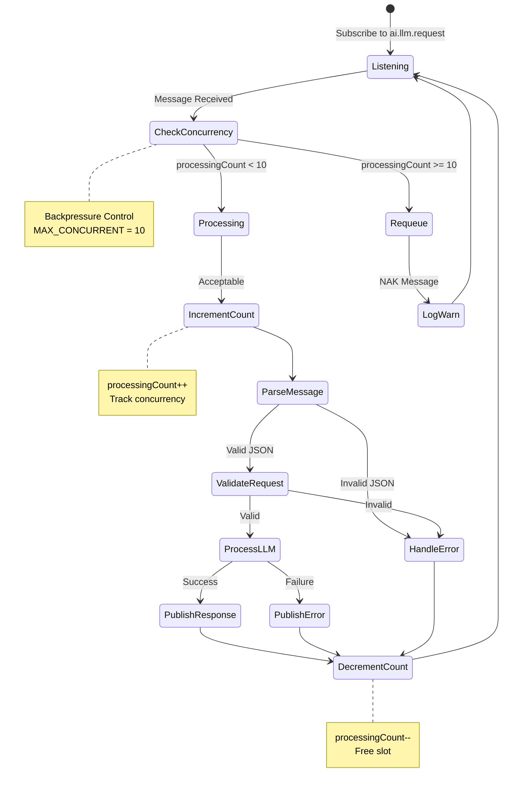
```mermaid
stateDiagram-v2
    [*] --> Listening: Subscribe to ai.llm.request
    
    Listening --> CheckConcurrency: Message Received
    
    CheckConcurrency --> Processing: processingCount < 10
    CheckConcurrency --> Requeue: processingCount >= 10
    
    Processing --> IncrementCount: Acceptable
    IncrementCount --> ParseMessage
    
    ParseMessage --> ValidateRequest: Valid JSON
    ParseMessage --> HandleError: Invalid JSON
    
    ValidateRequest --> ProcessLLM: Valid
    ValidateRequest --> HandleError: Invalid
    
    ProcessLLM --> PublishResponse: Success
    ProcessLLM --> PublishError: Failure
    
    PublishResponse --> DecrementCount
    PublishError --> DecrementCount
    HandleError --> DecrementCount
    
    DecrementCount --> Listening
    
    Requeue --> LogWarn: NAK Message
    LogWarn --> Listening
    
    note right of CheckConcurrency
        Backpressure Control
        MAX_CONCURRENT = 10
    end note
    
    note right of IncrementCount
        processingCount++
        Track concurrency
    end note
    
    note right of DecrementCount
        processingCount--
        Free slot
    end note
```

---

## Tool Execution Flow

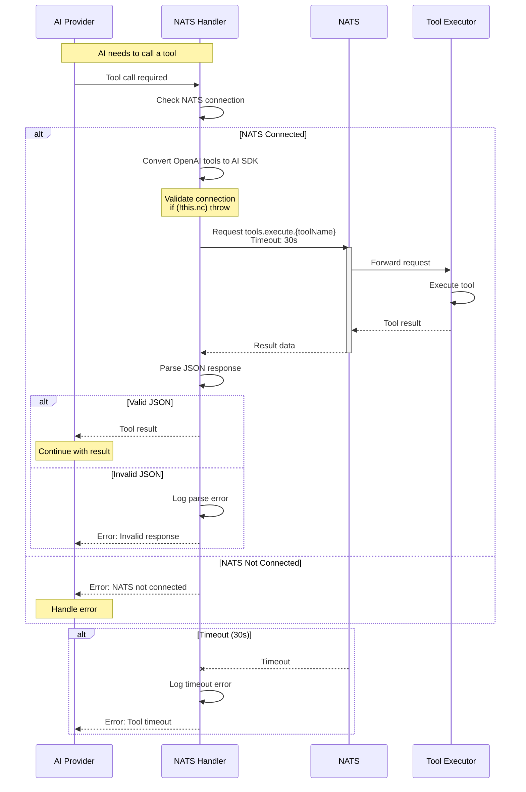
```mermaid
sequenceDiagram
    participant LLM as AI Provider
    participant Handler as NATS Handler
    participant NATS
    participant Elixir as Tool Executor
    
    Note over LLM,Handler: AI needs to call a tool
    
    LLM->>Handler: Tool call required
    Handler->>Handler: Check NATS connection
    
    alt NATS Connected
        Handler->>Handler: Convert OpenAI tools to AI SDK
        Note over Handler: Validate connection<br/>if (!this.nc) throw
        Handler->>NATS: Request tools.execute.{toolName}<br/>Timeout: 30s
        activate NATS
        NATS->>Elixir: Forward request
        Elixir->>Elixir: Execute tool
        Elixir-->>NATS: Tool result
        NATS-->>Handler: Result data
        deactivate NATS
        
        Handler->>Handler: Parse JSON response
        alt Valid JSON
            Handler-->>LLM: Tool result
            Note over LLM: Continue with result
        else Invalid JSON
            Handler->>Handler: Log parse error
            Handler-->>LLM: Error: Invalid response
        end
    else NATS Not Connected
        Handler-->>LLM: Error: NATS not connected
        Note over LLM: Handle error
    end
    
    alt Timeout (30s)
        NATS--xHandler: Timeout
        Handler->>Handler: Log timeout error
        Handler-->>LLM: Error: Tool timeout
    end
```

---

## Health Check Flow

```mermaid
flowchart TD
    Client[HTTP Client] -->|GET /health| Server[server.ts]
    
    Server --> CheckNATS{Check NATS<br/>Connection}
    Server --> GetUptime[Get Process<br/>Uptime]
    Server --> CountModels[Count Models<br/>in Catalog]
    Server --> GetMemory[Get Memory<br/>Stats]
    
    CheckNATS -->|Connected| NATSStatus[NATS: connected]
    CheckNATS -->|Disconnected| NATSStatus2[NATS: disconnected]
    
    NATSStatus --> BuildResponse
    NATSStatus2 --> BuildResponse
    GetUptime --> BuildResponse[Build Health JSON]
    CountModels --> BuildResponse
    GetMemory --> BuildResponse
    
    BuildResponse --> Response{
        status: ok,
        timestamp: ISO,
        uptime: seconds,
        models: {count, providers},
        nats: status,
        memory: {heapUsed, heapTotal, rss}
    }
    
    Response --> Client
    
    style Response fill:#9f6
```

---

## Startup Sequence

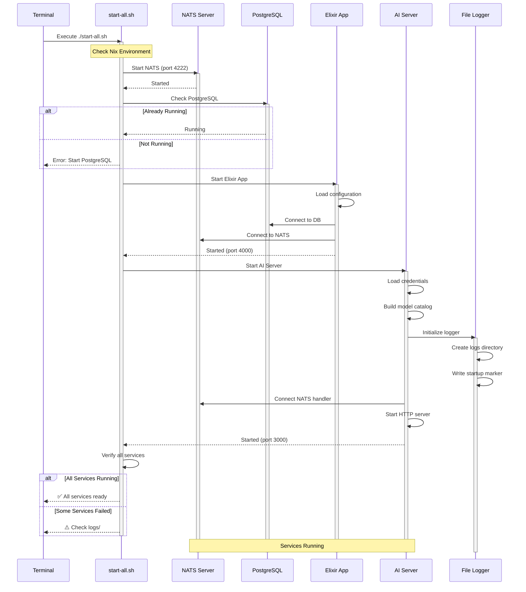
```mermaid
sequenceDiagram
    participant Shell as Terminal
    participant Script as start-all.sh
    participant NATS as NATS Server
    participant PG as PostgreSQL
    participant Elixir as Elixir App
    participant AI as AI Server
    participant Logger as File Logger
    
    Shell->>Script: Execute ./start-all.sh
    activate Script
    
    Note over Script: Check Nix Environment
    
    Script->>NATS: Start NATS (port 4222)
    activate NATS
    NATS-->>Script: Started
    
    Script->>PG: Check PostgreSQL
    activate PG
    alt Already Running
        PG-->>Script: Running
    else Not Running
        Script-->>Shell: Error: Start PostgreSQL
    end
    
    Script->>Elixir: Start Elixir App
    activate Elixir
    Elixir->>Elixir: Load configuration
    Elixir->>PG: Connect to DB
    Elixir->>NATS: Connect to NATS
    Elixir-->>Script: Started (port 4000)
    
    Script->>AI: Start AI Server
    activate AI
    AI->>AI: Load credentials
    AI->>AI: Build model catalog
    AI->>Logger: Initialize logger
    activate Logger
    Logger->>Logger: Create logs directory
    Logger->>Logger: Write startup marker
    AI->>NATS: Connect NATS handler
    AI->>AI: Start HTTP server
    AI-->>Script: Started (port 3000)
    
    Script->>Script: Verify all services
    
    alt All Services Running
        Script-->>Shell: ✅ All services ready
    else Some Services Failed
        Script-->>Shell: ⚠️ Check logs/
    end
    
    deactivate Script
    
    Note over NATS,AI: Services Running
    
    deactivate NATS
    deactivate PG
    deactivate Elixir
    deactivate AI
    deactivate Logger
```

---

## Request Lifecycle with Monitoring

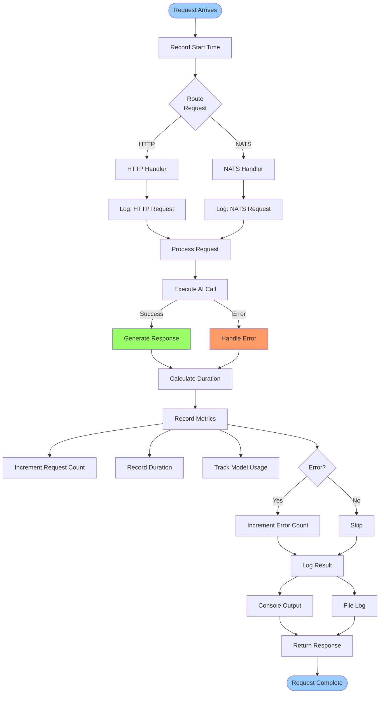
```mermaid
flowchart TD
    Start([Request Arrives]) --> RecordStart[Record Start Time]
    
    RecordStart --> Route{Route<br/>Request}
    
    Route -->|HTTP| HTTPHandler[HTTP Handler]
    Route -->|NATS| NATSHandler[NATS Handler]
    
    HTTPHandler --> LogHTTP[Log: HTTP Request]
    NATSHandler --> LogNATS[Log: NATS Request]
    
    LogHTTP --> Process[Process Request]
    LogNATS --> Process
    
    Process --> Execute[Execute AI Call]
    
    Execute -->|Success| Success[Generate Response]
    Execute -->|Error| Error[Handle Error]
    
    Success --> CalcDuration[Calculate Duration]
    Error --> CalcDuration
    
    CalcDuration --> RecordMetrics[Record Metrics]
    
    RecordMetrics --> RecordCount[Increment Request Count]
    RecordMetrics --> RecordTime[Record Duration]
    RecordMetrics --> RecordModel[Track Model Usage]
    RecordMetrics --> RecordError{Error?}
    
    RecordError -->|Yes| IncError[Increment Error Count]
    RecordError -->|No| SkipError[Skip]
    
    IncError --> LogResult
    SkipError --> LogResult[Log Result]
    
    LogResult --> ConsoleLog[Console Output]
    LogResult --> FileLog[File Log]
    
    ConsoleLog --> Return[Return Response]
    FileLog --> Return
    
    Return --> End([Request Complete])
    
    style Start fill:#9cf
    style Success fill:#9f6
    style Error fill:#f96
    style End fill:#9cf
```

---

## Model Selection Flow

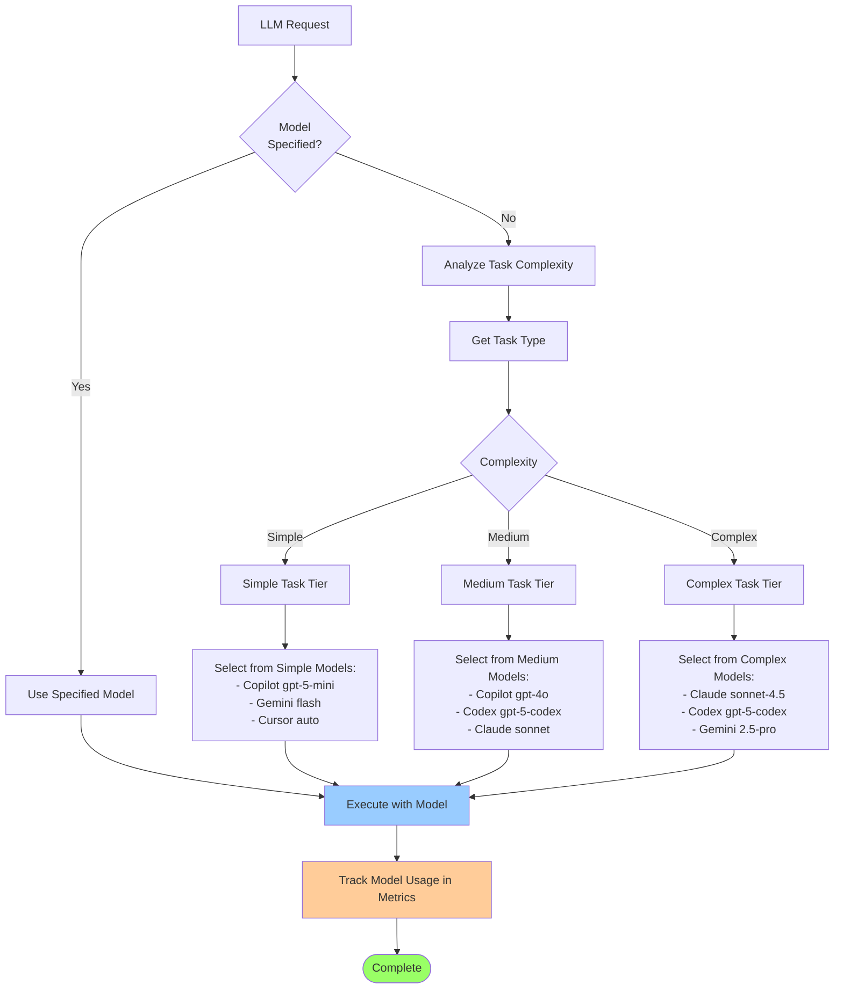
```mermaid
flowchart TD
    Request[LLM Request] --> HasModel{Model<br/>Specified?}
    
    HasModel -->|Yes| UseModel[Use Specified Model]
    HasModel -->|No| Analyze[Analyze Task Complexity]
    
    Analyze --> GetType[Get Task Type]
    GetType --> Simple{Complexity}
    
    Simple -->|Simple| SimpleTier[Simple Task Tier]
    Simple -->|Medium| MediumTier[Medium Task Tier]
    Simple -->|Complex| ComplexTier[Complex Task Tier]
    
    SimpleTier --> SelectSimple[Select from Simple Models:<br/>- Copilot gpt-5-mini<br/>- Gemini flash<br/>- Cursor auto]
    MediumTier --> SelectMedium[Select from Medium Models:<br/>- Copilot gpt-4o<br/>- Codex gpt-5-codex<br/>- Claude sonnet]
    ComplexTier --> SelectComplex[Select from Complex Models:<br/>- Claude sonnet-4.5<br/>- Codex gpt-5-codex<br/>- Gemini 2.5-pro]
    
    UseModel --> Execute[Execute with Model]
    SelectSimple --> Execute
    SelectMedium --> Execute
    SelectComplex --> Execute
    
    Execute --> TrackUsage[Track Model Usage in Metrics]
    TrackUsage --> End([Complete])
    
    style Execute fill:#9cf
    style TrackUsage fill:#fc9
    style End fill:#9f6
```

---

## Summary

This documentation provides comprehensive flow diagrams for:

1. **Overall Architecture** - Shows how all components connect
2. **AI Request Flows** - Both HTTP and NATS paths
3. **Error Handling** - Complete error handling logic
4. **Monitoring** - How logging and metrics work
5. **Backpressure** - NATS concurrency control
6. **Tool Execution** - Tool call flow with timeouts
7. **Health Checks** - System health monitoring
8. **Startup** - Service initialization sequence
9. **Request Lifecycle** - End-to-end with monitoring
10. **Model Selection** - Intelligent routing logic

All flows incorporate the production fixes and monitoring capabilities implemented in commits f58a7d9 and ad500f3.

---

**Key Features Documented:**
- ✅ Error handling with try/catch
- ✅ 30-second timeouts for tool execution
- ✅ Backpressure (max 10 concurrent)
- ✅ Resource cleanup
- ✅ File logging
- ✅ Metrics collection
- ✅ Health monitoring
- ✅ NATS connection validation

**Files Referenced:**
- `ai-server/src/server.ts`
- `ai-server/src/nats-handler.ts`
- `ai-server/src/logger.ts`
- `ai-server/src/metrics.ts`
- `ai-server/src/elixir-bridge.ts`
- `start-all.sh`

---

## Database Architecture & Flows

### PostgreSQL Database Architecture

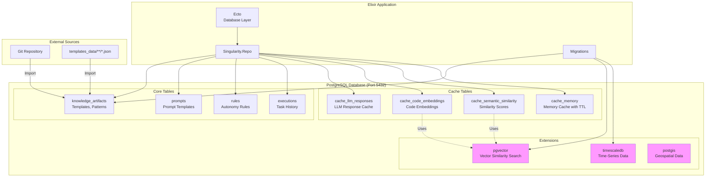
```mermaid
graph TB
    subgraph "Elixir Application"
        Ecto[Ecto<br/>Database Layer]
        Repo[Singularity.Repo]
        Migrations[Migrations]
    end
    
    subgraph "PostgreSQL Database (Port 5432)"
        subgraph "Core Tables"
            Artifacts[knowledge_artifacts<br/>Templates, Patterns]
            Prompts[prompts<br/>Prompt Templates]
            Rules[rules<br/>Autonomy Rules]
            Executions[executions<br/>Task History]
        end
        
        subgraph "Cache Tables"
            LLMCache[cache_llm_responses<br/>LLM Response Cache]
            EmbedCache[cache_code_embeddings<br/>Code Embeddings]
            SimCache[cache_semantic_similarity<br/>Similarity Scores]
            MemCache[cache_memory<br/>Memory Cache with TTL]
        end
        
        subgraph "Extensions"
            PGVector[pgvector<br/>Vector Similarity Search]
            TimescaleDB[timescaledb<br/>Time-Series Data]
            PostGIS[postgis<br/>Geospatial Data]
        end
    end
    
    subgraph "External Sources"
        Git[Git Repository]
        Templates[templates_data/**/*.json]
    end
    
    Ecto --> Repo
    Repo --> Artifacts
    Repo --> Prompts
    Repo --> Rules
    Repo --> Executions
    Repo --> LLMCache
    Repo --> EmbedCache
    Repo --> SimCache
    Repo --> MemCache
    
    Migrations --> Artifacts
    Migrations --> PGVector
    Migrations --> TimescaleDB
    
    Git -->|Import| Artifacts
    Templates -->|Import| Artifacts
    
    EmbedCache -.->|Uses| PGVector
    SimCache -.->|Uses| PGVector
    
    style PGVector fill:#f9f
    style TimescaleDB fill:#f9f
    style PostGIS fill:#f9f
```

### Database Connection Flow

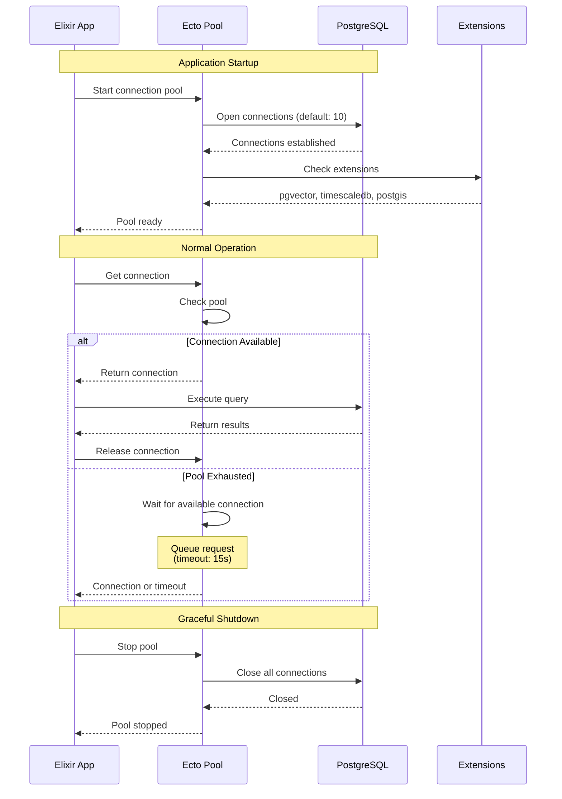
```mermaid
sequenceDiagram
    participant App as Elixir App
    participant Ecto as Ecto Pool
    participant PG as PostgreSQL
    participant Extensions as Extensions
    
    Note over App,PG: Application Startup
    
    App->>Ecto: Start connection pool
    Ecto->>PG: Open connections (default: 10)
    PG-->>Ecto: Connections established
    
    Ecto->>Extensions: Check extensions
    Extensions-->>Ecto: pgvector, timescaledb, postgis
    
    Ecto-->>App: Pool ready
    
    Note over App,PG: Normal Operation
    
    App->>Ecto: Get connection
    Ecto->>Ecto: Check pool
    
    alt Connection Available
        Ecto-->>App: Return connection
        App->>PG: Execute query
        PG-->>App: Return results
        App->>Ecto: Release connection
    else Pool Exhausted
        Ecto->>Ecto: Wait for available connection
        Note over Ecto: Queue request<br/>(timeout: 15s)
        Ecto-->>App: Connection or timeout
    end
    
    Note over App,PG: Graceful Shutdown
    
    App->>Ecto: Stop pool
    Ecto->>PG: Close all connections
    PG-->>Ecto: Closed
    Ecto-->>App: Pool stopped
```

---

## Knowledge Base Storage Flow

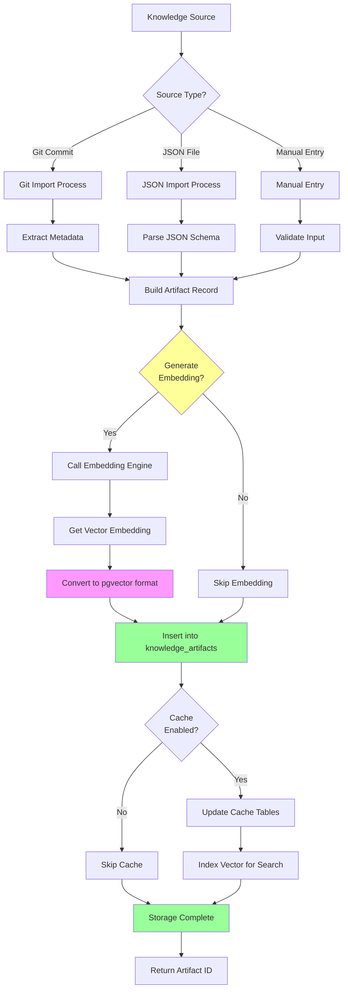
```mermaid
flowchart TD
    Start[Knowledge Source] --> CheckType{Source Type?}
    
    CheckType -->|Git Commit| GitImport[Git Import Process]
    CheckType -->|JSON File| JSONImport[JSON Import Process]
    CheckType -->|Manual Entry| ManualEntry[Manual Entry]
    
    GitImport --> ExtractData[Extract Metadata]
    JSONImport --> ParseJSON[Parse JSON Schema]
    ManualEntry --> ValidateInput[Validate Input]
    
    ExtractData --> BuildArtifact
    ParseJSON --> BuildArtifact
    ValidateInput --> BuildArtifact[Build Artifact Record]
    
    BuildArtifact --> GenerateEmbedding{Generate<br/>Embedding?}
    
    GenerateEmbedding -->|Yes| CallEmbedding[Call Embedding Engine]
    GenerateEmbedding -->|No| SkipEmbedding[Skip Embedding]
    
    CallEmbedding --> EmbeddingResult[Get Vector Embedding]
    EmbeddingResult --> ConvertPGVector[Convert to pgvector format]
    
    ConvertPGVector --> InsertDB
    SkipEmbedding --> InsertDB[Insert into knowledge_artifacts]
    
    InsertDB --> CheckCache{Cache<br/>Enabled?}
    
    CheckCache -->|Yes| UpdateCache[Update Cache Tables]
    CheckCache -->|No| SkipCache[Skip Cache]
    
    UpdateCache --> IndexVector
    SkipCache --> Complete
    
    IndexVector[Index Vector for Search] --> Complete[Storage Complete]
    
    Complete --> ReturnID[Return Artifact ID]
    
    style GenerateEmbedding fill:#ff9
    style ConvertPGVector fill:#f9f
    style InsertDB fill:#9f9
    style Complete fill:#9f9
```

### Knowledge Retrieval Flow

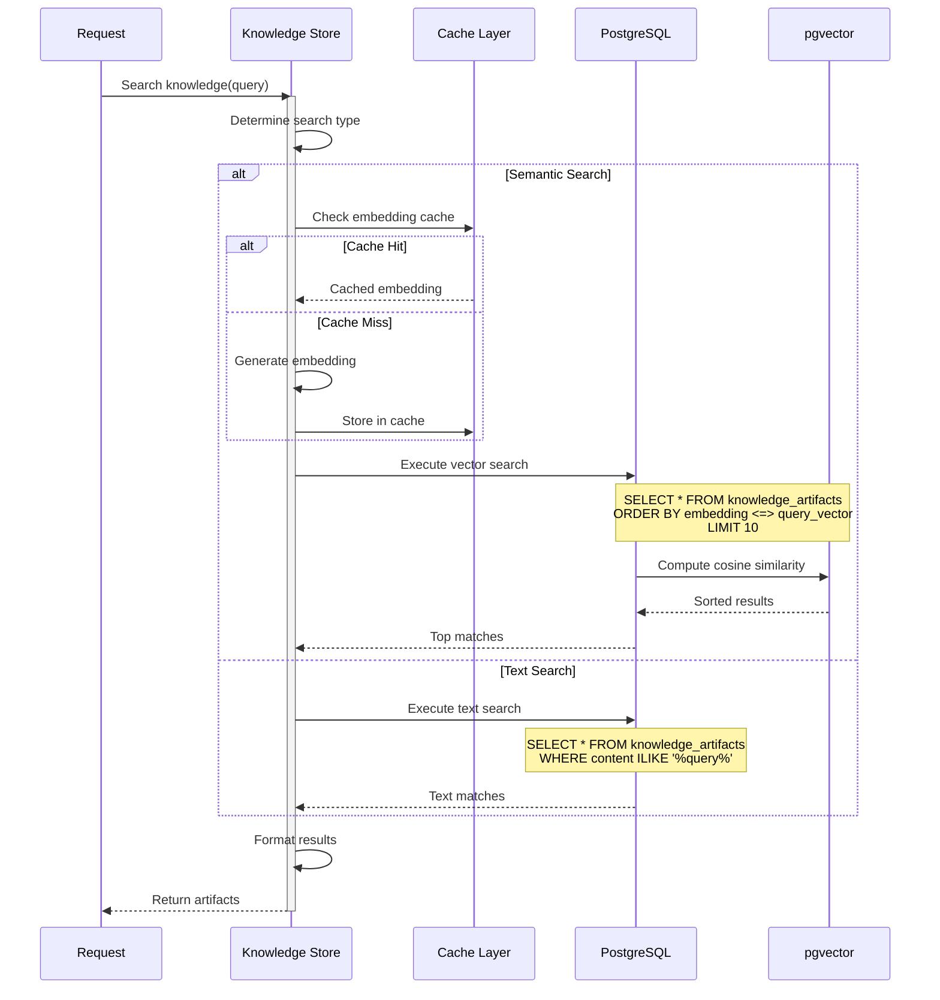
```mermaid
sequenceDiagram
    participant Client as Request
    participant Store as Knowledge Store
    participant Cache as Cache Layer
    participant DB as PostgreSQL
    participant Vector as pgvector
    
    Client->>Store: Search knowledge(query)
    activate Store
    
    Store->>Store: Determine search type
    
    alt Semantic Search
        Store->>Cache: Check embedding cache
        
        alt Cache Hit
            Cache-->>Store: Cached embedding
        else Cache Miss
            Store->>Store: Generate embedding
            Store->>Cache: Store in cache
        end
        
        Store->>DB: Execute vector search
        Note over DB,Vector: SELECT * FROM knowledge_artifacts<br/>ORDER BY embedding <=> query_vector<br/>LIMIT 10
        
        DB->>Vector: Compute cosine similarity
        Vector-->>DB: Sorted results
        DB-->>Store: Top matches
        
    else Text Search
        Store->>DB: Execute text search
        Note over DB: SELECT * FROM knowledge_artifacts<br/>WHERE content ILIKE '%query%'
        DB-->>Store: Text matches
    end
    
    Store->>Store: Format results
    Store-->>Client: Return artifacts
    deactivate Store
```

---

## Cache System Flow

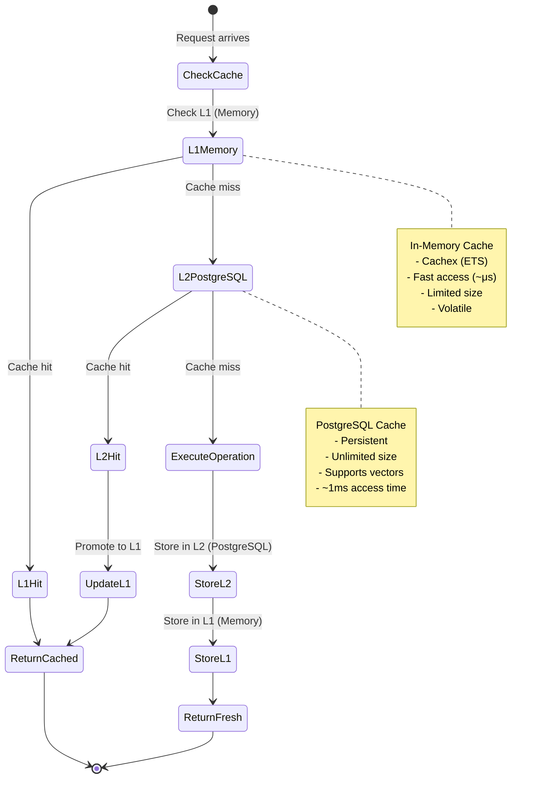
```mermaid
stateDiagram-v2
    [*] --> CheckCache: Request arrives
    
    CheckCache --> L1Memory: Check L1 (Memory)
    
    L1Memory --> L1Hit: Cache hit
    L1Memory --> L2PostgreSQL: Cache miss
    
    L1Hit --> ReturnCached
    
    L2PostgreSQL --> L2Hit: Cache hit
    L2PostgreSQL --> ExecuteOperation: Cache miss
    
    L2Hit --> UpdateL1: Promote to L1
    UpdateL1 --> ReturnCached
    
    ExecuteOperation --> StoreL2: Store in L2 (PostgreSQL)
    StoreL2 --> StoreL1: Store in L1 (Memory)
    StoreL1 --> ReturnFresh
    
    ReturnCached --> [*]
    ReturnFresh --> [*]
    
    note right of L1Memory
        In-Memory Cache
        - Cachex (ETS)
        - Fast access (~μs)
        - Limited size
        - Volatile
    end note
    
    note right of L2PostgreSQL
        PostgreSQL Cache
        - Persistent
        - Unlimited size
        - Supports vectors
        - ~1ms access time
    end note
```

### Cache Write-Through Flow

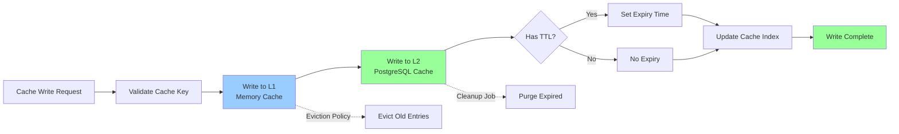
```mermaid
flowchart LR
    Request[Cache Write Request] --> ValidateKey[Validate Cache Key]
    
    ValidateKey --> WriteL1[Write to L1<br/>Memory Cache]
    WriteL1 --> WriteL2[Write to L2<br/>PostgreSQL Cache]
    
    WriteL2 --> CheckTTL{Has TTL?}
    
    CheckTTL -->|Yes| SetExpiry[Set Expiry Time]
    CheckTTL -->|No| NoExpiry[No Expiry]
    
    SetExpiry --> UpdateIndex
    NoExpiry --> UpdateIndex[Update Cache Index]
    
    UpdateIndex --> Success[Write Complete]
    
    WriteL1 -.->|Eviction Policy| EvictOld[Evict Old Entries]
    WriteL2 -.->|Cleanup Job| PurgeExpired[Purge Expired]
    
    style WriteL1 fill:#9cf
    style WriteL2 fill:#9f9
    style Success fill:#9f9
```

---

## Vector Search Flow (pgvector)

```mermaid
flowchart TD
    Query[Search Query] --> HasEmbedding{Already<br/>Embedded?}
    
    HasEmbedding -->|No| GenerateEmbed[Generate Embedding]
    HasEmbedding -->|Yes| UseEmbedding[Use Existing Embedding]
    
    GenerateEmbed --> EmbeddingEngine[Embedding Engine<br/>Jina v3 / Qodo-Embed]
    EmbeddingEngine --> VectorResult[Vector: [0.1, 0.2, ..., 0.n]]
    
    VectorResult --> ConvertFormat
    UseEmbedding --> ConvertFormat[Convert to pgvector]
    
    ConvertFormat --> BuildQuery[Build SQL Query]
    
    BuildQuery --> SQLQuery["SELECT id, content,<br/>embedding <=> '[vector]' AS distance<br/>FROM knowledge_artifacts<br/>ORDER BY distance<br/>LIMIT k"]
    
    SQLQuery --> PostgreSQL[(PostgreSQL + pgvector)]
    
    PostgreSQL --> VectorIndex{Index<br/>Available?}
    
    VectorIndex -->|Yes - HNSW| FastSearch[Fast HNSW Search<br/>Approximate]
    VectorIndex -->|No| FullScan[Sequential Scan<br/>Exact]
    
    FastSearch --> RankResults
    FullScan --> RankResults[Rank by Similarity]
    
    RankResults --> FilterThreshold{Similarity ><br/>Threshold?}
    
    FilterThreshold -->|Above| IncludeResult[Include in Results]
    FilterThreshold -->|Below| ExcludeResult[Exclude]
    
    IncludeResult --> TopK[Return Top K Results]
    ExcludeResult --> TopK
    
    TopK --> CacheResult{Cache<br/>Results?}
    
    CacheResult -->|Yes| StoreCache[Store in Similarity Cache]
    CacheResult -->|No| SkipCache[Skip]
    
    StoreCache --> ReturnResults
    SkipCache --> ReturnResults[Return to Client]
    
    style EmbeddingEngine fill:#f9f
    style PostgreSQL fill:#9f9
    style FastSearch fill:#9cf
    style ReturnResults fill:#9f9
```

### pgvector Index Strategy

```mermaid
graph TB
    subgraph "Index Selection Strategy"
        DataSize{Dataset Size}
        
        DataSize -->|< 10K vectors| NoIndex[No Index<br/>Sequential Scan]
        DataSize -->|10K - 100K| IVFFlat[IVF Flat Index<br/>Approximate Search]
        DataSize -->|> 100K| HNSW[HNSW Index<br/>Hierarchical Graph]
        
        NoIndex --> Exact[Exact Search<br/>100% Accuracy]
        IVFFlat --> Approx1[Approximate<br/>95-99% Accuracy]
        HNSW --> Approx2[Approximate<br/>90-95% Accuracy]
    end
    
    subgraph "Performance Characteristics"
        Exact --> SlowSearch[O(n) Search Time]
        Approx1 --> MediumSearch[O(log n) Search Time]
        Approx2 --> FastSearch[O(log log n) Search Time]
        
        SlowSearch --> BestQuality[Best Quality]
        MediumSearch --> GoodQuality[Good Quality]
        FastSearch --> FastestSpeed[Fastest Speed]
    end
    
    style HNSW fill:#9f9
    style FastSearch fill:#9cf
```

---

## Database Migration Flow

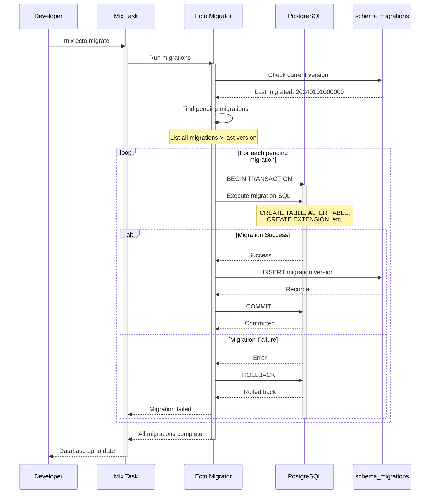
```mermaid
sequenceDiagram
    participant Dev as Developer
    participant Mix as Mix Task
    participant Ecto as Ecto.Migrator
    participant DB as PostgreSQL
    participant Schema as schema_migrations
    
    Dev->>Mix: mix ecto.migrate
    activate Mix
    
    Mix->>Ecto: Run migrations
    activate Ecto
    
    Ecto->>Schema: Check current version
    Schema-->>Ecto: Last migrated: 20240101000000
    
    Ecto->>Ecto: Find pending migrations
    Note over Ecto: List all migrations > last version
    
    loop For each pending migration
        Ecto->>DB: BEGIN TRANSACTION
        activate DB
        
        Ecto->>DB: Execute migration SQL
        Note over DB: CREATE TABLE, ALTER TABLE,<br/>CREATE EXTENSION, etc.
        
        alt Migration Success
            DB-->>Ecto: Success
            Ecto->>Schema: INSERT migration version
            Schema-->>Ecto: Recorded
            Ecto->>DB: COMMIT
            DB-->>Ecto: Committed
        else Migration Failure
            DB-->>Ecto: Error
            Ecto->>DB: ROLLBACK
            DB-->>Ecto: Rolled back
            Ecto-->>Mix: Migration failed
        end
        
        deactivate DB
    end
    
    Ecto-->>Mix: All migrations complete
    deactivate Ecto
    
    Mix-->>Dev: Database up to date
    deactivate Mix
```

---

## Database Backup & Recovery Flow

```mermaid
flowchart TD
    Trigger[Backup Trigger] --> CheckType{Backup Type?}
    
    CheckType -->|Scheduled| CronJob[Cron Job]
    CheckType -->|Manual| ManualCmd[Manual Command]
    CheckType -->|Pre-Deploy| DeployHook[Deploy Hook]
    
    CronJob --> StartBackup
    ManualCmd --> StartBackup
    DeployHook --> StartBackup[Initialize Backup]
    
    StartBackup --> DumpCmd[pg_dump Command]
    
    DumpCmd --> IncludeData{Include<br/>Data?}
    
    IncludeData -->|Schema + Data| FullDump[pg_dump --format=custom]
    IncludeData -->|Schema Only| SchemaOnly[pg_dump --schema-only]
    
    FullDump --> Compress
    SchemaOnly --> Compress[Compress with gzip]
    
    Compress --> Timestamp[Add Timestamp]
    Timestamp --> Store[Store Backup File]
    
    Store --> StoreLocal{Storage<br/>Location?}
    
    StoreLocal -->|Local| LocalDisk[./backups/]
    StoreLocal -->|Remote| S3Upload[Upload to S3/Cloud]
    
    LocalDisk --> Verify
    S3Upload --> Verify[Verify Backup]
    
    Verify --> Success{Verified?}
    
    Success -->|Yes| CleanOld[Clean Old Backups]
    Success -->|No| Alert[Send Alert]
    
    CleanOld --> Complete[Backup Complete]
    Alert --> Complete
    
    Complete --> Log[Log to System]
    
    style FullDump fill:#9f9
    style Verify fill:#ff9
    style Success fill:#9cf
    style Complete fill:#9f9
```

---

## Summary - Database Flows

This documentation provides comprehensive database flow diagrams for:

1. **Database Architecture** - PostgreSQL structure with tables, extensions, and connections
2. **Connection Flow** - Ecto pool management and connection lifecycle
3. **Knowledge Base Storage** - Import, embedding, and storage workflow
4. **Knowledge Retrieval** - Semantic and text search paths
5. **Cache System** - Two-tier caching with L1 (memory) and L2 (PostgreSQL)
6. **Vector Search (pgvector)** - Embedding generation and similarity search
7. **Index Strategy** - HNSW vs IVF Flat vs Sequential scan
8. **Migration Flow** - Database schema migration process
9. **Backup & Recovery** - Backup strategies and verification

**Key Database Features Documented:**
- ✅ PostgreSQL with pgvector, timescaledb, postgis extensions
- ✅ Two-tier cache system (Memory + PostgreSQL)
- ✅ Vector similarity search with cosine distance
- ✅ Knowledge base with semantic search
- ✅ Connection pooling with Ecto
- ✅ Migration management
- ✅ Backup and recovery strategies

**Database Extensions:**
- **pgvector** - Vector similarity search for embeddings
- **timescaledb** - Time-series data optimization
- **postgis** - Geospatial data support

**Tables:**
- `knowledge_artifacts` - Templates, patterns, prompts
- `cache_llm_responses` - LLM response caching
- `cache_code_embeddings` - Code embedding cache
- `cache_semantic_similarity` - Similarity score cache
- `executions` - Task execution history
- `rules` - Autonomy engine rules

---

## Agent Flows

### Agent Architecture Overview

```mermaid
graph TB
    subgraph "Agent Layer"
        AgentSup[Agent Supervisor<br/>DynamicSupervisor]
        
        subgraph "Agent Types"
            SelfImproving[Self-Improving Agent<br/>GenServer]
            CostOptimized[Cost-Optimized Agent<br/>GenServer]
            Architecture[Architecture Agent<br/>GenServer]
            Technology[Technology Agent<br/>GenServer]
            Refactoring[Refactoring Agent<br/>GenServer]
            Chat[Chat Conversation Agent<br/>GenServer]
        end
    end
    
    subgraph "Supporting Systems"
        Decider[Autonomy Decider<br/>Score & Decision]
        Limiter[Autonomy Limiter<br/>Rate Control]
        RuleEngine[Rule Engine<br/>Cachex + Repo]
        HotReload[Hot Reload Manager<br/>Dynamic Compilation]
        CodeStore[Code Store<br/>Versioned Code]
    end
    
    subgraph "Data Layer"
        FlowTracker[Agent Flow Tracker<br/>PostgreSQL]
        MetricsDB[(Metrics DB<br/>agent_metrics)]
        ImprovementDB[(Improvement History<br/>agent_improvements)]
    end
    
    AgentSup -->|Supervises| SelfImproving
    AgentSup -->|Supervises| CostOptimized
    AgentSup -->|Supervises| Architecture
    AgentSup -->|Supervises| Technology
    AgentSup -->|Supervises| Refactoring
    AgentSup -->|Supervises| Chat
    
    SelfImproving --> Decider
    SelfImproving --> Limiter
    SelfImproving --> HotReload
    SelfImproving --> CodeStore
    SelfImproving --> FlowTracker
    
    CostOptimized --> RuleEngine
    CostOptimized --> FlowTracker
    
    FlowTracker --> MetricsDB
    FlowTracker --> ImprovementDB
    
    style SelfImproving fill:#9f9
    style CostOptimized fill:#9cf
    style FlowTracker fill:#fc9
```

---

## Self-Improving Agent Lifecycle

```mermaid
stateDiagram-v2
    [*] --> Idle: Agent Started
    
    Idle --> Observing: Tick (5s interval)
    
    Observing --> EvaluatingMetrics: Collect Metrics
    
    EvaluatingMetrics --> ScoreCalculation: Compute Score
    
    ScoreCalculation --> DecisionPoint: Check Decider
    
    DecisionPoint --> Idle: Score OK<br/>(No improvement needed)
    DecisionPoint --> GeneratingPlan: Score Low<br/>(Needs improvement)
    DecisionPoint --> ForcedImprovement: External Trigger
    
    GeneratingPlan --> SynthesizingCode: Plan Created
    
    SynthesizingCode --> ValidatingCode: Code Generated
    
    ValidatingCode --> SchedulingHotReload: Validation Passed
    ValidatingCode --> RecordingFailure: Validation Failed
    
    SchedulingHotReload --> Updating: Hot Reload Scheduled
    
    Updating --> WaitingValidation: Code Deployed
    
    WaitingValidation --> Idle: Validation Success
    WaitingValidation --> RollingBack: Validation Failed
    
    RollingBack --> Idle: Rollback Complete
    
    RecordingFailure --> Idle: Failure Recorded
    
    ForcedImprovement --> GeneratingPlan
    
    note right of Observing
        Metrics Collected:
        - Success/Failure count
        - Latency stats
        - Resource usage
        - Custom metrics
    end note
    
    note right of DecisionPoint
        Decider Checks:
        - Score threshold
        - Rate limits
        - Recent failures
        - Fingerprint uniqueness
    end note
    
    note right of SchedulingHotReload
        Hot Reload Process:
        1. Generate new version
        2. Compile code
        3. Schedule activation
        4. Monitor validation
    end note
```

### Self-Improving Agent Flow Details

```mermaid
sequenceDiagram
    participant Timer as Tick Timer
    participant Agent as Self-Improving Agent
    participant Decider as Autonomy Decider
    participant Limiter as Autonomy Limiter
    participant LLM as LLM Service (NATS)
    participant HotReload as Hot Reload Manager
    participant CodeStore as Code Store
    participant FlowTracker as Flow Tracker
    
    Note over Timer,Agent: Observation Phase
    
    Timer->>Agent: Tick (every 5s)
    activate Agent
    Agent->>Agent: Increment cycles
    Agent->>Agent: Collect current metrics
    Agent->>Agent: Calculate score
    
    Agent->>Decider: should_evolve?(score, context)
    Decider->>Decider: Check thresholds
    Decider->>Decider: Check recent history
    Decider-->>Agent: Decision + Reason
    
    alt Should Not Evolve
        Agent->>Agent: Update state
        Agent->>FlowTracker: Log observation
        Agent-->>Timer: Wait for next tick
    else Should Evolve
        Note over Agent,LLM: Improvement Phase
        
        Agent->>Limiter: can_improve?(agent_id)
        Limiter->>Limiter: Check rate limits
        Limiter-->>Agent: Allowed/Denied
        
        alt Rate Limited
            Agent->>FlowTracker: Log rate limit
            Agent-->>Timer: Wait
        else Allowed
            Agent->>Agent: Generate plan
            Agent->>LLM: Request code synthesis
            Note over LLM: Generate improved code<br/>based on metrics
            LLM-->>Agent: New code + context
            
            Agent->>Agent: Validate code syntax
            
            alt Validation Failed
                Agent->>FlowTracker: Log failure
                Agent-->>Timer: Wait
            else Validation Passed
                Note over Agent,HotReload: Hot Reload Phase
                
                Agent->>CodeStore: Store new version
                CodeStore-->>Agent: Version ID
                
                Agent->>HotReload: schedule_reload(code, version)
                HotReload->>HotReload: Compile code
                HotReload->>HotReload: Schedule activation
                HotReload-->>Agent: Scheduled
                
                Agent->>Agent: Set status: updating
                Agent->>FlowTracker: Log improvement attempt
                
                Note over Agent,Timer: Validation Wait Phase
                
                HotReload->>Agent: Activation complete
                Agent->>Agent: Monitor new version
                Agent->>Agent: Wait for validation period
                
                alt Validation Success
                    Agent->>Agent: Finalize improvement
                    Agent->>FlowTracker: Log success
                    Agent->>Agent: Update improvement history
                    Agent->>Agent: Set status: idle
                else Validation Failure
                    Agent->>HotReload: Rollback to previous
                    Agent->>FlowTracker: Log rollback
                    Agent->>Agent: Set status: idle
                end
            end
        end
    end
    
    deactivate Agent
```

---

## Cost-Optimized Agent Flow

```mermaid
flowchart TD
    Start[Task Received] --> CorrelationStart[Start Correlation Tracking]
    
    CorrelationStart --> Phase1{Phase 1:<br/>Try Rules}
    
    Phase1 -->|Rules Available| RuleEngine[Query Rule Engine]
    Phase1 -->|No Rules| Phase2
    
    RuleEngine --> RuleResult{Rule<br/>Match?}
    
    RuleResult -->|Match Found| RuleSuccess[Apply Rule]
    RuleResult -->|No Match| Phase2{Phase 2:<br/>Check Cache}
    
    RuleSuccess --> RecordRule[Record: Rule Call<br/>Cost: $0.00]
    RecordRule --> ReturnAutonomous[Return: Autonomous Result]
    
    Phase2 -->|Check LLM Cache| CacheQuery[Query cache_llm_responses]
    
    CacheQuery --> CacheResult{Cache<br/>Hit?}
    
    CacheResult -->|Hit| CacheSuccess[Use Cached Response]
    CacheResult -->|Miss| Phase3{Phase 3:<br/>Call LLM}
    
    CacheSuccess --> RecordCache[Record: Cache Hit<br/>Cost: $0.00]
    RecordCache --> ReturnCached[Return: LLM Assisted (Cached)]
    
    Phase3 --> CostCheck{Cost<br/>Worth It?}
    
    CostCheck -->|Yes| LLMCall[Call LLM via NATS]
    CostCheck -->|No| Fallback[Use Simple Heuristic]
    
    LLMCall --> LLMResult[Get LLM Response]
    LLMResult --> StoreCache[Store in Cache]
    StoreCache --> RecordLLM[Record: LLM Call<br/>Cost: ~$0.06]
    
    Fallback --> RecordFallback[Record: Fallback<br/>Cost: $0.00]
    
    RecordLLM --> UpdateStats
    RecordFallback --> UpdateStats[Update Agent Stats]
    
    UpdateStats --> ReturnLLM[Return: LLM Assisted (Fresh)]
    
    ReturnAutonomous --> End
    ReturnCached --> End
    ReturnLLM --> End[Task Complete]
    
    style RuleSuccess fill:#9f9
    style CacheSuccess fill:#9cf
    style LLMCall fill:#fc9
    style End fill:#9f9
```

### Cost-Optimized Agent Statistics

```mermaid
graph LR
    subgraph "Agent Statistics Tracking"
        Stats[Agent Stats]
        
        Stats --> RuleCalls[Rule Calls Count<br/>Cost: $0]
        Stats --> CacheCalls[Cache Hits<br/>Cost: $0]
        Stats --> LLMCalls[LLM Calls<br/>Cost: Variable]
        Stats --> LifetimeCost[Lifetime Cost<br/>Total: $$$]
        
        RuleCalls --> Efficiency[Efficiency Metrics]
        CacheCalls --> Efficiency
        LLMCalls --> Efficiency
        
        Efficiency --> CostPerTask[Cost Per Task]
        Efficiency --> AutonomyRate[Autonomy Rate %]
        Efficiency --> CacheHitRate[Cache Hit Rate %]
    end
    
    subgraph "Decision Making"
        Efficiency --> CostThreshold{Cost<br/>Threshold?}
        
        CostThreshold -->|Under Budget| PreferLLM[Prefer LLM Calls]
        CostThreshold -->|Over Budget| PreferRules[Prefer Rules/Cache]
        
        PreferLLM --> Strategy[Update Strategy]
        PreferRules --> Strategy
    end
    
    style RuleCalls fill:#9f9
    style CacheCalls fill:#9cf
    style LLMCalls fill:#fc9
```

---

## Agent Supervision Tree

```mermaid
graph TB
    Application[Singularity.Application] --> AgentSup[Agent Supervisor<br/>DynamicSupervisor]
    
    AgentSup -->|Start Child| Agent1[Agent Instance 1<br/>GenServer]
    AgentSup -->|Start Child| Agent2[Agent Instance 2<br/>GenServer]
    AgentSup -->|Start Child| Agent3[Agent Instance N<br/>GenServer]
    
    Agent1 --> Registry1[Process Registry<br/>via_tuple: agent:id1]
    Agent2 --> Registry2[Process Registry<br/>via_tuple: agent:id2]
    Agent3 --> Registry3[Process Registry<br/>via_tuple: agent:id3]
    
    subgraph "Agent Lifecycle"
        Start[Start Agent] --> Init[Initialize State]
        Init --> Running[Running State]
        Running --> Monitor[Monitor Metrics]
        Monitor --> Evolve{Needs<br/>Evolution?}
        Evolve -->|Yes| Improve[Trigger Improvement]
        Evolve -->|No| Monitor
        Improve --> Running
        Running --> Shutdown[Graceful Shutdown]
        Shutdown --> Cleanup[Cleanup Resources]
    end
    
    subgraph "Restart Strategies"
        Crash[Agent Crash] --> RestartDecision{Restart<br/>Strategy?}
        RestartDecision -->|Transient| CheckExit{Normal<br/>Exit?}
        CheckExit -->|Yes| NoRestart[Don't Restart]
        CheckExit -->|No| Restart[Restart Agent]
        Restart --> PreserveID[Preserve Agent ID]
        PreserveID --> RestoreState[Restore from DB]
        RestoreState --> Running
    end
    
    style AgentSup fill:#9cf
    style Running fill:#9f9
    style Restart fill:#fc9
```

### Agent Communication Patterns

```mermaid
sequenceDiagram
    participant Client as External Client
    participant Registry as Process Registry
    participant Agent as Agent Instance
    participant NATS as NATS Bus
    participant DB as PostgreSQL
    
    Note over Client,Agent: Synchronous Call Pattern
    
    Client->>Registry: Find agent by ID
    Registry-->>Client: Agent PID
    Client->>Agent: GenServer.call(:process_task, task)
    activate Agent
    Agent->>Agent: Process task
    Agent->>DB: Store result
    Agent-->>Client: Return result
    deactivate Agent
    
    Note over Client,Agent: Asynchronous Cast Pattern
    
    Client->>Registry: Find agent by ID
    Registry-->>Client: Agent PID
    Client->>Agent: GenServer.cast(:update_metrics, metrics)
    Note over Agent: Non-blocking update
    
    Note over Agent,NATS: Agent-to-Agent via NATS
    
    Agent->>NATS: Publish agent.task.request
    Note over NATS: Topic: agent.{type}.{action}
    NATS->>Agent: Message routed
    Agent->>Agent: Handle task
    Agent->>NATS: Publish agent.task.response
    
    Note over Agent,DB: Metrics Broadcasting
    
    Agent->>Agent: Timer tick (5s)
    Agent->>DB: Store metrics
    Agent->>NATS: Broadcast improvement event
    Note over NATS: Other agents can listen
```

---

## Agent Flow Tracker Integration

```mermaid
flowchart LR
    subgraph "Agent Operations"
        AgentOp[Agent Operation]
        StartFlow[Start Flow]
        UpdateFlow[Update Flow]
        EndFlow[End Flow]
    end
    
    subgraph "Flow Tracker (PostgreSQL)"
        FlowTable[(agent_flows)]
        MetricsTable[(agent_flow_metrics)]
        EventsTable[(agent_flow_events)]
    end
    
    subgraph "Flow Data"
        FlowData[Flow Record]
        FlowData --> FlowID[flow_id: UUID]
        FlowData --> AgentID[agent_id: string]
        FlowData --> FlowType[flow_type: atom]
        FlowData --> Status[status: active/completed/failed]
        FlowData --> StartTime[started_at: timestamp]
        FlowData --> EndTime[completed_at: timestamp]
        FlowData --> Duration[duration_ms: integer]
        FlowData --> Metadata[metadata: jsonb]
    end
    
    AgentOp --> StartFlow
    StartFlow --> FlowTable
    FlowTable --> FlowData
    
    AgentOp --> UpdateFlow
    UpdateFlow --> MetricsTable
    UpdateFlow --> EventsTable
    
    AgentOp --> EndFlow
    EndFlow --> FlowTable
    
    FlowTable --> Analytics[Flow Analytics]
    MetricsTable --> Analytics
    EventsTable --> Analytics
    
    Analytics --> Insights[Performance Insights]
    Analytics --> Patterns[Pattern Detection]
    Analytics --> Optimization[Optimization Suggestions]
    
    style FlowTable fill:#9f9
    style Analytics fill:#9cf
```

---

## Summary - Agent Flows

This documentation provides comprehensive agent flow diagrams for:

1. **Agent Architecture** - Overview of agent types and supporting systems
2. **Self-Improving Agent Lifecycle** - Complete lifecycle from observation to hot reload
3. **Self-Improving Agent Flow** - Detailed sequence of improvement process
4. **Cost-Optimized Agent Flow** - Three-phase decision making (Rules → Cache → LLM)
5. **Cost Statistics** - Cost tracking and efficiency metrics
6. **Agent Supervision Tree** - Supervisor structure and restart strategies
7. **Agent Communication** - Synchronous calls, async casts, and NATS messaging
8. **Flow Tracker Integration** - PostgreSQL tracking of agent operations

**Key Agent Features Documented:**
- ✅ Self-improving agents with autonomous evolution
- ✅ Cost-optimized agents with intelligent LLM usage
- ✅ Hot reload capability for zero-downtime updates
- ✅ Metrics collection and decision making
- ✅ Rule engine integration
- ✅ Cache-first architecture
- ✅ NATS-based inter-agent communication
- ✅ Flow tracking in PostgreSQL
- ✅ Graceful restart and state recovery

**Agent Types:**
- **Self-Improving Agent** - Autonomous evolution based on metrics
- **Cost-Optimized Agent** - Rules-first, cache-second, LLM-fallback
- **Architecture Agent** - System architecture analysis
- **Technology Agent** - Technology detection
- **Refactoring Agent** - Code quality improvements
- **Chat Conversation Agent** - Interactive conversations

**Supporting Systems:**
- **Autonomy Decider** - Score calculation and evolution decisions
- **Autonomy Limiter** - Rate limiting and budget control
- **Rule Engine** - Fast, free rule-based decisions
- **Hot Reload Manager** - Dynamic code compilation and activation
- **Code Store** - Versioned code storage
- **Flow Tracker** - PostgreSQL-based operation tracking

---

*Agent flow documentation added to complement system and database flows. All diagrams reflect the autonomous agent architecture with self-improvement, cost optimization, and hot reload capabilities.*
