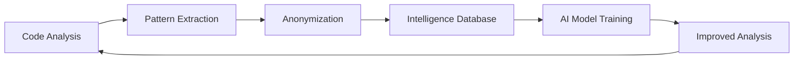

# Singularity Code Quality Service - Business Analysis

## 🎯 Value Proposition

**For Developers:**
- Advanced AI-powered code analysis (beyond traditional linters)
- Actionable recommendations for code quality, security, performance
- Integration with existing CI/CD pipelines
- Faster feedback loops and higher code quality

**For Your Business:**
- Intelligence from thousands of codebases to improve AI models
- Revenue stream from developer tools market
- Brand recognition in developer community
- Data for product development insights

## 📊 Market Opportunity

**Developer Tools Market:** $25B+ industry growing 15% YoY
- Static analysis tools: $2.5B segment
- AI-powered dev tools: Fastest growing category

**Competitive Landscape:**
- SonarQube/SonarCloud: $50M+ ARR, established but expensive
- DeepCode/CodeQL: Acquired by GitHub, limited scope
- Smaller players: Focus on specific languages/frameworks

**Your Differentiators:**
- Multi-language support (Rust, Elixir, JS/TS, Python, Java, Go)
- AI-powered pattern recognition and recommendations
- Intelligence collection for continuous improvement
- Competitive pricing with freemium model

## 💰 Revenue Model

### Freemium SaaS
- **Free:** 100 analyses/month, basic metrics
- **Developer:** $9/month (unlimited, advanced features)
- **Team:** $29/month (dashboard, integrations)
- **Enterprise:** Custom pricing

**Projected Revenue (Year 1):**
- 10K free users → 1K paid conversions (10%) → $108K MRR
- 50 enterprise customers → $500K+ ARR
- **Total ARR:** $600K+ (conservative estimate)

### Alternative Models
- **Per-repository pricing:** $5-20/month per repo
- **CI minutes:** Usage-based pricing
- **On-premise licensing:** For enterprises

## 🏗️ Technical Architecture

### Service Components
1. **Analysis Engine** (Your Rust code) - Core analysis logic
2. **API Gateway** - Request routing, authentication, rate limiting
3. **Queue System** - Async analysis processing (pgmq/ex_pgflow)
4. **Intelligence Pipeline** - Data collection and processing
5. **Web Dashboard** - User interface and reporting

### Deployment Options
- **Cloud SaaS:** AWS/GCP with auto-scaling
- **On-premise:** Docker containers for enterprise
- **Hybrid:** Cloud processing with on-premise data

### Intelligence Collection Pipeline

**Data Collected:**
- Framework/library usage patterns
- Architecture decisions
- Code quality metrics trends
- Technology adoption rates
- Common anti-patterns

**Privacy Protection:**
- SHA256 hashing of repository identifiers
- No source code storage
- Pattern-level analysis only
- Opt-in with clear consent

## 🚀 Go-to-Market Strategy

### Phase 1: MVP Launch (3 months)
- Core analysis features (quality metrics, basic recommendations)
- GitHub Actions integration
- Free tier + Developer plan
- Target: Developer community (GitHub, Reddit, Dev.to)

### Phase 2: Growth (6 months)
- Advanced AI recommendations
- Team features and dashboard
- Enterprise sales motion
- Integrations (GitLab, Bitbucket, Jenkins)

### Phase 3: Scale (12+ months)
- Multi-language expansion
- Custom rule engines
- White-label partnerships
- IPO preparation 😎

## ⚠️ Risks & Mitigation

### Technical Risks
- **Performance:** Rust engine should handle scale
- **Accuracy:** Continuous model improvement via intelligence loop
- **Security:** Code never leaves customer environment

### Business Risks
- **Competition:** Established players with bigger marketing budgets
- **Adoption:** Developer tools have high switching costs
- **Trust:** Privacy concerns with intelligence collection

**Mitigation:**
- Focus on underserved markets (Rust/Elixir developers)
- Transparent privacy practices
- Superior analysis quality through AI advantage
- Strong community engagement

## 🎯 Success Metrics

### Product Metrics
- Daily active analyses
- Analysis completion rate (>99%)
- User retention (paid plans)
- Intelligence data quality scores

### Business Metrics
- Monthly recurring revenue
- Customer acquisition cost
- Customer lifetime value
- Net revenue retention

### AI Metrics
- Analysis accuracy improvements
- New pattern detection rate
- False positive reduction
- User feedback scores

## 💡 Next Steps

1. **Technical Preparation (2 weeks)**
   - Extract CLI binary from existing Rust code
   - Create Docker containerization
   - Set up basic API endpoints

2. **Market Validation (2 weeks)**
   - Survey potential users on pain points
   - Test pricing sensitivity
   - Validate value proposition

3. **MVP Development (4 weeks)**
   - Build core service infrastructure
   - Create CI integrations
   - Implement billing and user management

4. **Soft Launch (2 weeks)**
   - Beta program with select users
   - Gather feedback and iterate
   - Prepare marketing materials

**Ready to disrupt the $25B developer tools market? 🚀**