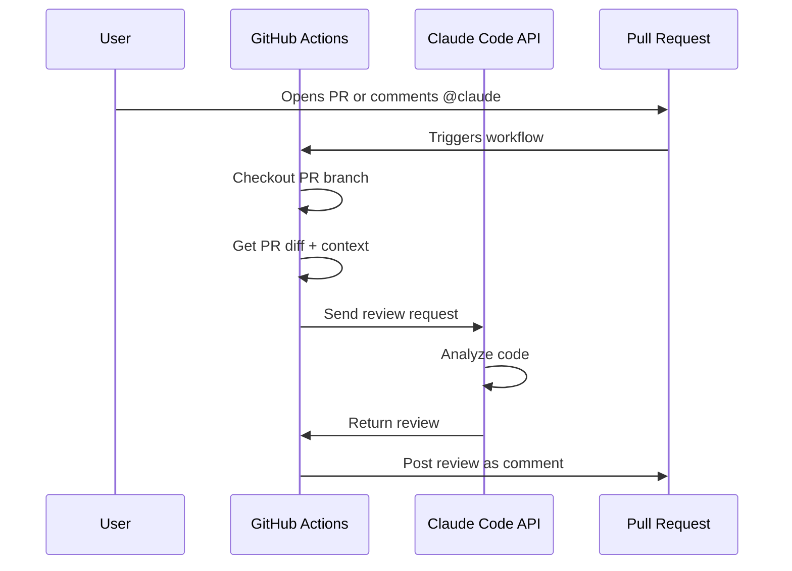
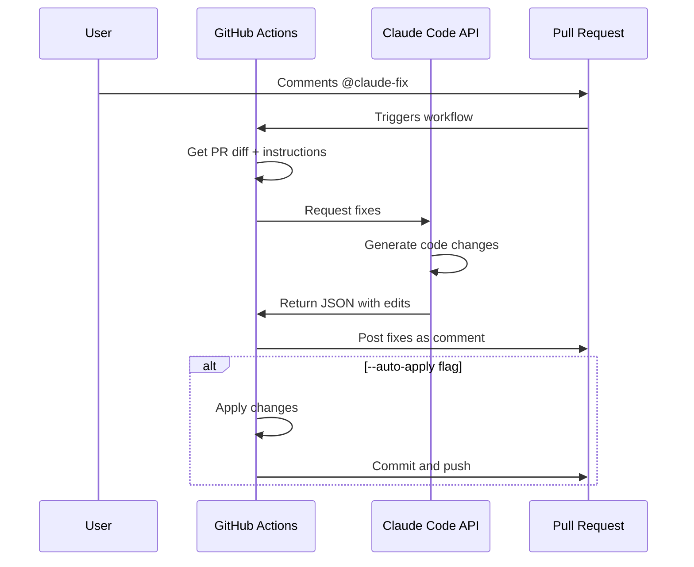

# Claude Code GitHub Workflows

Automated PR review and fixing using Claude Code via GitHub Actions.

## Setup

### 1. Required Secret

The `CLAUDE_CODE_OAUTH_TOKEN` secret must be set in GitHub Actions:

```bash
# Already set via:
gh secret set CLAUDE_CODE_OAUTH_TOKEN --body "sk-ant-oat01-..."
```

Verify it's set:
```bash
gh secret list | grep CLAUDE
```

### 2. Available Workflows

#### A. `claude-pr-review.yml` - Automatic PR Review

**Triggers:**
- When a PR is opened, updated, or reopened
- When someone comments `@claude` on a PR

**What it does:**
1. Gets the PR diff and context
2. Sends to Claude Code for review
3. Posts review as a comment with:
   - Code quality assessment
   - Architectural concerns
   - Specific suggestions
   - Approval status

**Usage:**

Automatic review on PR open:
```
# No action needed - reviews automatically
```

Request review via comment:
```
@claude Please review this PR and check for security issues
```

#### B. `claude-pr-fix.yml` - PR Auto-Fixing

**Triggers:**
- When someone comments `@claude-fix` on a PR

**What it does:**
1. Gets PR context and diff
2. Asks Claude Code to generate fixes
3. Posts fixes as a comment
4. Optionally auto-applies fixes if `--auto-apply` flag is used

**Usage:**

Request fix suggestions:
```
@claude-fix Please fix the template architecture violation mentioned in the review
```

Auto-apply fixes:
```
@claude-fix Fix the borrow checker errors --auto-apply
```

## Examples

### Example 1: Review PR #2

On PR #2, comment:
```
@claude Review this PR using the standards in docs/development/PR_2_REVIEW.md
```

Claude will:
1. Read the PR diff
2. Review against project standards
3. Post detailed review with code suggestions

### Example 2: Fix Template Architecture

On PR #2, comment:
```
@claude-fix Apply the fix documented in docs/development/PR_2_FIX_TEMPLATE_ARCHITECTURE.md
```

Claude will:
1. Read the fix instructions
2. Generate specific code changes
3. Post as a comment for manual review

Or auto-apply:
```
@claude-fix Apply the template architecture fix --auto-apply
```

### Example 3: Request Multiple Reviews

```
@claude Check for:
1. Architectural violations
2. Security issues
3. Performance problems
4. Test coverage
```

## Architecture

### How Reviews Work



### How Fixes Work



## Tool Integration

### Using `tools/claude-ai.ts`

Both workflows use the existing `tools/claude-ai.ts` wrapper:

```typescript
// tools/claude-ai.ts uses ai-sdk-provider-claude-code
import { claudeCode } from 'ai-sdk-provider-claude-code';

// No API key management needed - uses OAuth token
```

### Authentication

The workflows use `CLAUDE_CODE_OAUTH_TOKEN` which is:
- Stored in GitHub Actions secrets
- Passed as `CLAUDE_API_KEY` environment variable
- Used by `tools/claude-ai.ts` to authenticate

## Configuration

### Customize Review Depth

Edit `.github/workflows/claude-pr-review.yml`:

```yaml
# Change model for different analysis depth
model: "opus"  # More thorough but slower
model: "sonnet"  # Balanced (default)
```

### Customize Fix Behavior

Edit `.github/workflows/claude-pr-fix.yml`:

```yaml
# Enable auto-apply by default (remove --auto-apply requirement)
if: contains(github.event.comment.body, '@claude-fix')
# becomes:
if: contains(github.event.comment.body, '@claude-fix')
# and add auto-apply logic unconditionally
```

## Testing

### Test in Development

1. Create a test PR
2. Comment `@claude Review this for testing`
3. Check workflow runs in Actions tab
4. Verify comment appears on PR

### Local Testing

Test the Claude Code integration locally:

```bash
# Source .env to get token
source .env

# Test review
bun run tools/claude-ai.ts '{
  "model": "sonnet",
  "messages": [
    {"role": "user", "content": "Review this code: console.log(\"hello\")"}
  ]
}'
```

## Debugging

### Check Workflow Logs

```bash
# View recent workflow runs
gh run list --workflow=claude-pr-review.yml

# View specific run logs
gh run view <run-id> --log
```

### Check Secret

```bash
# Verify secret is set
gh secret list | grep CLAUDE

# Secret should show:
# CLAUDE_CODE_OAUTH_TOKEN	2025-10-05T16:07:37Z
```

### Common Issues

**1. "Missing CLAUDE_CODE_OAUTH_TOKEN"**
```bash
# Set the secret
gh secret set CLAUDE_CODE_OAUTH_TOKEN --body "$(jq -r '.claudeAiOauth.accessToken' ~/.claude/.credentials.json)"
```

**2. "tools/claude-ai.ts not found"**
```bash
# Ensure file exists and is executable
ls -la tools/claude-ai.ts
chmod +x tools/claude-ai.ts
```

**3. "Bun not found"**
```bash
# Workflows use Nix shell which includes bun
# Check flake.nix includes bun in webAndCli
```

## Limitations

### Current Limitations

1. **No direct file editing** - Fixes are posted as comments, not applied automatically (unless `--auto-apply`)
2. **No multi-file refactoring** - Works best for targeted fixes
3. **No test generation** - Focuses on reviewing/fixing existing code

### Future Enhancements

- [ ] Direct PR commits from Claude
- [ ] Multi-round conversations for complex fixes
- [ ] Integration with existing PR review bots (coderabbitai, qodo-merge-pro)
- [ ] Automatic test generation
- [ ] Performance benchmarking suggestions

## Security

### What's Safe

✅ Reviews are read-only
✅ Fixes require `--auto-apply` flag to commit
✅ All commits are clearly marked as bot-generated
✅ OAuth token has limited scope

### What to Watch

⚠️ Don't use `--auto-apply` on untrusted PRs
⚠️ Review Claude's suggestions before applying
⚠️ Token has access to your Claude account quota

## Integration with Existing Bots

The workflows work alongside existing PR bots:

- **coderabbitai**: Focused on general code review
- **qodo-merge-pro**: PR quality metrics
- **Claude Code**: Architectural review + fixes

All three can review the same PR without conflicts.

## Cost

Claude Code uses your Claude Pro/Team subscription:
- Reviews: ~2000-5000 tokens per PR
- Fixes: ~3000-8000 tokens per fix request

Typical usage: <10k tokens/day for moderate PR activity.

## Support

For issues with:
- **Workflows**: Check `.github/workflows/` files
- **Claude integration**: Check `tools/claude-ai.ts`
- **Authentication**: Check GitHub secrets

For questions, see:
- [PR Review Guide](PR_2_REVIEW.md)
- [Tool Setup](../deployment/DEPLOYMENT.md)
- [AI Server README](../../ai-server/README.md)
