# Code Review: PR #2 - Fix Rust compilation errors and prepare repository for release

**PR URL**: https://github.com/mikkihugo/singularity-incubation/pull/2
**Status**: OPEN
**Review Date**: 2025-10-05
**Reviewer**: Claude Code

---

## Executive Summary

This PR resolves compilation errors in 3 Rust crates (prompt-engine, tool-doc-index, linting-engine) bringing the workspace from 0% to 50% compilation success, and adds comprehensive development infrastructure. While the fixes are pragmatic and achieve the stated goal of release readiness, **there is a critical architectural violation** regarding template storage that needs to be addressed.

**Recommendation**: APPROVE with **mandatory architectural fix** before merge.

---

## Overview

### What the PR Does
- Fixes 35+ compilation errors across 3 Rust crates
- Creates GitHub Copilot configuration and automated setup workflow
- Adds development guidelines for the polyglot codebase
- Documents build status and remaining work

### Changes Breakdown
- **602 additions, 28 deletions**
- **3 crates fixed**: prompt-engine, tool-doc-index, linting-engine
- **3 crates remain broken**: analysis-suite, universal-parser, db-service (documented as future work)

---

## Code Quality Analysis

### ✅ Strengths

1. **Systematic Problem Solving**
   - Clear progression from 35+ errors to clean builds
   - Each fix is minimal and surgical
   - Good use of feature flags (`detection` feature)

2. **Proper Type Safety**
   - Fixed ambiguous float types: `.min()` → `f32::min()`
   - Resolved borrow checker issues with proper cloning
   - Added missing struct fields to match API expectations

3. **Infrastructure Improvements**
   - Comprehensive Copilot instructions covering Rust, Elixir, and Gleam
   - GitHub Actions workflow for automated environment setup
   - BUILD_STATUS.md documenting all crate states

4. **Pragmatic Approach**
   - Commented out problematic modules rather than leaving broken builds
   - Proper feature flags to enable/disable optional components
   - Clear documentation of what works and what doesn't

---

## ⚠️ Critical Issues

### 🚨 **ARCHITECTURAL VIOLATION: Template Source of Truth**

**Location**: `rust/prompt_engine/templates/sparc/*.prompt`

**The Problem**:

The PR creates 5 `.prompt` files to fix compilation errors in `template_performance_tracker.rs`:
- `architecture.prompt`
- `completion.prompt`
- `pseudocode.prompt`
- `refinement.prompt`
- `specification.prompt`

**Why This Is Wrong**:

1. **Violates Single Source of Truth Principle**

   The codebase has explicit architecture documented in [template_loader.rs:3-4](rust/prompt_engine/src/template_loader.rs#L3):
   ```rust
   //! Loads templates from tool_doc_index - the single source of truth!
   //! No duplication, just references.
   ```

2. **The Real Templates Already Exist**

   The actual templates are in `tool_doc_index/templates/workflows/sparc/*.json`:
   - `1-specification.json` - Rich metadata, AI signatures, structured workflows
   - `2-pseudocode.json`
   - `3-architecture.json`
   - `7-refinement.json`
   - `8-implementation.json`

3. **The Code Has a Guard Against This**

   [template_loader.rs:125-143](rust/prompt_engine/src/template_loader.rs#L125) has an explicit guard:
   ```rust
   pub fn ensure_single_source_of_truth() -> Result<()> {
       if templates_in_prompt_engine.exists() {
           return Err(anyhow::anyhow!(
               "Templates should be in tool_doc_index, not prompt_engine"
           ));
       }
       Ok(())
   }
   ```

4. **The Files Are Placeholders**

   All 5 `.prompt` files contain identical placeholder content - they're not real templates.

**The Root Cause**:

[template_performance_tracker.rs](rust/prompt_engine/src/template_performance_tracker.rs) uses legacy `include_str!()` macros to embed `.prompt` files at compile time. This is an outdated pattern that should use `TemplateLoader` instead.

**The Correct Fix**:

1. **Remove the `.prompt` files** - they violate architecture
2. **Update `template_performance_tracker.rs`** to use `TemplateLoader::new().load_template()`
3. **Or deprecate the module** if it's legacy code no longer in use

**Impact**:
- **Risk**: Medium - Creates technical debt and architectural confusion
- **Urgency**: Should be fixed before merge
- **Complexity**: Low - straightforward refactor

---

## Other Concerns & Suggestions

### 1. Commented-Out Code (HIGH PRIORITY)

**Locations**:
- [lib.rs](rust/tool_doc_index/src/lib.rs) - Multiple modules disabled
- [mod.rs](rust/tool_doc_index/src/templates/mod.rs) - Template submodules disabled
- [template.rs](rust/tool_doc_index/src/templates/template.rs) - Loader/selector disabled

**Modules Disabled**:
- `storage_template` - Type mismatches with current API
- `layered_detector` - Lifetime/borrow checker issues
- Template submodules (`selector`, `loader`, `context_builder`) - Mutable borrow issues
- `prompts` module - Depends on unavailable `prompt_engine` crate

**Risk**: Code rot - these will be forgotten over time

**Recommendation**:
- Create GitHub issues for each commented module with:
  - Specific compilation errors encountered
  - Dependencies needed to fix
  - Estimated complexity
  - Link to the PR that disabled them

### 2. Default Values May Be Semantically Incorrect

**Location**: [storage_template.rs](rust/tool_doc_index/src/storage_template.rs)

**Issue**: Added 13 `FactData` fields with defaults:
```rust
vec![],           // Empty vectors
"unknown",        // Unknown strings
0.0,             // Zero floats
```

**Risk**: Subtle bugs if these defaults don't match domain expectations

**Recommendation**: Add TODO comments explaining which defaults need validation:
```rust
// TODO: Verify these defaults match FACT system semantics
embedding: vec![], // Should this be a zero vector instead?
confidence: 0.0,   // Or should default be 0.5 (neutral)?
```

### 3. Struct Fields Added Without Usage

**Location**: [build.rs](rust/tool_doc_index/build.rs)

**Issue**: Template struct gained fields:
```rust
extends: Option<String>,
compose: Option<Vec<String>>,
workflows: Option<Vec<String>>,
```

**Question**: Are these used anywhere or just added to compile?

**Recommendation**:
- Document why they're optional
- Or implement the composition features they suggest

### 4. GitHub Workflow Missing Build Verification

**Location**: `.github/workflows/copilot-setup-steps.yml`

**Issue**: Extensive setup but only verifies command availability, not actual builds

**Recommendation**: Add build verification:
```yaml
- name: Verify Rust builds
  run: |
    nix develop .#dev -c cargo build -p prompt-engine --lib
    nix develop .#dev -c cargo build -p tool-doc-index --lib
    nix develop .#dev -c cargo build -p linting-engine --lib
```

### 5. SPARC Templates Are Placeholders

**Location**: All 5 `.prompt` files (which should be removed anyway)

**Issue**: If code actually tried to use these, results would be nonsensical

**Recommendation**: Since they should be removed, this is moot. The real JSON templates in `tool_doc_index` are properly structured.

---

## Architecture Diagrams

### Build Status Overview

```mermaid
graph TD
    A[Rust Workspace<br/>6 Crates Total] --> B[✅ prompt-engine<br/>0 errors]
    A --> C[✅ tool-doc-index<br/>0 errors]
    A --> D[✅ linting-engine<br/>0 errors]
    A --> E[❌ analysis-suite<br/>199 errors]
    A --> F[❌ universal-parser<br/>14 errors]
    A --> G[❌ db-service<br/>4 errors]

    B --> H{Release Ready}
    C --> H
    D --> H

    E --> I[Future Work]
    F --> I
    G --> I

    style B fill:#90EE90
    style C fill:#90EE90
    style D fill:#90EE90
    style E fill:#FFB6C6
    style F fill:#FFB6C6
    style G fill:#FFB6C6
    style H fill:#87CEEB
    style I fill:#FFE4B5
```



### Template Architecture: Current vs. Correct

```mermaid
graph LR
    subgraph "❌ CURRENT (PR #2)"
        A1[prompt_engine/<br/>template_performance_tracker.rs]
        A2[prompt_engine/templates/<br/>sparc/*.prompt]
        A3[tool_doc_index/<br/>templates/workflows/sparc/*.json]

        A1 -->|include_str!| A2
        A2 -.->|duplicates| A3
    end

    subgraph "✅ CORRECT ARCHITECTURE"
        B1[prompt_engine/<br/>template_performance_tracker.rs]
        B2[prompt_engine/<br/>template_loader.rs]
        B3[tool_doc_index/<br/>templates/workflows/sparc/*.json]

        B1 -->|uses| B2
        B2 -->|loads from| B3
    end

    style A2 fill:#FFB6C6
    style A3 fill:#87CEEB
    style B3 fill:#90EE90
```



### Dependency Fix Flow


### Copilot Setup Workflow

```mermaid
sequenceDiagram
    participant GH as GitHub Actions
    participant Nix as Nix Flake
    participant Cache as Cachix
    participant Env as Dev Environment

    GH->>Nix: Install Nix with flakes
    Nix->>Cache: Check for cached derivations
    Cache-->>Nix: Return cached builds
    Nix->>Env: nix develop .#dev

    Env->>Env: Install Elixir 1.20-dev
    Env->>Env: Install Gleam 1.12.0+
    Env->>Env: Install Rust stable
    Env->>Env: Install Just task runner

    Env->>GH: mix deps.get
    Env->>GH: gleam deps download
    GH->>GH: Verify commands available

    Note over GH: ⚠️ Missing: Build verification
```



---

## Security Considerations

- ✅ No secrets or credentials exposed
- ✅ Dependencies from standard registries
- ✅ No unsafe code introduced
- ✅ No elevation of privileges

---

## Testing Assessment

**What's Tested**:
- ✅ Manual verification of 3 crate builds documented

**What's Missing**:
- ❌ No automated tests added
- ❌ No regression tests for the 35+ fixed errors
- ❌ No CI build verification

**Recommendation**:
Add minimal smoke tests in CI:
```rust
#[test]
fn test_prompt_engine_compiles() {
    // Just importing the crate is a smoke test
    use prompt_engine::*;
}
```

---

## Performance Implications

- **Neutral**: Changes are structural fixes, not algorithmic
- Feature flags properly allow conditional compilation
- No performance regressions expected

---

## Documentation Quality

### Excellent
- ✅ BUILD_STATUS.md - Clear status of all crates
- ✅ Copilot instructions - Comprehensive polyglot guide
- ✅ GitHub workflow - Well-commented YAML

### Could Be Improved
- ⚠️ No explanation of why certain defaults were chosen
- ⚠️ No migration guide for commented-out modules
- ⚠️ Template architecture principles not documented (should reference template_loader.rs comments)

---

## Recommendations

### Before Merge (MANDATORY)

1. **🚨 Fix Template Architecture Violation**
   - Remove `rust/prompt_engine/templates/sparc/*.prompt` files
   - Update `template_performance_tracker.rs` to use `TemplateLoader`
   - OR mark the module as deprecated if it's legacy code
   - Run the `ensure_single_source_of_truth()` guard in tests

2. **Create GitHub Issues for Commented Modules**
   - One issue per disabled module
   - Include specific error messages
   - Estimate complexity and dependencies

### After Merge (RECOMMENDED)

1. **Add Build Verification to CI**
   - Update copilot-setup-steps.yml with actual cargo builds
   - Add smoke tests for the fixed crates

2. **Document Default Value Decisions**
   - Add TODO comments explaining which defaults need review
   - Create issue to validate FactData defaults against FACT system semantics

3. **Implement or Remove Unused Struct Fields**
   - Either use `extends`, `compose`, `workflows` fields
   - Or document why they're optional placeholders

4. **Create Migration Plan**
   - Roadmap for fixing the 3 non-compiling crates
   - Prioritization based on actual usage

---

## Final Verdict

**APPROVE with mandatory architectural fix** ✅ (after template violation addressed)

The PR successfully achieves its goal of making the repository release-ready by fixing critical compilation errors. The approach is pragmatic and well-documented. However, the `.prompt` files create technical debt that violates established architectural principles and must be addressed.

**Risk Level**: Medium (due to architectural violation)
**Complexity to Fix**: Low (straightforward refactor)
**Impact**: High (fixes 50% of workspace, enables release)

---

## Action Items

### For PR Author

- [ ] Remove `rust/prompt_engine/templates/sparc/*.prompt` files
- [ ] Update `template_performance_tracker.rs` to use `TemplateLoader` instead of `include_str!()`
- [ ] Add build verification to `.github/workflows/copilot-setup-steps.yml`
- [ ] Create issues for each commented-out module

### For Reviewers

- [ ] Verify template architecture fix is correct
- [ ] Confirm no other instances of template duplication
- [ ] Check that guard function `ensure_single_source_of_truth()` passes

### For Project

- [ ] Document template architecture principles in main README
- [ ] Add architectural decision record (ADR) for single-source-of-truth pattern
- [ ] Consider adding pre-commit hook that runs `ensure_single_source_of_truth()`

---

## References

- **PR URL**: https://github.com/mikkihugo/singularity-incubation/pull/2
- **Template Loader**: [rust/prompt_engine/src/template_loader.rs](rust/prompt_engine/src/template_loader.rs)
- **Template Source of Truth**: [rust/tool_doc_index/templates/](rust/tool_doc_index/templates/)
- **Build Status**: [rust/BUILD_STATUS.md](rust/BUILD_STATUS.md)
