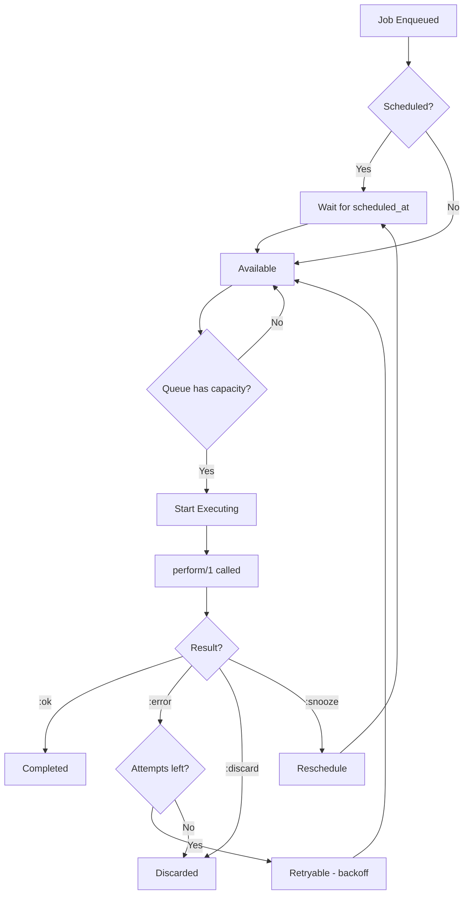

# Oban Jobs Integration Guide

Complete guide for creating, running, and managing background jobs with Oban in Singularity.

## Table of Contents

1. [Overview](#overview)
2. [When to Use Oban vs Quantum](#when-to-use-oban-vs-quantum)
3. [Creating Oban Workers](#creating-oban-workers)
4. [Job Lifecycle](#job-lifecycle)
5. [Error Handling & Retries](#error-handling--retries)
6. [Queue Configuration](#queue-configuration)
7. [Scheduling Jobs](#scheduling-jobs)
8. [Testing Oban Jobs](#testing-oban-jobs)
9. [Monitoring & Debugging](#monitoring--debugging)
10. [Production Best Practices](#production-best-practices)

---

## Overview

**Oban** is a persistent job queue for Elixir applications that provides:

- ✅ **Persistent storage** - Jobs survive app restarts (stored in PostgreSQL)
- ✅ **Automatic retries** - Configurable retry logic with exponential backoff
- ✅ **Concurrency control** - Limit concurrent jobs per queue
- ✅ **Rate limiting** - Throttle job execution
- ✅ **Job history** - Query past executions, failures, and metrics
- ✅ **Priority queues** - Multiple queues with different concurrency settings
- ✅ **Scheduling** - Delayed execution and recurring jobs

**Architecture:**

```
Elixir Code
    ↓ (enqueue job)
Oban.insert(job)
    ↓
PostgreSQL (oban_jobs table)
    ↓ (Oban polls for jobs)
Oban Worker executes
    ↓
Success → Job deleted | Failure → Retry or discard
```

---

## When to Use Oban vs Quantum

### Use Oban For:

✅ **Long-running tasks** that might fail and need retry logic
- ML model training (30+ minutes)
- Large-scale pattern mining (analyzing thousands of files)
- External API integrations (npm/cargo/pypi sync)
- Complex multi-step workflows

✅ **Jobs that must survive restarts**
- Critical business logic
- Jobs triggered by user actions
- Jobs with SLAs or guarantees

✅ **Jobs needing history/audit trail**
- Compliance requirements
- Debugging production issues
- Performance analysis

### Use Quantum For:

✅ **Fast, periodic maintenance** (< 1 minute execution)
- Cache cleanup
- Pattern synchronization
- Health checks
- Statistics aggregation

✅ **Fire-and-forget tasks** that don't need retry logic
- Logging
- Metrics collection
- Simple scheduled operations

### Current Usage:

| System | Oban Queues | Quantum Jobs |
|--------|-------------|--------------|
| **Singularity** | `training`, `maintenance`, `default` | Cache cleanup, pattern sync |
| **Centralcloud** | `aggregation`, `sync`, `default` | Pattern aggregation, package sync, statistics |

---

## Creating Oban Workers

### Basic Worker Structure

All Oban workers follow this pattern:

```elixir
defmodule MyApp.Jobs.MyWorker do
  @moduledoc """
  Background job for [purpose].

  ## Job Arguments

  - `argument_name` - Description

  ## Retry Policy

  - Max attempts: [N]
  - Backoff: [exponential/linear]
  - Timeout: [seconds]

  ## Queue

  Runs in `[queue_name]` queue with concurrency [N].
  """

  use Oban.Worker,
    queue: :default,        # Which queue (see config)
    max_attempts: 5,        # Retry up to 5 times
    priority: 0,            # Lower = higher priority (0-9)
    unique: [              # Prevent duplicate jobs
      period: 60,          # Within 60 seconds
      states: [:available, :scheduled, :executing]
    ]

  require Logger

  @impl Oban.Worker
  def perform(%Oban.Job{args: args}) do
    Logger.info("Starting MyWorker job", args: args)

    case do_work(args) do
      :ok ->
        Logger.info("MyWorker job completed successfully")
        :ok

      {:error, reason} ->
        Logger.error("MyWorker job failed", reason: inspect(reason))
        {:error, reason}  # Will be retried automatically
    end
  end

  defp do_work(args) do
    # Your job logic here
    :ok
  end
end
```

### Worker Options

```elixir
use Oban.Worker,
  # Queue Configuration
  queue: :default,              # Queue name (from config)

  # Retry Configuration
  max_attempts: 20,             # Retry up to 20 times (default: 20)

  # Priority (0 = highest, 9 = lowest)
  priority: 0,                  # Execute before higher numbers

  # Uniqueness (prevent duplicates)
  unique: [
    period: 60,                 # Within 60 seconds
    states: [:available, :scheduled, :executing],
    keys: [:user_id]            # Only these args matter for uniqueness
  ],

  # Tags (for filtering/monitoring)
  tags: ["ml", "training"],

  # Replace existing job with same uniqueness
  replace: [                    # Instead of ignoring duplicates
    scheduled: true,            # Replace scheduled jobs
    states: [:available, :scheduled]
  ]
```

### Example: ML Training Worker

```elixir
defmodule Singularity.Jobs.TrainModelJob do
  @moduledoc """
  Background job for training ML models on codebase patterns.

  ## Job Arguments

  - `model_type` - Type of model (t5, code_llama, etc.)
  - `codebase_path` - Path to codebase for training
  - `config` - Training configuration map

  ## Retry Policy

  - Max attempts: 3 (GPU training is expensive)
  - Backoff: exponential (60s, 120s, 240s)
  - Timeout: 3600s (1 hour)

  ## Queue

  Runs in `training` queue with concurrency 1 (GPU constraint).
  """

  use Oban.Worker,
    queue: :training,
    max_attempts: 3,
    priority: 0,
    unique: [period: 3600, keys: [:model_type, :codebase_path]]

  require Logger

  @impl Oban.Worker
  def perform(%Oban.Job{args: %{"model_type" => model_type, "codebase_path" => path}}) do
    Logger.info("Starting model training", model_type: model_type, path: path)

    # Check GPU availability
    case check_gpu_available() do
      {:ok, gpu_id} ->
        train_model(model_type, path, gpu_id)

      {:error, :no_gpu} ->
        # Snooze job for 5 minutes and retry
        {:snooze, 300}
    end
  end

  defp train_model(model_type, path, gpu_id) do
    # Your training logic here
    # Return :ok, {:error, reason}, or {:snooze, seconds}
    :ok
  end

  defp check_gpu_available do
    # Check NVIDIA GPU status
    case System.cmd("nvidia-smi", ["--query-gpu=index", "--format=csv,noheader"]) do
      {output, 0} -> {:ok, String.trim(output)}
      _ -> {:error, :no_gpu}
    end
  end
end
```

### Example: Package Sync Worker

```elixir
defmodule Centralcloud.Jobs.SyncPackageWorker do
  @moduledoc """
  Background job for syncing a single package from external registry.

  ## Job Arguments

  - `ecosystem` - npm, cargo, hex, or pypi
  - `package_name` - Name of package to sync
  - `force_refresh` - Skip cache and re-fetch (optional)

  ## Retry Policy

  - Max attempts: 10 (external APIs can be flaky)
  - Backoff: exponential with jitter
  - Timeout: 300s (5 minutes)

  ## Queue

  Runs in `sync` queue with concurrency 1 (rate limit external APIs).
  """

  use Oban.Worker,
    queue: :sync,
    max_attempts: 10,
    priority: 1,
    unique: [period: 3600, keys: [:ecosystem, :package_name]]

  require Logger
  alias Centralcloud.PackageRegistry

  @impl Oban.Worker
  def perform(%Oban.Job{
    args: %{"ecosystem" => ecosystem, "package_name" => name},
    attempt: attempt
  }) do
    Logger.info("Syncing package", ecosystem: ecosystem, name: name, attempt: attempt)

    case PackageRegistry.sync_package(ecosystem, name) do
      {:ok, package} ->
        Logger.info("Package synced successfully", package: name)
        :ok

      {:error, :rate_limited} ->
        # Exponential backoff: 2^attempt seconds
        backoff = :math.pow(2, attempt) |> round()
        Logger.warning("Rate limited, snoozing for #{backoff}s")
        {:snooze, backoff}

      {:error, :not_found} ->
        # Don't retry if package doesn't exist
        Logger.error("Package not found: #{name}")
        {:discard, :not_found}

      {:error, reason} ->
        # Retry with automatic backoff
        Logger.error("Package sync failed", reason: inspect(reason))
        {:error, reason}
    end
  end
end
```

---

## Job Lifecycle

### 1. Job States

```
ENQUEUED → AVAILABLE → EXECUTING → COMPLETED/DISCARDED/RETRYABLE
    ↓          ↓            ↓              ↓
scheduled  ready to   running       final state
           execute
```

**States:**
- `scheduled` - Waiting for scheduled_at time
- `available` - Ready to execute
- `executing` - Currently running
- `completed` - Finished successfully
- `discarded` - Failed permanently (max attempts or discard)
- `retryable` - Failed but will retry
- `cancelled` - Manually cancelled

### 2. Enqueuing Jobs

#### Basic Enqueue

```elixir
# Enqueue immediately
{:ok, job} = MyApp.Jobs.MyWorker.new(%{arg: "value"})
|> Oban.insert()

# Check job status
job.id          # => 123
job.state       # => "available"
job.queue       # => "default"
job.max_attempts # => 20
```

#### Scheduled Execution

```elixir
# Run in 5 minutes
MyApp.Jobs.MyWorker.new(%{arg: "value"}, scheduled_at: DateTime.add(DateTime.utc_now(), 300))
|> Oban.insert()

# Run at specific time
MyApp.Jobs.MyWorker.new(%{arg: "value"}, scheduled_at: ~U[2025-01-01 00:00:00Z])
|> Oban.insert()
```

#### Custom Options

```elixir
MyApp.Jobs.MyWorker.new(
  %{arg: "value"},
  queue: :custom_queue,
  priority: 2,
  max_attempts: 10,
  scheduled_at: DateTime.add(DateTime.utc_now(), 60),
  tags: ["important", "user-requested"]
)
|> Oban.insert()
```

#### Bulk Insert

```elixir
jobs = Enum.map(1..100, fn i ->
  MyApp.Jobs.MyWorker.new(%{user_id: i})
end)

Oban.insert_all(jobs)
```

### 3. Execution Flow



### 4. Return Values

```elixir
@impl Oban.Worker
def perform(%Oban.Job{args: args}) do
  # Success - job completed
  :ok

  # Failure - will retry with backoff
  {:error, "Something went wrong"}

  # Discard - don't retry, mark as failed
  {:discard, "Invalid input, cannot retry"}

  # Snooze - reschedule for later (seconds)
  {:snooze, 300}  # Try again in 5 minutes

  # Cancel - cancel all jobs in this uniqueness group
  {:cancel, "User cancelled"}
end
```

---

## Error Handling & Retries

### Automatic Retries

Oban automatically retries jobs that return `{:error, reason}`:

```elixir
def perform(%Oban.Job{args: args, attempt: attempt}) do
  Logger.info("Attempt #{attempt}/#{max_attempts}")

  case risky_operation(args) do
    :ok -> :ok
    {:error, reason} ->
      # Will retry automatically with exponential backoff
      {:error, reason}
  end
end
```

**Default Backoff:** Exponential with jitter
- Attempt 1: 0 seconds (immediate)
- Attempt 2: 16 seconds
- Attempt 3: 31 seconds
- Attempt 4: 46 seconds
- Attempt 5+: 61 seconds

### Custom Backoff

```elixir
use Oban.Worker,
  max_attempts: 10,
  backoff: fn attempt ->
    # Linear backoff: attempt * 60 seconds
    attempt * 60
  end
```

### Handling Different Errors

```elixir
def perform(%Oban.Job{args: args}) do
  case do_work(args) do
    :ok ->
      :ok

    {:error, :rate_limited} ->
      # Wait longer before retrying
      {:snooze, 600}

    {:error, :invalid_input} ->
      # Don't retry - data is bad
      {:discard, :invalid_input}

    {:error, :temporary_failure} ->
      # Retry with standard backoff
      {:error, :temporary_failure}

    {:error, :critical_failure} ->
      # Alert and discard
      alert_ops("Critical failure in job")
      {:discard, :critical_failure}
  end
end
```

### Timeouts

```elixir
use Oban.Worker,
  max_attempts: 5,
  timeout: :timer.minutes(30)  # Kill job after 30 minutes

def perform(%Oban.Job{args: args}) do
  # If this takes > 30 minutes, Oban will kill the process
  # and mark the job as failed (will retry)
  long_running_operation(args)
end
```

### Manual Retry Logic

```elixir
def perform(%Oban.Job{args: args, attempt: attempt}) do
  case attempt do
    1 -> try_primary_service(args)
    2 -> try_backup_service(args)
    3 -> try_tertiary_service(args)
    _ -> {:discard, "All services failed"}
  end
end
```

---

## Queue Configuration

### Queue Setup

Queues are configured in `config/config.exs`:

```elixir
# Singularity queues
config :singularity, Oban,
  repo: Singularity.Repo,
  queues: [
    # ML training - GPU constraint (only 1 concurrent job)
    training: [
      concurrency: 1,
      rate_limit: [allowed: 1, period: 60]
    ],

    # Maintenance - cache cleanup, pattern sync
    maintenance: [
      concurrency: 3,
      paused: false
    ],

    # Default - general background work
    default: [
      concurrency: 10,
      rate_limit: [allowed: 50, period: 60]  # 50 jobs/minute
    ],

    # Low priority - can be paused during high load
    low_priority: [
      concurrency: 2,
      paused: true  # Start paused
    ]
  ],
  plugins: [
    {Oban.Plugins.Pruner, max_age: 60 * 60 * 24 * 7},  # Prune after 7 days
    {Oban.Plugins.Stalled, interval: 60}                # Check for stalled jobs every 60s
  ]
```

### Queue Priority

Jobs with **lower priority numbers** execute first:

```elixir
# Priority 0 - highest (executes first)
MyWorker.new(%{urgent: true}, priority: 0)

# Priority 5 - medium
MyWorker.new(%{normal: true}, priority: 5)

# Priority 9 - lowest (executes last)
MyWorker.new(%{background: true}, priority: 9)
```

### Controlling Queues at Runtime

```elixir
# Pause a queue (stop processing)
Oban.pause_queue(queue: :training)

# Resume a queue
Oban.resume_queue(queue: :training)

# Scale queue concurrency
Oban.scale_queue(queue: :default, concurrency: 20)

# Pause all queues
Oban.pause_all_queues()

# Resume all queues
Oban.resume_all_queues()
```

---

## Scheduling Jobs

### One-Time Delayed Jobs

```elixir
# Run in 5 minutes
MyWorker.new(%{task: "cleanup"}, scheduled_at: DateTime.add(DateTime.utc_now(), 300))
|> Oban.insert()

# Run at midnight
midnight = DateTime.new!(Date.utc_today(), ~T[00:00:00])
MyWorker.new(%{task: "daily_report"}, scheduled_at: midnight)
|> Oban.insert()
```

### Recurring Jobs (with Quantum)

For **recurring jobs**, use **Quantum** to enqueue Oban jobs:

```elixir
# config/config.exs
config :my_app, MyApp.Scheduler,
  jobs: [
    # Every hour: enqueue Oban job for heavy processing
    {"0 * * * *", fn ->
      MyApp.Jobs.HeavyWorker.new(%{type: "hourly"})
      |> Oban.insert()
    end}
  ]
```

### Cron-Style Oban Jobs (Pro)

**Note:** Requires [Oban Pro](https://getoban.pro/) for `Oban.Plugins.Cron`

```elixir
# config/config.exs
config :my_app, Oban,
  plugins: [
    {Oban.Plugins.Cron,
     crontab: [
       {"0 * * * *", MyApp.Jobs.HourlyWorker},
       {"0 0 * * *", MyApp.Jobs.DailyWorker}
     ]}
  ]
```

---

## Testing Oban Jobs

### Test Configuration

```elixir
# config/test.exs
config :my_app, Oban,
  testing: :manual,  # Don't run jobs automatically in tests
  queues: false,     # Disable all queues
  plugins: false     # Disable all plugins
```

### Testing Job Enqueueing

```elixir
defmodule MyApp.Jobs.MyWorkerTest do
  use MyApp.DataCase, async: true
  use Oban.Testing, repo: MyApp.Repo

  alias MyApp.Jobs.MyWorker

  test "enqueues job with correct args" do
    {:ok, job} = MyWorker.new(%{user_id: 123}) |> Oban.insert()

    # Check job was enqueued
    assert job.queue == "default"
    assert job.args == %{"user_id" => 123}
    assert job.worker == "MyApp.Jobs.MyWorker"
  end

  test "job is unique within period" do
    {:ok, job1} = MyWorker.new(%{user_id: 123}) |> Oban.insert()
    {:ok, job2} = MyWorker.new(%{user_id: 123}) |> Oban.insert()

    # Second job should be discarded due to uniqueness
    assert job1.id == job2.id
  end
end
```

### Testing Job Execution

```elixir
test "job performs work successfully" do
  # Manually execute the job
  :ok = perform_job(MyWorker, %{user_id: 123})

  # Verify side effects
  assert_received {:email_sent, 123}
end

test "job retries on error" do
  # Execute and expect failure
  assert {:error, :api_down} = perform_job(MyWorker, %{user_id: 123})

  # Job should be retried
  assert_enqueued worker: MyWorker, args: %{user_id: 123}
end

test "job handles snooze" do
  assert {:snooze, 60} = perform_job(MyWorker, %{rate_limited: true})
end
```

### Integration Tests

```elixir
test "job processes successfully end-to-end", %{conn: conn} do
  # Trigger action that enqueues job
  post(conn, "/api/trigger")

  # Assert job was enqueued
  assert_enqueued worker: MyWorker

  # Drain the queue (execute all jobs)
  Oban.drain_queue(queue: :default)

  # Verify final state
  assert MyApp.get_result() == :success
end
```

---

## Monitoring & Debugging

### Query Jobs

```elixir
import Ecto.Query
alias MyApp.Repo

# Get all available jobs
Repo.all(from j in Oban.Job, where: j.state == "available")

# Get failed jobs
Repo.all(from j in Oban.Job, where: j.state == "discarded")

# Get jobs for specific worker
Repo.all(from j in Oban.Job, where: j.worker == "MyApp.Jobs.MyWorker")

# Get executing jobs
Repo.all(from j in Oban.Job, where: j.state == "executing")

# Count jobs by state
Repo.all(
  from j in Oban.Job,
  group_by: j.state,
  select: {j.state, count(j.id)}
)
```

### Cancel Jobs

```elixir
# Cancel a specific job
Oban.cancel_job(job_id)

# Cancel all jobs matching criteria
from(j in Oban.Job, where: j.worker == "MyWorker" and j.state == "available")
|> Repo.all()
|> Enum.each(&Oban.cancel_job/1)
```

### Retry Failed Jobs

```elixir
# Retry a specific failed job
failed_job = Repo.get(Oban.Job, 123)
Oban.retry_job(failed_job)

# Retry all discarded jobs for a worker
from(j in Oban.Job,
  where: j.worker == "MyWorker" and j.state == "discarded"
)
|> Repo.all()
|> Enum.each(&Oban.retry_job/1)
```

### Telemetry Events

```elixir
# Attach telemetry handler
:telemetry.attach_many(
  "oban-logger",
  [
    [:oban, :job, :start],
    [:oban, :job, :stop],
    [:oban, :job, :exception]
  ],
  &handle_oban_event/4,
  nil
)

def handle_oban_event([:oban, :job, :start], measurements, metadata, _config) do
  Logger.info("Job started",
    worker: metadata.worker,
    queue: metadata.queue,
    attempt: metadata.attempt
  )
end

def handle_oban_event([:oban, :job, :stop], measurements, metadata, _config) do
  Logger.info("Job completed",
    worker: metadata.worker,
    duration_ms: measurements.duration / 1_000_000
  )
end

def handle_oban_event([:oban, :job, :exception], measurements, metadata, _config) do
  Logger.error("Job failed",
    worker: metadata.worker,
    error: metadata.error,
    stacktrace: metadata.stacktrace
  )
end
```

### Oban Web (Pro)

[Oban Web](https://getoban.pro/docs/pro/web.html) provides a web dashboard for monitoring:

- Queue status and concurrency
- Job history and metrics
- Failed jobs with error details
- Retry failed jobs from UI
- Pause/resume queues

---

## Production Best Practices

### 1. Set Appropriate Timeouts

```elixir
use Oban.Worker,
  timeout: :timer.minutes(10)  # Adjust based on expected duration

def perform(%Oban.Job{}) do
  # If job takes > 10 minutes, it will be killed and retried
  # Set timeout higher than expected max duration
end
```

### 2. Idempotent Jobs

Jobs should be **idempotent** (safe to run multiple times):

```elixir
def perform(%Oban.Job{args: %{"user_id" => user_id}}) do
  # ❌ BAD: Creates duplicate records
  Repo.insert(%User{id: user_id, ...})

  # ✅ GOOD: Upserts (insert or update)
  Repo.insert(%User{id: user_id, ...},
    on_conflict: {:replace_all_except, [:id, :inserted_at]},
    conflict_target: :id
  )
end
```

### 3. Small Job Arguments

Keep `args` **small** (they're stored in PostgreSQL):

```elixir
# ❌ BAD: Storing large data in args
MyWorker.new(%{large_data: File.read!("huge.json")})

# ✅ GOOD: Store reference, fetch in worker
MyWorker.new(%{file_path: "huge.json"})

def perform(%Oban.Job{args: %{"file_path" => path}}) do
  data = File.read!(path)
  process(data)
end
```

### 4. Use Uniqueness to Prevent Duplicates

```elixir
use Oban.Worker,
  unique: [
    period: 3600,  # Within 1 hour
    keys: [:user_id, :action],  # Only these args matter
    states: [:available, :scheduled, :executing]
  ]

# Only one job per user per hour
MyWorker.new(%{user_id: 123, action: "sync", extra: "data"})
```

### 5. Monitor Queue Depth

```elixir
# Alert if queue depth exceeds threshold
def check_queue_depth do
  depth = Repo.aggregate(
    from(j in Oban.Job, where: j.queue == "training" and j.state == "available"),
    :count
  )

  if depth > 100 do
    alert_ops("Training queue depth: #{depth}")
  end
end
```

### 6. Graceful Degradation

```elixir
def perform(%Oban.Job{args: args, attempt: attempt}) do
  case attempt do
    # Try premium service first
    1 -> process_with_service(:premium, args)

    # Fall back to standard service
    2..3 -> process_with_service(:standard, args)

    # Last resort: basic processing
    _ -> process_with_service(:basic, args)
  end
end
```

### 7. Use Tags for Organization

```elixir
MyWorker.new(%{task: "sync"}, tags: ["critical", "user-123", "api-v2"])
|> Oban.insert()

# Query by tags
from(j in Oban.Job, where: "critical" in j.tags)
|> Repo.all()
```

### 8. Database Connection Pool

Ensure Oban has enough database connections:

```elixir
# config/prod.exs
config :my_app, MyApp.Repo,
  # Oban needs connections: sum of all queue concurrencies + overhead
  # training(1) + maintenance(3) + default(10) + overhead(6) = 20
  pool_size: 20
```

### 9. Pruning Old Jobs

```elixir
# config/config.exs
config :my_app, Oban,
  plugins: [
    # Delete completed/discarded jobs after 7 days
    {Oban.Plugins.Pruner,
      max_age: 60 * 60 * 24 * 7,
      limit: 1000
    }
  ]
```

### 10. Error Reporting

```elixir
use Oban.Worker

def perform(%Oban.Job{args: args}) do
  case do_work(args) do
    :ok -> :ok
    {:error, reason} ->
      # Report to error tracking service
      Sentry.capture_exception(
        %RuntimeError{message: "Job failed: #{inspect(reason)}"},
        extra: %{args: args, worker: __MODULE__}
      )
      {:error, reason}
  end
end
```

---

## Example: Complete Production Worker

```elixir
defmodule Singularity.Jobs.PatternMiningJob do
  @moduledoc """
  Background job for mining code patterns from large codebases.

  ## Job Arguments

  - `codebase_path` - Path to codebase to analyze
  - `pattern_types` - List of pattern types to extract
  - `min_confidence` - Minimum confidence threshold (0.0-1.0)

  ## Retry Policy

  - Max attempts: 5
  - Backoff: exponential with jitter
  - Timeout: 1800s (30 minutes)

  ## Queue

  Runs in `maintenance` queue with concurrency 3.

  ## Idempotency

  Safe to run multiple times - uses upsert for pattern storage.
  """

  use Oban.Worker,
    queue: :maintenance,
    max_attempts: 5,
    priority: 1,
    timeout: :timer.minutes(30),
    unique: [
      period: :timer.hours(1),
      keys: [:codebase_path],
      states: [:available, :scheduled, :executing]
    ],
    tags: ["pattern-mining", "ml"]

  require Logger
  alias Singularity.PatternMiner
  alias Singularity.Repo

  @impl Oban.Worker
  def perform(%Oban.Job{
    args: %{
      "codebase_path" => path,
      "pattern_types" => types,
      "min_confidence" => min_conf
    },
    attempt: attempt,
    id: job_id
  }) do
    Logger.info("Starting pattern mining",
      job_id: job_id,
      attempt: attempt,
      path: path
    )

    with {:ok, _exists} <- validate_codebase_exists(path),
         {:ok, patterns} <- mine_patterns(path, types, min_conf),
         {:ok, _stored} <- store_patterns(patterns) do
      Logger.info("Pattern mining completed",
        job_id: job_id,
        patterns_found: length(patterns)
      )
      :ok
    else
      {:error, :not_found} ->
        Logger.error("Codebase not found: #{path}")
        {:discard, :codebase_not_found}

      {:error, :invalid_path} ->
        Logger.error("Invalid codebase path: #{path}")
        {:discard, :invalid_path}

      {:error, :rate_limited} ->
        backoff = calculate_backoff(attempt)
        Logger.warning("Rate limited, snoozing for #{backoff}s")
        {:snooze, backoff}

      {:error, reason} ->
        Logger.error("Pattern mining failed",
          job_id: job_id,
          reason: inspect(reason)
        )

        # Report to error tracking
        report_error(reason, %{path: path, attempt: attempt})

        # Retry
        {:error, reason}
    end
  end

  defp validate_codebase_exists(path) do
    if File.dir?(path) do
      {:ok, true}
    else
      {:error, :not_found}
    end
  end

  defp mine_patterns(path, types, min_conf) do
    PatternMiner.extract_patterns(path,
      pattern_types: types,
      min_confidence: min_conf,
      timeout: :timer.minutes(20)
    )
  end

  defp store_patterns(patterns) do
    # Idempotent: upsert patterns
    Enum.reduce_while(patterns, {:ok, []}, fn pattern, {:ok, acc} ->
      case Repo.insert(pattern,
        on_conflict: {:replace_all_except, [:id, :inserted_at]},
        conflict_target: [:pattern_hash]
      ) do
        {:ok, stored} -> {:cont, {:ok, [stored | acc]}}
        {:error, reason} -> {:halt, {:error, reason}}
      end
    end)
  end

  defp calculate_backoff(attempt) do
    # Exponential backoff with jitter: 2^attempt * (1 + random(0-0.3))
    base = :math.pow(2, attempt) |> round()
    jitter = :rand.uniform() * 0.3
    round(base * (1 + jitter))
  end

  defp report_error(reason, metadata) do
    Sentry.capture_exception(
      %RuntimeError{message: "Pattern mining failed: #{inspect(reason)}"},
      extra: metadata
    )
  end
end
```

---

## Summary

**Oban Checklist:**

- ✅ Use Oban for long-running, critical jobs that need retries
- ✅ Use Quantum for fast, periodic maintenance tasks
- ✅ Set appropriate `max_attempts`, `timeout`, and `backoff`
- ✅ Make jobs idempotent (safe to run multiple times)
- ✅ Use `unique` to prevent duplicate jobs
- ✅ Return `:ok`, `{:error, reason}`, `{:discard, reason}`, or `{:snooze, seconds}`
- ✅ Keep job arguments small (< 1KB)
- ✅ Configure queue concurrency based on resources
- ✅ Use tags for organization and filtering
- ✅ Monitor queue depth and job failures
- ✅ Prune old jobs regularly
- ✅ Test jobs with `Oban.Testing`
- ✅ Report errors to tracking service

**Further Reading:**

- [Oban Documentation](https://hexdocs.pm/oban/)
- [Oban Pro](https://getoban.pro/) (Web UI, Cron, Workers)
- [Background Jobs Guide](./BACKGROUND_JOBS_GUIDE.md) (Quantum vs Oban)
