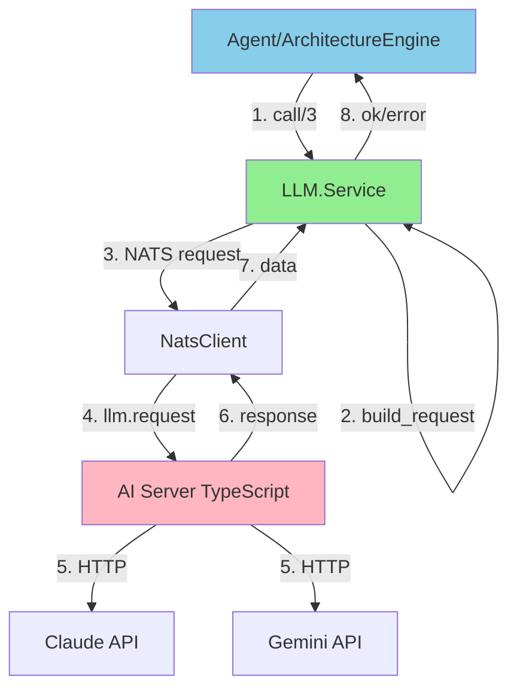
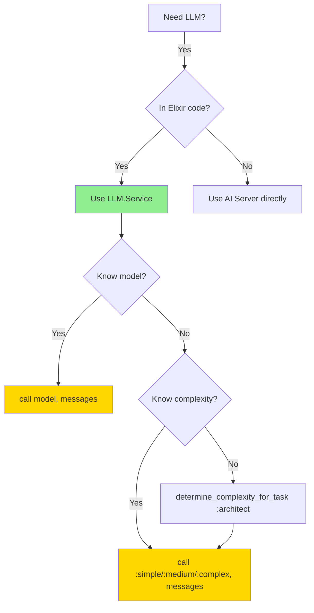
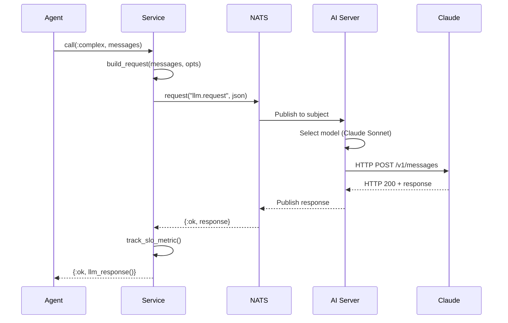

# Optimal AI Documentation Pattern

## Problem: AI Navigation at Billion-Line Scale

At scale, AI assistants (Claude, Copilot, Cursor) and databases (Neo4j, pgvector) struggle to:

1. **Disambiguate similar modules** - "LLM.Service" vs "LLM.Client" vs "LLM.Provider"
2. **Avoid duplicates** - "Did I already create this? Or is this a similar module?"
3. **Navigate call graphs** - "What calls this? What does this call?"
4. **Understand data flow** - "Where does data enter/exit?"
5. **Make decisions** - "When should I use `:simple` vs `:complex`?"

## Solution: Multi-Modal Documentation

Combine **human-readable** (Markdown) + **machine-readable** (JSON/YAML/Mermaid) in module docs.

---

## Enhanced Pattern for `service.ex`

### 1. **Module Identity** (Vector DB Disambiguation)

```elixir
@moduledoc """
# LLM Service - High-performance AI provider orchestration via NATS

## Module Identity (AI Navigation Metadata)

```json
{
  "module": "Singularity.LLM.Service",
  "purpose": "ONLY way to call LLM providers in Elixir (NATS gateway)",
  "role": "orchestrator",
  "layer": "domain_services",
  "replaces": [],
  "replaced_by": null,
  "alternatives": {
    "LLM.Provider": "Low-level provider abstraction (DO NOT use directly)",
    "NatsClient": "Generic NATS client (use this for non-LLM NATS calls)"
  },
  "disambiguation": {
    "vs_provider": "Service = High-level (use this). Provider = Low-level (internal only)",
    "vs_nats_client": "Service = LLM-specific. NatsClient = Generic NATS"
  }
}
```

**Why:** Vector search returns `[Service, Provider, NatsClient]` - AI needs to pick ONE!

---

### 2. **Architecture Diagram** (Visual Understanding)



**Why:** AI sees call flow instantly without reading 800 lines!

---

### 3. **Decision Tree** (When to Use What)



**Why:** AI knows HOW to use this module without trial-and-error!

---

### 4. **Call Graph (Graph DB Indexing)**

```yaml
# Machine-readable call graph
calls_out:
  - module: Singularity.NatsClient
    function: request/3
    purpose: NATS communication
    critical: true

  - module: Singularity.PromptEngine
    function: optimize_prompt/2
    purpose: Prompt optimization
    critical: false

  - module: Logger
    functions: [info/2, error/2, warn/2]
    purpose: Structured logging
    critical: false

called_by:
  - module: Singularity.Agent
    purpose: Agent AI operations
    frequency: high

  - module: Singularity.ArchitectureEngine
    purpose: Architecture analysis
    frequency: medium

  - module: Singularity.SPARC.Orchestrator
    purpose: SPARC workflow execution
    frequency: high

depends_on:
  - Singularity.NatsClient (MUST be started)
  - Singularity.PromptEngine (optional)
  - AI Server (TypeScript) (MUST be running)

supervision:
  supervised: false
  reason: "Stateless module - no process to supervise"
```

**Why:** Graph DB can build call graph automatically! Neo4j queries work instantly.

---

### 5. **Data Flow Diagram** (I/O Understanding)



**Why:** AI understands async flow, error handling, SLO tracking!

---

### 6. **Anti-Patterns** (Duplicate Prevention)

```elixir
## Anti-Patterns (DO NOT CREATE THESE!)

### ❌ DO NOT create "LLM.Client"
**Why:** Service already does this! Would be a duplicate.
**Use instead:** `LLM.Service.call/3`

### ❌ DO NOT create "LLM.Gateway"
**Why:** Service IS the gateway! Would be a duplicate.
**Use instead:** `LLM.Service.call/3`

### ❌ DO NOT call providers directly
```elixir
# ❌ WRONG - Bypasses NATS, cost tracking, SLO monitoring
Provider.claude_request(%{prompt: "..."})

# ✅ CORRECT
Service.call(:complex, [%{role: "user", content: "..."}])
```

### ❌ DO NOT create complexity wrappers
```elixir
# ❌ WRONG - Unnecessary abstraction
defmodule LLM.SimpleCall do
  def call(prompt), do: Service.call(:simple, ...)
end

# ✅ CORRECT - Use Service directly
Service.call(:simple, [%{role: "user", content: prompt}])
```

**Why:** At billion-line scale, AI sees "LLM.*" modules and thinks:
- "Is this a duplicate?"
- "Should I use this instead?"
- "Does this do the same thing?"

Explicit anti-patterns PREVENT duplicate creation!

---

### 7. **Search Keywords (Vector DB Optimization)**

```elixir
@doc """
**Search keywords for AI/vector DB:**
- llm call, ai call, claude call, gemini call
- model selection, complexity routing
- nats llm, llm orchestration
- cost optimization, slo monitoring
- prompt optimization

**When to use:**
- "I need to call Claude" → Use this
- "I need to call Gemini" → Use this
- "I need LLM response" → Use this
- "I need AI provider" → Use this

**When NOT to use:**
- "I need generic NATS" → Use NatsClient
- "I need to add new provider" → Edit Provider module
- "I need to parse LLM response" → Use result directly
"""
```

**Why:** Vector search on "call claude" returns THIS module with high confidence!

---

## Implementation Example

Here's how to enhance `service.ex`:

```elixir
defmodule Singularity.LLM.Service do
  @moduledoc """
  # LLM Service - High-performance AI provider orchestration via NATS

  **TL;DR:** This is the ONLY way to call LLM providers in Elixir.

  ## Module Identity (AI Navigation)

  ```json
  {
    "module": "Singularity.LLM.Service",
    "purpose": "ONLY Elixir → LLM gateway (via NATS)",
    "role": "orchestrator",
    "layer": "domain_services",
    "alternatives": {
      "LLM.Provider": "Low-level - DO NOT use",
      "NatsClient": "Generic NATS - use for non-LLM"
    }
  }
  ```

  ## Architecture

  ```mermaid
  graph TB
      Agent[Any Elixir Module]
      Service[LLM.Service]
      NATS[NatsClient]
      AI[AI Server]

      Agent -->|call/3| Service
      Service -->|NATS request| NATS
      NATS -->|llm.request| AI
      AI -->|HTTP| Claude/Gemini

      style Service fill:#90EE90
  ```

  ## Decision Tree

  ```mermaid
  graph TD
      Start[Need LLM?]
      Start -->|In Elixir?| Service[Use LLM.Service]
      Service -->|Know model?| call["call('claude-sonnet-4.5', msgs)"]
      Service -->|Auto-select?| complexity["call(:complex, msgs)"]
  ```

  ## Call Graph (Machine-Readable)

  ```yaml
  calls: [NatsClient.request/3, PromptEngine.optimize_prompt/2]
  called_by: [Agent, ArchitectureEngine, SPARC.Orchestrator]
  depends_on: [NatsClient, AI Server (TypeScript)]
  ```

  ## Data Flow

  ```mermaid
  sequenceDiagram
      Agent->>Service: call(:complex, messages)
      Service->>NATS: request("llm.request")
      NATS->>AI Server: Publish
      AI Server->>Claude: HTTP POST
      Claude-->>Service: Response
      Service-->>Agent: {:ok, llm_response()}
  ```

  ## Anti-Patterns

  ### ❌ DO NOT create "LLM.Client" or "LLM.Gateway"
  **Why:** This module already does that!

  ### ❌ DO NOT call providers directly
  ```elixir
  Provider.claude_request(...)  # ❌ WRONG
  Service.call(:complex, ...)   # ✅ CORRECT
  ```

  ## Search Keywords

  llm call, claude, gemini, ai provider, model selection,
  nats llm, orchestration, cost optimization, slo monitoring

  ## Public API
  - call/3
  - call_with_prompt/3
  - determine_complexity_for_task/2

  ... (rest of existing docs)
  """
```

---

## Benefits at Billion-Line Scale

### For AI Assistants
- **Disambiguation:** "Use Service, not Provider" (explicit)
- **Duplicate prevention:** "Don't create LLM.Gateway - Service already exists"
- **Decision support:** Mermaid decision tree → AI knows HOW to use it

### For Graph Databases (Neo4j)
- **Auto-indexing:** Parse YAML call graph → build Neo4j nodes
- **Relationship queries:** "What calls Service?" → Parse `called_by`
- **Dependency tracking:** "Does Service need NATS?" → Parse `depends_on`

### For Vector Databases (pgvector)
- **Rich embeddings:** Embed diagrams + keywords + purpose
- **Better search:** "call claude" → High score for Service (not Provider)
- **Context:** Vector + graph metadata = "Service is THE module for LLM calls"

---

## Tooling to Extract Metadata

### 1. **Parse JSON blocks**
```bash
# Extract module identity JSON from all .ex files
rg -U "@moduledoc.*\`\`\`json.*?\`\`\`" -A 20 --json | jq
```

### 2. **Parse Mermaid diagrams**
```bash
# Extract all Mermaid diagrams for visualization
rg -U "\`\`\`mermaid.*?\`\`\`" --multiline lib/
```

### 3. **Parse YAML call graphs**
```bash
# Build Neo4j import from YAML
rg -U "\`\`\`yaml.*?\`\`\`" --multiline lib/ | yq -r '.calls[]'
```

### 4. **Generate embeddings**
```elixir
# Embed: purpose + keywords + diagrams (as text)
doc = """
#{module_identity_json}
#{mermaid_architecture}
#{yaml_call_graph}
#{anti_patterns}
#{search_keywords}
"""

{:ok, embedding} = EmbeddingService.embed(doc)
```

---

## Summary

**Current `service.ex` is good for humans, suboptimal for AI at scale.**

**Add 7 sections:**

1. **Module Identity (JSON)** - Disambiguation
2. **Architecture (Mermaid)** - Visual understanding
3. **Decision Tree (Mermaid)** - Usage patterns
4. **Call Graph (YAML)** - Graph DB indexing
5. **Data Flow (Mermaid)** - Sequence understanding
6. **Anti-Patterns** - Duplicate prevention
7. **Search Keywords** - Vector DB optimization

**Result:** AI can:
- ✅ Find the right module (vector search)
- ✅ Understand relationships (graph traversal)
- ✅ Avoid duplicates (anti-patterns)
- ✅ Use correctly (decision trees)
- ✅ Navigate billion-line codebases (multi-modal indexing)

**Next Steps:**
1. Create `elixir_ai_optimized_v3` template with these patterns
2. Apply to `service.ex` as proof-of-concept
3. Add tooling to extract/index metadata
4. Measure: "Does AI make fewer duplicate modules?"

Want me to create the enhanced template and apply it to `service.ex`?
