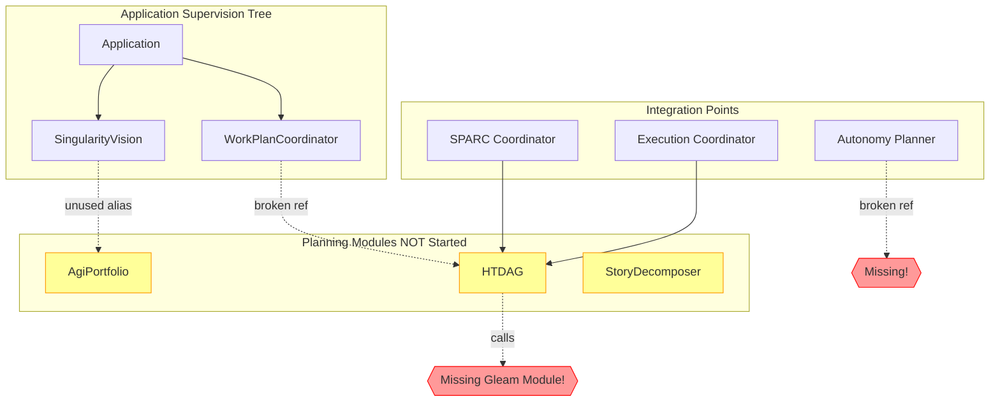
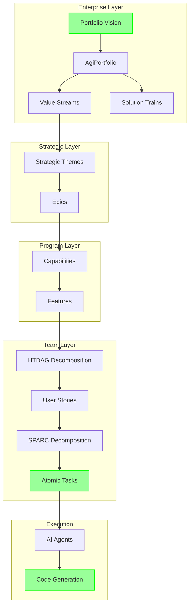
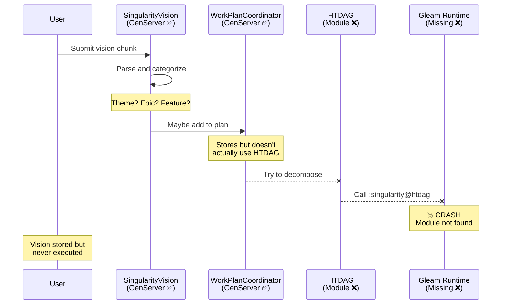
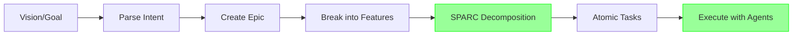

# Planning System Flow Analysis

## 🔴 Critical Issues Found

### 1. **Broken Module References**
```elixir
# In autonomy/planner.ex:15
alias Singularity.Planning.{Coordinator, HTDAG, StoryDecomposer}
```
❌ **Problem**: `Coordinator` module doesn't exist - only `WorkPlanCoordinator` exists
❌ **Impact**: HTDAG alias is unused (warning shown)

### 2. **Missing Gleam Integration**
```elixir
# In htdag.ex - calls Gleam functions
:singularity@htdag.new(goal.description)
:singularity@htdag.add_task(dag, root_task)
```
❌ **Problem**: Gleam `singularity@htdag` module not found in compilation
❌ **Impact**: HTDAG decomposition will crash at runtime

### 3. **Disconnected Components**
- ✅ `SingularityVision` - Started in application.ex
- ✅ `WorkPlanCoordinator` - Started in application.ex
- ❌ `AgiPortfolio` - NOT started anywhere
- ❌ `HTDAG` - Used but Gleam backend missing
- ❌ `StoryDecomposer` - Referenced but not wired

### 4. **Circular/Unclear Flow**
```elixir
# WorkPlanCoordinator calls HTDAG
alias Singularity.Planning.HTDAG

# But HTDAG is never actually instantiated
# It just calls Gleam functions that don't compile
```

## 📊 Current Architecture (As-Is)



## 🎯 Intended Architecture (Should Be)



## 🔧 What Needs Fixing

### Priority 1: Core Wiring
1. **Add AgiPortfolio to supervision tree**
   ```elixir
   # In application.ex
   {Singularity.Planning.AgiPortfolio, []},
   ```

2. **Fix broken module alias**
   ```elixir
   # In autonomy/planner.ex - CHANGE:
   alias Singularity.Planning.{Coordinator, HTDAG, StoryDecomposer}
   # TO:
   alias Singularity.Planning.{WorkPlanCoordinator, HTDAG, StoryDecomposer}
   ```

3. **Implement or Remove Gleam HTDAG**
   - Option A: Build the Gleam module at `singularity_app/src/singularity/htdag.gleam`
   - Option B: Implement HTDAG in pure Elixir
   - Option C: Use simpler task decomposition (no DAG)

### Priority 2: Connect the Flow
1. **Link Portfolio → Strategic → Program → Team**
   ```elixir
   # In AgiPortfolio
   def create_epic(theme_id, epic_data) do
     # Notify WorkPlanCoordinator
     WorkPlanCoordinator.add_epic(epic_data)
   end
   ```

2. **Connect Features → HTDAG**
   ```elixir
   # In WorkPlanCoordinator
   def decompose_feature(feature_id) do
     feature = get_feature(feature_id)
     {:ok, dag} = HTDAG.decompose(feature)
     # Store dag reference
   end
   ```

3. **Wire SPARC to Stories**
   ```elixir
   # After HTDAG creates stories
   stories = HTDAG.get_stories(dag)

   Enum.map(stories, fn story ->
     StoryDecomposer.decompose_story(story)
   end)
   ```

## 📋 Actual Data Flow (What Works Today)



## 💡 Recommended Solution

### Option A: Full Implementation (Complex)
- Build Gleam HTDAG module
- Wire all components together
- Implement full SAFe 6.0 flow

### Option B: Simplified Flow (Pragmatic) ⭐️


**Implementation:**
1. Use SingularityVision for vision management ✅
2. Use WorkPlanCoordinator for epic/feature tracking ✅
3. Skip HTDAG - use StoryDecomposer directly
4. Use SPARC for task breakdown ✅
5. Use existing execution pipeline ✅

### Option C: Incremental (Start Simple)
1. Fix the broken aliases (5 min)
2. Remove or stub HTDAG calls (10 min)
3. Direct Vision → SPARC flow (30 min)
4. Add HTDAG later when Gleam is ready

## 🚦 Current Status

| Component | Status | Started? | Works? | Issue |
|-----------|--------|----------|--------|-------|
| SingularityVision | 🟡 Partial | ✅ Yes | ⚠️ Stores only | Doesn't execute |
| WorkPlanCoordinator | 🟡 Partial | ✅ Yes | ⚠️ Stores only | HTDAG broken |
| AgiPortfolio | 🔴 Broken | ❌ No | ❌ No | Not supervised |
| HTDAG | 🔴 Broken | N/A | ❌ No | Gleam missing |
| StoryDecomposer | 🟢 Ready | N/A | ✅ Yes | Not used |
| SPARC | 🟢 Ready | ✅ Yes | ✅ Yes | Works! |

## Next Steps

1. **Decide**: Full vs Simplified vs Incremental?
2. **Fix** broken references (immediate)
3. **Wire** the chosen flow
4. **Test** end-to-end with real vision
5. **Document** the actual working flow

Would you like me to implement Option B (Simplified) or Option C (Incremental)?
