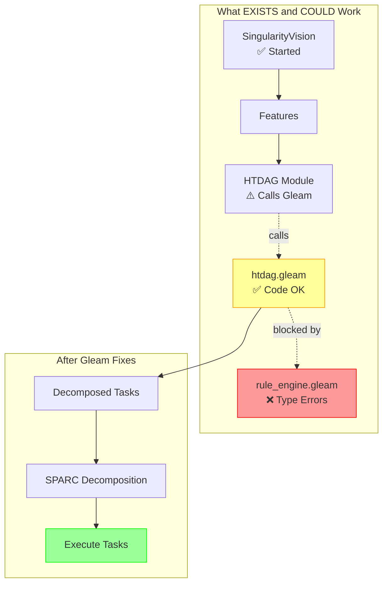

# Planning Flow - Status Update

## 🟡 Gleam Modules Exist BUT Don't Compile

### What We Found:

✅ **HTDAG Gleam module EXISTS** at `singularity_app/src/singularity/htdag.gleam`
✅ **Rule Engine Gleam module EXISTS** at `singularity_app/src/singularity/rule_engine.gleam`
✅ **Mix Gleam integration configured** via `singularity_app/gleam.toml`

❌ **Gleam build FAILS** due to type errors in `rule_engine.gleam`
❌ **HTDAG can't be used** because the overall Gleam project doesn't compile

### The Issue:

```bash
$ gleam build
error: Type mismatch - many Float/Int operator mismatches in rule_engine.gleam
```

The `rule_engine.gleam` has ~12 type errors using wrong operators:
- Using `*` instead of `*.` for Floats
- Using `>=` instead of `>=.` for Floats
- Missing `import gleam/int`
- Wrong return types

**HTDAG itself is fine** - but Gleam won't compile the project until ALL modules are correct.

## 🔧 Quick Fix Options

### Option 1: Fix Gleam Type Errors (30 min)
Fix all the type mismatches in rule_engine.gleam:
- Change `*` to `*.` for Float multiplication
- Change `>=` to `>=.` for Float comparison
- Add `import gleam/int`
- Fix function return types

### Option 2: Remove Broken Module (5 min)
Temporarily move `rule_engine.gleam` out of src/:
```bash
mv singularity_app/src/singularity/rule_engine.gleam singularity_app/src/singularity/rule_engine.gleam.broken
gleam build  # Should work now
```

### Option 3: Use Elixir HTDAG (1 hour)
Rewrite HTDAG in pure Elixir instead of Gleam

## 📊 Correct Architecture (Once Gleam Compiles)



## ✅ What to Do Next

### Immediate (Recommended):
1. **Fix the Gleam type errors** in rule_engine.gleam (I can do this)
2. **Rebuild Gleam** - should compile clean
3. **Test HTDAG** from Elixir
4. **Wire the flow** Vision → HTDAG → SPARC → Execution

### OR Alternative:
1. **Remove rule_engine.gleam** temporarily
2. **Gleam compiles** with just htdag.gleam
3. **Wire the flow** now
4. **Fix rule_engine** later

## 🎯 Bottom Line

**Good News**:
- HTDAG Gleam code IS there and looks solid
- The architecture CAN work
- Just needs Gleam to compile

**Bad News**:
- Can't use it until Gleam builds
- rule_engine.gleam has type errors blocking everything

**Fix Time**: 30-60 minutes to get it all working

Want me to:
- A) Fix the Gleam type errors now?
- B) Remove rule_engine temporarily and wire HTDAG?
- C) Skip Gleam and use Elixir HTDAG?
