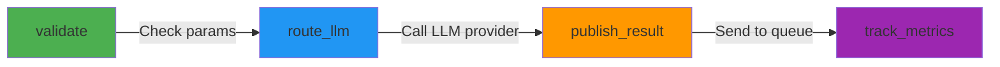

# Nexus Workflow Architecture - quantum_flow Integration

**Date:** 2025-10-25
**Status:** ✅ Implemented - Ready for Testing

---

## Overview

Nexus now uses **quantum_flow** for LLM request orchestration, replacing manual pgmq polling with database-driven DAG workflows.

## Architecture Comparison

### Before (Manual Queue Polling)

```
┌─────────────────────────────────────────────────────────────┐
│ Singularity/Client                                          │
│   ↓ Enqueue LLM request                                     │
│ PostgreSQL pgmq:llm_requests                                │
│   ↓                                                          │
│ Nexus.QueueConsumer (GenServer)                             │
│   ↓ Manual polling (raw SQL)                                │
│   ↓ Process message                                         │
│   ↓ Call LLMRouter                                          │
│   ↓ Publish result (raw SQL)                                │
│ PostgreSQL pgmq:llm_results                                 │
└─────────────────────────────────────────────────────────────┘

Issues:
- ❌ Manual retry logic
- ❌ No state persistence
- ❌ Single point of failure
- ❌ Hard to add new steps
- ❌ No observability
```

### After (quantum_flow Workflows)

```
┌─────────────────────────────────────────────────────────────┐
│ Singularity/Client                                          │
│   ↓ Enqueue LLM request                                     │
│ PostgreSQL pgmq:llm_requests                                │
│   ↓                                                          │
│ Nexus.WorkflowWorker                                        │
│   ↓ Start workflow                                          │
│ quantum_flow Executor                                          │
│   ↓ Execute DAG                                             │
│ Nexus.Workflows.LLMRequestWorkflow                          │
│   ├─ validate → route_llm → publish_result → track_metrics │
│   │                                                          │
│   │ Each step:                                              │
│   │ - Automatic retry (exponential backoff)                │
│   │ - State persisted in PostgreSQL                        │
│   │ - Independent failure isolation                        │
│   │ - Fully observable via DB queries                      │
│   ↓                                                          │
│ PostgreSQL pgmq:llm_results                                 │
└─────────────────────────────────────────────────────────────┘

Benefits:
- ✅ Automatic retry with exponential backoff
- ✅ State persisted in PostgreSQL
- ✅ Fault isolation (failed steps retry independently)
- ✅ Easy to add/modify steps
- ✅ Full observability (every step logged)
- ✅ Parallel execution across workers
- ✅ Dependency tracking
```

## Workflow DAG

The LLM Request Workflow is defined as a DAG (Directed Acyclic Graph):



### Step Descriptions

| Step | Purpose | Error Handling |
|------|---------|----------------|
| **validate** | Check request parameters (complexity, messages, etc.) | Returns `{:error, reason}`, workflow fails fast |
| **route_llm** | Route to LLM provider via `Nexus.LLMRouter` | Auto-retry on timeout/rate limit |
| **publish_result** | Publish response to `llm_results` queue | Auto-retry on queue failure |
| **track_metrics** | Store tokens, cost, latency for analysis | Logged but non-blocking |

## Code Structure

### Workflow Definition

```elixir
# nexus/lib/nexus/workflows/llm_request_workflow.ex
defmodule Nexus.Workflows.LLMRequestWorkflow do
  def __workflow_steps__ do
    [
      {:validate, &__MODULE__.validate/1, depends_on: []},
      {:route_llm, &__MODULE__.route_llm/1, depends_on: [:validate]},
      {:publish_result, &__MODULE__.publish_result/1, depends_on: [:route_llm]},
      {:track_metrics, &__MODULE__.track_metrics/1, depends_on: [:publish_result]}
    ]
  end

  def validate(input), do: {:ok, input}
  def route_llm(state), do: Nexus.LLMRouter.route(state["validate"])
  def publish_result(state), do: {:ok, state}
  def track_metrics(state), do: {:ok, state}
end
```

### Workflow Worker

```elixir
# nexus/lib/nexus/workflow_worker.ex
defmodule Nexus.WorkflowWorker do
  use GenServer

  def handle_info(:poll, state) do
    # Read messages from pgmq
    {:ok, messages} = read_messages(state.batch_size)

    # Execute workflow for each message
    Enum.each(messages, fn msg ->
      Executor.execute(LLMRequestWorkflow, msg.msg, Nexus.Repo)
    end)

    schedule_poll(state.poll_interval)
    {:noreply, state}
  end
end
```

## Database Tables

quantum_flow creates these tables for workflow state:

| Table | Purpose |
|-------|---------|
| `workflow_runs` | Overall workflow execution state |
| `workflow_step_states` | Step completion tracking |
| `workflow_step_tasks` | Individual task state |
| `workflow_step_dependencies` | DAG dependency graph |

## Usage Examples

### Execute Single LLM Request

```elixir
# Via WorkflowWorker (automatic polling)
{:ok, pid} = Nexus.WorkflowWorker.start_link()

# Or execute directly
{:ok, result} = QuantumFlow.Executor.execute(
  Nexus.Workflows.LLMRequestWorkflow,
  %{
    "request_id" => "uuid",
    "complexity" => "complex",
    "task_type" => "architect",
    "messages" => [%{"role" => "user", "content" => "Design a system"}]
  },
  Nexus.Repo
)
```

### Query Workflow Status

```sql
-- Get running workflows
SELECT * FROM workflow_runs WHERE status = 'running';

-- Get completed steps for a workflow
SELECT * FROM workflow_step_states
WHERE run_id = 'uuid'
ORDER BY created_at;

-- Get failed tasks for debugging
SELECT * FROM workflow_step_tasks
WHERE status = 'failed'
ORDER BY created_at DESC
LIMIT 10;
```

### Monitor Metrics

```sql
-- Track LLM cost by model
SELECT
  run_input->'complexity' as complexity,
  COUNT(*) as requests,
  SUM((run_output->'track_metrics'->>'tokens')::int) as total_tokens,
  SUM((run_output->'track_metrics'->>'cost')::float) as total_cost
FROM workflow_runs
WHERE flow_slug = 'llm_request_workflow'
  AND status = 'completed'
  AND created_at > NOW() - INTERVAL '1 day'
GROUP BY complexity;
```

## Benefits Over Manual Polling

| Feature | Manual Polling | quantum_flow Workflows |
|---------|---------------|---------------------|
| **Retry Logic** | Manual implementation | Automatic exponential backoff |
| **State Management** | In-memory (lost on crash) | PostgreSQL (survives crashes) |
| **Observability** | Logs only | Database queries + logs |
| **Fault Isolation** | Entire worker fails | Individual steps retry |
| **Parallel Execution** | Single worker | Multiple workers + steps |
| **Adding Steps** | Modify GenServer logic | Add to DAG definition |
| **Error Recovery** | Restart worker | Resume from last step |
| **Metrics Tracking** | Manual | Built-in via workflow state |

## Migration Path

### Phase 1: Implement Workflow (✅ DONE)

- [x] Create `Nexus.Workflows.LLMRequestWorkflow`
- [x] Create `Nexus.WorkflowWorker`
- [x] Add quantum_flow dependency
- [x] Write tests

### Phase 2: Test in Isolation (⏳ CURRENT)

- [ ] Run quantum_flow migrations
- [ ] Test workflow execution with mock LLM
- [ ] Verify state persistence
- [ ] Test failure scenarios

### Phase 3: Integrate with Real LLM

- [ ] Connect to actual LLM providers
- [ ] Test with real API calls
- [ ] Verify retry logic works
- [ ] Monitor metrics

### Phase 4: Deploy

- [ ] Update Nexus.Application to use WorkflowWorker
- [ ] Remove old QueueConsumer
- [ ] Update documentation
- [ ] Deploy to production

## Testing

```bash
# Run workflow tests
cd nexus
mix test test/nexus/workflows/llm_request_workflow_test.exs

# Test individual steps
iex> alias Nexus.Workflows.LLMRequestWorkflow
iex> LLMRequestWorkflow.validate(%{"complexity" => "invalid"})
{:error, {:invalid_complexity, "invalid"}}

iex> LLMRequestWorkflow.validate(%{
  "request_id" => "test",
  "complexity" => "simple",
  "messages" => [%{"role" => "user", "content" => "hi"}]
})
{:ok, %{...}}
```

## Next Steps

1. **Run Migrations** - `mix ecto.migrate` to create quantum_flow tables
2. **Test Workflow** - Execute with mock data
3. **Connect to LLM** - Test with real providers
4. **Remove Old Code** - Delete `QueueConsumer` after verification
5. **Monitor Production** - Track metrics and failures

## Related Documentation

- **quantum_flow README:** `packages/quantum_flow/README.md`
- **Workflow Guide:** `packages/quantum_flow/docs/DYNAMIC_WORKFLOWS_GUIDE.md`
- **Architecture:** `packages/quantum_flow/ARCHITECTURE.md`
- **Nexus README:** `nexus/README.md`
