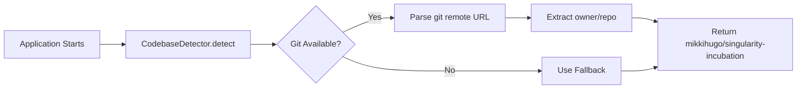

# Auto Codebase Detection from Git

**Automatic detection of codebase ID from GitHub repository**

---

## Overview

Instead of hardcoding `codebase_id = "singularity"`, the system now **auto-detects** from your Git remote URL!

### What Gets Detected

```bash
# Your Git remote
git remote get-url origin
# => git@github.com:mikkihugo/singularity-incubation.git

# Auto-detected codebase_id
codebase_id = "mikkihugo/singularity-incubation"
```

---

## Benefits

✅ **Works for any repo** - No hardcoded values
✅ **Includes your username/org** - Unique across all GitHub
✅ **Zero configuration** - Just works™
✅ **Consistent naming** - Same format everywhere
✅ **Matches GitHub** - Intuitive and familiar

---

## How It Works



### Detection Logic

```elixir
# 1. Run git command
git remote get-url origin

# 2. Parse URL (supports multiple formats)
"git@github.com:mikkihugo/singularity-incubation.git"
"https://github.com/mikkihugo/singularity-incubation.git"
"https://github.com/mikkihugo/singularity-incubation"

# 3. Extract owner/repo
"mikkihugo/singularity-incubation"
```

---

## Usage

### Auto-Detection (Recommended)

```elixir
# Uses CodebaseDetector automatically!

# StartupCodeIngestion (startup)
# → Detects "mikkihugo/singularity-incubation"
# → Ingests all files with that codebase_id

# CodeFileWatcher (runtime)
# → Detects "mikkihugo/singularity-incubation"
# → Auto-ingests file changes with that codebase_id

# UnifiedIngestionService
# → Detects "mikkihugo/singularity-incubation"
# → Uses as default codebase_id
```

### Manual Override (If Needed)

```elixir
# Override auto-detection
UnifiedIngestionService.ingest_file(file_path, codebase_id: "my-custom-id")

# Or configure fallback
CodebaseDetector.detect(fallback: "custom-fallback")
```

### Format Options

```elixir
# Repo name only (default)
CodebaseDetector.detect(format: :repo_only)
# => "singularity-incubation"

# Include owner (recommended)
CodebaseDetector.detect(format: :full)
# => "mikkihugo/singularity-incubation"
```

---

## Where It's Used

### 1. StartupCodeIngestion (Startup Ingestion)

```elixir
# lib/singularity/execution/planning/startup_code_ingestion.ex:479

defp persist_learned_codebase(learning) do
  # Auto-detect from Git
  codebase_id = CodebaseDetector.detect(format: :full)
  # => "mikkihugo/singularity-incubation"

  # Ingest all modules with auto-detected ID
  UnifiedIngestionService.ingest_file(file_path, codebase_id: codebase_id)
end
```

### 2. CodeFileWatcher (Runtime Ingestion)

```elixir
# lib/singularity/execution/planning/code_file_watcher.ex:287

defp do_reingest(file_path, _project_root) do
  # Auto-detect from Git
  codebase_id = CodebaseDetector.detect(format: :full)
  # => "mikkihugo/singularity-incubation"

  # Hot-reload: ingest changed file
  UnifiedIngestionService.ingest_file(file_path, codebase_id: codebase_id)
end
```

### 3. UnifiedIngestionService (Default)

```elixir
# lib/singularity/code/unified_ingestion_service.ex:85

def ingest_file(file_path, opts \\ []) do
  # Auto-detect from Git if not provided
  codebase_id = Keyword.get(opts, :codebase_id) ||
                CodebaseDetector.detect(format: :full)
  # => "mikkihugo/singularity-incubation"
end
```

---

## API Reference

### CodebaseDetector Module

```elixir
alias Singularity.Code.CodebaseDetector

# Auto-detect (repo only)
codebase_id = CodebaseDetector.detect()
# => "singularity-incubation"

# Auto-detect (with owner)
codebase_id = CodebaseDetector.detect(format: :full)
# => "mikkihugo/singularity-incubation"

# With fallback
codebase_id = CodebaseDetector.detect(fallback: "my-app")
# => "mikkihugo/singularity-incubation" or "my-app" if Git fails

# Check if Git repo
CodebaseDetector.git_repo?()
# => true

# Get full info
CodebaseDetector.get_info()
# => %{
#   codebase_id: "mikkihugo/singularity-incubation",
#   git_repo: true,
#   remote_url: "git@github.com:mikkihugo/singularity-incubation.git",
#   detected_at: ~U[2025-10-23 16:30:00Z]
# }
```

---

## Database Queries

Now you query using your GitHub username/org:

```elixir
import Ecto.Query
alias Singularity.{Repo, Schemas.CodeFile}

# Query by auto-detected codebase_id
codebase_id = CodebaseDetector.detect(format: :full)
# => "mikkihugo/singularity-incubation"

files = Repo.all(
  from f in CodeFile,
  where: f.project_name == ^codebase_id,
  select: f
)

# Or use directly
files = Repo.all(
  from f in CodeFile,
  where: f.project_name == "mikkihugo/singularity-incubation",
  select: f
)
```

---

## Mix Tasks

Mix tasks also use auto-detection:

```bash
# Auto-detects "mikkihugo/singularity-incubation"
mix analyze.codebase --codebase-id mikkihugo/singularity-incubation --store

# View results
mix analyze.results --codebase-id mikkihugo/singularity-incubation

# Or override
mix code.ingest --id my-custom-project
```

---

## Supported Git URL Formats

All common Git URL formats are supported:

### SSH Format
```
git@github.com:mikkihugo/singularity-incubation.git
git@gitlab.com:user/my-repo.git
```

### HTTPS Format
```
https://github.com/mikkihugo/singularity-incubation.git
https://github.com/mikkihugo/singularity-incubation
```

### Plain Format
```
mikkihugo/singularity-incubation
```

---

## Configuration

### Default Behavior (Recommended)

No configuration needed! Auto-detection works out of the box:

```elixir
# config/config.exs
# Nothing to configure - just works!
```

### Custom Fallback (Optional)

```elixir
# config/config.exs
config :singularity, Singularity.Code.CodebaseDetector,
  fallback: "my-default-project",
  format: :full  # or :repo_only
```

---

## Error Handling

Graceful fallback if Git detection fails:

```elixir
# Git available
CodebaseDetector.detect()
# => "mikkihugo/singularity-incubation"

# Git not available (rare)
CodebaseDetector.detect(fallback: "singularity")
# => "singularity"

# Check detection result
case CodebaseDetector.detect_from_git() do
  {:ok, codebase_id} ->
    IO.puts("Detected: #{codebase_id}")

  {:error, reason} ->
    IO.puts("Detection failed: #{reason}")
    IO.puts("Using fallback: singularity")
end
```

---

## Benefits for Multi-Repo Setup

Perfect for working with multiple codebases:

```bash
# Project 1: singularity-incubation
cd ~/code/singularity-incubation
iex -S mix
# Auto-detects: "mikkihugo/singularity-incubation"

# Project 2: my-other-project
cd ~/code/my-other-project
iex -S mix
# Auto-detects: "mikkihugo/my-other-project"

# Both stored separately in database!
```

### Database Isolation

```sql
-- Query by project
SELECT * FROM code_files
WHERE project_name = 'mikkihugo/singularity-incubation';

SELECT * FROM code_files
WHERE project_name = 'mikkihugo/my-other-project';

-- Count files per project
SELECT project_name, COUNT(*)
FROM code_files
GROUP BY project_name;
```

---

## Migration Notes

### Before (Hardcoded)

```elixir
# ❌ Old way
codebase_id = "singularity"
```

### After (Auto-Detected)

```elixir
# ✅ New way
codebase_id = CodebaseDetector.detect(format: :full)
# => "mikkihugo/singularity-incubation"
```

### Database Update

Existing records with `project_name = "singularity"` will remain.
New records will use `"mikkihugo/singularity-incubation"`.

To migrate existing records:

```sql
-- Update existing records (optional)
UPDATE code_files
SET project_name = 'mikkihugo/singularity-incubation'
WHERE project_name = 'singularity';

-- Or keep both (they're separate codebases in DB)
```

---

## Testing

```elixir
# Test auto-detection
iex> alias Singularity.Code.CodebaseDetector
iex> CodebaseDetector.detect(format: :full)
"mikkihugo/singularity-incubation"

iex> CodebaseDetector.git_repo?()
true

iex> CodebaseDetector.get_info()
%{
  codebase_id: "mikkihugo/singularity-incubation",
  git_repo: true,
  remote_url: "git@github.com:mikkihugo/singularity-incubation.git",
  detected_at: ~U[2025-10-23 16:35:00Z]
}
```

---

## Summary

✅ **Auto-detects** from Git remote URL
✅ **Includes username/org** for uniqueness
✅ **Zero configuration** needed
✅ **Graceful fallback** if Git unavailable
✅ **Works everywhere** (startup, runtime, Mix tasks)
✅ **Supports all formats** (SSH, HTTPS, plain)
✅ **Multi-repo ready** (different codebases in one database)

**Your codebase is now: `mikkihugo/singularity-incubation`** 🎉
