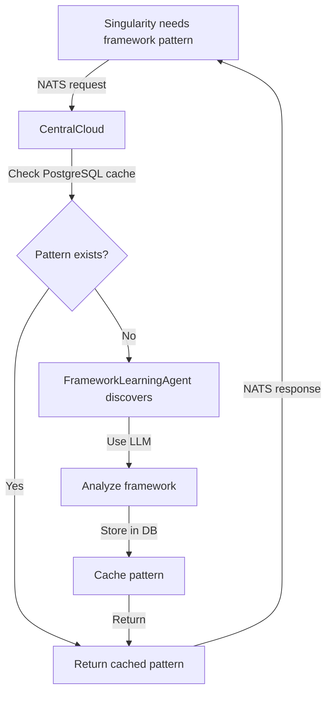
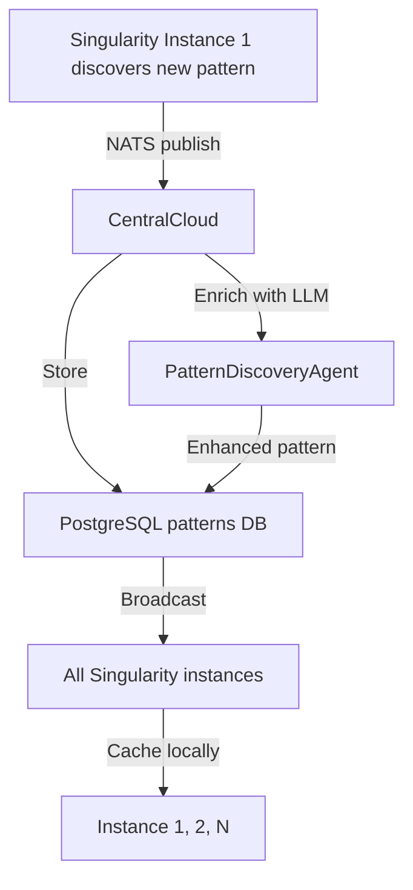

# CentralCloud Pattern Sync Architecture Refactor

**Move all pattern detection/storage to CentralCloud for centralized learning** 🏗️

---

## 🎯 Problem

Currently Singularity has **pattern detection logic duplicated locally** that should come from CentralCloud:

**❌ Current (Wrong):**
```
Singularity Instance 1 → Detects microservice patterns locally → Stores in local DB
Singularity Instance 2 → Detects microservice patterns locally → Stores in local DB
Singularity Instance N → Detects microservice patterns locally → Stores in local DB

Result: DUPLICATE LEARNING, NO SHARING
```

**✅ Correct:**
```
Singularity Instance 1 ──┐
Singularity Instance 2 ──┤
Singularity Instance N ──┴─→ Query CentralCloud → Framework/Pattern API
                                      ↓
                           Shared PostgreSQL (patterns DB)
                                      ↓
                           All instances benefit from collective learning!
```

---

## 📊 What Should Move to CentralCloud

### Pattern Detection Modules (Move to CentralCloud)

**Framework Patterns:**
- ❌ `lib/singularity/architecture_engine/framework_pattern_sync.ex`
- ❌ `lib/singularity/architecture_engine/framework_pattern_store.ex`
- ✅ Should be: `centralcloud/lib/centralcloud/framework_patterns.ex`

**Technology Patterns:**
- ❌ `lib/singularity/architecture_engine/technology_pattern_store.ex`
- ❌ `lib/singularity/detection/technology_pattern_adapter.ex`
- ✅ Should be: `centralcloud/lib/centralcloud/technology_patterns.ex`

**Microservice Patterns:**
- ❌ `lib/singularity/storage/code/analyzers/microservice_analyzer.ex`
- ✅ Should be: `centralcloud/lib/centralcloud/microservice_patterns.ex`

**Code Patterns:**
- ❌ `lib/singularity/storage/code/patterns/pattern_miner.ex`
- ❌ `lib/singularity/storage/code/patterns/pattern_indexer.ex`
- ❌ `lib/singularity/storage/code/patterns/code_pattern_extractor.ex`
- ❌ `lib/singularity/storage/code/patterns/pattern_consolidator.ex`
- ✅ Should be: `centralcloud/lib/centralcloud/code_patterns.ex`

**Pattern Sync Jobs:**
- ❌ `lib/singularity/jobs/pattern_sync_worker.ex`
- ❌ `lib/singularity/jobs/pattern_sync_job.ex`
- ❌ `lib/singularity/jobs/pattern_miner_job.ex`
- ✅ Should be: `centralcloud/lib/centralcloud/jobs/pattern_discovery.ex`

### Schemas (Move to CentralCloud DB)

- ❌ `lib/singularity/schemas/technology_pattern.ex`
- ❌ `lib/singularity/schemas/file_architecture_pattern.ex`
- ❌ `lib/singularity/schemas/package_usage_pattern.ex`
- ✅ Should be: `centralcloud/lib/centralcloud/schemas/pattern.ex`

---

## ✅ What Stays in Singularity

### Code Analysis (Local Only)

**✅ Keep in Singularity:**
- `lib/singularity/code_analyzer.ex` - Analyzes YOUR code (not patterns)
- `lib/singularity/code_quality/ast_quality_analyzer.ex` - Quality of YOUR code
- `lib/singularity/execution/feedback/analyzer.ex` - Agent feedback (local)

**Why:** These analyze YOUR specific codebase, not universal patterns

---

## 🏗️ Proposed Architecture

### CentralCloud Services

```elixir
# centralcloud/lib/centralcloud/

# Already exists:
framework_learning_agent.ex       # ✅ Discovers frameworks on-demand
template_service.ex                # ✅ Serves templates
knowledge_cache.ex                 # ✅ Caches knowledge

# Add new pattern services:
framework_patterns.ex              # Framework detection patterns
technology_patterns.ex             # Technology stack patterns
microservice_patterns.ex           # Microservice architecture patterns
code_patterns.ex                   # Reusable code patterns
pattern_discovery_agent.ex         # Discovers new patterns via LLM
```

### CentralCloud API (NATS subjects)

```elixir
# Query patterns
"centralcloud.patterns.framework.query"       # Get framework patterns
"centralcloud.patterns.technology.query"      # Get technology patterns
"centralcloud.patterns.microservice.query"    # Get microservice patterns
"centralcloud.patterns.code.query"            # Get code patterns

# Learn new patterns
"centralcloud.patterns.framework.learn"       # Learn new framework pattern
"centralcloud.patterns.technology.learn"      # Learn new technology pattern
"centralcloud.patterns.microservice.learn"    # Learn new microservice pattern
"centralcloud.patterns.code.learn"            # Learn new code pattern

# Sync patterns (bidirectional)
"centralcloud.patterns.sync.request"          # Request pattern sync
"centralcloud.patterns.sync.publish"          # Publish patterns to instances
```

### Singularity Integration

```elixir
# lib/singularity/integrations/central_patterns_client.ex

defmodule Singularity.Integrations.CentralPatternsClient do
  @moduledoc """
  Client for querying CentralCloud pattern APIs.

  Replaces local pattern detection with centralized pattern queries.
  """

  def query_framework_pattern(framework_name) do
    NatsClient.request("centralcloud.patterns.framework.query", %{
      framework: framework_name
    })
  end

  def query_microservice_patterns(codebase_path) do
    NatsClient.request("centralcloud.patterns.microservice.query", %{
      path: codebase_path,
      languages: ["typescript", "rust", "elixir"]
    })
  end

  def learn_new_pattern(pattern_type, pattern_data) do
    NatsClient.publish("centralcloud.patterns.#{pattern_type}.learn", pattern_data)
  end
end
```

---

## 📝 Migration Plan

### Phase 1: Create CentralCloud Pattern Services

1. **Create pattern services:**
   ```bash
   centralcloud/lib/centralcloud/
   ├── framework_patterns.ex
   ├── technology_patterns.ex
   ├── microservice_patterns.ex
   ├── code_patterns.ex
   └── pattern_discovery_agent.ex
   ```

2. **Move schemas to CentralCloud:**
   ```bash
   centralcloud/lib/centralcloud/schemas/
   ├── framework_pattern.ex
   ├── technology_pattern.ex
   ├── microservice_pattern.ex
   └── code_pattern.ex
   ```

3. **Create NATS API:**
   ```elixir
   # centralcloud/lib/centralcloud/pattern_api.ex
   defmodule Centralcloud.PatternApi do
     def handle_nats_requests do
       subscribe_to_all_pattern_subjects()
     end
   end
   ```

### Phase 2: Update Singularity to Query CentralCloud

1. **Create CentralPatternsClient:**
   ```bash
   singularity/lib/singularity/integrations/central_patterns_client.ex
   ```

2. **Replace local pattern detection:**
   ```elixir
   # Before (local):
   patterns = MicroserviceAnalyzer.detect_patterns(codebase)

   # After (centralized):
   patterns = CentralPatternsClient.query_microservice_patterns(codebase)
   ```

3. **Update all callers:**
   - Replace `FrameworkPatternStore.get()` → `CentralPatternsClient.query_framework_pattern()`
   - Replace `TechnologyPatternStore.get()` → `CentralPatternsClient.query_technology_pattern()`
   - Replace `MicroserviceAnalyzer.analyze()` → `CentralPatternsClient.query_microservice_patterns()`

### Phase 3: Bidirectional Learning

1. **Singularity learns new pattern → Sends to CentralCloud:**
   ```elixir
   # When Singularity discovers new pattern in YOUR code:
   CentralPatternsClient.learn_new_pattern(:framework, %{
     name: "custom-framework",
     indicators: ["package.json has custom-framework"],
     examples: [code_sample]
   })
   ```

2. **CentralCloud enriches → Publishes to all instances:**
   ```elixir
   # CentralCloud uses LLM to analyze pattern
   # Stores in shared DB
   # Publishes to all Singularity instances
   NatsClient.publish("centralcloud.patterns.sync.publish", enriched_pattern)
   ```

3. **All instances benefit immediately:**
   ```
   Instance 1 discovers pattern → CentralCloud → All instances get it!
   ```

---

## 🎯 Benefits

### 1. No Duplicate Learning

**Before:**
```
Instance 1: Discovers React pattern → Stores locally
Instance 2: Discovers React pattern → Stores locally (DUPLICATE!)
Instance 3: Discovers React pattern → Stores locally (DUPLICATE!)
```

**After:**
```
Instance 1: Discovers React pattern → Sends to CentralCloud
Instance 2: Queries CentralCloud → Gets React pattern (instant!)
Instance 3: Queries CentralCloud → Gets React pattern (instant!)
```

### 2. Constant Improvement

**Before:**
```
Instance 1: Learns React patterns from 10 projects
Instance 2: Learns React patterns from 5 projects (worse knowledge!)
```

**After:**
```
CentralCloud: Learns React patterns from 15 projects (collective!)
All instances: Get best React patterns immediately
```

### 3. Centralized Pattern Authority

**Before:**
```
3 instances × 4 pattern types × local DB = 12 separate pattern stores (chaos!)
```

**After:**
```
1 CentralCloud × 4 pattern types × shared DB = 1 pattern authority (clean!)
```

### 4. Faster Pattern Detection

**Before:**
```
Singularity: Run local analysis (slow, CPU-intensive)
```

**After:**
```
Singularity: Query CentralCloud API (fast, cached)
CentralCloud: Already analyzed, returns instantly
```

---

## 📊 Data Flow

### Pattern Query Flow



### Pattern Learning Flow



---

## ✅ Implementation Checklist

### CentralCloud (New Services)

- [ ] Create `framework_patterns.ex` service
- [ ] Create `technology_patterns.ex` service
- [ ] Create `microservice_patterns.ex` service
- [ ] Create `code_patterns.ex` service
- [ ] Create `pattern_discovery_agent.ex` (LLM-based)
- [ ] Create pattern schemas in CentralCloud DB
- [ ] Create NATS API endpoints
- [ ] Create pattern sync jobs

### Singularity (Remove Local, Add Client)

- [ ] Create `central_patterns_client.ex`
- [ ] Remove `microservice_analyzer.ex` (use CentralCloud instead)
- [ ] Remove `framework_pattern_store.ex` (use CentralCloud instead)
- [ ] Remove `technology_pattern_store.ex` (use CentralCloud instead)
- [ ] Remove `pattern_miner.ex` (use CentralCloud instead)
- [ ] Remove `pattern_sync_worker.ex` (CentralCloud handles sync)
- [ ] Update all callers to use `CentralPatternsClient`
- [ ] Add pattern learning hooks (send discoveries to CentralCloud)

### Testing

- [ ] Test pattern query (Singularity → CentralCloud)
- [ ] Test pattern learning (Singularity → CentralCloud → All instances)
- [ ] Test cache miss (CentralCloud discovers via LLM)
- [ ] Test multiple instances (shared learning)
- [ ] Test NATS failure (graceful degradation)

---

## 🎉 Summary

**Current:**
- ❌ Pattern detection duplicated in each Singularity instance
- ❌ No shared learning between instances
- ❌ Waste CPU/memory on duplicate analysis

**After Refactor:**
- ✅ All patterns in CentralCloud (single authority)
- ✅ Shared learning across all instances
- ✅ Faster pattern detection (cached in CentralCloud)
- ✅ Continuous improvement (collective intelligence)

**Architecture:**
```
Multiple Singularity instances → Query CentralCloud API → Shared pattern DB
                                       ↓
                               Pattern learning flows back
                                       ↓
                           All instances benefit immediately!
```

---

**Next Steps:** Implement Phase 1 - Create CentralCloud pattern services
