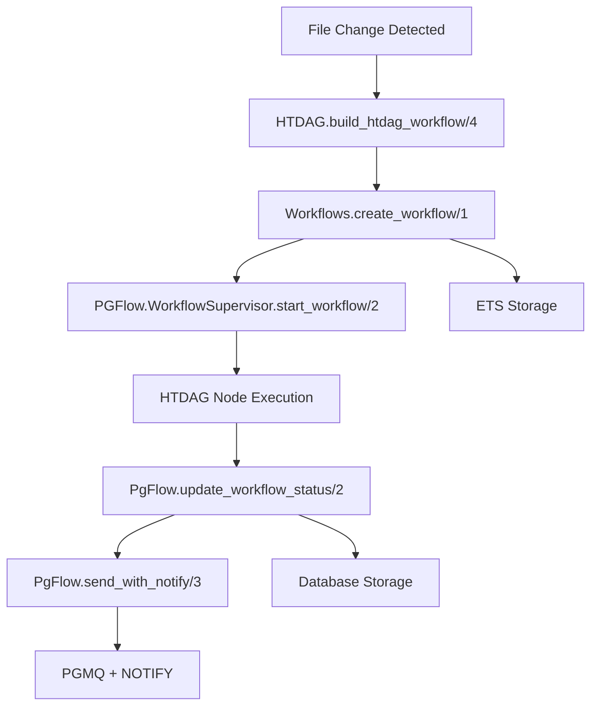

# HTDAG Architecture with PgFlow - Current Implementation ✅

## **How HTDAG Works with PgFlow**

### **Current Architecture (Corrected)**

```elixir
# 1. HTDAG creates workflow definition
workflow = build_htdag_workflow(dag_id, file_path, codebase_id, attrs)

# 2. Store workflow in ETS (fast access)
{:ok, _workflow} = Workflows.create_workflow(workflow)

# 3. Execute via PgFlow WorkflowSupervisor (reliable execution)
{:ok, _pid} = PGFlow.WorkflowSupervisor.start_workflow(workflow, [])

# 4. Update status via PgFlow (database persistence)
{:ok, _} = PgFlow.update_workflow_status(workflow, status)

# 5. Send notifications via PgFlow (reliable messaging)
{:ok, _} = PgFlow.send_with_notify("notifications", notification)
```

## **Key Components**

### **1. HTDAG (Hierarchical Task Directed Acyclic Graph)**
- **Purpose**: Defines hierarchical task workflows for code ingestion
- **Location**: `lib/singularity/htdag/auto_code_ingestion_dag.ex`
- **Role**: Workflow definition and task orchestration logic

### **2. Workflows (ETS-based)**
- **Purpose**: Fast workflow storage and retrieval
- **Location**: `lib/singularity/workflows.ex`
- **Role**: In-memory workflow state management
- **Storage**: ETS table `:pgflow_workflows`

### **3. PgFlow (Database + Messaging)**
- **Purpose**: Database persistence and real-time messaging
- **Location**: `lib/singularity/pgflow.ex`
- **Role**: 
  - Database persistence via `Singularity.PgFlow.Workflow` schema
  - Real-time messaging via PGMQ + PostgreSQL NOTIFY

### **4. PGFlow.WorkflowSupervisor**
- **Purpose**: Workflow execution orchestration
- **Location**: External PGFlow library
- **Role**: Manages workflow execution, retries, and monitoring

## **Data Flow**



## **Workflow Execution Pattern**

### **HTDAG Workflow Definition**
```elixir
def build_htdag_workflow(dag_id, file_path, codebase_id, attrs) do
  %{
    workflow_id: dag_id,
    type: @dag_type,
    status: :pending,
    payload: %{
      file_path: file_path,
      codebase_id: codebase_id,
      current_node: :file_detection,
      completed_nodes: [],
      node_statuses: %{},
      results: %{},
      dependencies: %{}
    },
    nodes: @nodes,
    created_at: DateTime.utc_now()
  }
end
```

### **Workflow Execution**
```elixir
# HTDAG creates workflow
workflow = build_htdag_workflow(dag_id, file_path, codebase_id, attrs)

# Store in ETS for fast access
{:ok, _workflow} = Workflows.create_workflow(workflow)

# Execute via PgFlow WorkflowSupervisor
{:ok, _pid} = PGFlow.WorkflowSupervisor.start_workflow(workflow, [])
```

### **Node Execution**
```elixir
defp execute_htdag_nodes(workflow) do
  # Execute current node
  case execute_node(current_node, payload) do
    {:ok, result} ->
      # Update workflow state
      updated_payload = update_payload(payload, result)
      
      # Persist via PgFlow
      PgFlow.update_workflow_status(workflow, updated_payload)
      
      # Continue to next node
      execute_htdag_nodes(%{workflow | payload: updated_payload})
  end
end
```

## **Storage Layers**

### **1. ETS (In-Memory)**
- **Purpose**: Fast workflow state access
- **Table**: `:pgflow_workflows`
- **Usage**: Active workflow state, node execution

### **2. PostgreSQL (Persistent)**
- **Purpose**: Workflow persistence and durability
- **Table**: `pgflow_workflows`
- **Usage**: Workflow history, recovery, analytics

### **3. PGMQ (Message Queue)**
- **Purpose**: Reliable message delivery
- **Usage**: Notifications, workflow events, inter-service communication

## **Benefits of This Architecture**

### **✅ Performance**
- ETS for fast workflow state access
- Rust NIFs for high-performance calculations
- PgFlow for reliable execution orchestration

### **✅ Reliability**
- Database persistence for workflow state
- PGMQ for reliable message delivery
- WorkflowSupervisor for retry logic and monitoring

### **✅ Scalability**
- HTDAG load balancer prevents system overload
- PgFlow handles workflow orchestration
- ETS + PostgreSQL hybrid storage

### **✅ Observability**
- Workflow state in ETS for real-time monitoring
- Database persistence for historical analysis
- Rich notifications via PgFlow messaging

## **Configuration**

```elixir
config :singularity, :htdag_auto_ingestion,
  enabled: true,
  watch_directories: ["lib", "packages", "nexus", "observer"],
  debounce_delay_ms: 500,
  max_concurrent_dags: 10,
  rate_limit_per_minute: 30,
  cpu_threshold: 0.7,
  memory_threshold: 0.8
```

## **Summary**

**HTDAG is NOT provided by PgFlow** - it's a separate workflow definition system that:

1. **Defines** hierarchical task workflows
2. **Uses** PgFlow for execution orchestration
3. **Stores** state in ETS for performance
4. **Persists** to database via PgFlow
5. **Sends** notifications via PgFlow messaging

**PgFlow provides the execution engine, not the workflow definition!** 🚀