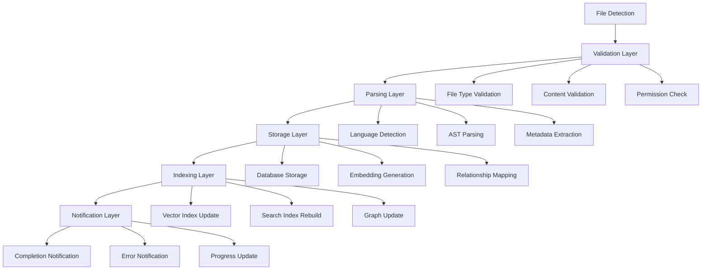

# HTDAG Automatic Code Ingestion System

This document describes the HTDAG (Hierarchical Task Directed Acyclic Graph) automatic code ingestion system integrated with PgFlow for robust, scalable, and observable code ingestion.

## Overview

The HTDAG automatic code ingestion system provides a comprehensive solution for automatically ingesting code changes into the database using a hierarchical task graph approach. It combines real-time file watching with PgFlow workflow orchestration to create a robust, scalable, and observable system.

## Architecture

### HTDAG Structure



### Key Components

1. **HTDAG.AutoCodeIngestionDAG** - Main HTDAG workflow management
2. **HTDAG.Supervisor** - Supervision tree for HTDAG components
3. **CodeFileWatcher** - Real-time file system monitoring
4. **PgFlow Integration** - Workflow orchestration and state management
5. **UnifiedIngestionService** - Code parsing and storage

## Features

### Real-time File Watching
- Monitors file system changes with debouncing
- Supports multiple file types (Elixir, Rust, TypeScript, Python, Go, etc.)
- Configurable watch directories and file filters
- Intelligent busy file detection

### HTDAG Workflow Management
- Hierarchical task execution with dependency management
- Retry logic with exponential backoff
- Progress tracking and observability
- Error handling and recovery

### PgFlow Integration
- Workflow state persistence
- Task dependency tracking
- Integration with other system workflows
- Comprehensive logging and monitoring

### Intelligent Batching
- Dependency-aware file processing
- Configurable batch sizes and concurrency limits
- Parallel processing within dependency constraints

## Configuration

### Environment Variables

```bash
# Enable HTDAG auto ingestion
export HTDAG_AUTO_INGESTION_ENABLED=true

# Watch directories (comma-separated)
export HTDAG_WATCH_DIRS="lib,packages,nexus,observer"

# Debounce delay in milliseconds
export HTDAG_DEBOUNCE_MS=500

# Maximum concurrent DAGs
export HTDAG_MAX_CONCURRENT=10

# Batch size for bulk operations
export HTDAG_BATCH_SIZE=10

# Enable dependency-aware processing
export HTDAG_DEPENDENCY_AWARE=true

# Retry configuration
export HTDAG_MAX_RETRIES=3
export HTDAG_BACKOFF_MULTIPLIER=2.0
export HTDAG_INITIAL_DELAY_MS=1000

# File filtering
export HTDAG_INCLUDE_EXT=".ex,.exs,.rs,.ts,.tsx,.js,.jsx,.py,.go,.nix,.sh,.toml,.json,.yaml,.yml,.md"
export HTDAG_IGNORE_PATTERNS="/_build/,/deps/,/node_modules/,/target/,/.git/,/.nix/,.log,.tmp,.pid,.DS_Store,Thumbs.db"

# Performance tuning
export HTDAG_NODE_TIMEOUT_MS=60000
export HTDAG_DAG_TIMEOUT_MS=300000

# Auto-detection settings
export HTDAG_AUTO_DETECT_CODEBASE=true
export HTDAG_DEFAULT_CODEBASE="singularity"
```

### Configuration in config.exs

```elixir
config :singularity, :htdag_auto_ingestion,
  enabled: true,
  watch_directories: ["lib", "packages", "nexus", "observer"],
  debounce_delay_ms: 500,
  max_concurrent_dags: 10,
  batch_size: 10,
  dependency_aware: true,
  retry_policy: %{
    max_retries: 3,
    backoff_multiplier: 2.0,
    initial_delay_ms: 1000
  },
  include_extensions: [".ex", ".exs", ".rs", ".ts", ".tsx", ".js", ".jsx", ".py", ".go", ".nix", ".sh", ".toml", ".json", ".yaml", ".yml", ".md"],
  ignore_patterns: ["/_build/", "/deps/", "/node_modules/", "/target/", "/.git/", "/.nix/", ".log", ".tmp", ".pid", ".DS_Store", "Thumbs.db"],
  node_timeout_ms: 60000,
  dag_timeout_ms: 300000,
  auto_detect_codebase: true,
  default_codebase_id: "singularity"
```

## Usage

### Starting a Single File DAG

```elixir
# Start HTDAG for a single file
{:ok, dag_id} = Singularity.HTDAG.AutoCodeIngestionDAG.start_dag(%{
  file_path: "/path/to/file.ex",
  codebase_id: "singularity",
  priority: :high
})

# Check DAG status
{:ok, status} = Singularity.HTDAG.AutoCodeIngestionDAG.get_dag_status(dag_id)

# Get DAG results
{:ok, results} = Singularity.HTDAG.AutoCodeIngestionDAG.get_dag_results(dag_id)
```

### Starting Bulk DAG

```elixir
# Start HTDAG for multiple files
{:ok, dag_ids} = Singularity.HTDAG.AutoCodeIngestionDAG.start_bulk_dag([
  "/path/to/file1.ex",
  "/path/to/file2.ex",
  "/path/to/file3.ex"
], %{
  codebase_id: "my-project",
  max_concurrent: 5,
  batch_size: 10,
  dependency_aware: true
})
```

### Monitoring DAG Progress

```elixir
# Get detailed DAG status
{:ok, status} = Singularity.HTDAG.AutoCodeIngestionDAG.get_dag_status(dag_id)

# Status includes:
# - status: "running" | "completed" | "failed"
# - current_node: current executing node
# - completed_nodes: list of completed nodes
# - failed_nodes: list of failed nodes
# - progress: completion percentage
# - node_statuses: status of each node
```

## HTDAG Nodes

### Detection Layer
- **file_detection**: Detects file changes and extracts metadata

### Validation Layer
- **file_validation**: Validates file existence and type
- **content_validation**: Validates file content and size

### Parsing Layer
- **language_detection**: Detects programming language
- **ast_parsing**: Parses code into AST using UnifiedIngestionService
- **metadata_extraction**: Extracts functions, dependencies, complexity

### Storage Layer
- **database_storage**: Stores parsed code in database
- **embedding_generation**: Generates embeddings for semantic search
- **relationship_mapping**: Maps relationships between files

### Indexing Layer
- **vector_index_update**: Updates vector database for semantic search
- **search_index_rebuild**: Rebuilds search indexes
- **graph_update**: Updates code graph with relationships

### Notification Layer
- **completion_notification**: Sends completion notifications

## Error Handling

### Retry Logic
- Configurable retry policy with exponential backoff
- Per-node retry limits
- Graceful degradation on persistent failures

### Error Recovery
- Automatic fallback to direct ingestion
- Dependency-aware retry scheduling
- Comprehensive error logging

### Monitoring
- Real-time progress tracking
- Node-level status monitoring
- Performance metrics collection

## Performance Characteristics

### Time Complexity
- File detection: O(1) per file
- Validation: O(1) per file
- Parsing: O(n) where n = file size
- Storage: O(1) per file
- Indexing: O(log n) where n = total files

### Space Complexity
- Per DAG: ~10KB state
- Per node: ~1-5KB temporary data
- Total system: ~100KB for 100 concurrent DAGs

### Typical Latencies
- Single file: 200-500ms
- Bulk processing: 1-5 seconds per batch
- Large files (>10KB): 1-3 seconds

## Integration Points

### PgFlow Workflows
- Workflow state persistence
- Task dependency tracking
- Integration with other workflows

### UnifiedIngestionService
- Code parsing and storage
- Database operations
- Embedding generation

### CodeFileWatcher
- Real-time file monitoring
- Debounced change detection
- File filtering and validation

### Supervision Tree
- Automatic restart on failure
- Graceful shutdown handling
- Process lifecycle management

## Troubleshooting

### Common Issues

1. **DAG Stuck in Running State**
   - Check node dependencies
   - Verify file permissions
   - Review error logs

2. **High Memory Usage**
   - Reduce max_concurrent_dags
   - Increase batch_size
   - Check for memory leaks

3. **Slow Processing**
   - Optimize file filters
   - Increase node timeouts
   - Review database performance

### Debugging

```elixir
# Enable debug logging
Logger.configure(level: :debug)

# Check DAG status
{:ok, status} = Singularity.HTDAG.AutoCodeIngestionDAG.get_dag_status(dag_id)

# Review node statuses
IO.inspect(status.node_statuses)

# Check workflow state
{:ok, workflow} = Singularity.Workflows.fetch_workflow(dag_id)
IO.inspect(workflow.payload)
```

## Future Enhancements

### Planned Features
- Machine learning-based dependency analysis
- Intelligent batching based on file relationships
- Real-time performance optimization
- Advanced error recovery strategies

### Scalability Improvements
- Distributed DAG execution
- Load balancing across nodes
- Dynamic resource allocation
- Advanced caching strategies

## Conclusion

The HTDAG automatic code ingestion system provides a robust, scalable, and observable solution for automatically ingesting code changes into the database. By combining real-time file watching with hierarchical task execution and PgFlow orchestration, it ensures reliable, efficient, and maintainable code ingestion at scale.