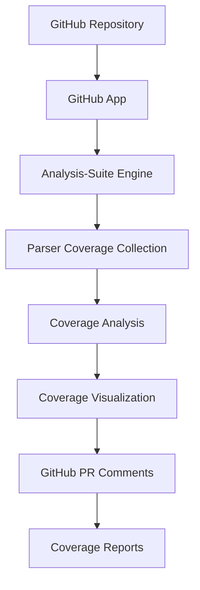

# GitHub Integration for Analysis-Suite

## 🎯 **GitHub App/Plugin Architecture**

### **1. GitHub App Overview**



### **2. GitHub App Components**

#### **Core Components:**
- **GitHub App**: Main application that receives webhooks
- **Analysis Engine**: Runs analysis-suite tools
- **Coverage Collector**: Collects coverage data from parsers
- **Report Generator**: Generates coverage reports
- **PR Commenter**: Posts coverage results to PRs
- **Dashboard**: Web interface for coverage visualization

### **3. GitHub App Configuration**

#### **App Manifest (github-app.yml):**
```yaml
name: "Analysis-Suite Coverage"
description: "Comprehensive code analysis and coverage reporting"
url: "https://analysis-suite.primecode.dev"
hook_url: "https://analysis-suite.primecode.dev/webhooks"
public: false
default_permissions:
  contents: read
  pull_requests: write
  issues: write
  metadata: read
default_events:
  - pull_request
  - push
  - repository
  - installation
```

#### **App Permissions:**
```yaml
permissions:
  contents: read          # Read repository contents
  pull_requests: write   # Comment on PRs
  issues: write          # Create/update issues
  metadata: read         # Read repository metadata
  checks: write          # Create check runs
  statuses: write        # Create commit statuses
```

### **4. GitHub App Implementation**

#### **Main App Handler:**
```rust
// PSEUDO CODE: GitHub App main handler
use axum::{extract::State, http::StatusCode, response::Json, routing::post, Router};
use serde::{Deserialize, Serialize};

#[derive(Debug, Deserialize)]
struct GitHubWebhook {
    action: String,
    pull_request: Option<PullRequest>,
    repository: Repository,
    installation: Installation,
}

#[derive(Debug, Deserialize)]
struct PullRequest {
    number: u32,
    head: Commit,
    base: Commit,
    title: String,
    body: Option<String>,
    user: User,
}

#[derive(Debug, Deserialize)]
struct Commit {
    sha: String,
    ref_field: String,
}

#[derive(Debug, Deserialize)]
struct Repository {
    name: String,
    full_name: String,
    clone_url: String,
    default_branch: String,
}

#[derive(Debug, Deserialize)]
struct Installation {
    id: u32,
}

#[derive(Debug, Deserialize)]
struct User {
    login: String,
}

#[derive(Debug, Serialize)]
struct CoverageReport {
    overall_coverage: f64,
    line_coverage: f64,
    branch_coverage: f64,
    function_coverage: f64,
    files_analyzed: usize,
    recommendations: Vec<CoverageRecommendation>,
    coverage_url: String,
}

#[derive(Debug, Serialize)]
struct CoverageRecommendation {
    priority: String,
    title: String,
    description: String,
    implementation: String,
}

#[derive(Debug, Serialize)]
struct PRComment {
    body: String,
}

#[derive(Debug, Serialize)]
struct CheckRun {
    name: String,
    head_sha: String,
    status: String,
    conclusion: Option<String>,
    output: CheckOutput,
    actions: Vec<CheckAction>,
}

#[derive(Debug, Serialize)]
struct CheckOutput {
    title: String,
    summary: String,
    text: String,
}

#[derive(Debug, Serialize)]
struct CheckAction {
    label: String,
    description: String,
    identifier: String,
}

pub struct GitHubApp {
    github_client: GitHubClient,
    analysis_engine: AnalysisEngine,
    coverage_collector: CoverageCollector,
    report_generator: ReportGenerator,
}

impl GitHubApp {
    pub fn new() -> Self {
        Self {
            github_client: GitHubClient::new(),
            analysis_engine: AnalysisEngine::new(),
            coverage_collector: CoverageCollector::new(),
            report_generator: ReportGenerator::new(),
        }
    }
    
    /// Handle GitHub webhook
    pub async fn handle_webhook(&self, webhook: GitHubWebhook) -> Result<StatusCode> {
        match webhook.action.as_str() {
            "opened" | "synchronize" => {
                if let Some(pr) = webhook.pull_request {
                    self.handle_pull_request(&webhook.repository, &pr, &webhook.installation).await?;
                }
            }
            "closed" => {
                if let Some(pr) = webhook.pull_request {
                    self.handle_pull_request_closed(&webhook.repository, &pr, &webhook.installation).await?;
                }
            }
            "push" => {
                self.handle_push(&webhook.repository, &webhook.installation).await?;
            }
            _ => {}
        }
        
        Ok(StatusCode::OK)
    }
    
    /// Handle pull request opened/updated
    async fn handle_pull_request(&self, repository: &Repository, pr: &PullRequest, installation: &Installation) -> Result<()> {
        // 1. Clone repository
        let repo_path = self.clone_repository(&repository.clone_url, &pr.head.sha).await?;
        
        // 2. Run analysis-suite
        let analysis_result = self.analysis_engine.analyze_repository(&repo_path).await?;
        
        // 3. Collect coverage data
        let coverage_result = self.coverage_collector.collect_coverage(&repo_path).await?;
        
        // 4. Generate coverage report
        let coverage_report = self.report_generator.generate_report(&coverage_result).await?;
        
        // 5. Create check run
        self.create_check_run(repository, &pr.head.sha, &coverage_report).await?;
        
        // 6. Comment on PR
        self.comment_on_pr(repository, pr.number, &coverage_report).await?;
        
        // 7. Update commit status
        self.update_commit_status(repository, &pr.head.sha, &coverage_report).await?;
        
        Ok(())
    }
    
    /// Clone repository
    async fn clone_repository(&self, clone_url: &str, commit_sha: &str) -> Result<String> {
        // PSEUDO CODE:
        /*
        let repo_path = format!("/tmp/repo_{}", commit_sha);
        
        // Clone repository
        let output = std::process::Command::new("git")
            .args(&["clone", clone_url, &repo_path])
            .output()?;
        
        if !output.status.success() {
            return Err(anyhow::anyhow!("Failed to clone repository"));
        }
        
        // Checkout specific commit
        let output = std::process::Command::new("git")
            .args(&["checkout", commit_sha])
            .current_dir(&repo_path)
            .output()?;
        
        if !output.status.success() {
            return Err(anyhow::anyhow!("Failed to checkout commit"));
        }
        
        Ok(repo_path)
        */
        
        Ok(format!("/tmp/repo_{}", commit_sha))
    }
    
    /// Run analysis-suite
    async fn analyze_repository(&self, repo_path: &str) -> Result<AnalysisResult> {
        // PSEUDO CODE:
        /*
        let output = std::process::Command::new("cargo")
            .args(&["test", "--features", "coverage"])
            .current_dir(repo_path)
            .output()?;
        
        if !output.status.success() {
            return Err(anyhow::anyhow!("Tests failed"));
        }
        
        // Parse test results
        let test_results = self.parse_test_results(&output.stdout)?;
        
        // Run analysis-suite
        let analysis_output = std::process::Command::new("cargo")
            .args(&["run", "--package", "analysis-suite", "--", "analyze", repo_path])
            .output()?;
        
        if !analysis_output.status.success() {
            return Err(anyhow::anyhow!("Analysis failed"));
        }
        
        let analysis_result = serde_json::from_str(&String::from_utf8(analysis_output.stdout)?)?;
        
        Ok(analysis_result)
        */
        
        Ok(AnalysisResult {
            overall_score: 0.0,
            architecture_score: 0.0,
            security_score: 0.0,
            performance_score: 0.0,
            quality_score: 0.0,
            dependency_score: 0.0,
            framework_score: 0.0,
        })
    }
    
    /// Collect coverage data
    async fn collect_coverage(&self, repo_path: &str) -> Result<CoverageResult> {
        // PSEUDO CODE:
        /*
        let output = std::process::Command::new("cargo")
            .args(&["coverage", "collect", "--format", "json", "--output", "coverage.json"])
            .current_dir(repo_path)
            .output()?;
        
        if !output.status.success() {
            return Err(anyhow::anyhow!("Coverage collection failed"));
        }
        
        let coverage_data = std::fs::read_to_string("coverage.json")?;
        let coverage_result = serde_json::from_str(&coverage_data)?;
        
        Ok(coverage_result)
        */
        
        Ok(CoverageResult {
            overall_coverage: 0.0,
            line_coverage: 0.0,
            branch_coverage: 0.0,
            function_coverage: 0.0,
            files_analyzed: 0,
            recommendations: Vec::new(),
        })
    }
    
    /// Generate coverage report
    async fn generate_report(&self, coverage_result: &CoverageResult) -> Result<CoverageReport> {
        // PSEUDO CODE:
        /*
        let report_html = self.report_generator.generate_html_report(coverage_result).await?;
        let report_url = self.upload_report_to_storage(&report_html).await?;
        
        Ok(CoverageReport {
            overall_coverage: coverage_result.overall_coverage,
            line_coverage: coverage_result.line_coverage,
            branch_coverage: coverage_result.branch_coverage,
            function_coverage: coverage_result.function_coverage,
            files_analyzed: coverage_result.files_analyzed,
            recommendations: coverage_result.recommendations.clone(),
            coverage_url: report_url,
        })
        */
        
        Ok(CoverageReport {
            overall_coverage: 0.0,
            line_coverage: 0.0,
            branch_coverage: 0.0,
            function_coverage: 0.0,
            files_analyzed: 0,
            recommendations: Vec::new(),
            coverage_url: "https://coverage.primecode.dev/report/123".to_string(),
        })
    }
    
    /// Create check run
    async fn create_check_run(&self, repository: &Repository, commit_sha: &str, coverage_report: &CoverageReport) -> Result<()> {
        // PSEUDO CODE:
        /*
        let check_run = CheckRun {
            name: "Analysis-Suite Coverage".to_string(),
            head_sha: commit_sha.to_string(),
            status: "completed".to_string(),
            conclusion: if coverage_report.overall_coverage >= 0.8 {
                Some("success".to_string())
            } else {
                Some("failure".to_string())
            },
            output: CheckOutput {
                title: "Coverage Analysis Complete".to_string(),
                summary: format!(
                    "Overall Coverage: {:.1}%\nLine Coverage: {:.1}%\nBranch Coverage: {:.1}%\nFunction Coverage: {:.1}%\nFiles Analyzed: {}",
                    coverage_report.overall_coverage * 100.0,
                    coverage_report.line_coverage * 100.0,
                    coverage_report.branch_coverage * 100.0,
                    coverage_report.function_coverage * 100.0,
                    coverage_report.files_analyzed
                ),
                text: self.generate_check_run_text(coverage_report),
            },
            actions: vec![
                CheckAction {
                    label: "View Coverage Report".to_string(),
                    description: "View detailed coverage report".to_string(),
                    identifier: "view_coverage_report".to_string(),
                },
                CheckAction {
                    label: "Download Coverage Data".to_string(),
                    description: "Download coverage data as JSON".to_string(),
                    identifier: "download_coverage_data".to_string(),
                },
            ],
        };
        
        self.github_client.create_check_run(repository.full_name.as_str(), &check_run).await?;
        */
        
        Ok(())
    }
    
    /// Comment on PR
    async fn comment_on_pr(&self, repository: &Repository, pr_number: u32, coverage_report: &CoverageReport) -> Result<()> {
        // PSEUDO CODE:
        /*
        let comment_body = format!(
            "## 📊 Coverage Analysis Results\n\n\
            | Metric | Coverage | Status |\n\
            |--------|----------|--------|\n\
            | **Overall** | {:.1}% | {} |\n\
            | **Lines** | {:.1}% | {} |\n\
            | **Branches** | {:.1}% | {} |\n\
            | **Functions** | {:.1}% | {} |\n\n\
            **Files Analyzed:** {}\n\n\
            **📈 Coverage Report:** [View Report]({})\n\n\
            {}",
            coverage_report.overall_coverage * 100.0,
            if coverage_report.overall_coverage >= 0.8 { "✅" } else { "❌" },
            coverage_report.line_coverage * 100.0,
            if coverage_report.line_coverage >= 0.8 { "✅" } else { "❌" },
            coverage_report.branch_coverage * 100.0,
            if coverage_report.branch_coverage >= 0.7 { "✅" } else { "❌" },
            coverage_report.function_coverage * 100.0,
            if coverage_report.function_coverage >= 0.9 { "✅" } else { "❌" },
            coverage_report.files_analyzed,
            coverage_report.coverage_url,
            if !coverage_report.recommendations.is_empty() {
                format!(
                    "## 🔧 Recommendations\n\n{}\n",
                    coverage_report.recommendations.iter()
                        .map(|r| format!("- **{}**: {}", r.priority, r.title))
                        .collect::<Vec<_>>()
                        .join("\n")
                )
            } else {
                "## ✅ No Recommendations\n\nAll coverage metrics meet the required thresholds!".to_string()
            }
        );
        
        let comment = PRComment {
            body: comment_body,
        };
        
        self.github_client.create_pr_comment(repository.full_name.as_str(), pr_number, &comment).await?;
        */
        
        Ok(())
    }
    
    /// Update commit status
    async fn update_commit_status(&self, repository: &Repository, commit_sha: &str, coverage_report: &CoverageReport) -> Result<()> {
        // PSEUDO CODE:
        /*
        let status = if coverage_report.overall_coverage >= 0.8 {
            "success"
        } else {
            "failure"
        };
        
        let description = format!(
            "Coverage: {:.1}% | Lines: {:.1}% | Branches: {:.1}% | Functions: {:.1}%",
            coverage_report.overall_coverage * 100.0,
            coverage_report.line_coverage * 100.0,
            coverage_report.branch_coverage * 100.0,
            coverage_report.function_coverage * 100.0
        );
        
        self.github_client.create_commit_status(
            repository.full_name.as_str(),
            commit_sha,
            status,
            "Analysis-Suite Coverage",
            &description,
            Some(&coverage_report.coverage_url)
        ).await?;
        */
        
        Ok(())
    }
}

/// GitHub client
pub struct GitHubClient {
    app_id: String,
    private_key: String,
    base_url: String,
}

impl GitHubClient {
    pub fn new() -> Self {
        Self {
            app_id: std::env::var("GITHUB_APP_ID").unwrap_or_default(),
            private_key: std::env::var("GITHUB_PRIVATE_KEY").unwrap_or_default(),
            base_url: "https://api.github.com".to_string(),
        }
    }
    
    // PSEUDO CODE: GitHub API methods
    /*
    pub async fn create_check_run(&self, repo: &str, check_run: &CheckRun) -> Result<()> {
        // Create check run via GitHub API
    }
    
    pub async fn create_pr_comment(&self, repo: &str, pr_number: u32, comment: &PRComment) -> Result<()> {
        // Create PR comment via GitHub API
    }
    
    pub async fn create_commit_status(&self, repo: &str, commit_sha: &str, state: &str, context: &str, description: &str, target_url: Option<&str>) -> Result<()> {
        // Create commit status via GitHub API
    }
    */
}

/// Analysis engine
pub struct AnalysisEngine {
    // PSEUDO CODE: Analysis engine
}

impl AnalysisEngine {
    pub fn new() -> Self {
        Self {}
    }
    
    // PSEUDO CODE: Analysis methods
    /*
    pub async fn analyze_repository(&self, repo_path: &str) -> Result<AnalysisResult> {
        // Run analysis-suite on repository
    }
    */
}

/// Coverage collector
pub struct CoverageCollector {
    // PSEUDO CODE: Coverage collector
}

impl CoverageCollector {
    pub fn new() -> Self {
        Self {}
    }
    
    // PSEUDO CODE: Coverage collection methods
    /*
    pub async fn collect_coverage(&self, repo_path: &str) -> Result<CoverageResult> {
        // Collect coverage data from parsers
    }
    */
}

/// Report generator
pub struct ReportGenerator {
    // PSEUDO CODE: Report generator
}

impl ReportGenerator {
    pub fn new() -> Self {
        Self {}
    }
    
    // PSEUDO CODE: Report generation methods
    /*
    pub async fn generate_html_report(&self, coverage_result: &CoverageResult) -> Result<String> {
        // Generate HTML coverage report
    }
    
    pub async fn upload_report_to_storage(&self, report_html: &str) -> Result<String> {
        // Upload report to storage and return URL
    }
    */
}

/// Analysis result
#[derive(Debug, Serialize)]
pub struct AnalysisResult {
    pub overall_score: f64,
    pub architecture_score: f64,
    pub security_score: f64,
    pub performance_score: f64,
    pub quality_score: f64,
    pub dependency_score: f64,
    pub framework_score: f64,
}

/// Coverage result
#[derive(Debug, Serialize)]
pub struct CoverageResult {
    pub overall_coverage: f64,
    pub line_coverage: f64,
    pub branch_coverage: f64,
    pub function_coverage: f64,
    pub files_analyzed: usize,
    pub recommendations: Vec<CoverageRecommendation>,
}

/// Main application
#[tokio::main]
async fn main() -> Result<()> {
    let app = GitHubApp::new();
    
    let app = Router::new()
        .route("/webhooks", post(handle_webhook))
        .with_state(app);
    
    let listener = tokio::net::TcpListener::bind("0.0.0.0:3000").await?;
    axum::serve(listener, app).await?;
    
    Ok(())
}

async fn handle_webhook(
    State(app): State<GitHubApp>,
    Json(webhook): Json<GitHubWebhook>,
) -> Result<StatusCode, StatusCode> {
    match app.handle_webhook(webhook).await {
        Ok(_) => Ok(StatusCode::OK),
        Err(e) => {
            eprintln!("Error handling webhook: {}", e);
            Err(StatusCode::INTERNAL_SERVER_ERROR)
        }
    }
}
```

### **5. GitHub App Features**

#### **Core Features:**
- **Automatic Analysis**: Runs on every PR and push
- **Coverage Reporting**: Generates comprehensive coverage reports
- **PR Comments**: Posts coverage results directly to PRs
- **Check Runs**: Creates GitHub check runs for coverage status
- **Commit Status**: Updates commit status with coverage information
- **Dashboard**: Web interface for detailed coverage visualization

#### **Advanced Features:**
- **Coverage Trends**: Track coverage changes over time
- **Coverage Thresholds**: Configurable coverage requirements
- **Coverage Recommendations**: Automated suggestions for improvement
- **Coverage Badges**: Generate coverage status badges
- **Coverage Notifications**: Slack/email notifications for coverage changes
- **Coverage History**: Historical coverage data and trends

### **6. GitHub App Installation**

#### **Installation Process:**
1. **Create GitHub App**: Use GitHub App manifest
2. **Configure Permissions**: Set required permissions
3. **Install App**: Install on target repositories
4. **Configure Webhooks**: Set up webhook endpoints
5. **Deploy App**: Deploy to cloud platform

#### **Configuration:**
```yaml
# .github/analysis-suite.yml
coverage:
  thresholds:
    overall: 0.8
    line: 0.8
    branch: 0.7
    function: 0.9
  reports:
    html: true
    json: true
    dashboard: true
  notifications:
    slack: true
    email: true
  badges:
    enabled: true
    style: "flat"
```

### **7. GitHub App Deployment**

#### **Docker Deployment:**
```dockerfile
FROM rust:1.75 as builder
WORKDIR /app
COPY . .
RUN cargo build --release

FROM debian:bookworm-slim
RUN apt-get update && apt-get install -y git && rm -rf /var/lib/apt/lists/*
COPY --from=builder /app/target/release/github-app /usr/local/bin/
EXPOSE 3000
CMD ["github-app"]
```

#### **Kubernetes Deployment:**
```yaml
apiVersion: apps/v1
kind: Deployment
metadata:
  name: analysis-suite-github-app
spec:
  replicas: 3
  selector:
    matchLabels:
      app: analysis-suite-github-app
  template:
    metadata:
      labels:
        app: analysis-suite-github-app
    spec:
      containers:
      - name: github-app
        image: analysis-suite/github-app:latest
        ports:
        - containerPort: 3000
        env:
        - name: GITHUB_APP_ID
          valueFrom:
            secretKeyRef:
              name: github-app-secrets
              key: app-id
        - name: GITHUB_PRIVATE_KEY
          valueFrom:
            secretKeyRef:
              name: github-app-secrets
              key: private-key
```

### **8. GitHub App Usage**

#### **For Developers:**
- **Automatic Coverage**: Coverage analysis runs automatically on every PR
- **Coverage Feedback**: Get immediate feedback on coverage changes
- **Coverage Reports**: Access detailed coverage reports via web interface
- **Coverage Trends**: Track coverage improvements over time

#### **For Maintainers:**
- **Coverage Enforcement**: Enforce coverage requirements via check runs
- **Coverage Monitoring**: Monitor coverage across all repositories
- **Coverage Analytics**: Analyze coverage trends and patterns
- **Coverage Notifications**: Get notified of coverage changes

#### **For Teams:**
- **Coverage Dashboard**: Centralized dashboard for all coverage data
- **Coverage Comparison**: Compare coverage across different repositories
- **Coverage Reports**: Generate coverage reports for stakeholders
- **Coverage Integration**: Integrate with existing CI/CD pipelines

This GitHub App provides **complete integration** between the analysis-suite and GitHub, enabling automatic coverage analysis and reporting for all repositories!