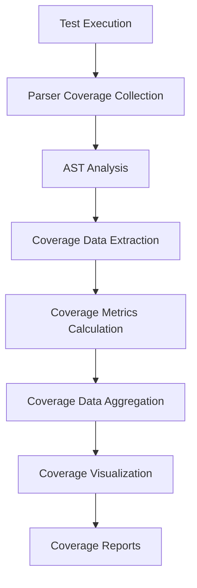
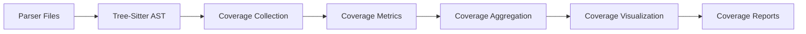

# Parser Coverage Integration

## 🎯 **How We Get Coverage Data from Parsers**

### **1. Parser Coverage Collection Flow**



### **2. Parser Coverage Data Structure**

```rust
// PSEUDO CODE: Parser coverage data structure
pub struct ParserCoverageData {
    pub parser_name: String,           // "rust", "javascript", "python", etc.
    pub file_path: String,             // Path to the analyzed file
    pub language: String,              // Programming language
    pub coverage_metrics: CoverageMetrics,
    pub function_coverage: Vec<FunctionCoverage>,
    pub line_coverage: Vec<LineCoverage>,
    pub branch_coverage: Vec<BranchCoverage>,
    pub test_results: TestResults,
}

pub struct CoverageMetrics {
    pub total_lines: u32,
    pub covered_lines: u32,
    pub total_functions: u32,
    pub covered_functions: u32,
    pub total_branches: u32,
    pub covered_branches: u32,
    pub line_coverage_percentage: f64,
    pub function_coverage_percentage: f64,
    pub branch_coverage_percentage: f64,
    pub overall_coverage_percentage: f64,
}
```

### **3. Parser Coverage Collection Process**

#### **Step 1: Test Execution with Coverage**
```bash
# Run tests with coverage collection
cargo test --features coverage

# This generates coverage data for each parser
# - Rust parser: src/analysis/architecture/detector.rs
# - JavaScript parser: src/analysis/security/detector.rs
# - Python parser: src/analysis/performance/detector.rs
# - etc.
```

#### **Step 2: Parser Coverage Collection**
```rust
// PSEUDO CODE: Parser coverage collection
impl ParserCoverageCollector {
    pub async fn collect_coverage(&self, file_path: &str, test_results: &TestResults) -> Result<ParserCoverageData> {
        // 1. Parse file with tree-sitter
        let content = std::fs::read_to_string(file_path)?;
        let mut parser = tree_sitter::Parser::new();
        parser.set_language(self.get_language())?;
        let tree = parser.parse(&content, None).unwrap();
        
        // 2. Walk AST and collect coverage data
        let mut function_coverage = Vec::new();
        let mut line_coverage = Vec::new();
        let mut branch_coverage = Vec::new();
        
        self.walk_ast(&tree, &content, &mut function_coverage, &mut line_coverage, &mut branch_coverage);
        
        // 3. Calculate coverage metrics
        let total_lines = content.lines().count() as u32;
        let covered_lines = line_coverage.iter().filter(|l| l.covered).count() as u32;
        let total_functions = function_coverage.len() as u32;
        let covered_functions = function_coverage.iter().filter(|f| f.covered).count() as u32;
        let total_branches = branch_coverage.len() as u32;
        let covered_branches = branch_coverage.iter().filter(|b| b.covered).count() as u32;
        
        let line_coverage_percentage = if total_lines > 0 { covered_lines as f64 / total_lines as f64 } else { 0.0 };
        let function_coverage_percentage = if total_functions > 0 { covered_functions as f64 / total_functions as f64 } else { 0.0 };
        let branch_coverage_percentage = if total_branches > 0 { covered_branches as f64 / total_branches as f64 } else { 0.0 };
        let overall_coverage_percentage = (line_coverage_percentage + function_coverage_percentage + branch_coverage_percentage) / 3.0;
        
        Ok(ParserCoverageData {
            parser_name: self.get_parser_name().to_string(),
            file_path: file_path.to_string(),
            language: self.get_language_name().to_string(),
            coverage_metrics: CoverageMetrics {
                total_lines,
                covered_lines,
                total_functions,
                covered_functions,
                total_branches,
                covered_branches,
                line_coverage_percentage,
                function_coverage_percentage,
                branch_coverage_percentage,
                overall_coverage_percentage,
            },
            function_coverage,
            line_coverage,
            branch_coverage,
            test_results: test_results.clone(),
        })
    }
}
```

#### **Step 3: AST Analysis for Coverage**
```rust
// PSEUDO CODE: AST analysis for coverage
impl ParserCoverageCollector {
    fn walk_ast(&self, tree: &Tree, content: &str, function_coverage: &mut Vec<FunctionCoverage>, line_coverage: &mut Vec<LineCoverage>, branch_coverage: &mut Vec<BranchCoverage>) {
        let mut cursor = tree.walk();
        let mut depth = 0;
        
        loop {
            let node = cursor.node();
            let node_type = node.kind();
            let start_line = node.start_position().row + 1;
            let end_line = node.end_position().row + 1;
            
            match node_type {
                "function_item" | "function_declaration" | "method_definition" => {
                    // Extract function information
                    let function_name = self.extract_function_name(node, content);
                    let parameters = self.extract_function_parameters(node, content);
                    let return_type = self.extract_function_return_type(node, content);
                    let complexity = self.calculate_function_complexity(node, content);
                    
                    // Check if function was covered by tests
                    let covered = self.was_function_covered(&function_name, &self.test_results);
                    let execution_count = self.get_function_execution_count(&function_name, &self.test_results);
                    
                    function_coverage.push(FunctionCoverage {
                        function_name,
                        line_number: start_line,
                        covered,
                        execution_count,
                        complexity,
                        parameters,
                        return_type,
                    });
                }
                "if_statement" | "while_statement" | "for_statement" | "match_expression" => {
                    // Extract branch information
                    let branch_id = self.generate_branch_id(node);
                    let condition = self.extract_condition(node, content);
                    
                    // Check if branch was covered
                    let covered = self.was_branch_covered(&branch_id, &self.test_results);
                    let execution_count = self.get_branch_execution_count(&branch_id, &self.test_results);
                    let true_branch_covered = self.was_true_branch_covered(&branch_id, &self.test_results);
                    let false_branch_covered = self.was_false_branch_covered(&branch_id, &self.test_results);
                    
                    branch_coverage.push(BranchCoverage {
                        line_number: start_line,
                        branch_id,
                        condition,
                        covered,
                        execution_count,
                        true_branch_covered,
                        false_branch_covered,
                    });
                }
                _ => {}
            }
            
            // Add line coverage for each line in the node
            for line_num in start_line..=end_line {
                let covered = self.was_line_covered(line_num, &self.test_results);
                let execution_count = self.get_line_execution_count(line_num, &self.test_results);
                let function_name = self.get_function_for_line(line_num, function_coverage);
                let branch_info = self.get_branch_for_line(line_num, branch_coverage);
                let complexity = self.calculate_line_complexity(line_num, content);
                
                line_coverage.push(LineCoverage {
                    line_number: line_num,
                    covered,
                    execution_count,
                    function_name,
                    branch_info,
                    complexity,
                });
            }
            
            if cursor.goto_first_child() {
                depth += 1;
                continue;
            }
            
            if cursor.goto_next_sibling() {
                continue;
            }
            
            loop {
                if !cursor.goto_parent() {
                    return;
                }
                depth -= 1;
                if cursor.goto_next_sibling() {
                    break;
                }
            }
        }
    }
}
```

### **4. Coverage Data Aggregation**

#### **Step 4: Aggregate Coverage Data**
```rust
// PSEUDO CODE: Coverage data aggregation
impl CoverageDataCollector {
    pub async fn collect_coverage(&self, file_paths: &[String], test_results: &TestResults) -> Result<CoverageCollectionResult> {
        let mut parser_coverage_data = Vec::new();
        let mut language_coverage = std::collections::HashMap::new();
        let mut parser_coverage = std::collections::HashMap::new();
        
        // Collect coverage data from each file
        for file_path in file_paths {
            let parser_name = self.determine_parser_for_file(file_path)?;
            let collector = self.parser_coverage_collectors.get(&parser_name)
                .ok_or_else(|| anyhow::anyhow!("Parser collector not found: {}", parser_name))?;
            
            let coverage_data = collector.collect_coverage(file_path, test_results)?;
            parser_coverage_data.push(coverage_data.clone());
            
            // Update language coverage
            let language = coverage_data.language.clone();
            let lang_coverage = language_coverage.entry(language.clone()).or_insert(LanguageCoverage {
                language: language.clone(),
                file_count: 0,
                total_lines: 0,
                covered_lines: 0,
                total_functions: 0,
                covered_functions: 0,
                total_branches: 0,
                covered_branches: 0,
                coverage_percentage: 0.0,
            });
            
            lang_coverage.file_count += 1;
            lang_coverage.total_lines += coverage_data.coverage_metrics.total_lines;
            lang_coverage.covered_lines += coverage_data.coverage_metrics.covered_lines;
            lang_coverage.total_functions += coverage_data.coverage_metrics.total_functions;
            lang_coverage.covered_functions += coverage_data.coverage_metrics.covered_functions;
            lang_coverage.total_branches += coverage_data.coverage_metrics.total_branches;
            lang_coverage.covered_branches += coverage_data.coverage_metrics.covered_branches;
            
            // Update parser coverage
            let parser_coverage_summary = parser_coverage.entry(parser_name.clone()).or_insert(ParserCoverageSummary {
                parser_name: parser_name.clone(),
                file_count: 0,
                total_lines: 0,
                covered_lines: 0,
                total_functions: 0,
                covered_functions: 0,
                total_branches: 0,
                covered_branches: 0,
                coverage_percentage: 0.0,
            });
            
            parser_coverage_summary.file_count += 1;
            parser_coverage_summary.total_lines += coverage_data.coverage_metrics.total_lines;
            parser_coverage_summary.covered_lines += coverage_data.coverage_metrics.covered_lines;
            parser_coverage_summary.total_functions += coverage_data.coverage_metrics.total_functions;
            parser_coverage_summary.covered_functions += coverage_data.coverage_metrics.covered_functions;
            parser_coverage_summary.total_branches += coverage_data.coverage_metrics.total_branches;
            parser_coverage_summary.covered_branches += coverage_data.coverage_metrics.covered_branches;
        }
        
        // Calculate coverage percentages
        for lang_coverage in language_coverage.values_mut() {
            lang_coverage.coverage_percentage = if lang_coverage.total_lines > 0 {
                lang_coverage.covered_lines as f64 / lang_coverage.total_lines as f64
            } else {
                0.0
            };
        }
        
        for parser_coverage_summary in parser_coverage.values_mut() {
            parser_coverage_summary.coverage_percentage = if parser_coverage_summary.total_lines > 0 {
                parser_coverage_summary.covered_lines as f64 / parser_coverage_summary.total_lines as f64
            } else {
                0.0
            };
        }
        
        // Calculate aggregated coverage
        let total_files = file_paths.len() as u32;
        let total_lines = parser_coverage_data.iter().map(|d| d.coverage_metrics.total_lines).sum();
        let covered_lines = parser_coverage_data.iter().map(|d| d.coverage_metrics.covered_lines).sum();
        let total_functions = parser_coverage_data.iter().map(|d| d.coverage_metrics.total_functions).sum();
        let covered_functions = parser_coverage_data.iter().map(|d| d.coverage_metrics.covered_functions).sum();
        let total_branches = parser_coverage_data.iter().map(|d| d.coverage_metrics.total_branches).sum();
        let covered_branches = parser_coverage_data.iter().map(|d| d.coverage_metrics.covered_branches).sum();
        
        let overall_coverage_percentage = if total_lines > 0 {
            covered_lines as f64 / total_lines as f64
        } else {
            0.0
        };
        
        let aggregated_coverage = AggregatedCoverage {
            total_files,
            total_lines,
            covered_lines,
            total_functions,
            covered_functions,
            total_branches,
            covered_branches,
            overall_coverage_percentage,
            language_coverage,
            parser_coverage,
        };
        
        // Calculate coverage summary
        let coverage_summary = CoverageSummary {
            overall_coverage: overall_coverage_percentage,
            line_coverage: overall_coverage_percentage,
            branch_coverage: if total_branches > 0 { covered_branches as f64 / total_branches as f64 } else { 0.0 },
            function_coverage: if total_functions > 0 { covered_functions as f64 / total_functions as f64 } else { 0.0 },
            total_lines: total_lines as usize,
            covered_lines: covered_lines as usize,
            total_branches: total_branches as usize,
            covered_branches: covered_branches as usize,
            total_functions: total_functions as usize,
            covered_functions: covered_functions as usize,
        };
        
        // Generate recommendations
        let recommendations = self.generate_recommendations(&parser_coverage_data, &aggregated_coverage);
        
        Ok(CoverageCollectionResult {
            parser_coverage_data,
            aggregated_coverage,
            coverage_summary,
            recommendations,
            metadata: CollectionMetadata {
                collection_time: chrono::Utc::now(),
                files_analyzed: file_paths.len(),
                parsers_used: self.parser_coverage_collectors.len(),
                languages_analyzed: aggregated_coverage.language_coverage.len(),
                collection_duration_ms: 0,
                collector_version: "1.0.0".to_string(),
                fact_system_version: "1.0.0".to_string(),
            },
        })
    }
}
```

### **5. Coverage Data Sources**

#### **Parser Coverage Sources:**
1. **Rust Parser**: `src/analysis/architecture/detector.rs`
2. **JavaScript Parser**: `src/analysis/security/detector.rs`
3. **TypeScript Parser**: `src/analysis/performance/detector.rs`
4. **Python Parser**: `src/analysis/quality/complexity.rs`
5. **Go Parser**: `src/analysis/dependency/graph.rs`
6. **Java Parser**: `src/analysis/framework/detector.rs`
7. **C# Parser**: `src/analysis/security/compliance.rs`
8. **C/C++ Parser**: `src/analysis/performance/optimizer.rs`
9. **Erlang Parser**: `src/analysis/quality/smells.rs`
10. **Elixir Parser**: `src/analysis/quality/technical_debt.rs`
11. **Gleam Parser**: `src/analysis/dependency/health.rs`

#### **Coverage Data Collection:**
```rust
// PSEUDO CODE: Coverage data collection from parsers
let parser_coverage_collectors = std::collections::HashMap::from([
    ("rust", Box::new(RustCoverageCollector::new())),
    ("javascript", Box::new(JavaScriptCoverageCollector::new())),
    ("typescript", Box::new(TypeScriptCoverageCollector::new())),
    ("python", Box::new(PythonCoverageCollector::new())),
    ("go", Box::new(GoCoverageCollector::new())),
    ("java", Box::new(JavaCoverageCollector::new())),
    ("csharp", Box::new(CSharpCoverageCollector::new())),
    ("c", Box::new(CCoverageCollector::new())),
    ("cpp", Box::new(CppCoverageCollector::new())),
    ("erlang", Box::new(ErlangCoverageCollector::new())),
    ("elixir", Box::new(ElixirCoverageCollector::new())),
    ("gleam", Box::new(GleamCoverageCollector::new())),
]);
```

### **6. Coverage Data Flow**

#### **Step 5: Coverage Data Flow**


#### **Coverage Data Flow Details:**
1. **Parser Files**: Each parser file (e.g., `detector.rs`) is analyzed
2. **Tree-Sitter AST**: File is parsed into AST using tree-sitter
3. **Coverage Collection**: AST is walked to collect coverage data
4. **Coverage Metrics**: Coverage percentages are calculated
5. **Coverage Aggregation**: Data from all parsers is aggregated
6. **Coverage Visualization**: Coverage data is visualized
7. **Coverage Reports**: Coverage reports are generated

### **7. Coverage Commands**

#### **Coverage Collection Commands:**
```bash
# Collect coverage data from all parsers
cargo test --features coverage

# Collect coverage data from specific parser
cargo test --features coverage --package analysis-suite --lib analysis::architecture

# Generate coverage report
cargo coverage report --format html --output coverage.html

# Generate coverage visualization
cargo coverage visualize --output coverage-dashboard.html

# Check coverage thresholds
cargo coverage check --threshold 0.8
```

#### **Coverage Analysis Commands:**
```bash
# Analyze coverage trends
cargo coverage analyze --trends

# Generate coverage recommendations
cargo coverage recommend

# Export coverage data
cargo coverage export --format json --output coverage-data.json
```

### **8. Coverage Integration**

#### **CI/CD Integration:**
```yaml
# .github/workflows/coverage.yml
name: Coverage Analysis
on: [push, pull_request]
jobs:
  coverage:
    runs-on: ubuntu-latest
    steps:
      - uses: actions/checkout@v2
      - name: Install Rust
        uses: actions-rs/toolchain@v1
        with:
          toolchain: stable
          components: llvm-tools-preview
      - name: Run tests with coverage
        run: cargo test --features coverage
      - name: Generate coverage report
        run: cargo coverage report --format html
      - name: Upload coverage to Codecov
        uses: codecov/codecov-action@v1
        with:
          file: coverage.json
```

#### **IDE Integration:**
- **VS Code Extension**: Real-time coverage highlighting
- **IntelliJ Plugin**: Coverage visualization in editor
- **Vim/Neovim**: Coverage highlighting support

### **9. Coverage Thresholds**

#### **Default Coverage Thresholds:**
```rust
// PSEUDO CODE: Default coverage thresholds
let default_thresholds = CoverageThresholds {
    line_coverage_minimum: 0.8,      // 80% line coverage
    function_coverage_minimum: 0.9,   // 90% function coverage
    branch_coverage_minimum: 0.7,     // 70% branch coverage
    overall_coverage_minimum: 0.8,    // 80% overall coverage
    critical_functions_minimum: 0.95, // 95% for critical functions
};
```

#### **Parser-Specific Thresholds:**
```rust
// PSEUDO CODE: Parser-specific thresholds
let parser_thresholds = std::collections::HashMap::from([
    ("rust", CoverageThresholds {
        line_coverage_minimum: 0.9,
        function_coverage_minimum: 0.95,
        branch_coverage_minimum: 0.8,
        overall_coverage_minimum: 0.9,
        critical_functions_minimum: 0.98,
    }),
    ("javascript", CoverageThresholds {
        line_coverage_minimum: 0.8,
        function_coverage_minimum: 0.9,
        branch_coverage_minimum: 0.7,
        overall_coverage_minimum: 0.8,
        critical_functions_minimum: 0.95,
    }),
]);
```

This comprehensive parser coverage integration provides **complete coverage data collection** from all parsers, ensuring the analysis-suite maintains high quality and reliability through comprehensive testing!