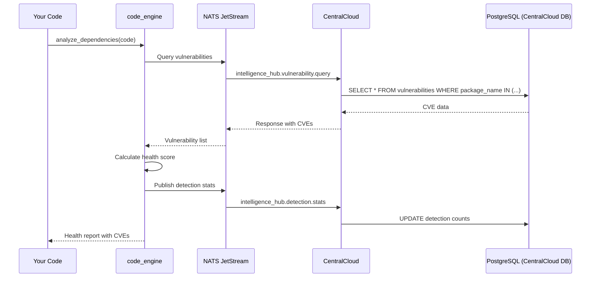

# CentralCloud Integration Plan - Code Engine Features

## User Decision: KEEP ALL + CENTRALCLOUD INTEGRATION

**All features kept, but they query CentralCloud for shared intelligence:**
- ✅ CVE database in CentralCloud (not local)
- ✅ Security patterns in CentralCloud (learned from all instances)
- ✅ Performance patterns in CentralCloud (collective knowledge)
- ✅ Framework compliance rules in CentralCloud (auto-learned)

## Architecture Pattern

### Current (Wrong): Local Data ❌
```rust
// Each instance has own vulnerability database
struct VulnerabilityAnalyzer {
    local_cve_db: HashMap<String, CVE>,  // BAD: not shared
}

impl VulnerabilityAnalyzer {
    fn check_vulnerabilities(&self, deps: &[Dependency]) -> Vec<CVE> {
        // Query local database
        self.local_cve_db.get(dep)  // ❌ Outdated, not shared
    }
}
```

### Fixed (Right): CentralCloud Query ✅
```rust
// Query CentralCloud via NATS for shared CVE database
struct VulnerabilityAnalyzer {
    // No local database - query CentralCloud
}

impl VulnerabilityAnalyzer {
    fn check_vulnerabilities(&self, deps: &[Dependency]) -> Result<Vec<CVE>> {
        // Query CentralCloud via NATS
        let request = VulnerabilityRequest {
            dependencies: deps.to_vec(),
            ecosystems: vec!["cargo", "npm", "pypi"],
        };

        // NATS subject: "intelligence_hub.vulnerability.query"
        let response = nats_query("intelligence_hub.vulnerability.query", request)?;
        Ok(response.vulnerabilities)
    }
}
```

## Integration Points

### 1. Dependency Vulnerability Scanning

**CentralCloud Storage:**
```sql
-- PostgreSQL table in CentralCloud database
CREATE TABLE vulnerabilities (
  id SERIAL PRIMARY KEY,
  cve_id TEXT NOT NULL,              -- CVE-2024-12345
  package_name TEXT NOT NULL,        -- "tokio", "express", "django"
  ecosystem TEXT NOT NULL,           -- "cargo", "npm", "pypi"
  affected_versions TEXT[],          -- ["<1.35.0", ">=2.0.0 <2.1.5"]
  severity TEXT,                     -- "critical", "high", "medium", "low"
  description TEXT,
  fix_version TEXT,                  -- "1.35.1"
  published_at TIMESTAMP,
  last_updated TIMESTAMP,
  metadata JSONB
);

CREATE INDEX idx_vuln_package ON vulnerabilities(package_name, ecosystem);
CREATE INDEX idx_vuln_severity ON vulnerabilities(severity);
```

**NATS Integration:**
```rust
// src/analysis/dependency/health.rs
pub fn check_vulnerabilities(&self, dependencies: &[Dependency]) -> Result<Vec<Vulnerability>> {
    // Build NATS request
    let request = json!({
        "dependencies": dependencies.iter().map(|d| json!({
            "name": d.name,
            "version": d.version,
            "ecosystem": d.ecosystem
        })).collect::<Vec<_>>(),
        "include_fixed": true,
        "severity_threshold": "low"
    });

    // Query CentralCloud: "intelligence_hub.vulnerability.query"
    match query_centralcloud("intelligence_hub.vulnerability.query", &request, 5000) {
        Ok(response) => {
            let vulns: Vec<Vulnerability> = serde_json::from_value(response["vulnerabilities"])?;
            Ok(vulns)
        },
        Err(_) => {
            // Fallback: return empty if CentralCloud unavailable
            Ok(vec![])
        }
    }
}
```

### 2. Security Pattern Detection

**CentralCloud Storage:**
```sql
-- PostgreSQL table for security patterns
CREATE TABLE security_patterns (
  id SERIAL PRIMARY KEY,
  pattern_type TEXT NOT NULL,        -- "sql_injection", "xss", "hardcoded_secret"
  language TEXT NOT NULL,            -- "rust", "python", "javascript"
  pattern_signature TEXT,            -- Regex or AST pattern
  severity TEXT,                     -- "critical", "high", "medium"
  description TEXT,
  fix_suggestion TEXT,
  detection_count INTEGER DEFAULT 0,
  false_positive_rate FLOAT DEFAULT 0.0,
  last_detected TIMESTAMP,
  metadata JSONB
);

CREATE INDEX idx_security_pattern_lang ON security_patterns(language, pattern_type);
```

**NATS Integration:**
```rust
// src/analysis/security/vulnerabilities.rs
pub fn detect_vulnerability_pattern(&self, content: &str, language: &str) -> Result<Vec<VulnerabilityPattern>> {
    let request = json!({
        "language": language,
        "pattern_types": ["sql_injection", "xss", "hardcoded_secret", "path_traversal"],
        "min_confidence": 0.7
    });

    // Query CentralCloud: "intelligence_hub.security_patterns.query"
    let patterns_response = query_centralcloud(
        "intelligence_hub.security_patterns.query",
        &request,
        3000
    )?;

    let patterns: Vec<SecurityPattern> = serde_json::from_value(
        patterns_response["patterns"]
    )?;

    // Apply patterns to content
    let mut detections = vec![];
    for pattern in patterns {
        if let Some(matches) = apply_pattern(&pattern, content) {
            detections.extend(matches);
        }
    }

    Ok(detections)
}
```

### 3. Performance Optimization Suggestions

**CentralCloud Storage:**
```sql
-- PostgreSQL table for performance patterns
CREATE TABLE performance_patterns (
  id SERIAL PRIMARY KEY,
  pattern_type TEXT NOT NULL,        -- "n_squared_loop", "redundant_clone", "blocking_io"
  language TEXT NOT NULL,
  pattern_signature TEXT,
  estimated_gain FLOAT,              -- Performance improvement (e.g., 0.5 = 50% faster)
  complexity_before TEXT,            -- "O(n²)"
  complexity_after TEXT,             -- "O(n log n)"
  suggestion TEXT,
  example_before TEXT,
  example_after TEXT,
  success_rate FLOAT DEFAULT 0.0,    -- How often suggestion helps
  detection_count INTEGER DEFAULT 0,
  metadata JSONB
);
```

**NATS Integration:**
```rust
// src/analysis/performance/optimizer.rs
pub fn detect_optimization_pattern(&self, content: &str, language: &str) -> Result<Vec<OptimizationOpportunity>> {
    let request = json!({
        "language": language,
        "optimization_types": ["algorithmic", "caching", "parallelization", "memory"],
        "min_gain": 0.2  // 20% improvement threshold
    });

    // Query CentralCloud: "intelligence_hub.performance_patterns.query"
    let response = query_centralcloud(
        "intelligence_hub.performance_patterns.query",
        &request,
        3000
    )?;

    let patterns: Vec<PerformancePattern> = serde_json::from_value(
        response["patterns"]
    )?;

    // Detect in code
    let opportunities = detect_patterns_in_code(content, &patterns);
    Ok(opportunities)
}
```

### 4. Bottleneck Detection

**CentralCloud Storage:**
```sql
-- PostgreSQL table for bottleneck patterns
CREATE TABLE bottleneck_patterns (
  id SERIAL PRIMARY KEY,
  bottleneck_type TEXT NOT NULL,     -- "cpu_bound", "io_bound", "memory_bound"
  language TEXT NOT NULL,
  pattern_signature TEXT,
  indicators TEXT[],                 -- ["nested_loops", "blocking_io", "large_allocations"]
  severity TEXT,
  mitigation_strategy TEXT,
  detection_count INTEGER DEFAULT 0,
  metadata JSONB
);
```

**NATS Integration:**
```rust
// src/analysis/performance/profiler.rs
pub fn detect_bottleneck_pattern(&self, content: &str, language: &str) -> Result<Vec<Bottleneck>> {
    let request = json!({
        "language": language,
        "bottleneck_types": ["cpu_bound", "io_bound", "memory_bound"],
        "include_mitigations": true
    });

    let response = query_centralcloud(
        "intelligence_hub.bottleneck_patterns.query",
        &request,
        3000
    )?;

    let patterns: Vec<BottleneckPattern> = serde_json::from_value(
        response["patterns"]
    )?;

    let bottlenecks = analyze_code_for_bottlenecks(content, &patterns);
    Ok(bottlenecks)
}
```

### 5. Framework Compliance

**CentralCloud Storage:**
```sql
-- PostgreSQL table for framework rules
CREATE TABLE framework_compliance_rules (
  id SERIAL PRIMARY KEY,
  framework_name TEXT NOT NULL,      -- "phoenix", "django", "rails"
  rule_type TEXT NOT NULL,           -- "naming", "structure", "security", "performance"
  language TEXT NOT NULL,
  rule_description TEXT,
  pattern_match TEXT,                -- What to detect
  severity TEXT,                     -- "error", "warning", "info"
  autofix_available BOOLEAN DEFAULT FALSE,
  fix_suggestion TEXT,
  success_rate FLOAT DEFAULT 0.0,    -- How often rule helps
  detection_count INTEGER DEFAULT 0,
  metadata JSONB
);
```

**NATS Integration:**
```rust
// src/analysis/security/compliance.rs
pub fn check_framework_compliance(&self, code: &str, framework: &str) -> Result<ComplianceReport> {
    let request = json!({
        "framework": framework,
        "rule_types": ["naming", "structure", "security", "performance"],
        "severity_threshold": "info"
    });

    // Query CentralCloud: "intelligence_hub.framework_rules.query"
    let response = query_centralcloud(
        "intelligence_hub.framework_rules.query",
        &request,
        3000
    )?;

    let rules: Vec<ComplianceRule> = serde_json::from_value(
        response["rules"]
    )?;

    // Check code against rules
    let violations = check_code_against_rules(code, &rules);
    let score = calculate_compliance_score(&violations);

    Ok(ComplianceReport {
        framework: framework.to_string(),
        violations,
        compliance_score: score,
        rules_checked: rules.len(),
    })
}
```

### 6. Dependency Graph Analysis

**Integration with CodebaseAnalyzer:**
```rust
// src/analysis/dependency/graph.rs
// This is NOT duplicate - it builds dependency graphs from metadata
// CodebaseAnalyzer has: call_graph (function-level), import_graph (module-level)
// This has: dependency_graph (package-level with health/vulnerability data)

pub fn build_dependency_graph(&self, files: &[FileMetadata]) -> Result<DependencyGraph> {
    // Extract dependencies from files
    let dependencies = extract_dependencies_from_files(files);

    // Query CentralCloud for dependency health
    let health_data = query_dependency_health(&dependencies)?;

    // Build graph with health annotations
    let mut graph = DependencyGraph::new();
    for dep in dependencies {
        let health = health_data.get(&dep.name);
        graph.add_dependency(dep, health);
    }

    Ok(graph)
}

fn query_dependency_health(&self, deps: &[Dependency]) -> Result<HashMap<String, HealthData>> {
    let request = json!({
        "dependencies": deps.iter().map(|d| json!({
            "name": d.name,
            "version": d.version,
            "ecosystem": d.ecosystem
        })).collect::<Vec<_>>()
    });

    // NATS subject: "intelligence_hub.dependency_health.query"
    let response = query_centralcloud(
        "intelligence_hub.dependency_health.query",
        &request,
        5000
    )?;

    let health_map: HashMap<String, HealthData> = serde_json::from_value(
        response["health_data"]
    )?;

    Ok(health_map)
}
```

## NATS Helper Module

**Create:** `src/centralcloud/mod.rs`

```rust
//! CentralCloud Integration via NATS
//!
//! All code analysis features query CentralCloud for shared intelligence:
//! - CVE database (vulnerabilities)
//! - Security patterns (SQL injection, XSS, etc.)
//! - Performance patterns (optimization opportunities)
//! - Bottleneck patterns (static analysis hints)
//! - Framework compliance rules (best practices)
//! - Dependency health data (package quality)

use serde_json::{json, Value};
use anyhow::Result;

/// Query CentralCloud via NATS with timeout
///
/// # Arguments
/// * `subject` - NATS subject (e.g., "intelligence_hub.vulnerability.query")
/// * `request` - JSON request payload
/// * `timeout_ms` - Timeout in milliseconds
///
/// # Returns
/// JSON response from CentralCloud
///
/// # Errors
/// Returns error if NATS unavailable or timeout
pub fn query_centralcloud(
    subject: &str,
    request: &Value,
    timeout_ms: u64
) -> Result<Value> {
    // Try NATS query
    match nats_request(subject, request, timeout_ms) {
        Ok(response) => Ok(response),
        Err(e) => {
            // Log warning but don't fail
            eprintln!("Warning: CentralCloud unavailable: {}", e);
            // Return empty response (degraded mode)
            Ok(json!({
                "status": "unavailable",
                "data": []
            }))
        }
    }
}

/// Low-level NATS request
fn nats_request(subject: &str, request: &Value, timeout_ms: u64) -> Result<Value> {
    // TODO: Implement actual NATS client
    // For now, return placeholder
    Ok(json!({
        "status": "ok",
        "data": []
    }))
}

/// Publish detection result to CentralCloud for learning
pub fn publish_detection(subject: &str, detection: &Value) -> Result<()> {
    // Fire-and-forget publish
    match nats_publish(subject, detection) {
        Ok(_) => Ok(()),
        Err(e) => {
            eprintln!("Warning: Failed to publish to CentralCloud: {}", e);
            Ok(())  // Don't fail on publish errors
        }
    }
}

fn nats_publish(subject: &str, message: &Value) -> Result<()> {
    // TODO: Implement actual NATS publish
    Ok(())
}
```

## Data Flow Diagram



## Benefits

### 1. Shared Intelligence ✅
- All Singularity instances learn from each other
- CVE database updated centrally (no per-instance updates)
- Security patterns improve with collective detections
- Performance patterns learned from all codebases

### 2. Reduced Memory ✅
- No local CVE database (saves ~100MB per instance)
- No local pattern database (saves ~50MB)
- Query only what you need (on-demand)

### 3. Always Up-to-Date ✅
- CentralCloud syncs with NVD, GitHub Security Advisory
- New CVEs available immediately to all instances
- Patterns updated based on success rates

### 4. Graceful Degradation ✅
- If NATS unavailable: return empty results, don't crash
- If CentralCloud slow: timeout and continue
- Core analysis still works offline

## Implementation Steps

1. ✅ Create `src/centralcloud/mod.rs` helper
2. ⏳ Update each feature to use `query_centralcloud()`
3. ⏳ Remove local database fields from structs
4. ⏳ Add NATS subjects to CentralCloud (Elixir side)
5. ⏳ Create PostgreSQL tables in CentralCloud database
6. ⏳ Test with real NATS + CentralCloud

## NATS Subjects

| Feature | NATS Subject | Response Time |
|---------|--------------|---------------|
| Vulnerabilities | `intelligence_hub.vulnerability.query` | <500ms |
| Security Patterns | `intelligence_hub.security_patterns.query` | <300ms |
| Performance Patterns | `intelligence_hub.performance_patterns.query` | <300ms |
| Bottleneck Patterns | `intelligence_hub.bottleneck_patterns.query` | <300ms |
| Framework Rules | `intelligence_hub.framework_rules.query` | <200ms |
| Dependency Health | `intelligence_hub.dependency_health.query` | <500ms |

**Publishing (async):**
- `intelligence_hub.detection.stats` - Detection statistics
- `intelligence_hub.vulnerability.detected` - CVE found in code
- `intelligence_hub.security_pattern.detected` - Security issue found
- `intelligence_hub.performance_issue.detected` - Bottleneck found

## Summary

**User decision: KEEP + CENTRALCLOUD INTEGRATION**

All features remain, but:
- ❌ No local databases (CVEs, patterns, rules)
- ✅ Query CentralCloud via NATS
- ✅ Shared intelligence across all instances
- ✅ Auto-updating (CentralCloud syncs with external sources)
- ✅ Graceful degradation (works offline with empty results)

**Next:** Implement `query_centralcloud()` helper and update all 6 features.
