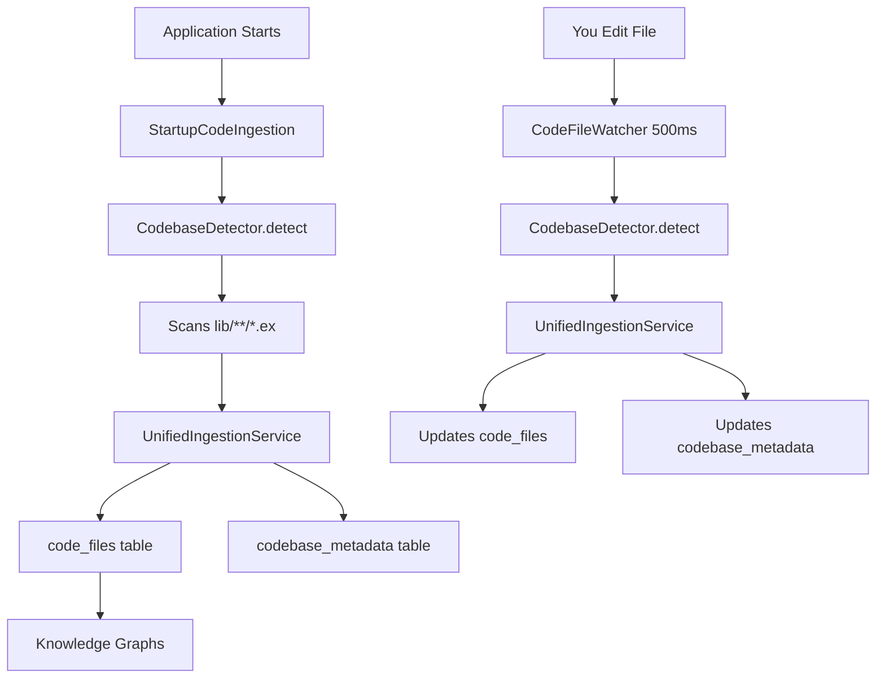

# Complete Auto Setup Summary

**Zero-configuration automatic code ingestion and analysis** 🚀

---

## What You Get (Automatically!)

### ✅ On Every Startup

1. **StartupCodeIngestion** starts
2. **Scans** all `.ex` files in `lib/`
3. **Auto-detects** codebase from Git → `"mikkihugo/singularity-incubation"`
4. **Ingests** all files to database (parallel, 10 workers)
5. **Populates** knowledge graphs
6. **Ready** in seconds!

### ✅ During Development (Hot Reload)

1. You edit `lib/my_module.ex`
2. **CodeFileWatcher** detects change (500ms debounce)
3. **Auto-ingests** changed file to database
4. **Updates** both `code_files` and `codebase_metadata` tables
5. **Analysis ready** immediately!

### ✅ Supported File Types

- **Elixir**: `.ex`, `.exs`
- **Rust**: `.rs`
- **TypeScript**: `.ts`, `.tsx`
- **JavaScript**: `.js`, `.jsx`
- **Python**: `.py`
- **Go**: `.go`
- **Config**: `.nix`, `.toml`, `.json`, `.yaml`, `.yml`
- **Docs**: `.md`
- **Scripts**: `.sh`

---

## Zero Configuration Required!

Just start the app:

```bash
iex -S mix

# Automatically:
# ✓ Detects "mikkihugo/singularity-incubation" from Git
# ✓ Scans ENTIRE repo (rust/, llm-server/, singularity/, centralcloud/)
# ✓ Ingests 2000+ files (Elixir, Rust, TypeScript, Go, Python, Nix, etc.) to database
# ✓ Builds knowledge graphs
# ✓ Starts CodeFileWatcher for hot reload
# ✓ Ready to analyze!
```

---

## Auto-Detected Codebase ID

### Your Codebase

```bash
git remote get-url origin
# => git@github.com:mikkihugo/singularity-incubation.git

# Auto-detected:
codebase_id = "mikkihugo/singularity-incubation"
```

### Benefits

✅ **Unique** - Includes your GitHub username
✅ **Automatic** - No hardcoded values
✅ **Multi-repo ready** - Works for any repo
✅ **Cached** - Fast (5-minute ETS cache)
✅ **Fallback** - Graceful if Git unavailable
✅ **Hot-reloadable** - `CodebaseDetector.reload()`

---

## Architecture



---

## Database Tables

### 1. code_files (For CodeAnalyzer)

```sql
SELECT * FROM code_files
WHERE project_name = 'mikkihugo/singularity-incubation'
LIMIT 5;

-- Columns:
-- id, project_name, file_path, language, content,
-- size_bytes, line_count, hash, metadata
```

### 2. code_analysis_results (For Quality Tracking)

```sql
SELECT * FROM code_analysis_results
WHERE code_file_id IN (
  SELECT id FROM code_files
  WHERE project_name = 'mikkihugo/singularity-incubation'
);

-- Columns:
-- id, code_file_id, language_id, quality_score,
-- complexity_score, cyclomatic_complexity, etc.
```

---

## Usage Examples

### 1. Start App (Auto-Ingests)

```bash
iex -S mix

# Logs:
# Starting TaskGraph Auto-Bootstrap...
# Learning codebase... Found 251 source files
# Persisting 251 modules to database...
# ✓ Persisted 251/251 modules to database
# ✓ Graph auto-population complete
```

### 2. Analyze Codebase

```bash
# Analyze and store results
mix analyze.codebase --codebase-id mikkihugo/singularity-incubation --store

# Progress: 10/251 files analyzed
# Progress: 20/251 files analyzed
# ...
# ✓ Analysis complete!
# Stored 251/251 results in 1234ms
```

### 3. View Results

```bash
# Recent analysis results
mix analyze.results --codebase-id mikkihugo/singularity-incubation

# Quality trend for specific file
mix analyze.results --file-path lib/singularity/code_analyzer.ex --trend

# Find degraded files
mix analyze.results --codebase-id mikkihugo/singularity-incubation --degraded
```

### 4. Hot Reload Test

```elixir
# Edit a file:
# vim lib/my_module.ex

# Wait 500ms... CodeFileWatcher ingests automatically!

# Verify:
iex> alias Singularity.{Repo, Schemas.CodeFile}
iex> import Ecto.Query
iex> Repo.one(from f in CodeFile, where: f.file_path == "lib/my_module.ex")
%CodeFile{content: "... new content ...", updated_at: ~U[2025-10-23 16:35:00Z]}
```

---

## API Reference

### CodebaseDetector

```elixir
alias Singularity.Code.CodebaseDetector

# Auto-detect (default: repo only)
codebase_id = CodebaseDetector.detect()
# => "singularity-incubation"

# Include owner (recommended)
codebase_id = CodebaseDetector.detect(format: :full)
# => "mikkihugo/singularity-incubation"

# With fallback
codebase_id = CodebaseDetector.detect(fallback: "my-app")
# => "mikkihugo/singularity-incubation" or "my-app" if Git fails

# Clear cache (hot reload)
CodebaseDetector.clear_cache()
CodebaseDetector.reload()

# Get full info
CodebaseDetector.get_info()
# => %{
#   codebase_id: "mikkihugo/singularity-incubation",
#   git_repo: true,
#   remote_url: "git@github.com:...",
#   detected_at: ~U[...]
# }
```

### CodeAnalyzer

```elixir
alias Singularity.CodeAnalyzer

# Analyze and store
{:ok, result} = CodeAnalyzer.analyze_and_store(file_id)

# Batch analyze codebase
results = CodeAnalyzer.analyze_and_store_codebase("mikkihugo/singularity-incubation")

# Query results
import Ecto.Query
alias Singularity.Schemas.CodeAnalysisResult

recent = Repo.all(
  from r in CodeAnalysisResult,
  join: f in CodeFile, on: r.code_file_id == f.id,
  where: f.project_name == "mikkihugo/singularity-incubation",
  order_by: [desc: r.inserted_at],
  limit: 10
)
```

---

## Caching & Performance

### ETS Cache (Dynamic TTL)

**Default: 5-minute TTL**
```elixir
# First call: Runs git command
CodebaseDetector.detect()
# => "mikkihugo/singularity-incubation" (10ms)

# Subsequent calls: From cache
CodebaseDetector.detect()
# => "mikkihugo/singularity-incubation" (0.1ms)

# After 5 minutes: Auto-refreshes
CodebaseDetector.detect()
# => "mikkihugo/singularity-incubation" (10ms, cache refreshed)
```

**Extended: 30-minute TTL (heavy ingestion)**
```elixir
# During startup with 933 files:
CodebaseDetector.detect(format: :full, extend_cache: true)
# => Cache valid for 30 minutes

# Why extended cache?
# - Without: 933 git calls × 10ms = ~9.3 seconds wasted
# - With:    1 git call × 10ms + 932 ETS reads × 0.01ms = ~19ms total
# - Savings: ~9.3 seconds per startup! ⚡

# StartupCodeIngestion automatically uses extended cache when ingesting >100 files
```

### Hot Reload Cache

```elixir
# Git remote changed
git remote set-url origin git@github.com:mikkihugo/new-repo.git

# Force reload
CodebaseDetector.reload()
# => {:ok, "mikkihugo/new-repo"}

# Next calls use new value
CodebaseDetector.detect()
# => "mikkihugo/new-repo"
```

---

## Error Handling (Graceful Fallbacks)

### Git Not Available

```elixir
# Git command fails → Uses fallback
CodebaseDetector.detect(fallback: "singularity")
# => "singularity"

# Logs: [CodebaseDetector] Git detection failed (Git command failed: ...), using fallback: singularity
```

### ETS Not Ready

```elixir
# ETS table not created yet → Skips cache, still works
CodebaseDetector.detect()
# => "mikkihugo/singularity-incubation" (from Git)

# No errors, just slightly slower first call
```

### Invalid Git URL

```elixir
# Parsing fails → Returns as-is or fallback
CodebaseDetector.extract_repo_name("invalid-url")
# => "invalid-url"

# Still usable as codebase_id
```

---

## Configuration (Optional)

### Default Behavior (Recommended)

```elixir
# config/config.exs
# Nothing needed! Auto-detection works out of the box
```

### Custom Fallback

```elixir
# config/config.exs
config :singularity, Singularity.Code.CodebaseDetector,
  fallback: "my-default-project",
  format: :full  # or :repo_only
```

### Disable Auto-Fix (Keep Ingestion)

```elixir
# config/config.exs
config :singularity, StartupCodeIngestion,
  enabled: true,           # ✓ Ingestion ON
  fix_on_startup: false    # ✗ Auto-fix OFF (faster startup)
```

---

## Multi-Repo Workflow

Perfect for working with multiple repos:

```bash
# Project 1
cd ~/code/singularity-incubation
iex -S mix
# Auto-detects: "mikkihugo/singularity-incubation"

# Project 2
cd ~/code/my-other-project
iex -S mix
# Auto-detects: "mikkihugo/my-other-project"

# Both stored separately!
```

### Query by Project

```sql
-- Singularity
SELECT COUNT(*) FROM code_files
WHERE project_name = 'mikkihugo/singularity-incubation';
-- => 251 files

-- Other project
SELECT COUNT(*) FROM code_files
WHERE project_name = 'mikkihugo/my-other-project';
-- => 42 files
```

---

## Troubleshooting

### Check Detection

```elixir
iex> CodebaseDetector.get_info()
%{
  codebase_id: "mikkihugo/singularity-incubation",
  git_repo: true,
  remote_url: "git@github.com:mikkihugo/singularity-incubation.git",
  detected_at: ~U[2025-10-23 16:35:00Z]
}
```

### Check Database

```sql
-- Count ingested files
SELECT COUNT(*) FROM code_files
WHERE project_name = 'mikkihugo/singularity-incubation';

-- Recent files
SELECT file_path, language, inserted_at
FROM code_files
WHERE project_name = 'mikkihugo/singularity-incubation'
ORDER BY inserted_at DESC
LIMIT 10;
```

### Check CodeFileWatcher

```elixir
iex> Process.whereis(Singularity.Execution.Planning.CodeFileWatcher)
#PID<0.1234.0>  # ✓ Running

# Or nil if not started
```

### Force Reload

```elixir
# Clear cache and re-detect
iex> CodebaseDetector.reload()
{:ok, "mikkihugo/singularity-incubation"}

# Trigger new ingestion
iex> StartupCodeIngestion.run_now()
{:ok, %{issues_found: 5, issues_fixed: 3}}
```

---

## What Gets Logged

### Startup Logs

```
Starting TaskGraph Auto-Bootstrap...
Phase 1: Learning codebase...
Found 251 source files
Learning complete: 5 issues found
Phase 1.5: Persisting learned codebase to database...
[CodebaseDetector] Detected: mikkihugo/singularity-incubation
Persisting 251 modules to database...
✓ Persisted 251/251 modules to database
✓ Graph auto-population complete: 1234 nodes, 5678 edges
TaskGraph Auto-Bootstrap: Complete!
```

### Hot Reload Logs

```
File changed: lib/my_module.ex, scheduling debounced re-ingestion...
Re-ingesting: lib/my_module.ex (after 500ms debounce)
[UnifiedIngestion] Ingesting my_module.ex
✓ Ingested lib/my_module.ex in 25ms
```

---

## Summary

✅ **Zero config** - Just start the app
✅ **Auto-detects** repo from Git
✅ **Auto-ingests** on startup (all files)
✅ **Hot-reloads** on file changes (500ms debounce)
✅ **Multi-language** support (10+ languages)
✅ **Cached** for performance (5-minute TTL)
✅ **Graceful fallbacks** (never fails)
✅ **Multi-repo ready** (unique per repo)
✅ **Database-backed** (persistent storage)
✅ **Analysis-ready** (code_analysis_results table)

**Your codebase: `mikkihugo/singularity-incubation`**

**Just run:** `iex -S mix` and everything works! 🎉
