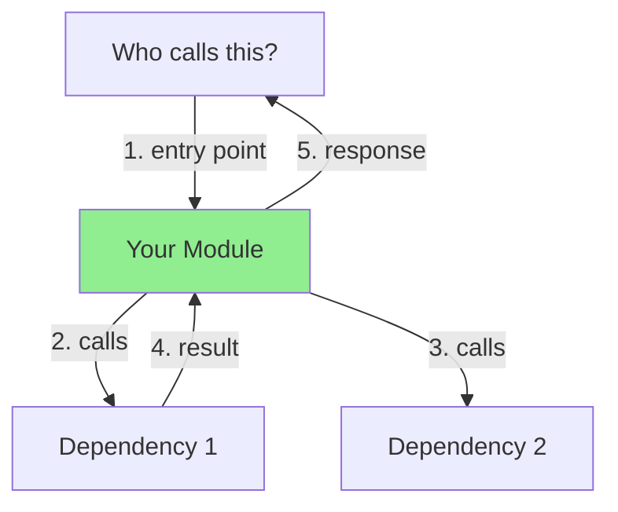
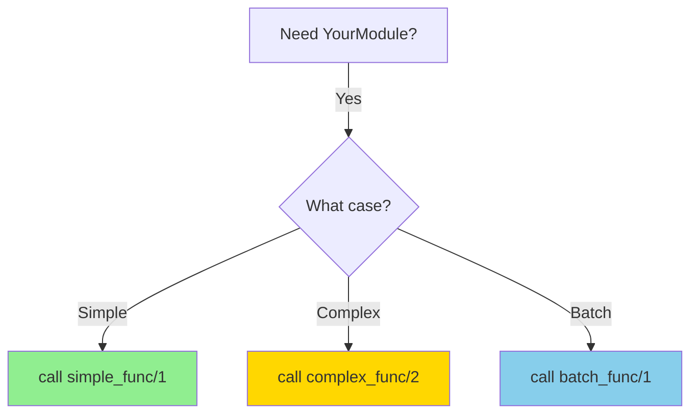
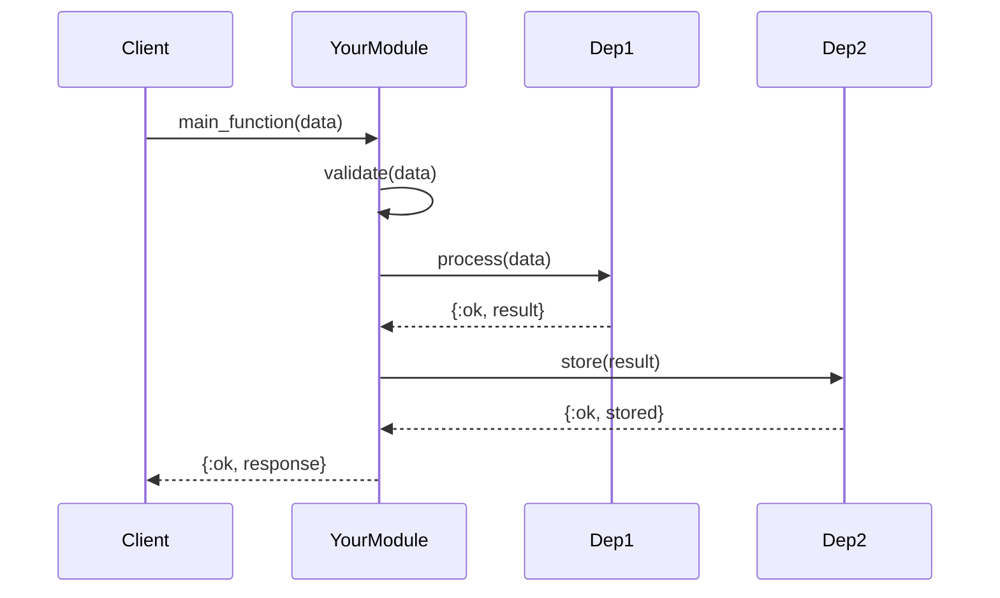

# AI Metadata Quick Reference

One-page guide for adding AI-optimized metadata to Elixir modules.

---

## 1. Module Identity (JSON) - 5 min

```elixir
@moduledoc """
## Module Identity

```json
{
  "module": "Singularity.YourModule",
  "purpose": "One-line clear purpose (what does this do?)",
  "role": "service|store|analyzer|collector|orchestrator",
  "layer": "domain_services|infrastructure|application",
  "alternatives": {
    "SimilarModule1": "Why use this instead of SimilarModule1",
    "SimilarModule2": "Why use this instead of SimilarModule2"
  },
  "disambiguation": {
    "vs_similar1": "Key difference from SimilarModule1",
    "vs_similar2": "Key difference from SimilarModule2"
  }
}
```
"""
```

**Quick questions:**
- What's the module name? → `module`
- What does it do (one line)? → `purpose`
- What type is it? → `role` (service, store, analyzer, etc.)
- Where in architecture? → `layer`
- What are similar modules? → `alternatives`
- How is this different? → `disambiguation`

---

## 2. Architecture Diagram (Mermaid) - 10 min

```elixir
@moduledoc """
## Architecture


"""
```

**Quick questions:**
- Who calls this module? → `Caller`
- What does this module call? → `Dep1`, `Dep2`
- What's the flow? → Number the arrows

**Mermaid basics:**
- `graph TB` = top-to-bottom
- `A --> B` = arrow from A to B
- `A -->|label| B` = labeled arrow
- `style A fill:#90EE90` = green highlight

---

## 3. Decision Tree (Mermaid) - 5 min

**Only if** your module has multiple usage patterns!

```elixir
@moduledoc """
## Decision Tree


"""
```

**Quick questions:**
- What are the main use cases? → Branches
- Which function for each case? → Endpoints

---

## 4. Call Graph (YAML) - 5 min

```elixir
@moduledoc """
## Call Graph

```yaml
calls_out:
  - module: Dependency1
    function: func/2
    purpose: Why calling it
    critical: true  # Would module break without this?

  - module: Dependency2
    function: func/1
    purpose: Why calling it
    critical: false  # Optional dependency

called_by:
  - module: Client1
    purpose: What Client1 uses this for
    frequency: high  # high/medium/low

  - module: Client2
    purpose: What Client2 uses this for
    frequency: low

depends_on:
  - Dependency1 (MUST exist before this module)
  - Dependency2 (optional)

supervision:
  supervised: true  # or false
  reason: "Why supervised (if GenServer) or why not (if plain module)"
```
"""
```

**Quick questions:**
- What does this call? → `calls_out`
- Who calls this? → `called_by`
- What must exist first? → `depends_on`
- Is it supervised? → `supervision`

---

## 5. Data Flow (Mermaid Sequence) - 10 min

**Only if** your module orchestrates multiple components!

```elixir
@moduledoc """
## Data Flow


"""
```

**Quick questions:**
- Who initiates? → First participant
- What's the sequence? → Top to bottom
- Sync or async? → `->>` (sync) or `-->>` (async return)

---

## 6. Anti-Patterns - 5 min

```elixir
@moduledoc """
## Anti-Patterns

### ❌ DO NOT create "YourModule.Wrapper" or "YourModule.Helper"
**Why:** This module already provides that functionality!
**Use instead:** Call this module directly.

### ❌ DO NOT bypass validation
```elixir
# ❌ WRONG
YourModule.unsafe_call(data)

# ✅ CORRECT
YourModule.safe_call(data)
```

### ❌ DO NOT call internal functions
```elixir
# ❌ WRONG - Calling private function
YourModule.Internal.private_func(data)

# ✅ CORRECT - Use public API
YourModule.public_func(data)
```
"""
```

**Quick questions:**
- What modules should NOT be created? → Duplicates/wrappers
- What functions should NOT be called? → Private/internal
- What patterns should be avoided? → Common mistakes

---

## 7. Search Keywords - 2 min

```elixir
@moduledoc """
## Search Keywords

your module, main purpose, key feature 1, key feature 2,
technology used, pattern implemented, use case 1, use case 2,
related concept, common search term

(10-20 comma-separated keywords for vector search)
"""
```

**Quick questions:**
- What would someone search for? → Keywords
- What problems does this solve? → Use case keywords
- What technologies are used? → Tech keywords

**Examples:**
- Service: "llm service, ai call, claude, model selection, nats"
- Store: "pattern store, framework patterns, semantic search, storage"
- Analyzer: "code analysis, ast parsing, quality metrics, linting"

---

## Complete Template (Human-First Order)

```elixir
defmodule Singularity.YourModule do
  @moduledoc """
  # YourModule - Brief description

  **What this module does** - Clear one-sentence purpose

  ## Quick Start

  ```elixir
  # Most common use case
  YourModule.main_func(data)

  # With options
  YourModule.main_func(data, option: :value)
  ```

  ## Public API

  - `main_func(data, opts)` - Primary function
  - `helper_func(data)` - Helper function

  ## Key Features

  - **Feature 1:** Description and benefit
  - **Feature 2:** Description and benefit
  - **Feature 3:** Description and benefit

  ## Error Handling

  All functions return `{:ok, result} | {:error, reason}`:
  - `:invalid_input` - Input validation failed
  - `:processing_error` - Processing failed

  ## Examples

  ```elixir
  # Success case
  {:ok, result} = YourModule.main_func("data")
  # => {:ok, "processed: data"}

  # Error case
  {:error, reason} = YourModule.main_func("")
  # => {:error, :invalid_input}
  ```

  ---

  ## AI Navigation Metadata

  The sections below provide structured metadata for AI assistants,
  graph databases (Neo4j), and vector databases (pgvector).

  ### Module Identity (JSON)

  ```json
  {
    "module": "Singularity.YourModule",
    "purpose": "Clear purpose statement",
    "role": "service",
    "layer": "domain_services",
    "alternatives": {"SimilarModule": "Why use this instead"},
    "disambiguation": {"vs_similar": "Key difference"}
  }
  ```

  ### Architecture (Mermaid)

  ```mermaid
  graph TB
      Caller --> YourModule
      YourModule --> Dep
  ```

  ### Call Graph (YAML)

  ```yaml
  calls_out:
    - module: Dep
      function: func/1
      purpose: Why
      critical: true
  called_by:
    - module: Client
      purpose: Use case
      frequency: high
  depends_on:
    - Dep (MUST exist)
  supervision:
    supervised: false
    reason: "Stateless module"
  ```

  ### Anti-Patterns

  #### ❌ DO NOT create duplicates
  **Why:** This module already exists!

  ### Search Keywords

  your module, purpose, use case, technology
  """

  # Rest of module...
end
```

---

## Time Budget

- Module Identity JSON: **5 min**
- Architecture Diagram: **10 min**
- Decision Tree: **5 min** (if multiple patterns)
- Call Graph YAML: **5 min**
- Data Flow Sequence: **10 min** (if orchestrator)
- Anti-Patterns: **5 min**
- Search Keywords: **2 min**

**Total:** ~30 min for full AI optimization

**Minimum viable:** Module Identity + Call Graph + Anti-Patterns = **15 min**

---

## Why Each Section?

| Section | For AI | For Graph DB | For Vector DB |
|---------|--------|--------------|---------------|
| Module Identity | Disambiguation | Node properties | Semantic embedding |
| Architecture | Visual understanding | - | Contextual embedding |
| Decision Tree | Usage patterns | - | Use case search |
| Call Graph | Relationship understanding | **Auto-indexing!** | Dependency context |
| Data Flow | Sequence understanding | - | Flow context |
| Anti-Patterns | **Duplicate prevention** | - | Negative examples |
| Search Keywords | - | - | **Search optimization** |

---

## Validation Checklist

Before committing, check:

- [ ] Module Identity has all 6 fields (module, purpose, role, layer, alternatives, disambiguation)
- [ ] Architecture diagram renders correctly (test in GitHub markdown preview)
- [ ] Call Graph YAML is valid (test: `yq < file.yaml`)
- [ ] Anti-patterns include at least 2 examples
- [ ] Search keywords include 10+ terms
- [ ] All code blocks are properly closed (```json, ```mermaid, ```yaml, ```elixir)

---

## Tools

### Render Mermaid locally
```bash
# Install
npm install -g @mermaid-js/mermaid-cli

# Render
mmdc -i diagram.mmd -o diagram.png
```

### Validate YAML
```bash
yq < call_graph.yaml
```

### Validate JSON
```bash
python3 -m json.tool < module_identity.json
```

### Extract metadata
```bash
# Extract all Module Identity JSON
rg -U '@moduledoc.*```json.*?```' --json lib/ | jq

# Extract all Call Graphs
rg -U '@moduledoc.*```yaml.*?```' --multiline lib/
```

---

## Examples in Codebase

See these modules for full examples:
- `templates_data/code_generation/examples/elixir_ai_optimized_example.ex` - Complete example
- `singularity/lib/singularity/llm/service.ex` - Real production module

---

## Questions?

- **Why JSON/YAML/Mermaid?** Machine-readable for tooling (graph DBs, vector DBs, parsers)
- **Is this required?** For production modules in v2.1+ template, yes
- **Can I skip sections?** Minimum: Module Identity + Call Graph + Anti-Patterns
- **What about legacy code?** Gradual migration - start with critical modules
- **How to test?** View in GitHub - Mermaid renders automatically

---

## Remember

**The goal:** Help AI navigate billion-line codebases without creating duplicates!

**Key insight:** Humans read prose. AI needs structured data + visuals.

**One template.** Keep it simple. Keep it practical. Keep it in ONE place.
